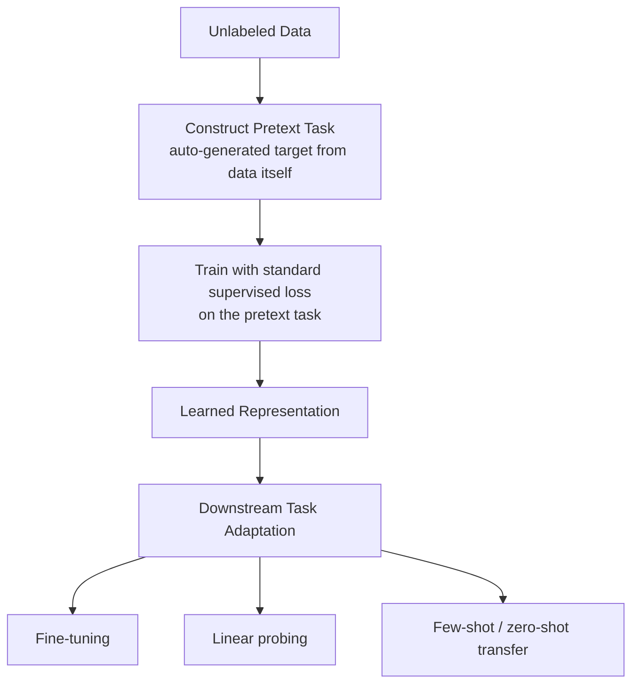
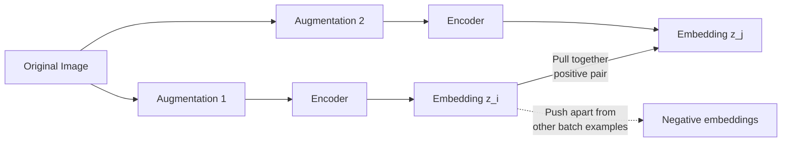

## Self-Supervised Learning

### What Self-Supervised Learning Addresses

Supervised learning requires labeled data, which is expensive and slow to produce at scale — especially for domains where labeling requires expert judgment (medical imaging) or where the sheer volume of available raw data (web text, images, video) vastly exceeds what could ever be manually labeled. Self-supervised learning (SSL) sidesteps this by constructing supervisory signal directly from the structure of unlabeled data itself, using **pretext tasks** whose "labels" can be automatically derived from the data.

**Key Points**

- The defining idea is that part of the input can serve as supervision for predicting another part — no human annotation required
- SSL is typically a *pretraining* stage: the resulting representations are then adapted to downstream tasks (via fine-tuning, linear probing, or few-shot adaptation) rather than SSL itself solving the end task directly
- SSL sits conceptually between unsupervised learning (no task-specific signal at all) and supervised learning (human-provided labels) — the "self" in self-supervised refers to labels being auto-generated from the data, not to an absence of a training signal

### Why Distinguish SSL from Unsupervised Learning

Both use unlabeled data, but SSL explicitly defines a prediction task with an automatically derivable target (e.g., predict a masked word, predict the rotation applied to an image), trained with a standard supervised-style loss on that auto-generated target. Traditional unsupervised learning (e.g., clustering, density estimation) typically doesn't involve constructing such a prediction task — this distinction is why SSL is often described as "supervised learning without human-provided labels" rather than simply a subset of unsupervised learning.

### Categories of Pretext Tasks

#### Generative / Reconstruction-Based

The model learns to reconstruct part of the input from another part, forcing it to capture meaningful structure in order to succeed.

**Masked Language Modeling (MLM)**: a portion of input tokens are masked, and the model predicts the masked tokens from surrounding context — the pretext task underlying BERT-style pretraining.

$$\mathcal{L}_{\text{MLM}} = -\sum_{i \in \text{masked}} \log P(x_i \mid x_{\setminus \text{masked}})$$

**Autoregressive / Next-Token Prediction**: the model predicts the next element in a sequence given everything before it — the pretext task underlying GPT-style language model pretraining.

$$\mathcal{L}_{\text{AR}} = -\sum_{t=1}^{T} \log P(x_t \mid x_{<t})$$

**Masked Autoencoding (images)**: analogous to MLM but for images — patches of an image are masked, and the model reconstructs the missing pixel content from visible patches (e.g., Masked Autoencoders / MAE-style approaches).

**Denoising Autoencoding**: the input is corrupted (noise, masking, shuffling) and the model learns to reconstruct the clean original, forcing it to learn structure robust to the corruption applied.

#### Contrastive Learning

Rather than reconstruction, the model learns representations by pulling together embeddings of related ("positive") pairs and pushing apart embeddings of unrelated ("negative") pairs — without ever reconstructing raw input content.

**SimCLR-style approach**: two random augmentations of the same image form a positive pair; augmentations of different images form negative pairs. The model is trained so positive pairs have high embedding similarity and negative pairs have low similarity.

$$\mathcal{L}_{\text{contrastive}} = -\log \frac{\exp\left(\text{sim}(z_i, z_j)/\tau\right)}{\sum_{k=1}^{2N} \mathbb{1}_{[k \neq i]} \exp\left(\text{sim}(z_i, z_k)/\tau\right)}$$

where $z_i, z_j$ are embeddings of two augmented views of the same example, $\tau$ is a temperature parameter controlling how sharply the similarity distribution is concentrated, and the denominator sums over all other examples in the batch as negatives.

**Momentum Contrast (MoCo) and memory banks**: address the practical challenge that contrastive learning benefits from many negative examples, which naively requires very large batches — momentum-updated encoders and maintained memory queues provide a large, consistent pool of negatives without requiring the batch itself to be enormous.

**Negative-free contrastive methods (BYOL, SimSiam)**: [Unverified] some contrastive-style methods have been shown empirically to learn useful representations without explicit negative pairs at all, relying instead on architectural asymmetries (e.g., a momentum-updated target network, a stop-gradient operation) to avoid the trivial collapsed solution where all embeddings become identical — the precise theoretical explanation for why these methods avoid collapse without explicit negatives has been an active area of study rather than a fully settled question.

#### Predictive / Pretext-Specific Tasks (Earlier SSL Approaches)

Earlier SSL work in computer vision used hand-designed pretext tasks with automatically derivable labels:

- **Rotation prediction**: predict which rotation (0°, 90°, 180°, 270°) was applied to an image
- **Jigsaw puzzle solving**: predict the correct arrangement of shuffled image patches
- **Colorization**: predict color channels from a grayscale version of an image

These have largely been superseded in practice by contrastive and masked-modeling approaches, which have generally demonstrated stronger downstream transfer performance in the settings where comparisons have been made, though the specific ranking depends on the downstream task and evaluation protocol used.

### Comparison of Pretext Task Families

| Family | Core Mechanism | Requires Negatives | Representative Examples |
| --- | --- | --- | --- |
| Reconstruction/generative | Reconstruct masked/corrupted input | No | BERT (MLM), GPT (autoregressive), MAE |
| Contrastive | Distinguish positive pairs from negatives | Typically yes | SimCLR, MoCo |
| Negative-free contrastive-style | Avoid collapse via architectural asymmetry | No | BYOL, SimSiam |
| Hand-designed pretext | Predict an auto-derivable transformation label | No | Rotation prediction, jigsaw, colorization |

### Domain-Specific SSL Approaches

#### Natural Language Processing

Masked and autoregressive language modeling are the dominant SSL paradigms, forming the pretraining basis for most modern large language models. The scale of readily available unlabeled text made SSL pretraining practical here earlier and more thoroughly than in some other domains.

#### Computer Vision

Contrastive learning (SimCLR, MoCo) and masked image modeling (MAE) are both widely used; vision SSL has historically required more careful augmentation design than NLP SSL, since meaningful positive-pair augmentations (crop, color jitter, blur) need to preserve semantic content while genuinely varying the input.

#### Audio and Speech

Self-supervised approaches (e.g., predicting masked audio segments, contrastive objectives over audio representations) have been applied to build speech representations usable for downstream tasks like speech recognition with reduced labeled data requirements.

#### Graphs

Pretext tasks like predicting masked node/edge attributes or contrasting different views of a graph (e.g., via subgraph sampling) extend SSL principles to graph-structured data.

### Why SSL Representations Transfer Well

The pretext task is designed so that succeeding at it requires the model to capture semantically meaningful structure — predicting a masked word well requires understanding context and meaning; distinguishing augmented views of the same image from different images requires focusing on stable semantic content rather than superficial pixel-level details. This is the underlying rationale for why SSL-pretrained representations tend to transfer well to varied downstream tasks, though the degree of transfer varies by how well-aligned the pretext task is with the eventual downstream task.

$$\text{Downstream utility} \approx f\left(\text{pretext task alignment with downstream semantics}, \text{ pretraining scale}\right)$$

[Inference] This is a qualitative characterization of a widely observed empirical pattern rather than a precise, generally-applicable formula — the actual relationship between pretext task design, pretraining scale, and downstream transfer quality is task- and domain-dependent and remains an active area of empirical study.

### Evaluation Protocols for SSL Representations

#### Linear Probing

Freeze the pretrained encoder and train only a linear classifier on top, on a labeled downstream dataset — isolates the quality of the learned representation itself from the effect of further fine-tuning.

#### Fine-Tuning Evaluation

Update the full (or partially unfrozen) pretrained model on the downstream labeled task — typically achieves higher absolute performance than linear probing but conflates representation quality with fine-tuning capacity.

#### Few-Shot / Zero-Shot Transfer

Evaluate the pretrained representation's usefulness with very limited or no downstream labeled data, connecting directly to the few-shot learning strategies covered separately in this material (frozen-feature transfer is essentially SSL representations feeding into a few-shot adaptation strategy).

### Comparison: Linear Probing vs. Fine-Tuning

| Aspect | Linear Probing | Fine-Tuning |
| --- | --- | --- |
| What's measured | Representation quality in isolation | Representation quality + adaptation capacity |
| Overfitting risk on small downstream data | Lower | Higher |
| Typical absolute performance | Lower | Higher (when downstream data is sufficient) |
| Common use | Comparing pretraining methods | Deploying a final downstream model |

### Practical Considerations

- **Pretraining scale and compute cost**: SSL pretraining, particularly contrastive and large-scale language modeling approaches, is typically far more computationally expensive than the downstream fine-tuning stage, motivating widespread reuse of publicly released pretrained checkpoints rather than pretraining from scratch
- **Augmentation design (vision contrastive methods)**: the choice of augmentations directly shapes what invariances the learned representation acquires — overly aggressive or task-inappropriate augmentations can remove information the downstream task actually needs
- **Batch size and negative sampling (contrastive methods)**: methods relying on in-batch negatives are often sensitive to batch size, motivating techniques like memory banks/queues (MoCo) to decouple negative pool size from GPU memory constraints
- **Domain mismatch**: as with transfer learning generally, SSL pretraining on one domain (e.g., natural images) transfers less reliably to a substantially different target domain (e.g., medical images) than to a similar one

### Common Pitfalls

- Assuming SSL representations are universally superior to supervised pretraining, when the relative advantage depends on downstream task, data availability, and domain alignment, and should be evaluated rather than assumed
- Using linear-probe results to make claims about fine-tuned performance, or vice versa, when the two evaluation protocols measure meaningfully different things
- Applying vision-style augmentation intuitions directly to a new domain without verifying the augmentations preserve task-relevant semantic content
- Underestimating the compute cost of contrastive pretraining at appropriate batch/negative-pool scale, particularly if attempting to pretrain from scratch rather than reusing existing checkpoints
- Conflating self-supervised learning with unsupervised learning as strictly interchangeable terms, obscuring the specific pretext-task-based mechanism that distinguishes SSL

**Related Topics**

- Transfer learning and fine-tuning strategies built on top of SSL representations
- Contrastive learning methods in depth (SimCLR, MoCo, BYOL, SimSiam)
- Large language model pretraining objectives and scale
- Few-shot and zero-shot transfer evaluation
- Representation learning theory (what makes a representation "good")
- Multimodal self-supervised learning (e.g., contrastive image-text pretraining)