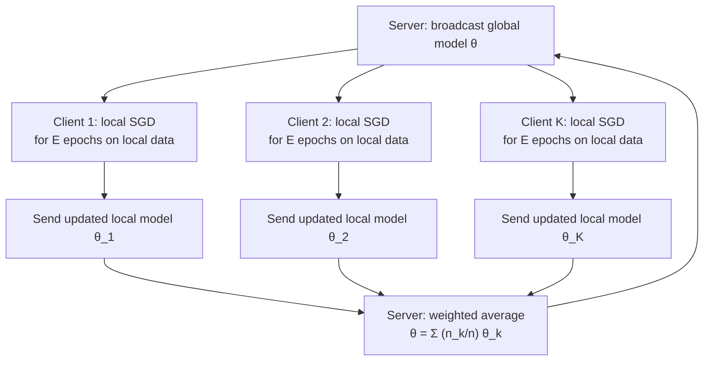
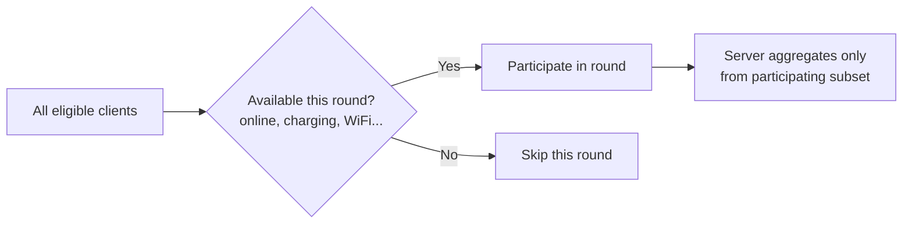

## Federated Learning

### Scope of This Topic

Where the earlier discussion introduced federated learning primarily as a privacy technique (keeping raw data local), this topic goes deeper on the distributed machine learning problem itself: how aggregation actually works mathematically, why it's harder than centralized training, and the systems-level challenges of training across many independent, unreliable clients.

**Key Points**

- Federated learning is fundamentally a distributed optimization problem complicated by data that is non-identically distributed across clients and clients that are unreliable, resource-constrained, and communication-limited
- The standard setting distinguishes **cross-device** federated learning (many, e.g., millions, resource-constrained clients like phones, often unreliable/intermittent) from **cross-silo** federated learning (few, e.g., tens, well-resourced clients like hospitals or companies, generally reliable)
- Most practical challenges in federated learning stem from relaxing assumptions that centralized training takes for granted: IID data, reliable participants, and cheap communication

### The Federated Averaging Algorithm (FedAvg)

The foundational algorithm for federated learning, extending simple parameter averaging to a setting with local multi-step training rather than single-gradient-step aggregation.

$$\theta_{t+1} = \sum_{k=1}^{K} \frac{n_k}{n} \theta_{t+1}^{k}$$

where $n_k$ is client $k$'s local dataset size, $n = \sum_k n_k$ is the total, and $\theta_{t+1}^k$ is the result of client $k$ running several local SGD steps starting from the broadcast global model $\theta_t$. The weighting by local dataset size means clients with more data contribute proportionally more to the aggregated update.

#### Why Local Multi-Step Updates (Not Just Single Gradients)

Communicating a full model update after every single gradient step would require prohibitively frequent communication for cross-device settings. FedAvg instead lets each client perform several local epochs before communicating, trading off communication frequency against a specific new problem: local models can drift apart during those multiple local steps, especially when client data distributions differ substantially — this drift is often called **client drift**.

### The Core Challenge: Statistical Heterogeneity (Non-IID Data)

Unlike centralized training where data is typically shuffled into IID batches, federated clients often have systematically different data distributions — a phone's photo library reflects that specific user's life; a hospital's patient records reflect its specific patient population.

#### Types of Non-IID Data

- **Label distribution skew**: different clients have different proportions of each class (e.g., one client has mostly one type of example)
- **Feature distribution skew**: the same label corresponds to different feature distributions across clients (e.g., handwriting style varies by user for the same digit)
- **Quantity skew**: clients have widely varying amounts of local data
- **Temporal/concept skew**: the relationship between features and labels differs across clients or shifts differently over time per client

#### Consequences for FedAvg

$$\mathbb{E}\left[\theta_{t+1}\right] \neq \arg\min_\theta \sum_{k} \frac{n_k}{n} \mathcal{L}_k(\theta) \quad \text{when local drift is severe}$$

Client drift during local training can cause the naive averaged model to be a worse solution than what any reasonable centralized or single-client model would produce — this is a well-documented failure mode of vanilla FedAvg under high statistical heterogeneity, not merely a minor efficiency loss.

### Algorithms Addressing Heterogeneity

#### FedProx

Adds a proximal term to each client's local objective, penalizing local models for drifting too far from the current global model, which limits the degree of client drift during local training.

$$\mathcal{L}_k^{\text{FedProx}}(\theta) = \mathcal{L}_k(\theta) + \frac{\mu}{2}\left\|\theta - \theta_t\right\|^2$$

#### SCAFFOLD

Uses control variates (correction terms) to explicitly estimate and correct for the difference between each client's local update direction and the "true" global update direction, directly targeting client drift rather than only regularizing toward the previous global model.

#### Personalization Approaches

Rather than forcing all clients toward one shared global model, some approaches explicitly allow per-client model variation — e.g., training a shared representation with client-specific output layers, or meta-learning-style approaches (connecting to the meta-learning material covered separately) that produce a global initialization each client quickly personalizes locally.

### Comparison of Heterogeneity-Handling Approaches

| Approach | Mechanism | Trade-off |
| --- | --- | --- |
| Vanilla FedAvg | Simple weighted averaging | Degrades under high heterogeneity |
| FedProx | Proximal regularization toward global model | Extra hyperparameter ($\mu$) to tune; limits useful local adaptation too |
| SCAFFOLD | Explicit drift correction via control variates | Requires additional client-side state and communication |
| Personalization/meta-learning approaches | Allow per-client model variation | Departs from "one global model" goal; more complex evaluation |

### Systems-Level Challenges

#### Client Availability and Partial Participation

In cross-device settings, only a small, often randomly varying subset of eligible clients participate in any given communication round — devices may be offline, low on battery, or on a metered connection. Aggregation algorithms need to handle this partial and variable participation gracefully rather than assuming a fixed, complete set of clients each round.

#### Communication Efficiency

Communication (not computation) is frequently the primary bottleneck in cross-device federated learning, particularly for large models over constrained mobile networks. Mitigations include:

- **Model compression**: quantizing or sparsifying the transmitted model update rather than sending full-precision weights
- **Structured updates**: constraining the update to a lower-dimensional or structured form that's cheaper to transmit
- **Fewer, larger communication rounds**: increasing local epochs per round (trading off against client drift, as above) to reduce total communication rounds needed

#### Fault Tolerance and Stragglers

Slower or failing clients ("stragglers") can hold up synchronous aggregation rounds. Approaches include setting a per-round deadline and aggregating only from clients that responded in time, or asynchronous aggregation schemes that don't wait for a full synchronized round — the latter introduces its own complexity around staleness of contributions from slow clients.

#### Server-Side Aggregation Robustness

Beyond simple weighted averaging, robust aggregation methods (e.g., trimmed mean, coordinate-wise median, or other outlier-resistant aggregation rules) are sometimes used to reduce the influence of anomalous client updates — relevant both for handling naturally noisy/low-quality clients and as a defense against the poisoning attacks covered under model security.

### Security and Privacy Layer (Building on Base FedAvg)

As introduced in the privacy-preserving techniques material, federated learning alone provides data locality but not a formal privacy guarantee against inference from the shared model updates themselves. Common combinations layered on top of the base algorithm:

- **Secure aggregation**: cryptographic protocols ensuring the server only ever sees the *sum* of client updates, never any individual client's update in isolation
- **Differential privacy**: adding calibrated noise to client updates (local DP) or to the aggregated update (central DP) before/during aggregation, bounding what can be inferred about any individual client's data from the published model
- **Robust aggregation against poisoning**: as above, defending against a malicious client submitting a crafted update intended to implant a backdoor or degrade the global model, connecting to the data poisoning attacks covered under model security

### Comparison: Cross-Device vs. Cross-Silo Federated Learning

| Aspect | Cross-Device | Cross-Silo |
| --- | --- | --- |
| Number of clients | Very large (thousands–millions) | Small (typically single/low double digits) |
| Client reliability | Low, intermittent participation | High, generally always available |
| Client compute/data | Limited (phones, edge devices) | Substantial (organizations, data centers) |
| Communication constraint | Often severe (mobile networks) | Generally less constrained |
| Typical motivating use case | Mobile keyboard prediction, on-device personalization | Cross-hospital or cross-institution collaborative model training |

### Common Pitfalls

- Assuming vanilla FedAvg will converge as reliably as centralized SGD under significant client data heterogeneity, when client drift is a well-documented failure mode requiring explicit mitigation
- Overlooking that communication, not computation, is often the dominant cost in cross-device settings, and optimizing only for local training efficiency
- Treating federated learning as providing complete privacy protection by default, without layering secure aggregation or differential privacy on top
- Ignoring partial client participation and stragglers when reasoning about convergence, since the effective "dataset" seen by the algorithm varies round to round
- Applying cross-silo assumptions (few, reliable, well-resourced clients) to a cross-device deployment or vice versa, when the two settings call for substantially different algorithmic and systems choices

**Related Topics**

- Privacy-preserving techniques (differential privacy, secure aggregation) as complements to base federated learning
- Data poisoning and robust aggregation defenses in a federated setting
- Meta-learning approaches, relevant to personalized federated learning
- Distributed and communication-efficient optimization more broadly
- Model compression and quantization for constrained communication settings
- Model monitoring across heterogeneous, distributed deployment populations