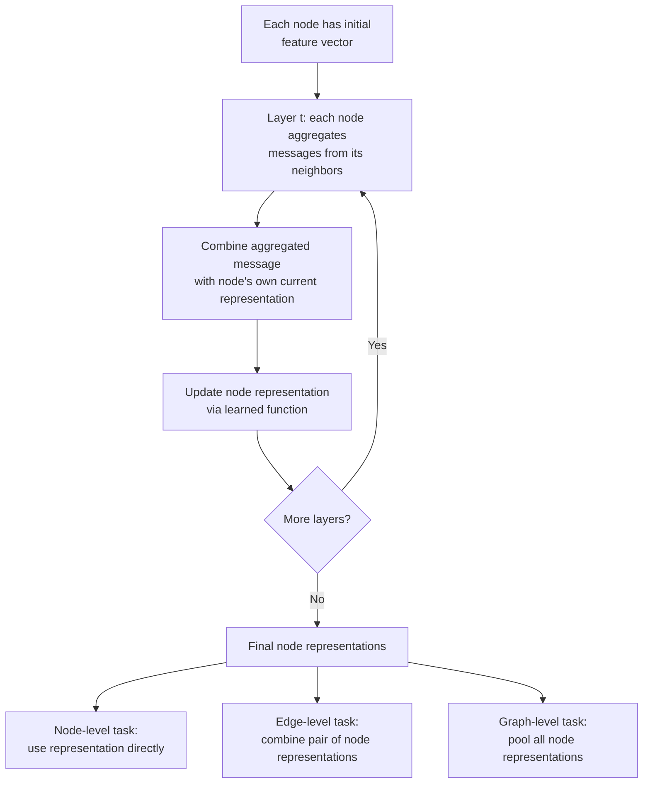
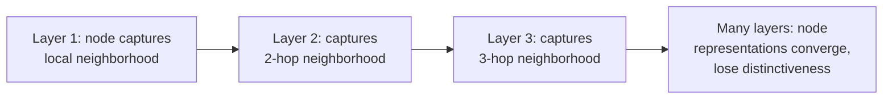

## Graph Neural Networks

### What Graph Neural Networks Address

Many real-world domains are naturally structured as graphs — molecules (atoms as nodes, bonds as edges), social networks (people as nodes, relationships as edges), road networks, citation networks, knowledge graphs. Standard neural architectures (CNNs, RNNs, transformers) assume input with fixed, regular structure — a grid for images, a sequence for text — and don't natively handle the irregular, variable-sized connectivity of a graph. Graph Neural Networks (GNNs) are built specifically to learn from this relational structure.

**Key Points**

- The core operation in nearly all GNN variants is **message passing**: nodes iteratively update their representation by aggregating information from their neighbors
- GNNs must respect **permutation invariance/equivariance** — reordering the nodes in a graph's representation shouldn't change what the model learns or predicts, since a graph has no inherent node ordering
- Tasks on graphs span three levels: node-level (classify/predict per node), edge-level (predict/classify relationships), and graph-level (predict a property of the entire graph)

### Graph Representation Basics

A graph $G = (V, E)$ consists of nodes $V$ and edges $E$, often represented via an adjacency matrix $A$ (indicating which node pairs are connected) and a node feature matrix $X$ (each node's input features).

$$A_{ij} = \begin{cases} 1 & \text{if edge exists between node } i \text{ and } j \\ 0 & \text{otherwise} \end{cases}$$

Graphs can be **directed** or **undirected**, **weighted** or **unweighted**, and may include edge features in addition to node features (e.g., bond type in a molecule, relationship type in a knowledge graph).

### The Message Passing Framework

Nearly all mainstream GNN architectures can be described as instances of a general message passing scheme, repeated over several layers/rounds:

$$h_v^{(t+1)} = \text{UPDATE}\left(h_v^{(t)}, \; \text{AGGREGATE}\left(\left\{h_u^{(t)} : u \in \mathcal{N}(v)\right\}\right)\right)$$

where $h_v^{(t)}$ is node $v$'s representation at layer $t$, $\mathcal{N}(v)$ is its set of neighbors, AGGREGATE combines neighbor messages (commonly sum, mean, or max — chosen to be permutation-invariant), and UPDATE combines the aggregated message with the node's own previous representation, typically via a learned neural network layer.

#### Why Aggregation Must Be Permutation-Invariant

Since a node's neighbors have no inherent ordering, the aggregation function must produce the same output regardless of the order neighbors are processed in — this is why sum, mean, and max (all permutation-invariant operations) are standard choices, whereas an operation sensitive to input order (like feeding neighbors through an RNN in arbitrary order) would make the model's output depend on an arbitrary, meaningless ordering choice.

### Major GNN Architectures

#### Graph Convolutional Networks (GCN)

Generalizes the convolution operation to graphs by aggregating neighbor features with a specific normalization based on node degree, motivated by a spectral graph theory derivation (though commonly implemented and understood via its simplified spatial form).

$$H^{(t+1)} = \sigma\left(\tilde{D}^{-1/2}\tilde{A}\tilde{D}^{-1/2}H^{(t)}W^{(t)}\right)$$

where $\tilde{A} = A + I$ (adjacency matrix with added self-loops), $\tilde{D}$ is the corresponding degree matrix, $W^{(t)}$ is a learned weight matrix, and $\sigma$ is a nonlinearity. The normalization term prevents nodes with many neighbors from dominating purely due to having a larger raw aggregated sum.

#### GraphSAGE

Designed explicitly for **inductive** learning (generalizing to entirely new, unseen nodes/graphs at inference time, not just the exact graph seen during training) by learning aggregation *functions* rather than fixed per-node embeddings, and by sampling a fixed-size neighborhood rather than using all neighbors — improving scalability to large graphs.

$$h_v^{(t+1)} = \sigma\left(W \cdot \text{CONCAT}\left(h_v^{(t)}, \; \text{AGGREGATE}\left(\{h_u^{(t)} : u \in \mathcal{N}_{\text{sample}}(v)\}\right)\right)\right)$$

#### Graph Attention Networks (GAT)

Applies an attention mechanism so that neighbor contributions are weighted by a learned relevance score, rather than treated equally (as in plain mean aggregation) or purely degree-normalized (as in GCN) — letting the model learn which neighbors matter more for a given node.

$$\alpha_{vu} = \frac{\exp\left(\text{LeakyReLU}(a^T[Wh_v \| Wh_u])\right)}{\sum_{k \in \mathcal{N}(v)} \exp\left(\text{LeakyReLU}(a^T[Wh_v \| Wh_k])\right)}, \qquad h_v^{(t+1)} = \sigma\left(\sum_{u \in \mathcal{N}(v)} \alpha_{vu} W h_u^{(t)}\right)$$

#### Message Passing Neural Networks (MPNN)

A general formalization (proposed to unify many GNN variants under one framework) that explicitly separates a learned message function, an aggregation step, and a learned update function — several architectures above can be viewed as specific instantiations of this general template, including variants that incorporate edge features directly into the message function.

### Comparison of Architectures

| Architecture | Neighbor Weighting | Inductive Capability | Distinguishing Feature |
| --- | --- | --- | --- |
| GCN | Fixed, degree-based normalization | Limited (originally transductive) | Spectral-motivated normalized aggregation |
| GraphSAGE | Learned aggregation function | Strong (designed for it) | Neighborhood sampling, generalizes to unseen nodes |
| GAT | Learned attention weights | Reasonable | Attention lets model learn neighbor importance |
| MPNN (general framework) | Depends on instantiation | Depends on instantiation | Unifying formalism; supports edge-feature messages |

### Task Levels and Readout

#### Node-Level Tasks

Use each node's final representation $h_v^{(T)}$ directly — e.g., classifying users in a social network, predicting node properties in a citation graph.

#### Edge-Level Tasks

Combine a pair of node representations (e.g., concatenation, dot product, or a learned function) to predict a property of the edge, or whether an edge should exist at all (**link prediction**) — relevant to recommendation systems and knowledge graph completion.

$$\hat{y}_{vu} = f\left(h_v^{(T)}, h_u^{(T)}\right), \quad \text{e.g., } f(a,b) = \sigma(a^T b) \text{ for link prediction}$$

#### Graph-Level Tasks

Require pooling all node representations into a single graph-level representation (**readout**), commonly via sum, mean, max pooling, or more sophisticated learned pooling schemes — used for tasks like molecular property prediction, where the target is a property of the whole molecule rather than any individual atom.

$$h_G = \text{READOUT}\left(\{h_v^{(T)} : v \in V\}\right)$$

### Key Challenges in GNN Design

#### Over-Smoothing

As more message-passing layers are stacked, node representations can become increasingly similar to each other across the whole graph, losing discriminative power — a well-documented phenomenon that limits how deep many GNN architectures can be usefully stacked, in contrast to CNNs/transformers where much greater depth is often beneficial.

[Inference] Over-smoothing is widely documented as a practical limitation, and mitigations (residual connections, normalization techniques, careful depth selection) are commonly used to address it, though the precise depth at which over-smoothing becomes problematic varies by architecture, dataset, and specific mitigation applied, so it shouldn't be treated as occurring at a fixed universal layer count.

#### Scalability to Large Graphs

Full-batch message passing over graphs with millions of nodes can be computationally and memory prohibitive. Mitigations include neighborhood sampling (as in GraphSAGE), graph partitioning/clustering approaches that train on subgraphs, and various approximate or simplified aggregation schemes designed to reduce per-step computational cost.

#### Heterogeneous and Dynamic Graphs

Many real graphs have multiple node/edge types (heterogeneous graphs, e.g., knowledge graphs with typed relations) or change over time (dynamic/temporal graphs, e.g., evolving social networks). These require architectural extensions beyond the basic homogeneous, static-graph message passing framework — type-specific transformation functions for heterogeneous graphs, and temporal encoding mechanisms for dynamic graphs.

#### Expressiveness Limits

Standard message-passing GNNs have been shown to be no more powerful than the Weisfeiler-Leman (WL) graph isomorphism test at distinguishing non-isomorphic graphs — meaning there exist structurally distinct graphs that standard message-passing GNNs cannot distinguish. This has motivated more expressive architectures (higher-order GNNs, WL-test-inspired extensions) at increased computational cost.

### Comparison to Other Architecture Families

| Aspect | CNN | Transformer | GNN |
| --- | --- | --- | --- |
| Input structure assumed | Regular grid | Sequence (with positional info) | Arbitrary graph connectivity |
| Core operation | Local convolution over fixed neighborhood | Global self-attention over all positions | Message passing over graph-defined neighbors |
| Permutation handling | N/A (grid has fixed structure) | Requires explicit positional encoding | Permutation invariance often built into aggregation |

[Inference] Transformers can be viewed as a special case of message passing on a fully-connected graph (every token attends to every other token), which is a connection sometimes drawn in the literature — this framing is a useful conceptual bridge rather than a claim that the two architecture families are interchangeable in practice, since typical GNNs exploit sparse, meaningful graph structure that a fully-connected transformer does not assume.

### Applications

- **Molecular property prediction and drug discovery**: molecules as graphs (atoms/bonds), predicting properties relevant to drug candidate screening
- **Recommendation systems**: modeling user-item interactions as a bipartite graph, using link prediction-style GNN approaches
- **Knowledge graph completion**: predicting missing relationships/entities in structured knowledge bases
- **Traffic and transportation networks**: modeling road networks as graphs for traffic prediction, connecting to spatiotemporal GNN variants
- **Fraud and anomaly detection**: modeling transaction or relationship networks to detect anomalous substructures or nodes

### Common Pitfalls

- Stacking many GNN layers without addressing over-smoothing, expecting depth to help as it often does in CNNs/transformers
- Using a transductive-style architecture (e.g., basic GCN in its original formulation) in a setting that actually requires generalizing to unseen nodes or graphs at inference time
- Treating standard message-passing GNN expressiveness as unlimited, when there are provable structural limits (WL-test equivalence) relevant to tasks requiring fine-grained structural distinction
- Applying homogeneous-graph architectures directly to heterogeneous or dynamic graphs without the necessary architectural extensions
- Underestimating the scalability challenge of full-graph message passing on large real-world graphs, without planning for sampling or partitioning approaches from the start

**Related Topics**

- Graph representation learning and node embedding methods (e.g., random-walk-based approaches predating modern GNNs)
- Molecular machine learning and drug discovery applications
- Knowledge graph embedding and completion methods
- Attention mechanisms and their relationship to graph attention networks
- Scalable training methods for large-graph GNNs (sampling, partitioning)
- Temporal and dynamic graph neural network architectures