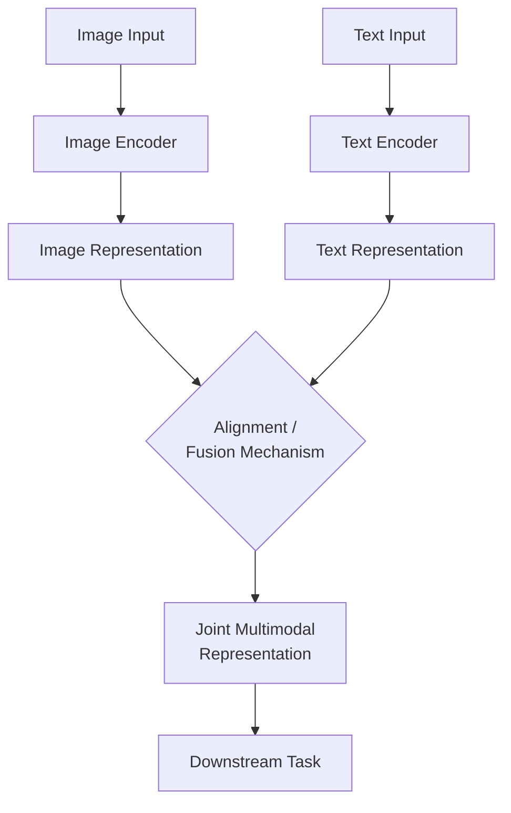
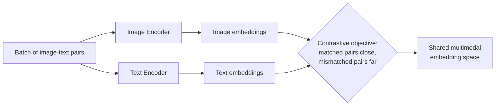
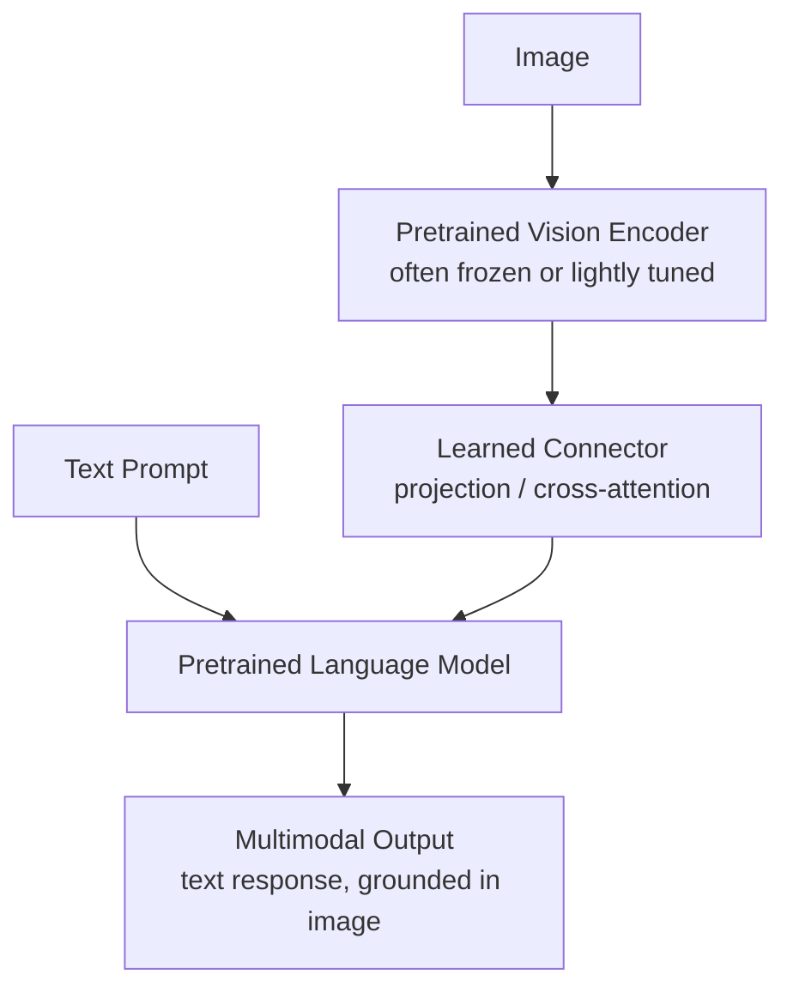

## Multimodal Learning Systems

### What Multimodal Learning Addresses

Real-world information rarely arrives in a single modality — a video has visual frames, audio, and often text (captions/transcripts); a product listing has an image and a text description; a medical record combines imaging, lab values, and clinical notes. Multimodal learning builds models that jointly process and relate information across two or more distinct modalities (image, text, audio, video, tabular, etc.), rather than treating each modality with an entirely separate, unconnected model.

**Key Points**

- The central technical challenge is **representation alignment**: different modalities have fundamentally different statistical structure (pixels vs. discrete tokens vs. continuous audio waveforms), and a model must learn how information in one relates to information in another
- Multimodal systems can integrate modalities at different points in the pipeline — early, late, or intermediate fusion — with different trade-offs for each
- Much of modern multimodal learning builds directly on self-supervised and contrastive learning techniques, applied *across* modalities rather than within a single one

### Why Multimodal Learning Is Harder Than Single-Modality Learning

#### The Heterogeneity Gap

Different modalities have different native structure, dimensionality, and noise characteristics — an image is a dense, spatially structured grid of continuous values; text is a discrete, variably-ordered token sequence; audio is a continuous temporal signal. There's no universal, modality-agnostic way to compare raw inputs directly, which is why nearly all multimodal approaches involve learning modality-specific encoders that map into some shared or related representation space.

#### The Alignment Problem

Even after encoding each modality, the model must learn a meaningful correspondence between them — which parts of an image correspond to which words in a caption, which audio segment corresponds to which point in a video. This correspondence is often only weakly or noisily supervised (e.g., a caption describes an image's general content but rarely aligns word-by-word to specific regions).

### Fusion Strategies

#### Early Fusion

Raw or lightly processed inputs from different modalities are combined at or near the input stage, before most of the model's processing happens — e.g., concatenating raw feature vectors from each modality before feeding into a shared network.

- **Strength**: allows the model to learn cross-modal interactions from the earliest stage, potentially capturing fine-grained correlations
- **Limitation**: requires modalities to be brought into a compatible format very early, and can be harder to train when modalities have very different scales, noise levels, or missing-data patterns

#### Late Fusion

Each modality is processed independently through its own full pipeline (potentially a fully separate model per modality), and outputs (predictions or high-level representations) are combined only at the end, often via simple operations like averaging or a small combining classifier.

- **Strength**: simpler to implement, allows using strong pretrained unimodal models directly per modality, robust to a modality being missing (that branch simply contributes nothing)
- **Limitation**: cannot capture fine-grained cross-modal interactions that occur at intermediate levels of processing, since each modality's pipeline never "sees" the others until the very end

#### Intermediate (Hybrid) Fusion

Combines modalities at one or more intermediate layers, allowing some independent per-modality processing while still enabling interaction before the final output — commonly implemented via cross-attention mechanisms, where representations from one modality attend to representations from another.

$$\text{CrossAttn}(Q_{\text{text}}, K_{\text{image}}, V_{\text{image}}) = \text{softmax}\left(\frac{Q_{\text{text}} K_{\text{image}}^T}{\sqrt{d_k}}\right) V_{\text{image}}$$

### Comparison of Fusion Strategies

| Strategy | Cross-Modal Interaction Depth | Handles Missing Modality | Implementation Complexity |
| --- | --- | --- | --- |
| Early fusion | High (from the start) | Poorly (needs all modalities present) | Moderate–high |
| Late fusion | Low (only at output) | Well (missing branch contributes nothing) | Low |
| Intermediate/hybrid fusion | Moderate–high, at controlled points | Moderate (depends on design) | High |

### Contrastive Multimodal Pretraining

A major modern paradigm: train separate encoders for each modality such that representations of *matched* pairs (e.g., an image and its correct caption) are pulled close together in a shared embedding space, while mismatched pairs are pushed apart — directly extending the contrastive self-supervised learning principle across modalities rather than within one.

$$\mathcal{L} = -\log \frac{\exp\left(\text{sim}(f_{\text{img}}(x_i), f_{\text{text}}(y_i))/\tau\right)}{\sum_{j=1}^{N} \exp\left(\text{sim}(f_{\text{img}}(x_i), f_{\text{text}}(y_j))/\tau\right)}$$

This is the core idea behind CLIP-style image-text pretraining: given a large dataset of (image, caption) pairs, train image and text encoders jointly so matched pairs have high similarity, using in-batch mismatched pairs as negatives — closely mirroring the SimCLR-style contrastive objective covered under self-supervised learning, applied across modalities instead of across augmented views of one modality.

- **Strength**: produces a shared embedding space usable for zero-shot classification (comparing an image embedding against text embeddings of candidate class names), cross-modal retrieval (finding images matching a text query or vice versa), and as a foundation for downstream multimodal tasks
- **Limitation**: quality depends heavily on the scale and quality of paired training data; captions are often noisy, partial descriptions of image content rather than exhaustive, which caps how fine-grained the learned alignment can be

### Generative Multimodal Approaches

Rather than (or in addition to) learning an aligned embedding space, some approaches directly generate one modality conditioned on another:

- **Image captioning**: generate text conditioned on an image, typically via an image encoder feeding into a text decoder (often attention-based, so the decoder can attend to relevant image regions while generating each word)
- **Text-to-image generation**: generate image content conditioned on a text description, using architectures such as diffusion models conditioned on text embeddings, or autoregressive models operating over discretized image representations
- **Vision-language models with unified generation**: architectures that can both understand (answer questions about, describe) and generate multimodal content within a shared architecture, often combining a large pretrained language model backbone with a vision encoder connected via a learned interface

### Vision-Language Models (VLMs)

A prominent modern architecture pattern connects a pretrained vision encoder to a pretrained large language model via a relatively lightweight learned connector (e.g., a small projection network or cross-attention layers), enabling the combined system to answer questions about images, follow instructions referencing visual content, and reason jointly over text and images.

[Inference] This "connect pretrained unimodal backbones via a lightweight interface" pattern has become common because it reuses the substantial capability already present in separately pretrained vision and language models, generally requiring far less multimodal-specific training data and compute than training a comparably capable model from scratch — though the exact architecture and training recipe (what's frozen, what's fine-tuned, connector design) varies significantly across specific systems and continues to evolve.

### Comparison of Multimodal Paradigms

| Paradigm | Primary Goal | Output | Representative Pattern |
| --- | --- | --- | --- |
| Contrastive alignment | Shared embedding space | Embeddings for retrieval/zero-shot classification | CLIP-style image-text contrastive pretraining |
| Cross-modal generation | Generate one modality from another | New content (text, image, etc.) | Image captioning, text-to-image generation |
| Vision-language models | Joint reasoning/generation over multiple modalities | Text output grounded in visual (and other) input | Pretrained vision encoder + LLM with connector |

### Key Challenges

#### Modality Imbalance

One modality can dominate the learned representation if it's easier to learn from or more predictive of the training signal, causing the model to under-utilize the other modality — sometimes called modality collapse or modality dominance, requiring careful training design (e.g., balanced loss weighting, modality dropout during training) to mitigate.

#### Missing or Noisy Modalities at Inference Time

Real-world deployment often involves cases where one modality is missing, low-quality, or misaligned (e.g., a mistimed caption, corrupted audio) — systems need to degrade gracefully rather than fail outright when this occurs, which fusion strategy choice (late fusion tends to handle this more naturally than early fusion) directly affects.

#### Evaluation Complexity

Evaluating multimodal systems often requires assessing not just per-modality task performance but the quality of cross-modal grounding itself (e.g., does a generated caption actually describe what's in the image, or does a VLM's answer correctly reference the relevant part of an image) — this is generally harder to automate reliably than single-modality metric computation and often still relies partly on human evaluation.

#### Data Scale and Quality for Paired Data

Contrastive and generative multimodal approaches typically require large amounts of paired data (e.g., image-caption pairs), which is more constrained in availability and generally noisier than single-modality data (e.g., raw unlabeled text or images alone) — this has motivated techniques for filtering or improving the quality of large-scale scraped multimodal datasets.

### Common Pitfalls

- Choosing early fusion for a deployment scenario where a modality is frequently missing, when late or hybrid fusion would degrade more gracefully
- Assuming a contrastively pretrained multimodal embedding space captures fine-grained cross-modal correspondence, when it's typically optimized for coarse-grained matching (whole image to whole caption) rather than precise regional/word-level alignment
- Evaluating multimodal systems using only per-modality metrics, missing failures in cross-modal grounding that per-modality metrics wouldn't detect
- Underestimating the impact of modality imbalance, where a model quietly learns to rely on the easier or more predictive modality and under-uses the other
- Assuming paired multimodal data is as clean and reliable as curated single-modality datasets, when scraped image-text and similar paired datasets are frequently noisy and only loosely aligned

**Related Topics**

- Self-supervised and contrastive learning as the foundation for multimodal pretraining
- Attention mechanisms and cross-attention specifically for cross-modal fusion
- Vision-language model architectures and instruction-tuning approaches
- Generative models for cross-modal synthesis (diffusion models, autoregressive generation)
- Dataset curation and filtering for large-scale paired multimodal data
- Evaluation methodologies for grounded generation and cross-modal retrieval