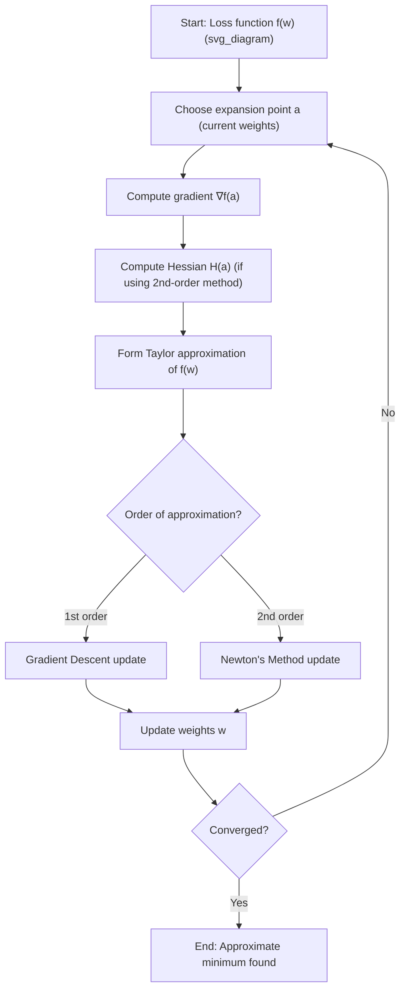

## Taylor and Maclaurin Series

### Overview

A Taylor series represents a function as an infinite sum of terms calculated from the function's derivatives at a single point. This concept underlies many machine learning techniques, including gradient-based optimization, loss function approximation, and second-order optimization methods.

The Taylor series of a function $f(x)$ expanded around a point $a$ is defined as:

$$f(x) = \sum_{n=0}^{\infty} \frac{f^{(n)}(a)}{n!}(x-a)^n$$

A Maclaurin series is a special case of the Taylor series where the expansion point $a = 0$:

$$f(x) = \sum_{n=0}^{\infty} \frac{f^{(n)}(0)}{n!}x^n$$

### Why This Matters for Machine Learning

Taylor series provide the mathematical foundation for approximating complex, nonlinear functions using polynomials. In machine learning, this is directly relevant to:

- Approximating loss functions near a minimum
- Deriving optimization algorithms such as Newton's Method
- Understanding gradient descent as a first-order Taylor approximation
- Analyzing convergence behavior of iterative optimization methods
- Backpropagation-adjacent sensitivity analysis

### Derivation of the Taylor Series

**Key Points**
- Built from successive derivatives of $f$ evaluated at a fixed point $a$
- Each additional term improves the local approximation of $f(x)$ near $a$
- The series is exact only for functions that are infinitely differentiable and analytic on their domain of convergence

Starting from the assumption that $f(x)$ can be written as a power series centered at $a$:

$$f(x) = c_0 + c_1(x-a) + c_2(x-a)^2 + c_3(x-a)^3 + \dots$$

Differentiating repeatedly and evaluating at $x = a$ isolates each coefficient:

$$c_n = \frac{f^{(n)}(a)}{n!}$$

This gives the general Taylor series formula shown above.

### First-Order and Second-Order Approximations

Two truncations of the Taylor series are especially important in ML optimization.

**First-order (linear) approximation:**

$$f(x) \approx f(a) + f'(a)(x-a)$$

This is the basis of gradient descent — the update step moves in the direction of steepest descent using only first-derivative (gradient) information.

**Second-order (quadratic) approximation:**

$$f(x) \approx f(a) + f'(a)(x-a) + \frac{1}{2}f''(a)(x-a)^2$$

This is the basis of Newton's Method, which uses curvature (the second derivative or Hessian in multivariate settings) to take more informed steps toward a minimum.

### Multivariate Taylor Expansion

For functions of several variables, such as a loss function $f(\mathbf{w})$ over a weight vector $\mathbf{w} \in \mathbb{R}^n$, the second-order Taylor expansion around a point $\mathbf{a}$ is:

$$f(\mathbf{w}) \approx f(\mathbf{a}) + \nabla f(\mathbf{a})^T(\mathbf{w}-\mathbf{a}) + \frac{1}{2}(\mathbf{w}-\mathbf{a})^T H(\mathbf{a}) (\mathbf{w}-\mathbf{a})$$

Where:
- $\nabla f(\mathbf{a})$ is the gradient vector (first derivatives)
- $H(\mathbf{a})$ is the Hessian matrix (second derivatives)

This expansion is central to second-order optimization methods and to analyzing the local geometry of loss surfaces.

<svg xmlns="http://www.w3.org/2000/svg" viewBox="0 0 700 420">
  <text x="350" y="30" font-size="16" font-weight="bold" text-anchor="middle" fill="#1a1a1a">Taylor Approximation of a Function (svg_diagram)</text>

  <line x1="60" y1="360" x2="650" y2="360" stroke="#333" stroke-width="1.5" />
  <line x1="60" y1="360" x2="60" y2="50" stroke="#333" stroke-width="1.5" />
  <text x="655" y="365" font-size="12" fill="#333">x</text>
  <text x="45" y="45" font-size="12" fill="#333">y</text>

  <path d="M 80 340 Q 200 60 340 200 T 620 100" fill="none" stroke="#1f77b4" stroke-width="3" />
  <text x="600" y="90" font-size="12" fill="#1f77b4">f(x)</text>

  <line x1="120" y1="330" x2="580" y2="150" stroke="#d62728" stroke-width="2" stroke-dasharray="6,3" />
  <text x="500" y="165" font-size="12" fill="#d62728">1st-order (tangent line)</text>

  <path d="M 120 330 Q 300 130 480 175 Q 550 190 580 210" fill="none" stroke="#2ca02c" stroke-width="2" stroke-dasharray="2,2" />
  <text x="470" y="205" font-size="12" fill="#2ca02c">2nd-order (quadratic)</text>

  <circle cx="340" cy="200" r="5" fill="#333" />
  <text x="345" y="195" font-size="12" fill="#333">a</text>

  <text x="150" y="390" font-size="11" fill="#555">Expansion point a: higher-order terms improve local fit</text>
</svg>

### Common Maclaurin Series Expansions

These standard expansions appear frequently when analyzing activation functions and approximating nonlinear operations in ML pipelines.

$$e^x = 1 + x + \frac{x^2}{2!} + \frac{x^3}{3!} + \dots = \sum_{n=0}^{\infty} \frac{x^n}{n!}$$

$$\sin(x) = x - \frac{x^3}{3!} + \frac{x^5}{5!} - \dots$$

$$\cos(x) = 1 - \frac{x^2}{2!} + \frac{x^4}{4!} - \dots$$

$$\ln(1+x) = x - \frac{x^2}{2} + \frac{x^3}{3} - \dots \quad \text{for } -1 < x \le 1$$

$$\frac{1}{1-x} = 1 + x + x^2 + x^3 + \dots \quad \text{for } |x| < 1$$

**Example**

The sigmoid function $\sigma(x) = \frac{1}{1+e^{-x}}$, commonly used as an activation function, can be locally approximated near $x = 0$ using a Maclaurin-derived expansion:

$$\sigma(x) \approx \frac{1}{2} + \frac{x}{4} - \frac{x^3}{48} + \dots$$

This approximation shows why sigmoid behaves nearly linearly near zero, a property relevant to gradient behavior during early training when weighted inputs are small. [Inference] This linear-region behavior is a mathematical consequence of the expansion; whether it materially affects training dynamics in a specific network depends on architecture, initialization, and data, and is not something this derivation alone confirms.

### Application: Newton's Method for Optimization

**Key Points**
- Uses the second-order Taylor expansion to find a stationary point
- Update rule (single-variable case):

$$x_{n+1} = x_n - \frac{f'(x_n)}{f''(x_n)}$$

- Multivariate update rule:

$$\mathbf{w}_{n+1} = \mathbf{w}_n - H(\mathbf{w}_n)^{-1} \nabla f(\mathbf{w}_n)$$

Newton's Method often converges in fewer iterations than gradient descent near a well-behaved minimum because it incorporates curvature information. [Inference] This faster convergence is a known theoretical property under specific conditions (e.g., the function being twice differentiable and the Hessian being positive definite near the minimum); actual performance on a given loss surface is not something that can be stated as a fixed outcome, since it depends on the specific function and starting point.

Computing and inverting the Hessian matrix is computationally expensive for models with a large number of parameters, such as deep neural networks. This is why quasi-Newton methods (e.g., BFGS, L-BFGS) and adaptive gradient methods (e.g., Adam) are more commonly used in large-scale ML in practice. [Unverified] I cannot verify the exact relative usage frequency of these methods across current industry ML pipelines without a citable source; this reflects general convention rather than a confirmed statistic.

### Remainder Term and Approximation Error

Truncating a Taylor series at order $n$ introduces an error captured by the remainder term $R_n(x)$. The Lagrange form of the remainder is:

$$R_n(x) = \frac{f^{(n+1)}(\xi)}{(n+1)!}(x-a)^{n+1}$$

for some $\xi$ between $a$ and $x$.

This term is used to bound the error of polynomial approximations and is relevant when assessing how closely a truncated Taylor expansion of a loss function represents the true loss near a given point.

### Process Flow: Taylor Expansion in Optimization

### Convergence Considerations

**Key Points**
- A Taylor series converges to $f(x)$ only within its radius of convergence
- Not all infinitely differentiable functions equal their Taylor series everywhere (a classic counterexample is $f(x) = e^{-1/x^2}$ at $x=0$)
- In ML, loss surfaces are rarely globally well-approximated by a truncated Taylor series; the approximation is typically treated as locally valid near the expansion point

[Inference] Because loss landscapes in deep learning are generally non-convex, Taylor-based approximations used in optimization are usually reliable only in a local neighborhood of the current parameter values, not across the full parameter space. This is a reasoned consequence of non-convexity rather than a claim verified for any specific network architecture.

### Worked Example: Second-Order Approximation of a Simple Loss Function

**Example**

Consider a simplified loss function $f(w) = w^4 - 3w^2 + 2$.

First derivative:
$$f'(w) = 4w^3 - 6w$$

Second derivative:
$$f''(w) = 12w^2 - 6$$

Expanding around $a = 1$:

$$f(1) = 1 - 3 + 2 = 0$$
$$f'(1) = 4 - 6 = -2$$
$$f''(1) = 12 - 6 = 6$$

Second-order Taylor approximation near $w = 1$:

$$f(w) \approx 0 - 2(w-1) + \frac{1}{2}(6)(w-1)^2 = -2(w-1) + 3(w-1)^2$$

**Output**

This quadratic approximation can be used directly in a Newton's Method update step:

$$w_{n+1} = 1 - \frac{-2}{6} = 1 + \frac{1}{3} = \frac{4}{3}$$

This single step moves the estimate toward a critical point of the original function based on local curvature.

### Limitations and Practical Notes

- Taylor approximations assume local smoothness; functions with discontinuities or sharp kinks (such as ReLU at zero) are not well-approximated by a single Taylor expansion at that point
- Higher-order terms add computational cost, which is why most ML optimization methods restrict themselves to first-order or approximate second-order information
- [Speculation] It is possible that certain specialized optimization techniques in emerging ML research explore higher-order (third-order and beyond) Taylor terms for specific problem classes, but this is not something confirmed as standard or widespread practice at present.

### Related Topics

- Gradient Descent and its relationship to first-order Taylor approximation
- Newton's Method and Quasi-Newton Methods (BFGS, L-BFGS)
- The Hessian Matrix and Second-Order Optimization
- Convexity and Non-Convex Loss Landscapes
- Partial Derivatives and the Gradient Vector
- Jacobians and Multivariate Chain Rule (relevant to backpropagation)
- Lagrange Remainder and Error Bounds in Approximation
- Radius and Interval of Convergence for Power Series