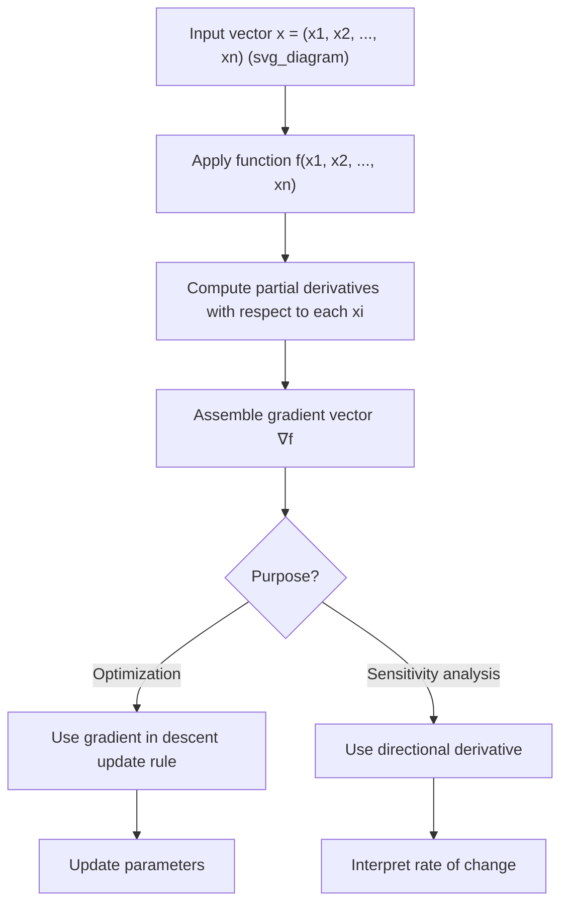

## Functions of Several Variables

### Overview

A function of several variables maps multiple input variables to a single output value. In machine learning, this is the standard mathematical object used to represent models, loss functions, and layers, since inputs are typically vectors of features or parameters rather than single numbers.

A general form for a function of $n$ variables is:

$$f: \mathbb{R}^n \rightarrow \mathbb{R}, \quad f(x_1, x_2, \dots, x_n)$$

A concrete example relevant to ML:

$$f(\mathbf{w}, \mathbf{x}) = \mathbf{w}^T\mathbf{x} + b$$

representing a linear model's output as a function of weight vector $\mathbf{w}$ and input vector $\mathbf{x}$.

### Why This Matters for Machine Learning

Nearly every quantity optimized in machine learning — loss functions, activation outputs, regularization terms — is a function of several variables, often hundreds, thousands, or billions in the case of deep neural network weights. Understanding how these functions behave, and how to differentiate them, is foundational to:

- Gradient-based optimization
- Backpropagation
- Understanding loss surfaces and their geometry
- Regularization and constrained optimization

### Domain and Range in Multiple Dimensions

**Key Points**
- The domain of a function of $n$ variables is a subset of $\mathbb{R}^n$
- The range remains a subset of $\mathbb{R}$ for scalar-valued functions (e.g., most loss functions)
- Vector-valued functions of several variables (where the output is also a vector) are common in ML, such as the output layer of a neural network before a final scalar loss is applied

For a scalar-valued function $f(x, y)$, the domain is typically a region in the $xy$-plane, and the function assigns a single real number (the output) to each point in that region.

For a vector-valued function such as:

$$\mathbf{F}(\mathbf{x}) = \begin{bmatrix} f_1(\mathbf{x}) \\ f_2(\mathbf{x}) \\ \vdots \\ f_m(\mathbf{x}) \end{bmatrix}$$

each component $f_i$ is itself a scalar function of several variables. This structure appears directly in neural network layers, where $\mathbf{x} \in \mathbb{R}^n$ is mapped to an output in $\mathbb{R}^m$.

### Visualizing Functions of Two Variables

For $f(x, y)$, the graph is a surface in three-dimensional space. This is the most common case used for visual intuition, even though ML functions typically involve far more than two variables.

<svg xmlns="http://www.w3.org/2000/svg" viewBox="0 0 700 450">
  <text x="350" y="30" font-size="16" font-weight="bold" text-anchor="middle" fill="#1a1a1a">Surface Plot of f(x, y) = x² + y² (svg_diagram)</text>

  <line x1="100" y1="380" x2="600" y2="380" stroke="#333" stroke-width="1.5" />
  <line x1="100" y1="380" x2="100" y2="60" stroke="#333" stroke-width="1.5" />
  <line x1="100" y1="380" x2="250" y2="430" stroke="#333" stroke-width="1.5" />
  <text x="605" y="385" font-size="12" fill="#333">x</text>
  <text x="85" y="55" font-size="12" fill="#333">z (output)</text>
  <text x="255" y="440" font-size="12" fill="#333">y</text>

  <ellipse cx="350" cy="330" rx="180" ry="40" fill="none" stroke="#1f77b4" stroke-width="1.5" opacity="0.5" />
  <ellipse cx="350" cy="280" rx="140" ry="32" fill="none" stroke="#1f77b4" stroke-width="1.5" opacity="0.6" />
  <ellipse cx="350" cy="230" rx="100" ry="24" fill="none" stroke="#1f77b4" stroke-width="1.5" opacity="0.7" />
  <ellipse cx="350" cy="190" rx="60" ry="16" fill="none" stroke="#1f77b4" stroke-width="2" opacity="0.85" />
  <ellipse cx="350" cy="170" rx="25" ry="7" fill="#1f77b4" opacity="0.9" />

  <line x1="350" y1="170" x2="350" y2="380" stroke="#d62728" stroke-width="1" stroke-dasharray="4,3" />
  <circle cx="350" cy="170" r="4" fill="#d62728" />
  <text x="360" y="165" font-size="11" fill="#d62728">global minimum at (0,0)</text>

  <text x="150" y="410" font-size="11" fill="#555">Bowl-shaped surface: a common form for convex loss functions</text>
</svg>

For functions of three or more variables, direct visualization is not possible; contour plots, slices (holding all but one or two variables fixed), or dimensionality reduction techniques are typically used instead to build intuition. [Inference] The reliance on these indirect visualization methods follows from the geometric fact that surfaces beyond three dimensions cannot be directly rendered in physical or standard visual space; this is a reasoned consequence of dimensionality rather than a claim requiring external verification.

### Level Curves and Level Sets

**Key Points**
- A level curve (or contour) of $f(x, y)$ is the set of points where $f(x, y) = c$ for a constant $c$
- In higher dimensions, this generalizes to a level set: $f(\mathbf{x}) = c$
- Level curves are used to visualize loss landscapes in 2D projections and to illustrate gradient descent trajectories

$$\{(x, y) : f(x, y) = c\}$$

For the function $f(x,y) = x^2 + y^2$, the level curves are concentric circles $x^2 + y^2 = c$ for each value of $c > 0$.

### Partial Derivatives

**Key Points**
- A partial derivative measures the rate of change of a function with respect to one variable, holding all other variables constant
- Partial derivatives are the building blocks of the gradient vector, which is central to gradient descent

For $f(x, y)$, the partial derivatives are defined as:

$$\frac{\partial f}{\partial x} = \lim_{h \to 0} \frac{f(x+h, y) - f(x,y)}{h}$$

$$\frac{\partial f}{\partial y} = \lim_{h \to 0} \frac{f(x, y+h) - f(x,y)}{h}$$

**Example**

For $f(x, y) = x^2y + 3xy^2$:

$$\frac{\partial f}{\partial x} = 2xy + 3y^2$$

$$\frac{\partial f}{\partial y} = x^2 + 6xy$$

Each partial derivative is computed by treating the other variable as a constant, using standard single-variable differentiation rules.

### The Gradient Vector

**Key Points**
- The gradient collects all partial derivatives of a scalar-valued function into a single vector
- The gradient points in the direction of steepest ascent of the function at a given point
- Gradient descent moves in the negative gradient direction to minimize a function

For $f(x_1, x_2, \dots, x_n)$:

$$\nabla f = \begin{bmatrix} \dfrac{\partial f}{\partial x_1} \\ \dfrac{\partial f}{\partial x_2} \\ \vdots \\ \dfrac{\partial f}{\partial x_n} \end{bmatrix}$$

**Example**

For $f(x, y) = x^2 + y^2$:

$$\nabla f(x, y) = \begin{bmatrix} 2x \\ 2y \end{bmatrix}$$

At the point $(1, 2)$:

$$\nabla f(1, 2) = \begin{bmatrix} 2 \\ 4 \end{bmatrix}$$

This vector indicates the direction of steepest increase of $f$ at that point; moving in the opposite direction decreases $f$ most rapidly locally.

### Continuity and Differentiability in Several Variables

**Key Points**
- Continuity in multiple variables requires the limit of $f(x,y)$ to exist and match $f(a,b)$ as $(x,y) \to (a,b)$ from every possible direction, not just along specific paths
- A function can have partial derivatives at a point without being differentiable there — this is a key difference from single-variable calculus
- Differentiability in the multivariate sense requires the function to be well-approximated by a linear map (the total derivative) near a point

[Unverified] I do not have a verified general reference confirming how frequently non-differentiable points of this kind arise in practical ML loss surfaces; this would depend on the specific architecture and activation functions used, and I cannot state a general frequency without a citable source.

A necessary condition often used in practice: if $f$ has continuous partial derivatives in a neighborhood of a point, then $f$ is differentiable at that point. This is a standard sufficient condition from multivariable calculus.

### Directional Derivatives

**Key Points**
- Measures the rate of change of $f$ in the direction of an arbitrary unit vector $\mathbf{u}$, not just along the coordinate axes
- Generalizes partial derivatives, which are directional derivatives along the standard basis vectors

$$D_{\mathbf{u}}f(\mathbf{x}) = \nabla f(\mathbf{x}) \cdot \mathbf{u}$$

where $\mathbf{u}$ is a unit vector ($\|\mathbf{u}\| = 1$).

**Example**

For $f(x, y) = x^2 + y^2$ at point $(1,1)$, in the direction $\mathbf{u} = \left(\frac{1}{\sqrt{2}}, \frac{1}{\sqrt{2}}\right)$:

$$\nabla f(1,1) = \begin{bmatrix} 2 \\ 2 \end{bmatrix}$$

$$D_{\mathbf{u}}f(1,1) = \begin{bmatrix} 2 \\ 2 \end{bmatrix} \cdot \begin{bmatrix} \frac{1}{\sqrt{2}} \\ \frac{1}{\sqrt{2}} \end{bmatrix} = \frac{2}{\sqrt{2}} + \frac{2}{\sqrt{2}} = 2\sqrt{2}$$

### Process Flow: Evaluating Multivariable Functions in a Model

### Composite Functions of Several Variables

**Key Points**
- Neural networks are compositions of functions of several variables applied in sequence (layers)
- Differentiating compositions requires the multivariate chain rule, which underlies backpropagation

A simple two-layer composition:

$$f(\mathbf{x}) = g(h(\mathbf{x}))$$

where $h: \mathbb{R}^n \rightarrow \mathbb{R}^m$ and $g: \mathbb{R}^m \rightarrow \mathbb{R}$.

The chain rule for this composition, in terms of partial derivatives, is:

$$\frac{\partial f}{\partial x_i} = \sum_{j=1}^{m} \frac{\partial g}{\partial h_j} \cdot \frac{\partial h_j}{\partial x_i}$$

[Inference] This summation structure is the mathematical basis commonly cited for how backpropagation computes gradients layer by layer in neural networks; whether a specific ML framework's implementation follows this exact formulation internally is not something confirmed here, since implementation details vary by framework and version.

### Worked Example: Multivariable Function in a Simple Model

**Example**

Consider a two-parameter linear regression model with squared error loss for a single data point $(x, y)$:

$$L(w, b) = (wx + b - y)^2$$

Treating $x$ and $y$ as fixed data (constants) and $w, b$ as variables:

$$\frac{\partial L}{\partial w} = 2(wx + b - y) \cdot x$$

$$\frac{\partial L}{\partial b} = 2(wx + b - y) \cdot 1$$

**Output**

The gradient vector for this loss function is:

$$\nabla L(w, b) = \begin{bmatrix} 2x(wx + b - y) \\ 2(wx + b - y) \end{bmatrix}$$

This gradient is exactly what is used in a gradient descent update step to adjust $w$ and $b$ to reduce the loss $L$ for that data point.

### Limitations and Practical Notes

- Functions of several variables in real ML models often involve non-convex, high-dimensional landscapes; intuition from 2D or 3D examples does not always generalize
- [Inference] Because the number of variables in deep learning models is typically very large, direct geometric visualization of the full function is not feasible, and practitioners generally rely on lower-dimensional projections, summary statistics, or loss curves over training steps instead; this is a reasoned inference based on dimensionality constraints, not a confirmed description of any specific practitioner's workflow.
- Saddle points, local minima, and flat regions all become more complex and more common considerations in high-dimensional multivariable optimization compared to single-variable cases. [Unverified] I do not have a verified source confirming precise statistics on the relative frequency of saddle points versus local minima in general deep learning loss landscapes, so this statement should be treated as a qualitative observation rather than a quantified claim.

### Related Topics

- Partial Derivatives and Higher-Order Partial Derivatives
- The Gradient Vector and Gradient Descent
- The Hessian Matrix and Second-Order Conditions
- The Multivariate Chain Rule and Backpropagation
- Directional Derivatives and Steepest Ascent/Descent
- Critical Points, Saddle Points, and Local Extrema in Several Variables
- Lagrange Multipliers and Constrained Optimization
- Jacobian Matrices for Vector-Valued Functions