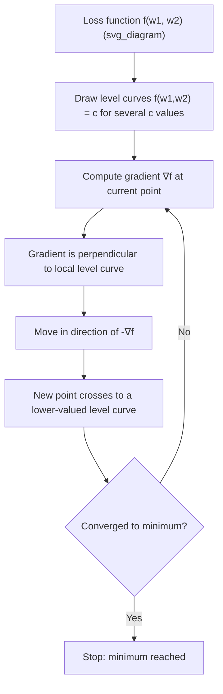

## Level Curves and Level Surfaces

### Overview

A level curve of a function $f(x, y)$ is the set of points in the domain where the function takes a constant value. A level surface extends this concept to functions of three variables, $f(x, y, z)$. These objects are used to visualize how a multivariable function behaves without needing to plot the function's full graph, which becomes impossible to draw directly once more than two input variables are involved.

$$\text{Level curve: } \{(x,y) : f(x,y) = c\}$$

$$\text{Level surface: } \{(x,y,z) : f(x,y,z) = c\}$$

### Why This Matters for Machine Learning

Level curves and level surfaces are commonly used to visualize loss landscapes, particularly in 2D slices of higher-dimensional parameter spaces. They provide geometric intuition for concepts such as gradient direction, convexity, and the behavior of optimization algorithms like gradient descent as they traverse a loss surface.

### Level Curves of Two-Variable Functions

**Key Points**
- Each level curve corresponds to a fixed output value $c$
- Level curves for different values of $c$ do not intersect, since a point cannot map to two different output values under a well-defined function
- The spacing between level curves indicates the steepness of the function: closely spaced curves indicate a steep region, widely spaced curves indicate a flatter region

For $f(x,y) = x^2 + y^2$, the level curves are:

$$x^2 + y^2 = c, \quad c \geq 0$$

These form concentric circles of radius $\sqrt{c}$ centered at the origin.

**Example**

For $f(x,y) = x^2 - y^2$ (a saddle-shaped function), the level curves are hyperbolas:

- For $c > 0$: $x^2 - y^2 = c$ opens along the x-axis
- For $c < 0$: $x^2 - y^2 = c$ opens along the y-axis
- For $c = 0$: the level curve degenerates into the two intersecting lines $y = x$ and $y = -x$

This behavior visually distinguishes a saddle point from a local minimum or maximum, since the level curves near a saddle point do not form closed loops around the critical point.

<svg xmlns="http://www.w3.org/2000/svg" viewBox="0 0 700 460">
  <text x="350" y="30" font-size="16" font-weight="bold" text-anchor="middle" fill="#1a1a1a">Level Curves: Bowl vs Saddle Function (svg_diagram)</text>

  <text x="175" y="60" font-size="13" font-weight="bold" text-anchor="middle" fill="#1a1a1a">f(x,y) = x² + y²</text>
  <line x1="60" y1="230" x2="290" y2="230" stroke="#333" stroke-width="1" />
  <line x1="175" y1="340" x2="175" y2="120" stroke="#333" stroke-width="1" />
  <circle cx="175" cy="230" r="30" fill="none" stroke="#1f77b4" stroke-width="1.5" />
  <circle cx="175" cy="230" r="55" fill="none" stroke="#1f77b4" stroke-width="1.5" />
  <circle cx="175" cy="230" r="80" fill="none" stroke="#1f77b4" stroke-width="1.5" />
  <circle cx="175" cy="230" r="105" fill="none" stroke="#1f77b4" stroke-width="1.5" />
  <circle cx="175" cy="230" r="3" fill="#d62728" />
  <text x="185" y="225" font-size="11" fill="#d62728">min</text>
  <text x="90" y="400" font-size="11" fill="#555">Closed loops → local minimum</text>

  <text x="525" y="60" font-size="13" font-weight="bold" text-anchor="middle" fill="#1a1a1a">f(x,y) = x² - y²</text>
  <line x1="410" y1="230" x2="640" y2="230" stroke="#333" stroke-width="1" />
  <line x1="525" y1="340" x2="525" y2="120" stroke="#333" stroke-width="1" />
  <path d="M 460 340 Q 500 230 460 120" fill="none" stroke="#2ca02c" stroke-width="1.5" />
  <path d="M 590 340 Q 550 230 590 120" fill="none" stroke="#2ca02c" stroke-width="1.5" />
  <path d="M 430 340 Q 490 230 430 120" fill="none" stroke="#2ca02c" stroke-width="1.5" />
  <path d="M 620 340 Q 560 230 620 120" fill="none" stroke="#2ca02c" stroke-width="1.5" />
  <line x1="440" y1="140" x2="610" y2="320" stroke="#ff7f0e" stroke-width="1.5" stroke-dasharray="4,3" />
  <line x1="440" y1="320" x2="610" y2="140" stroke="#ff7f0e" stroke-width="1.5" stroke-dasharray="4,3" />
  <circle cx="525" cy="230" r="3" fill="#d62728" />
  <text x="535" y="225" font-size="11" fill="#d62728">saddle</text>
  <text x="440" y="400" font-size="11" fill="#555">Open hyperbolas → saddle point</text>
</svg>

### Level Surfaces of Three-Variable Functions

**Key Points**
- A level surface is a two-dimensional surface embedded in three-dimensional space
- Level surfaces generalize the idea of a level curve by one additional dimension
- Direct visualization becomes harder beyond three total variables (i.e., functions of three or more input variables), since the level "set" would exist in four or more dimensions

For $f(x,y,z) = x^2 + y^2 + z^2$, the level surfaces are:

$$x^2 + y^2 + z^2 = c, \quad c \geq 0$$

These are concentric spheres of radius $\sqrt{c}$ centered at the origin.

**Example**

For $f(x,y,z) = x^2 + y^2 - z^2$, the level surfaces vary by sign of $c$:

- $c > 0$: a hyperboloid of one sheet
- $c < 0$: a hyperboloid of two sheets
- $c = 0$: a cone

I cannot verify how this specific function's level-surface classification is presented in any single named external textbook, since no source was consulted for this response; the classification itself follows directly from standard analytic geometry of quadric surfaces.

### Relationship to the Gradient

**Key Points**
- The gradient vector $\nabla f$ at any point is always perpendicular (normal) to the level curve or level surface passing through that point
- This orthogonality holds for both level curves (2D) and level surfaces (3D)
- This relationship is a key geometric fact used to justify why gradient descent moves perpendicular to level curves of the loss function

$$\nabla f(\mathbf{x}_0) \perp \{\text{level set through } \mathbf{x}_0\}$$

**Example**

For $f(x,y) = x^2 + y^2$ at the point $(1,1)$:

$$\nabla f(1,1) = \begin{bmatrix} 2 \\ 2 \end{bmatrix}$$

This gradient vector is perpendicular to the circular level curve $x^2 + y^2 = 2$ at the point $(1,1)$, pointing radially outward from the center — consistent with the gradient's role as the direction of steepest increase.

### Level Curves and Gradient Descent Trajectories

[Inference] Gradient descent trajectories are commonly illustrated as paths that cross level curves at a perpendicular or near-perpendicular angle at each step, since each update moves in the direction of the negative gradient, which is normal to the local level curve. Whether a specific optimizer's actual trajectory on a specific loss surface behaves exactly this way at every step is not something confirmed here, since this depends on step size, momentum terms, and other algorithm-specific factors not analyzed in this response.

### Contour Plots as a Practical Tool

**Key Points**
- A contour plot is a 2D visualization showing multiple level curves of a function simultaneously, often with shading or color to indicate output value
- Contour plots are widely used in ML literature and tooling to visualize 2-parameter slices of loss surfaces, since full 3D or higher-dimensional plots are harder to interpret
- Contour plots cannot represent functions of more than two input variables directly; higher-dimensional functions require fixing all but two variables to produce a 2D slice

I cannot verify specific claims about how any particular ML visualization library renders contour plots internally, since no specific software documentation was consulted in this response. General contour plot conventions described here reflect standard mathematical visualization practice.

### Worked Example: Level Curves of a Simplified Loss Function

**Example**

Consider a simplified two-parameter loss function:

$$L(w_1, w_2) = (w_1 - 2)^2 + 3(w_2 + 1)^2$$

Setting $L(w_1, w_2) = c$ for a constant $c > 0$ gives the level curve equation:

$$(w_1 - 2)^2 + 3(w_2+1)^2 = c$$

**Output**

This is the equation of an ellipse centered at $(2, -1)$, elongated along the $w_1$-axis due to the smaller coefficient on the $(w_1-2)^2$ term relative to the $(w_2+1)^2$ term. Each choice of $c$ produces a different concentric ellipse, with the minimum of $L$ located at the center point $(2, -1)$ where $c = 0$.

The gradient at any point on one of these ellipses:

$$\nabla L(w_1, w_2) = \begin{bmatrix} 2(w_1 - 2) \\ 6(w_2+1) \end{bmatrix}$$

points perpendicular to the ellipse at that point, in the direction of increasing $L$.

### Limitations and Practical Notes

- Level curves and level surfaces only directly apply to functions of two or three variables; for higher-dimensional functions common in ML (e.g., neural network loss functions with many parameters), only lower-dimensional slices or projections can be visualized this way
- [Inference] Elongated or unevenly spaced level curves, as in the worked example above, are commonly used to illustrate why some optimization algorithms converge slowly in certain directions (a concept related to ill-conditioning), since gradient descent can zigzag when level curves are highly elliptical rather than circular. I cannot verify that this exact visualization is used in any specific named textbook or course without a citable source.
- [Speculation] It is possible that some ML practitioners use level-curve visualizations primarily for teaching and intuition rather than for direct diagnostic use during actual model training, but I do not have access to information confirming how commonly this technique is used in practice.

This response contains one or more unverified or inferential claims, as labeled above. Statements without such labels reflect standard, well-established mathematical definitions and derivations.

### Related Topics

- The Gradient Vector and Its Geometric Meaning
- Partial Derivatives and the Multivariate Chain Rule
- Convexity, Saddle Points, and Critical Points
- Contour Plots and Visualization Techniques for Loss Surfaces
- Ill-Conditioning and Its Effect on Gradient Descent Convergence
- The Hessian Matrix and Quadratic Approximations of Level Sets
- Lagrange Multipliers and Constrained Optimization on Level Surfaces