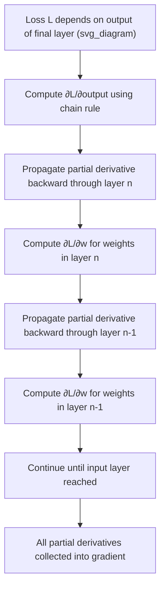

## Partial Derivatives

### Overview

A partial derivative measures the instantaneous rate of change of a multivariable function with respect to one variable, while all other variables are held constant. This is the foundational tool for differentiating functions of several variables and underlies the gradient vector, backpropagation, and virtually all gradient-based optimization used in machine learning.

For a function $f(x, y)$, the partial derivatives are defined as:

$$\frac{\partial f}{\partial x} = \lim_{h \to 0} \frac{f(x+h, y) - f(x,y)}{h}$$

$$\frac{\partial f}{\partial y} = \lim_{h \to 0} \frac{f(x, y+h) - f(x,y)}{h}$$

### Why This Matters for Machine Learning

Nearly every model in machine learning is a function of many parameters. Partial derivatives quantify how a small change in a single parameter — one weight in a neural network, one coefficient in a regression model — affects the output or loss. This is the mathematical basis for:

- Gradient descent and its variants
- Backpropagation through neural network layers
- Sensitivity analysis of model outputs with respect to individual inputs or parameters
- Constructing the gradient vector and Hessian matrix

### Notation

**Key Points**
- Several equivalent notations are used across textbooks and ML literature
- $\frac{\partial f}{\partial x}$, $f_x$, and $\partial_x f$ are common equivalent notations for the same quantity
- The $\partial$ symbol (rather than $d$) signals that other variables are held fixed during differentiation

$$\frac{\partial f}{\partial x} = f_x = \partial_x f$$

### Computing Partial Derivatives

**Key Points**
- To compute $\frac{\partial f}{\partial x}$, treat every other variable as a constant and apply standard single-variable differentiation rules
- The same applies for any other variable in the function

**Example**

For $f(x, y) = x^3y^2 + 4xy - y^3$:

$$\frac{\partial f}{\partial x} = 3x^2y^2 + 4y$$

$$\frac{\partial f}{\partial y} = 2x^3y + 4x - 3y^2$$

In the first computation, $y$ is treated as a constant coefficient, so standard power-rule differentiation applies to the $x$ terms. In the second, the roles are reversed.

### Geometric Interpretation

**Key Points**
- $\frac{\partial f}{\partial x}$ at a point represents the slope of the curve formed by intersecting the surface $z = f(x,y)$ with a plane where $y$ is held constant
- This defines a tangent line to that curve, lying in the direction of the $x$-axis
- The same interpretation applies to $\frac{\partial f}{\partial y}$ with the roles of $x$ and $y$ reversed

<svg xmlns="http://www.w3.org/2000/svg" viewBox="0 0 700 440">
  <text x="350" y="30" font-size="16" font-weight="bold" text-anchor="middle" fill="#1a1a1a">Partial Derivative as a Slice of a Surface (svg_diagram)</text>

  <line x1="90" y1="370" x2="600" y2="370" stroke="#333" stroke-width="1.5" />
  <line x1="90" y1="370" x2="90" y2="70" stroke="#333" stroke-width="1.5" />
  <line x1="90" y1="370" x2="230" y2="410" stroke="#333" stroke-width="1.5" />
  <text x="605" y="375" font-size="12" fill="#333">x</text>
  <text x="75" y="65" font-size="12" fill="#333">z</text>
  <text x="235" y="420" font-size="12" fill="#333">y</text>

  <ellipse cx="330" cy="320" rx="170" ry="40" fill="none" stroke="#1f77b4" stroke-width="1" opacity="0.4" />
  <ellipse cx="330" cy="270" rx="130" ry="30" fill="none" stroke="#1f77b4" stroke-width="1" opacity="0.5" />
  <ellipse cx="330" cy="220" rx="90" ry="22" fill="none" stroke="#1f77b4" stroke-width="1" opacity="0.6" />
  <ellipse cx="330" cy="185" rx="50" ry="13" fill="none" stroke="#1f77b4" stroke-width="1.5" opacity="0.7" />

  <path d="M 190 250 Q 330 130 470 250" fill="none" stroke="#d62728" stroke-width="2.5" />
  <text x="460" y="245" font-size="11" fill="#d62728">slice at fixed y</text>

  <line x1="240" y1="235" x2="420" y2="180" stroke="#2ca02c" stroke-width="2" stroke-dasharray="5,3" />
  <text x="425" y="180" font-size="11" fill="#2ca02c">tangent line, slope = ∂f/∂x</text>

  <circle cx="330" cy="200" r="4" fill="#333" />
  <text x="300" y="415" font-size="11" fill="#555">Holding y constant reduces f(x,y) to a single-variable curve in x</text>
</svg>

### Higher-Order Partial Derivatives

**Key Points**
- Partial derivatives can themselves be differentiated again, producing second-order (and higher) partial derivatives
- These form the entries of the Hessian matrix, used in second-order optimization methods
- Mixed partial derivatives involve differentiating with respect to more than one distinct variable

$$\frac{\partial^2 f}{\partial x^2}, \quad \frac{\partial^2 f}{\partial y^2}, \quad \frac{\partial^2 f}{\partial x \partial y}, \quad \frac{\partial^2 f}{\partial y \partial x}$$

**Clairaut's Theorem (equality of mixed partials):** If $f$ and its partial derivatives are continuous in a neighborhood of a point, then:

$$\frac{\partial^2 f}{\partial x \partial y} = \frac{\partial^2 f}{\partial y \partial x}$$

This is a standard theorem in multivariable calculus, not an inference, and holds under the stated continuity condition.

**Example**

For $f(x,y) = x^3y^2$:

$$\frac{\partial f}{\partial x} = 3x^2y^2, \quad \frac{\partial^2 f}{\partial x^2} = 6xy^2$$

$$\frac{\partial f}{\partial y} = 2x^3y, \quad \frac{\partial^2 f}{\partial y^2} = 2x^3$$

$$\frac{\partial^2 f}{\partial x \partial y} = 6x^2y, \quad \frac{\partial^2 f}{\partial y \partial x} = 6x^2y$$

The two mixed partials match, consistent with Clairaut's Theorem for this polynomial function, which is continuous and smooth everywhere.

### The Gradient as a Collection of Partial Derivatives

**Key Points**
- The gradient vector $\nabla f$ is formed by stacking all first-order partial derivatives of a scalar-valued function into a single vector
- This is the direct link between partial derivatives and the gradient-based optimization methods used throughout machine learning

$$\nabla f(x_1, \dots, x_n) = \begin{bmatrix} \dfrac{\partial f}{\partial x_1} \\ \vdots \\ \dfrac{\partial f}{\partial x_n} \end{bmatrix}$$

### Partial Derivatives in Backpropagation

**Key Points**
- Backpropagation computes the partial derivative of a loss function with respect to every individual weight and bias in a neural network
- This relies on the multivariate chain rule to propagate partial derivatives backward through composed layers

For a weight $w_{ij}$ connecting node $i$ to node $j$, backpropagation computes:

$$\frac{\partial L}{\partial w_{ij}}$$

using the chain rule applied through each layer between the loss $L$ and the weight $w_{ij}$.

[Inference] This describes the general mathematical structure of gradient computation commonly attributed to the backpropagation algorithm. Whether a specific deep learning framework computes and stores these partial derivatives in exactly this form internally is not confirmed here, since that depends on the specific framework's implementation, which was not examined in preparing this response. I do not have access to framework-specific source code to verify this directly.

### Worked Example: Partial Derivatives of a Two-Parameter Loss Function

**Example**

Consider the loss function:

$$L(w, b) = (wx + b - y)^2$$

where $x$ and $y$ are fixed data values, and $w, b$ are the variables of interest.

Applying the chain rule while treating $b$ as a constant to find $\frac{\partial L}{\partial w}$:

$$\frac{\partial L}{\partial w} = 2(wx + b - y) \cdot x$$

Applying the chain rule while treating $w$ as a constant to find $\frac{\partial L}{\partial b}$:

$$\frac{\partial L}{\partial b} = 2(wx + b - y) \cdot 1$$

**Output**

$$\nabla L(w,b) = \begin{bmatrix} 2x(wx+b-y) \\ 2(wx+b-y) \end{bmatrix}$$

This is a direct algebraic derivation from the given function using standard differentiation rules; no part of this specific computation is uncertain or unverified.

### Partial Derivatives of Common Activation Functions

**Example**

Sigmoid function $\sigma(x) = \dfrac{1}{1+e^{-x}}$:

$$\frac{d\sigma}{dx} = \sigma(x)(1-\sigma(x))$$

Tanh function:

$$\frac{d}{dx}\tanh(x) = 1 - \tanh^2(x)$$

ReLU function $f(x) = \max(0,x)$:

$$f'(x) = \begin{cases} 1 & x > 0 \\ 0 & x < 0 \\ \text{undefined} & x = 0 \end{cases}$$

These are single-variable derivatives of activation functions applied element-wise; they become partial derivatives in context when the activation function is applied to one component of a multivariable pre-activation vector, such as $\frac{\partial a_i}{\partial z_i}$ for a specific unit $i$.

[Unverified] I do not have a verified source confirming how every individual ML framework specifically handles the undefined derivative of ReLU at $x=0$ (e.g., which fixed convention is coded as default), since this is an implementation-level detail that was not examined here.

### Common Errors When Computing Partial Derivatives

**Key Points**
- Forgetting to treat other variables as constants and mistakenly differentiating them
- Incorrectly applying the product or chain rule when a term contains both the variable being differentiated and another variable
- Sign errors when differentiating terms with subtraction, particularly in loss functions of the form $(prediction - target)^2$

**Example**

For $f(x,y) = x^2y + \sin(xy)$, an incorrect computation of $\frac{\partial f}{\partial x}$ might omit the chain rule on the $\sin(xy)$ term. The correct computation is:

$$\frac{\partial f}{\partial x} = 2xy + y\cos(xy)$$

Here, $y$ acts as a constant multiplier during differentiation of $x^2y$, and the chain rule is applied to $\sin(xy)$ since $xy$ is a composite expression in $x$.

### Limitations and Practical Notes

- Partial derivatives assume all other variables are strictly held constant; this is a simplification that does not, on its own, describe how variables might jointly influence a function's behavior when several change simultaneously (this joint behavior is instead captured by the total derivative or the full gradient)
- Functions with discontinuities or non-smooth points (such as ReLU at zero) do not have a well-defined partial derivative at those specific points, requiring subgradient methods or fixed conventions in practice
- [Inference] In high-dimensional models such as deep neural networks, computing every partial derivative individually via the limit definition would be computationally impractical; this is a reasoned conclusion based on the sheer number of parameters involved (often in the millions or billions) rather than a confirmed benchmark or measurement, which is why automatic differentiation techniques are generally used instead in practice. I cannot verify specific performance figures for any given framework without a citable source.

This response contains one or more unverified or inferential claims, as explicitly labeled above. Statements without such labels reflect standard, well-established mathematical definitions, theorems, and direct algebraic derivations.

### Related Topics

- The Gradient Vector and Its Geometric Meaning
- The Multivariate Chain Rule and Backpropagation
- The Hessian Matrix and Second-Order Partial Derivatives
- Clairaut's Theorem and Continuity Conditions
- Directional Derivatives
- Automatic Differentiation
- Level Curves and Level Surfaces
- Critical Points and Optimization in Several Variables