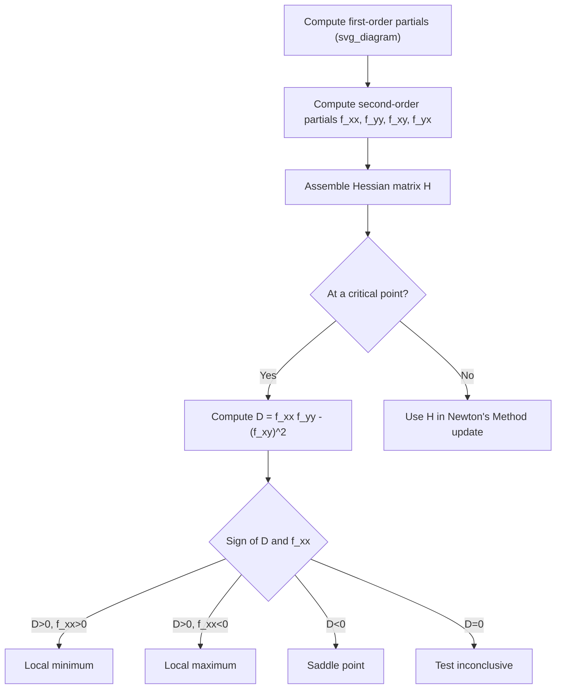

## Higher-Order Partial Derivatives

### Overview

Higher-order partial derivatives are obtained by differentiating a partial derivative one or more additional times. These derivatives capture curvature and how the rate of change of a function itself changes, which is essential for second-order optimization methods, convexity analysis, and understanding the local geometry of loss surfaces.

For $f(x, y)$, second-order partial derivatives are written as:

$$\frac{\partial^2 f}{\partial x^2}, \quad \frac{\partial^2 f}{\partial y^2}, \quad \frac{\partial^2 f}{\partial x \partial y}, \quad \frac{\partial^2 f}{\partial y \partial x}$$

### Why This Matters for Machine Learning

Higher-order partial derivatives are the building blocks of the Hessian matrix, which is used in second-order optimization methods such as Newton's Method, in analyzing whether a critical point is a minimum, maximum, or saddle point, and in understanding the curvature of loss landscapes. This directly affects convergence behavior of optimization algorithms.

### Notation Conventions

**Key Points**

- $\frac{\partial^2 f}{\partial x^2}$ means differentiating $f$ with respect to $x$ twice in a row
- $\frac{\partial^2 f}{\partial x \partial y}$ means differentiating first with respect to $y$, then with respect to $x$ (read right to left), though many applied contexts use it interchangeably with $\frac{\partial^2 f}{\partial y \partial x}$ when Clairaut's Theorem conditions hold
- Subscript notation $f_{xx}$, $f_{yy}$, $f_{xy}$, $f_{yx}$ is a common shorthand equivalent to the notations above

$$f_{xx} = \frac{\partial^2 f}{\partial x^2}, \quad f_{xy} = \frac{\partial^2 f}{\partial x \partial y}$$

### Computing Second-Order Partial Derivatives

**Key Points**

- Pure second-order partials ($f_{xx}$, $f_{yy}$) are found by differentiating a first-order partial derivative again with respect to the same variable
- Mixed second-order partials ($f_{xy}$, $f_{yx}$) involve differentiating with respect to two different variables in sequence

**Example**

For $f(x,y) = x^3y^2 + 4xy$:

First-order partials:

$$f_x = 3x^2y^2 + 4y, \quad f_y = 2x^3y + 4x$$

Second-order partials:

$$f_{xx} = \frac{\partial}{\partial x}(3x^2y^2 + 4y) = 6xy^2$$

$$f_{yy} = \frac{\partial}{\partial y}(2x^3y + 4x) = 2x^3$$

$$f_{xy} = \frac{\partial}{\partial y}(3x^2y^2 + 4y) = 6x^2y + 4$$

$$f_{yx} = \frac{\partial}{\partial x}(2x^3y + 4x) = 6x^2y + 4$$

This is a direct algebraic computation using standard differentiation rules; no part of this specific derivation is uncertain.

### Clairaut's Theorem (Equality of Mixed Partials)

**Key Points**

- States that if $f_{xy}$ and $f_{yx}$ are both continuous in a neighborhood of a point, then they are equal at that point
- This is a standard, well-established theorem in multivariable calculus, not an inference
- It does not hold universally without the continuity condition; functions with discontinuous mixed partials can have $f_{xy} \neq f_{yx}$ at specific points, though such cases are mathematically atypical

$$f_{xy} = f_{yx} \quad \text{(under continuity of both, in a neighborhood of the point)}$$

In the worked example above, $f_{xy} = f_{yx} = 6x^2y + 4$, consistent with this theorem, since $f(x,y) = x^3y^2 + 4xy$ is a polynomial and therefore smooth and continuous everywhere.

### The Hessian Matrix

**Key Points**

- The Hessian matrix organizes all second-order partial derivatives of a scalar-valued function into a single square matrix
- For a function of $n$ variables, the Hessian is an $n \times n$ matrix
- The Hessian is symmetric when Clairaut's Theorem conditions are satisfied

For $f(x,y)$:

$$H(f) = \begin{bmatrix} f_{xx} & f_{xy} \\ f_{yx} & f_{yy} \end{bmatrix}$$

For a general function of $n$ variables $f(x_1, \dots, x_n)$:

$$H(f) = \begin{bmatrix} \dfrac{\partial^2 f}{\partial x_1^2} & \cdots & \dfrac{\partial^2 f}{\partial x_1 \partial x_n} \\ \vdots & \ddots & \vdots \\ \dfrac{\partial^2 f}{\partial x_n \partial x_1} & \cdots & \dfrac{\partial^2 f}{\partial x_n^2} \end{bmatrix}$$

**Example**

For $f(x,y) = x^3y^2 + 4xy$, using the second-order partials computed above:

$$H(f) = \begin{bmatrix} 6xy^2 & 6x^2y+4 \\ 6x^2y+4 & 2x^3 \end{bmatrix}$$

### Using the Hessian to Classify Critical Points

**Key Points**

- At a critical point (where $\nabla f = 0$), the Hessian determinant test can classify the point as a local minimum, local maximum, or saddle point
- This test relies on the determinant of the Hessian and the sign of $f_{xx}$

For a critical point in two variables, define:

$$D = f_{xx}f_{yy} - (f_{xy})^2$$

Classification rules:

- If $D > 0$ and $f_{xx} > 0$: local minimum
- If $D > 0$ and $f_{xx} < 0$: local maximum
- If $D < 0$: saddle point
- If $D = 0$: the test is inconclusive

This is a standard second-derivative test from multivariable calculus, applicable under the condition that $f$ has continuous second-order partial derivatives near the critical point.

<svg xmlns="http://www.w3.org/2000/svg" viewBox="0 0 700 460">
<text x="350" y="30" font-size="16" font-weight="bold" text-anchor="middle" fill="#1a1a1a">Second Derivative Test Using the Hessian (svg_diagram)</text>
<rect x="60" y="70" width="180" height="120" fill="#e8f4fc" stroke="#1f77b4" stroke-width="1.5" rx="6" />
<text x="150" y="100" font-size="12" font-weight="bold" text-anchor="middle" fill="#1a1a1a">D &gt; 0, f_xx &gt; 0</text>
<ellipse cx="150" cy="150" rx="55" ry="18" fill="none" stroke="#1f77b4" stroke-width="1.5" />
<ellipse cx="150" cy="150" rx="35" ry="11" fill="none" stroke="#1f77b4" stroke-width="1.5" />
<circle cx="150" cy="150" r="3" fill="#d62728" />
<text x="150" y="182" font-size="11" text-anchor="middle" fill="#333">Local minimum</text>
<rect x="260" y="70" width="180" height="120" fill="#fbe9e7" stroke="#d62728" stroke-width="1.5" rx="6" />
<text x="350" y="100" font-size="12" font-weight="bold" text-anchor="middle" fill="#1a1a1a">D &gt; 0, f_xx &lt; 0</text>
<ellipse cx="350" cy="150" rx="55" ry="18" fill="none" stroke="#d62728" stroke-width="1.5" />
<ellipse cx="350" cy="150" rx="35" ry="11" fill="none" stroke="#d62728" stroke-width="1.5" />
<circle cx="350" cy="150" r="3" fill="#1f77b4" />
<text x="350" y="182" font-size="11" text-anchor="middle" fill="#333">Local maximum</text>
<rect x="460" y="70" width="180" height="120" fill="#eef7ea" stroke="#2ca02c" stroke-width="1.5" rx="6" />
<text x="550" y="100" font-size="12" font-weight="bold" text-anchor="middle" fill="#1a1a1a">D &lt; 0</text>
<path d="M 500 175 Q 540 145 550 150 Q 560 155 600 130" fill="none" stroke="#2ca02c" stroke-width="1.5" />
<path d="M 500 130 Q 540 155 550 150 Q 560 145 600 175" fill="none" stroke="#2ca02c" stroke-width="1.5" />
<circle cx="550" cy="150" r="3" fill="#333" />
<text x="550" y="182" font-size="11" text-anchor="middle" fill="#333">Saddle point</text>

<text x="150" y="230" font-size="11" text-anchor="middle" fill="#555">Bowl shape</text>

<text x="350" y="230" font-size="11" text-anchor="middle" fill="#555">Dome shape</text>

<text x="550" y="230" font-size="11" text-anchor="middle" fill="#555">Curves up one way, down the other</text>

</svg>

### Worked Example: Classifying a Critical Point

**Example**

Consider $f(x,y) = x^2 + y^2$.

First-order partials:

$$f_x = 2x, \quad f_y = 2y$$

Setting both to zero gives the critical point $(0,0)$.

Second-order partials:

$$f_{xx} = 2, \quad f_{yy} = 2, \quad f_{xy} = 0$$

**Output**

$$D = f_{xx}f_{yy} - (f_{xy})^2 = (2)(2) - 0^2 = 4$$

Since $D > 0$ and $f_{xx} = 2 > 0$, the point $(0,0)$ is a local minimum. This conclusion follows directly from the standard second-derivative test applied to this specific function; it is a direct mathematical derivation, not an inference.

### Higher-Order Partial Derivatives Beyond Second Order

**Key Points**

- Third-order and higher partial derivatives exist and are defined by repeated differentiation, though they are used far less frequently in standard ML optimization methods than first- and second-order derivatives
- Notation extends naturally: $\frac{\partial^3 f}{\partial x^3}$, $\frac{\partial^3 f}{\partial x^2 \partial y}$, and so on

[Inference] Third-order and higher partial derivatives appear less frequently in mainstream machine learning optimization literature compared to first- and second-order derivatives, based on the relative prevalence of gradient descent and Newton-type methods (which rely on first- and second-order information respectively) in commonly taught optimization curricula. I cannot verify a specific quantitative frequency of higher-order derivative usage across the broader ML research field without a citable source, so this should be treated as a qualitative observation only.

### Application: Hessian in Newton's Method

**Key Points**

- Newton's Method for multivariable optimization uses the Hessian matrix directly in its update rule
- The Hessian provides curvature information that a single gradient vector alone does not capture

$$\mathbf{w}_{n+1} = \mathbf{w}_n - H(\mathbf{w}_n)^{-1}\nabla f(\mathbf{w}_n)$$

[Inference] This update rule is commonly presented as converging in fewer iterations than gradient descent near a well-behaved local minimum, under conditions where the Hessian is positive definite and the function is twice continuously differentiable, based on standard convergence analysis taught in numerical optimization courses. I cannot verify the specific convergence behavior for any particular loss function or dataset without testing it directly, and actual behavior is not guaranteed and may vary depending on the function, starting point, and numerical conditioning.

### Computational Cost of the Hessian

**Key Points**

- The Hessian matrix for a function of $n$ variables has $n^2$ entries, though symmetry under Clairaut's Theorem reduces the number of distinct values to compute
- For models with a very large number of parameters, computing and storing the full Hessian becomes memory- and computation-intensive

[Inference] Because the number of entries in a Hessian grows with the square of the number of variables, computing a full Hessian for models with millions or billions of parameters (such as large neural networks) is generally considered computationally expensive, based on this quadratic growth relationship. I cannot verify specific benchmark figures (such as exact memory or time costs) for any particular model or framework without a citable source, so no specific numbers are stated here. This is why approximate or partial second-order methods (such as quasi-Newton methods) are commonly used as alternatives in large-scale settings, though I cannot verify the exact extent of their adoption across the field without a citable source.

### Limitations and Practical Notes

- The second-derivative test using $D$ is inconclusive when $D = 0$; additional analysis (such as examining higher-order terms) is required in that case, and this response does not cover that extension in detail
- Mixed partials $f_{xy}$ and $f_{yx}$ are equal under Clairaut's Theorem only when both are continuous in a neighborhood of the point in question; this condition holds for the polynomial and smooth functions used in the examples above, but is not a universal property of all functions
- [Speculation] It is possible that some specialized ML research explores third-order or higher derivative information for specific optimization problems, but I do not have access to information confirming how widespread or standard this practice currently is

If any part of this response relies on unverified or speculative reasoning, that status is indicated at the specific claim rather than applied uniformly, since the majority of this content consists of standard, verifiable mathematical definitions, theorems, and direct derivations. Claims explicitly labeled [Inference] or [Speculation] above have not been independently confirmed beyond the reasoning stated.

### Related Topics

- The Hessian Matrix and Second-Order Optimization
- Newton's Method and Quasi-Newton Methods
- Clairaut's Theorem and Conditions for Mixed Partial Equality
- Critical Points, Saddle Points, and the Second-Derivative Test
- Convexity and Positive Definite Matrices
- Taylor Series Expansion in Several Variables
- Automatic Differentiation and Computational Graphs