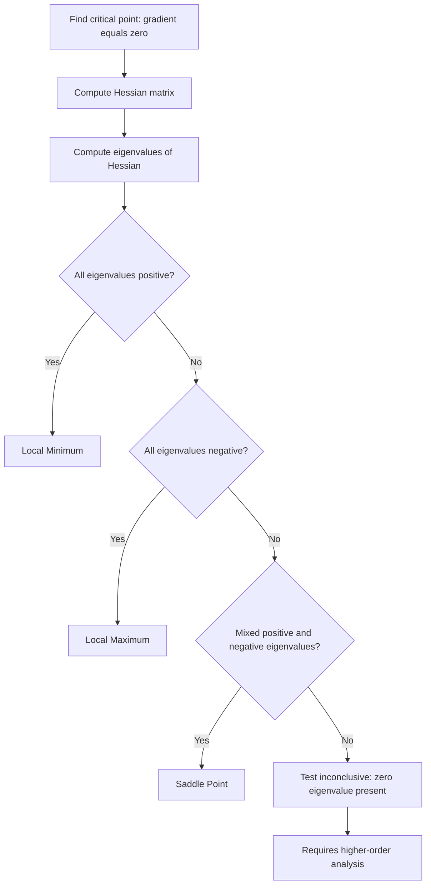

## Saddle Points

### Overview

A saddle point is a critical point of a multivariable function where the gradient vanishes but the point is neither a local minimum nor a local maximum. At a saddle point, the function increases in some directions and decreases in others. Saddle points are of particular importance in machine learning because high-dimensional loss landscapes, such as those encountered in deep neural network training, are dominated by saddle points rather than local minima or maxima. [Inference] This claim about the relative prevalence of saddle points versus local minima in high-dimensional loss landscapes is based on theoretical and empirical results from optimization research literature; specific numerical prevalence figures are not verified here and vary by architecture and problem setting.

### Definition

A point $x^* \in \mathbb{R}^n$ is a critical point of a function $f(x)$ if:

$$\nabla f(x^*) = 0$$

The point $x^*$ is classified using the Hessian matrix $H(x^*)$, the matrix of second-order partial derivatives:

$$H(x^*) = \begin{bmatrix} \dfrac{\partial^2 f}{\partial x_1^2} & \cdots & \dfrac{\partial^2 f}{\partial x_1 \partial x_n} \\ \vdots & \ddots & \vdots \\ \dfrac{\partial^2 f}{\partial x_n \partial x_1} & \cdots & \dfrac{\partial^2 f}{\partial x_n^2} \end{bmatrix}$$

A critical point is classified as a saddle point if the Hessian at that point is indefinite — that is, it has both positive and negative eigenvalues.

### Classification via Eigenvalues

**Key Points**
- If all eigenvalues of $H(x^*)$ are positive, $x^*$ is a local minimum.
- If all eigenvalues of $H(x^*)$ are negative, $x^*$ is a local maximum.
- If eigenvalues have mixed signs (some positive, some negative), $x^*$ is a saddle point.
- If any eigenvalue is exactly zero and the rest share a consistent sign, the second-derivative test is inconclusive, and higher-order terms or direct analysis are needed.

This classification follows from the second-order Taylor expansion of $f(x)$ around $x^*$:

$$f(x^* + \Delta x) \approx f(x^*) + \nabla f(x^*)^T \Delta x + \frac{1}{2} \Delta x^T H(x^*) \Delta x$$

Since $\nabla f(x^*) = 0$ at a critical point, the local behavior of $f$ is governed entirely by the quadratic form $\Delta x^T H(x^*) \Delta x$. The sign of this quadratic form along different directions $\Delta x$ determines whether the function rises or falls, which is precisely what the eigenvalues of $H(x^*)$ encode.

### Simple Example

Consider $f(x, y) = x^2 - y^2$.

**Example**

Step 1: Compute the gradient.
$$\nabla f(x,y) = \begin{bmatrix} 2x \\ -2y \end{bmatrix}$$

Setting this to zero gives the critical point $(0, 0)$.

Step 2: Compute the Hessian.
$$H = \begin{bmatrix} 2 & 0 \\ 0 & -2 \end{bmatrix}$$

Step 3: Find eigenvalues. Since $H$ is diagonal, the eigenvalues are read directly from the diagonal: $\lambda_1 = 2$, $\lambda_2 = -2$.

**Output**

Because the eigenvalues have mixed signs, $(0,0)$ is a saddle point. Moving along the $x$-axis, $f$ increases; moving along the $y$-axis, $f$ decreases.

### Geometric Visualization

<svg xmlns="http://www.w3.org/2000/svg" viewBox="0 0 500 380">
  <text x="250" y="25" font-size="16" font-weight="bold" text-anchor="middle" fill="#1a1a1a">Saddle Point Cross-Sections (svg_diagram)</text>

  
  <line x1="60" y1="200" x2="440" y2="200" stroke="#333" stroke-width="1.5" />
  <line x1="250" y1="60" x2="250" y2="340" stroke="#333" stroke-width="1.5" />
  <text x="445" y="205" font-size="12" fill="#333">x-axis direction</text>
  <text x="255" y="55" font-size="12" fill="#333">y-axis direction</text>

  
  <path d="M 100 260 Q 250 120 400 260" fill="none" stroke="#4a90d9" stroke-width="2.5" />
  <text x="330" y="255" font-size="11" fill="#2a5a8a">f increases along x</text>

  
  <path d="M 250 340 Q 380 200 250 60" fill="none" stroke="#d9534f" stroke-width="0" />
  <path d="M 190 90 Q 250 200 190 310" fill="none" stroke="#d9534f" stroke-width="2.5" />
  <text x="120" y="100" font-size="11" fill="#a8362f">f decreases along y</text>

  
  <circle cx="250" cy="200" r="5" fill="#333" />
  <text x="258" y="195" font-size="12" fill="#333" font-weight="bold">x*</text>

  <text x="80" y="365" font-size="12" fill="#333">Blue: convex direction. Red: concave direction. Point x* is a saddle.</text>
</svg>

[Inference] This diagram is a simplified schematic illustration constructed for explanatory purposes and is not a reproduction of any specific published figure.

### Saddle Points in High-Dimensional Optimization

**Key Points**
- As the dimensionality of parameter space increases, the probability that a random critical point has all-positive or all-negative eigenvalues decreases sharply, while the probability of mixed-sign eigenvalues increases. [Inference] This is a probabilistic argument drawn from random matrix theory as applied to loss surface analysis in optimization research; it describes a general tendency under certain theoretical assumptions and is not a verified guarantee about any specific network or dataset.
- Some research literature suggests that in deep learning loss landscapes, saddle points may be a more significant obstacle to training than local minima. [Unverified] This claim originates from specific papers in the optimization and deep learning literature; it has not been independently verified here, and results may not generalize across all architectures, datasets, or training regimes.
- Gradient descent can slow down substantially near saddle points because the gradient magnitude becomes small in the flat directions surrounding the saddle, even though the point is not a true optimum. [Inference] This behavior follows from the mathematical structure of gradient-based updates near critical points with small local curvature; actual slowdown severity is not guaranteed and depends on the specific loss surface and optimizer used.

### Why Saddle Points Are Problematic for Gradient Descent

Near a saddle point, the gradient $\nabla f(x)$ approaches zero, which causes standard gradient descent update rules:

$$x_{t+1} = x_t - \eta \nabla f(x_t)$$

to take increasingly small steps. This can cause training to appear to stall, even though the point is not a genuine local minimum. [Inference] Whether an optimizer eventually escapes a saddle point depends on factors including the curvature structure, step size, noise in stochastic gradients, and the specific optimizer used; escape is not guaranteed in all cases and behavior may vary.

### Strategies Used to Address Saddle Points

**Key Points**
- **Stochastic Gradient Descent (SGD)**: The noise inherent in mini-batch gradient estimates can help perturb the optimization trajectory away from saddle points. [Inference] This is a commonly cited theoretical explanation in optimization literature; it does not guarantee escape from every saddle point encountered in practice.
- **Momentum-based methods**: Methods such as SGD with momentum or Adam incorporate accumulated gradient history, which [Inference] may help traverse flat regions near saddle points faster than vanilla gradient descent in some cases, though this behavior is not guaranteed and depends on hyperparameter settings and problem structure.
- **Second-order and curvature-aware methods**: Techniques that use or approximate Hessian information, such as saddle-free Newton methods, are designed to distinguish descent directions from ascent directions explicitly rather than relying solely on gradient magnitude. [Unverified] The practical effectiveness and adoption of these methods varies across the literature and is not independently verified here.
- **Random perturbations**: Some algorithms intentionally inject noise into parameters when gradient magnitude is small, to help move the iterate off a saddle point. [Inference] This is a known technique described in optimization research; its effectiveness is context-dependent and not guaranteed.

### Saddle Points vs. Local Minima vs. Local Maxima

| Property | Local Minimum | Local Maximum | Saddle Point |
|---|---|---|---|
| Gradient at point | Zero | Zero | Zero |
| Hessian eigenvalues | All positive | All negative | Mixed sign |
| Function behavior nearby | Increases in all directions | Decreases in all directions | Increases in some directions, decreases in others |
| Relevance to ML training | Desirable stopping point | Rarely relevant in minimization | Common obstacle in high dimensions [Inference] |

### Second Derivative Test Summary

### Connection to the KKT Framework

In constrained optimization using KKT conditions, stationarity identifies critical points of the Lagrangian, but does not by itself distinguish minima from saddle points of the Lagrangian. [Inference] Second-order conditions, analogous to the Hessian eigenvalue test described above but applied to the Lagrangian restricted to the feasible tangent space, are generally needed to confirm whether a KKT point is a genuine local minimum; the exact form of this second-order test depends on the specific constrained optimization framework being used and is not elaborated further here.

### Common Pitfalls

- Assuming that a zero gradient always indicates a minimum, without checking the Hessian.
- Treating slow training progress as convergence, when it may instead indicate proximity to a saddle point. [Inference] This distinction requires further diagnostic analysis and cannot be confirmed from loss curves alone.
- Confusing saddle points with plateaus; a plateau is a broader region of near-zero gradient that does not necessarily correspond to a critical point with mixed-sign Hessian eigenvalues. [Unverified] Precise terminology usage varies across sources.
- Assuming all optimizers handle saddle points identically. [Inference] Behavior differs by optimizer design, and no universal claim can be made about which method performs best in all cases.

### Conclusion

Saddle points are critical points where the Hessian is indefinite, causing the function to rise in some directions and fall in others. They are distinguished from local minima and maxima through eigenvalue analysis of the Hessian matrix. [Inference] In high-dimensional machine learning optimization problems, saddle points are widely discussed in the research literature as a significant factor affecting training dynamics, though the precise practical impact varies by model, dataset, and optimizer, and no specific outcome is guaranteed.

**Related Topics**
- Hessian Matrix and Second-Order Optimality Conditions
- Eigenvalues and Eigenvectors in Optimization
- Stochastic Gradient Descent and Noise-Induced Escape Dynamics
- Newton's Method and Saddle-Free Newton Methods
- Convexity, Concavity, and Indefinite Quadratic Forms
- Loss Landscape Geometry in Deep Neural Networks