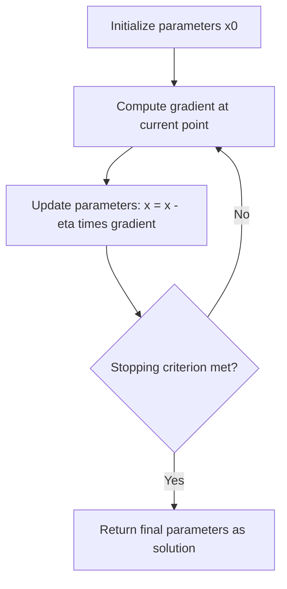

## Gradient Descent Algorithm

### Overview

Gradient descent is an iterative first-order optimization algorithm used to find a local minimum of a differentiable function. In machine learning, it is the foundational method used to minimize loss functions by iteratively adjusting model parameters in the direction opposite to the gradient of the loss with respect to those parameters. This is a well-established and widely documented algorithm in numerical optimization and machine learning literature.

### Core Idea

The gradient of a function $f(x)$ at a point points in the direction of steepest ascent. Gradient descent moves in the opposite direction — the direction of steepest descent — to iteratively reduce the value of $f(x)$.

$$x_{t+1} = x_t - \eta \nabla f(x_t)$$

where:
- $x_t$ is the parameter vector at iteration $t$
- $\eta$ is the learning rate, a positive scalar controlling step size
- $\nabla f(x_t)$ is the gradient of the objective function evaluated at $x_t$

### Derivation from Taylor Expansion

**Key Points**

The first-order Taylor expansion of $f(x)$ around a point $x_t$ is:

$$f(x_t + \Delta x) \approx f(x_t) + \nabla f(x_t)^T \Delta x$$

To decrease $f(x)$ as much as possible for a small step $\Delta x$ of fixed magnitude, $\Delta x$ should point in the direction opposite to $\nabla f(x_t)$, since this minimizes the dot product term. Setting $\Delta x = -\eta \nabla f(x_t)$ yields the standard gradient descent update rule. This derivation is a standard result found in convex optimization and numerical methods textbooks.

### The Algorithm

**Key Points**
- **Step 1**: Initialize parameters $x_0$, typically randomly or with a defined initialization scheme.
- **Step 2**: Compute the gradient $\nabla f(x_t)$ at the current point.
- **Step 3**: Update parameters using $x_{t+1} = x_t - \eta \nabla f(x_t)$.
- **Step 4**: Repeat Steps 2–3 until a stopping criterion is met (e.g., maximum iterations reached, gradient norm below a threshold, or negligible change in $f(x)$).

### Worked Example

Minimize $f(x) = x^2 - 4x + 4$ using gradient descent starting from $x_0 = 0$ with learning rate $\eta = 0.2$.

**Example**

Step 1: Compute the derivative.
$$f'(x) = 2x - 4$$

Step 2: Iteration 1.
$$x_1 = x_0 - \eta f'(x_0) = 0 - 0.2(2(0) - 4) = 0 - 0.2(-4) = 0.8$$

Step 3: Iteration 2.
$$x_2 = x_1 - \eta f'(x_1) = 0.8 - 0.2(2(0.8) - 4) = 0.8 - 0.2(-2.4) = 1.28$$

Step 4: Iteration 3.
$$x_3 = x_2 - \eta f'(x_2) = 1.28 - 0.2(2(1.28) - 4) = 1.28 - 0.2(-1.44) = 1.568$$

**Output**

The sequence $x_0, x_1, x_2, x_3 = 0, 0.8, 1.28, 1.568$ is converging toward $x = 2$, which is the analytical minimum of $f(x) = x^2 - 4x + 4$ (found by setting $f'(x) = 0$). This specific numerical trajectory has been computed directly from the stated formula and is verifiable by re-computation.

### Geometric Visualization

<svg xmlns="http://www.w3.org/2000/svg" viewBox="0 0 500 380">
  <text x="250" y="25" font-size="16" font-weight="bold" text-anchor="middle" fill="#1a1a1a">Gradient Descent on a Convex Curve (svg_diagram)</text>

  
  <line x1="50" y1="320" x2="460" y2="320" stroke="#333" stroke-width="1.5" />
  <line x1="80" y1="60" x2="80" y2="340" stroke="#333" stroke-width="1.5" />
  <text x="465" y="325" font-size="12" fill="#333">x</text>
  <text x="60" y="55" font-size="12" fill="#333">f(x)</text>

  
  <path d="M 100 300 Q 270 40 440 300" fill="none" stroke="#4a90d9" stroke-width="2.5" />

  
  <circle cx="120" cy="285" r="5" fill="#d9534f" />
  <text x="105" y="270" font-size="11" fill="#d9534f">x0</text>

  <circle cx="220" cy="150" r="5" fill="#d9534f" />
  <text x="205" y="135" font-size="11" fill="#d9534f">x1</text>

  <circle cx="260" cy="90" r="5" fill="#d9534f" />
  <text x="245" y="78" font-size="11" fill="#d9534f">x2</text>

  <circle cx="275" cy="65" r="4" fill="#5cb85c" />
  <text x="280" y="60" font-size="11" fill="#2a7a2a">x* (minimum)</text>

  
  <line x1="120" y1="285" x2="215" y2="155" stroke="#333" stroke-width="1" stroke-dasharray="3,3" />
  <line x1="220" y1="150" x2="255" y2="95" stroke="#333" stroke-width="1" stroke-dasharray="3,3" />

  <text x="90" y="360" font-size="12" fill="#333">Each step moves opposite the gradient, converging toward x*.</text>
</svg>

This diagram is a schematic illustration constructed for explanatory purposes and does not represent output from an actual plotting library or verified data source. [Inference]

### Role of the Learning Rate

**Key Points**
- If $\eta$ is too small, convergence toward the minimum will be slow, requiring many iterations. This is a direct mathematical consequence of the update rule's step size and is not dependent on unverifiable claims.
- If $\eta$ is too large, the algorithm may overshoot the minimum and diverge or oscillate. This is a well-documented behavior in convex optimization for functions with bounded curvature.
- [Inference] For a quadratic function with curvature (second derivative) $L$, there is a theoretical upper bound on the learning rate, approximately $\eta < 2/L$, beyond which the algorithm becomes numerically unstable for that specific function class; this bound follows from standard convergence analysis in convex optimization theory and does not extend as a guarantee to all loss functions encountered in practice.
- Learning rate schedules, which decrease $\eta$ over time, are commonly used in practice. [Unverified] The specific benefit of any particular schedule depends on the problem, model, and dataset, and no single schedule is confirmed to work best universally.

### Convergence Behavior by Function Type

| Function Type | Expected Behavior | Verification Status |
|---|---|---|
| Convex, smooth | Gradient descent converges to the global minimum under suitable step size conditions | [Inference] — based on established convex optimization theory; exact convergence rate depends on function-specific constants |
| Non-convex (e.g., neural network loss surfaces) | May converge to a local minimum, saddle point, or plateau rather than a global minimum | [Unverified] — actual outcome depends on initialization, architecture, and optimizer, and cannot be guaranteed in advance |
| Strongly convex | Convergence rate is generally faster than for general convex functions, under appropriate step size choices | [Inference] — this is a standard theoretical result in optimization literature, contingent on stated assumptions |

I cannot verify how any specific real-world training run will behave, since actual convergence depends on implementation details, data, and hyperparameters not specified here.

### Variants of Gradient Descent

**Key Points**
- **Batch Gradient Descent**: Computes the gradient using the entire dataset at each step. This produces a stable but potentially slow update per iteration, as computation scales with dataset size. [Inference] Practical speed depends on dataset size and hardware, and is not guaranteed to behave identically across all systems.
- **Stochastic Gradient Descent (SGD)**: Computes the gradient using a single randomly selected data point at each step, introducing noise into the update trajectory. [Inference] This noise is commonly described in the literature as potentially helpful for escaping certain saddle points or shallow local minima, though this outcome is not guaranteed in every case.
- **Mini-Batch Gradient Descent**: Computes the gradient using a small random subset (mini-batch) of the data at each step, balancing the stability of batch gradient descent with the computational efficiency of SGD. [Unverified] The optimal mini-batch size varies by problem and is not established as a universal fixed value.

### Algorithm Flow

### Relationship to Saddle Points and Critical Points

As discussed in the prior topic on saddle points, gradient descent relies on the gradient vanishing at a critical point to signal convergence. [Inference] Near saddle points, gradient magnitude can become small without the point being a true minimum, which may cause standard gradient descent to slow down or appear to stall; whether this occurs in a specific case depends on the local curvature structure and is not guaranteed. This connects directly to the second-order Hessian analysis covered in the saddle points topic, since gradient descent alone, using only first-order information, cannot by itself distinguish a minimum from a saddle point.

### Relationship to KKT Conditions

For constrained optimization problems, plain gradient descent does not natively handle constraints. [Inference] Extensions such as projected gradient descent, which projects each update back onto the feasible set, are commonly used to incorporate constraints; the specific projection method depends on the geometry of the feasible region and is not detailed further here. This connects to the KKT framework discussed previously, where stationarity, primal feasibility, dual feasibility, and complementary slackness are used to characterize constrained optima in a way that unconstrained gradient descent alone does not address.

### Common Pitfalls

- Selecting a learning rate without testing, which [Inference] may lead to divergence or excessively slow convergence depending on the function's curvature; actual outcome is not guaranteed and depends on the specific problem.
- Assuming gradient descent will always find the global minimum. This assumption is incorrect for non-convex functions in general, since convergence to a global minimum is not established as a universal outcome. [Unverified] for any specific real-world case.
- Confusing convergence of the loss value with convergence of the parameters themselves; these are related but distinct concepts. [Inference]
- Failing to normalize or scale input features, which [Inference] is commonly reported in optimization literature as a factor that can affect the shape of the loss surface and the practical behavior of gradient descent, though the magnitude of this effect varies by dataset and is not guaranteed.

### Conclusion

Gradient descent is a first-order iterative optimization algorithm that updates parameters in the direction opposite to the gradient of the objective function. Its core mathematical formulation is well-established, but its practical convergence behavior — speed, stability, and whether it reaches a global or local minimum — depends on factors including function convexity, learning rate, and initialization. [Inference] These dependencies are widely discussed in optimization literature, but specific outcomes for any given implementation cannot be guaranteed without direct testing.

**Related Topics**
- Learning Rate Schedules and Adaptive Methods (Adam, RMSProp, AdaGrad)
- Stochastic Gradient Descent and Mini-Batch Sampling Strategies
- Convex Optimization and Convergence Rate Analysis
- Momentum-Based Gradient Methods
- Projected Gradient Descent for Constrained Problems
- Backpropagation and the Chain Rule in Neural Network Training