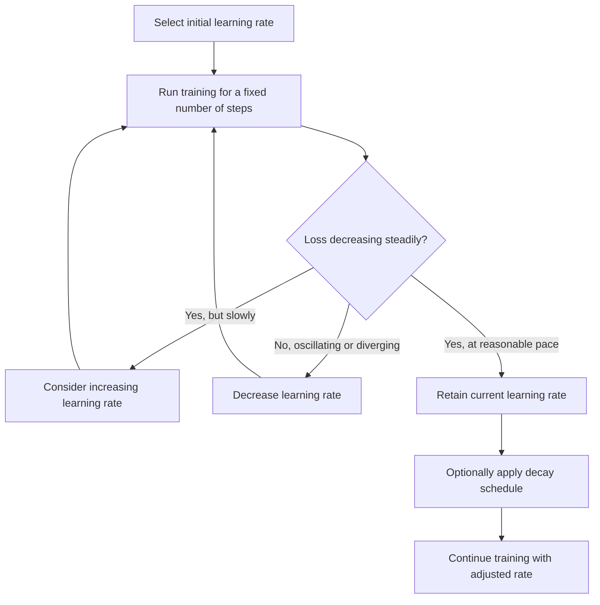

## Learning Rate and Step Size Intuition

### Overview

The learning rate, often denoted $\eta$ or $\alpha$, is a scalar hyperparameter that controls the size of each update step in gradient-based optimization algorithms. It scales the gradient before it is subtracted from the current parameter values. The learning rate is one of the most consequential hyperparameters in machine learning optimization, directly affecting whether an algorithm converges, how fast it converges, and what quality of solution it reaches. [Inference] This characterization reflects general consensus in optimization literature; the specific impact on any individual training run is not guaranteed and depends on the problem.

### Mathematical Role

In the standard gradient descent update rule:

$$x_{t+1} = x_t - \eta \nabla f(x_t)$$

the term $\eta \nabla f(x_t)$ represents the actual step taken in parameter space. The gradient $\nabla f(x_t)$ determines the direction of the step, while $\eta$ determines its magnitude. Even with a correct gradient direction, an inappropriately sized learning rate can prevent effective optimization. This is a direct mathematical consequence of the update rule and is not dependent on unverifiable assumptions.

### Intuition: Step Size on a Curved Surface

**Key Points**

Consider walking downhill on a landscape where $f(x)$ represents elevation. The gradient tells you the steepest downhill direction at your current position. The learning rate determines how far you walk in that direction before re-evaluating the slope.

- A small learning rate corresponds to short, cautious steps. Progress toward the minimum is slow but each step is a reasonably accurate reflection of the local slope.
- A large learning rate corresponds to long strides. These strides can leap over the minimum entirely, landing on the opposite side of the valley, potentially at a higher elevation than before.
- An excessively large learning rate can cause each step to land farther from the minimum than the previous step, resulting in divergence. [Inference] This describes a well-established qualitative behavior in convex optimization theory for functions with bounded curvature; the exact threshold at which this occurs is function-specific.

### Geometric Visualization

<svg xmlns="http://www.w3.org/2000/svg" viewBox="0 0 520 420">
  <text x="260" y="25" font-size="16" font-weight="bold" text-anchor="middle" fill="#1a1a1a">Effect of Learning Rate on Descent Path (svg_diagram)</text>

  
  <text x="120" y="55" font-size="13" font-weight="bold" text-anchor="middle" fill="#333">Small Learning Rate</text>
  <line x1="30" y1="180" x2="220" y2="180" stroke="#333" stroke-width="1" />
  <path d="M 40 170 Q 125 60 210 170" fill="none" stroke="#4a90d9" stroke-width="2" />
  <circle cx="55" cy="155" r="4" fill="#d9534f" />
  <circle cx="75" cy="130" r="4" fill="#d9534f" />
  <circle cx="95" cy="108" r="4" fill="#d9534f" />
  <circle cx="112" cy="90" r="4" fill="#d9534f" />
  <circle cx="125" cy="78" r="3" fill="#5cb85c" />
  <text x="70" y="200" font-size="10" fill="#333">Many small steps, steady progress</text>

  
  <text x="260" y="55" font-size="13" font-weight="bold" text-anchor="middle" fill="#333">Well-Tuned Rate</text>
  <line x1="180" y1="180" x2="370" y2="180" stroke="#333" stroke-width="1" opacity="0" />
  <path d="M 190 170 Q 275 60 360 170" fill="none" stroke="#4a90d9" stroke-width="2" />
  <circle cx="205" cy="152" r="4" fill="#d9534f" />
  <circle cx="245" cy="95" r="4" fill="#d9534f" />
  <circle cx="270" cy="75" r="3" fill="#5cb85c" />
  <text x="220" y="200" font-size="10" fill="#333">Fewer steps, efficient convergence</text>

  
  <text x="420" y="55" font-size="13" font-weight="bold" text-anchor="middle" fill="#333">Excessive Rate</text>
  <path d="M 330 170 Q 425 60 510 170" fill="none" stroke="#4a90d9" stroke-width="2" />
  <circle cx="345" cy="150" r="4" fill="#d9534f" />
  <circle cx="500" cy="150" r="4" fill="#d9534f" />
  <circle cx="355" cy="155" r="4" fill="#d9534f" />
  <line x1="345" y1="150" x2="500" y2="150" stroke="#d9534f" stroke-width="1" stroke-dasharray="3,3" />
  <line x1="500" y1="150" x2="355" y2="155" stroke="#d9534f" stroke-width="1" stroke-dasharray="3,3" />
  <text x="370" y="200" font-size="10" fill="#333">Overshoot, oscillation or divergence</text>

  <text x="260" y="380" font-size="11" text-anchor="middle" fill="#555">Diagram is a schematic illustration, not generated from computed optimization data. [Inference]</text>
</svg>

### Worked Numerical Example

Minimize $f(x) = x^2$ starting from $x_0 = 5$, comparing three learning rates.

**Example**

The gradient is $f'(x) = 2x$, and the update rule is $x_{t+1} = x_t - \eta(2x_t) = x_t(1 - 2\eta)$.

**Case 1: $\eta = 0.1$**
$$x_1 = 5(1 - 0.2) = 4.0$$
$$x_2 = 4.0(0.8) = 3.2$$
$$x_3 = 3.2(0.8) = 2.56$$

**Case 2: $\eta = 0.5$**
$$x_1 = 5(1 - 1.0) = 0$$

Convergence occurs in a single step for this specific quadratic function, since $1 - 2\eta = 0$.

**Case 3: $\eta = 1.2$**
$$x_1 = 5(1 - 2.4) = 5(-1.4) = -7.0$$
$$x_2 = -7.0(-1.4) = 9.8$$
$$x_3 = 9.8(-1.4) = -13.72$$

**Output**

These three cases, computed directly from the formula $x_{t+1} = x_t(1 - 2\eta)$, show progressively slower convergence for $\eta = 0.1$, immediate convergence for $\eta = 0.5$, and divergence with growing oscillation for $\eta = 1.2$. These specific numbers are verifiable by direct recomputation of the stated formula. For this particular function $f(x) = x^2$, the general convergence condition is $|1 - 2\eta| < 1$, which holds for $0 < \eta < 1$. [Inference] This threshold is derived analytically for this specific quadratic function and does not generalize numerically to other functions without separate derivation.

### Relationship to Curvature

**Key Points**
- For a quadratic function $f(x) = \frac{1}{2} L x^2$, where $L$ represents the curvature (second derivative), the theoretical convergence condition is $\eta < 2/L$. [Inference] This is a standard result from convex optimization theory for quadratic functions specifically, and does not directly extend as a numerical guarantee to non-quadratic or non-convex loss functions.
- Functions with high curvature generally require smaller learning rates to avoid overshooting, while functions with low curvature can typically tolerate larger learning rates. [Inference] This is a general qualitative relationship described in optimization literature; exact appropriate values depend on the specific function.
- In multivariable settings, curvature varies by direction, meaning a single scalar learning rate may be too large for high-curvature directions and too small for low-curvature directions simultaneously. [Inference] This observation is commonly discussed in optimization literature as a motivation for adaptive and second-order methods, though the practical severity of this tradeoff depends on the specific loss surface.

### Fixed vs. Adaptive Learning Rates

| Approach | Description | Verification Status |
|---|---|---|
| Fixed learning rate | A single constant $\eta$ used throughout training | Directly defined by the update rule; behavior is mathematically determined given $\eta$ and $f(x)$ |
| Learning rate decay/schedule | $\eta$ decreases over time according to a predefined rule (e.g., step decay, exponential decay) | [Inference] Commonly used to balance fast early progress with fine-grained convergence near the minimum; specific benefit is problem-dependent and not guaranteed |
| Adaptive methods (e.g., Adam, RMSProp, AdaGrad) | Learning rate is adjusted per-parameter based on historical gradient information | [Unverified] These methods are widely used in practice according to the literature, but whether they outperform a well-tuned fixed rate for any specific problem is not established as a universal fact |

I cannot verify how any specific adaptive method will perform on an unspecified dataset or model without direct testing.

### Step Size Selection Methods

**Key Points**
- **Grid search**: Testing multiple fixed learning rate values and selecting the one yielding the best observed validation performance. [Inference] This is a commonly described practical approach in machine learning literature.
- **Learning rate range test**: Gradually increasing the learning rate over a short trial run and observing the point at which loss begins increasing sharply. [Unverified] The specific effectiveness of this heuristic depends on the loss surface and is not confirmed as universally reliable.
- **Line search methods**: Analytically or numerically determining a step size that satisfies certain descent conditions (e.g., Armijo condition) at each iteration, rather than using a fixed value. This is a documented method in classical numerical optimization literature.
- **Second-order methods**: Using curvature information (e.g., via the Hessian, as discussed in the saddle points topic) to compute a more informed step size automatically, such as in Newton's method. [Inference] This connects directly to Hessian-based analysis, though computing and inverting the Hessian is computationally expensive for high-dimensional problems, which is a widely cited practical limitation in the literature.

### Process Flow for Learning Rate Tuning

### Connection to Prior Topics

As discussed in the gradient descent topic, the update rule $x_{t+1} = x_t - \eta \nabla f(x_t)$ relies entirely on the learning rate to convert gradient direction into an actual parameter change. As discussed in the saddle points topic, [Inference] a small gradient magnitude near a saddle point can interact with the learning rate such that progress appears to stall even under a well-chosen $\eta$, since the effective step size $\eta \nabla f(x_t)$ shrinks when the gradient itself is small; this is a mathematical consequence of the update formula rather than a claim about any specific training outcome. In the KKT conditions topic, constrained optimization problems typically require step size choices that also respect feasibility, which is one motivation for methods such as projected gradient descent mentioned previously.

### Common Pitfalls

- Assuming a learning rate that works well for one function or dataset will work well for another. [Unverified] Transferability of a specific learning rate value across different problems is not established as a general fact.
- Using a single fixed learning rate for all parameters when curvature varies significantly across dimensions, which [Inference] is commonly cited in the literature as a motivation for adaptive methods, though the actual practical impact varies by problem.
- Interpreting oscillating loss values as a sign of a bug rather than considering an excessive learning rate as a possible cause. [Inference]
- Setting the learning rate too small and mistaking slow convergence for a converged or stuck model. [Inference] This distinction generally requires monitoring gradient norms or loss trends over a longer horizon rather than a small number of steps.

### Conclusion

The learning rate governs the magnitude of each optimization step and interacts directly with the curvature of the objective function to determine whether an algorithm converges, diverges, or oscillates. [Inference] While mathematical relationships such as $\eta < 2/L$ hold precisely for specific quadratic functions under stated theoretical assumptions, the practical selection of a learning rate for complex, non-convex machine learning models generally relies on empirical tuning methods, and no single value or schedule is confirmed to work universally across all problems. I do not have access to information that would allow verification of optimal learning rate values for any unspecified real-world model.

**Related Topics**
- Adaptive Optimization Methods (Adam, RMSProp, AdaGrad)
- Learning Rate Schedules and Decay Strategies
- Second-Order Methods and Newton's Method
- Line Search and the Armijo Condition
- Curvature, the Hessian, and Condition Number
- Momentum and Its Interaction with Step Size