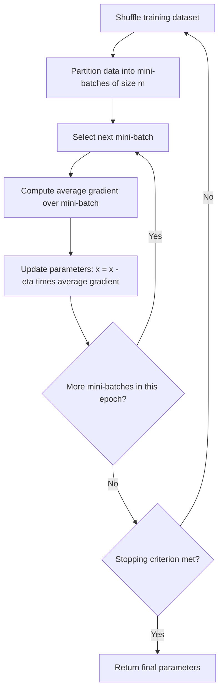

## Mini-Batch Gradient Descent

### Overview

Mini-batch gradient descent is an optimization method that computes the gradient of the loss function using a small, randomly sampled subset of the training data — called a mini-batch — at each iteration, rather than the entire dataset (as in batch gradient descent) or a single example (as in stochastic gradient descent). It is described in machine learning literature as a widely used approach for training models on large datasets. [Unverified] The specific claim that it is the most common approach across all of contemporary practice is not independently verified here.

### Mathematical Formulation

For a loss function decomposed as a sum over $n$ training examples:

$$f(x) = \frac{1}{n} \sum_{i=1}^{n} f_i(x)$$

Mini-batch gradient descent samples a subset $B_t \subset \{1, \dots, n\}$ of size $m$ (where $1 < m < n$) at each iteration, and updates parameters using:

$$x_{t+1} = x_t - \eta \cdot \frac{1}{m} \sum_{i \in B_t} \nabla f_i(x_t)$$

This averages the gradient over the mini-batch, producing a gradient estimate with lower variance than a single-example SGD step, while remaining computationally cheaper than a full-batch gradient computation. [Inference] The reduction in variance relative to single-example SGD follows from standard statistical properties of averaging independent or near-independent samples; the exact magnitude of variance reduction depends on the batch size and the data distribution, and is not established as a fixed numerical value here.

### Core Intuition

**Key Points**
- Batch gradient descent uses all $n$ examples, producing a low-noise but computationally expensive gradient estimate per step.
- Stochastic gradient descent uses 1 example, producing a high-noise but computationally cheap gradient estimate per step.
- Mini-batch gradient descent uses $m$ examples, where $1 < m < n$, positioned as an intermediate option between these two extremes. [Inference] This positioning is a direct mathematical consequence of averaging over more than one but fewer than all data points, rather than an empirical claim requiring separate verification.

### Geometric Visualization

<svg xmlns="http://www.w3.org/2000/svg" viewBox="0 0 520 400">
  <text x="260" y="25" font-size="16" font-weight="bold" text-anchor="middle" fill="#1a1a1a">Descent Path Noise by Batch Size (svg_diagram)</text>

  
  <ellipse cx="260" cy="220" rx="180" ry="120" fill="none" stroke="#ccc" stroke-width="1" stroke-dasharray="4,4" />
  <ellipse cx="260" cy="220" rx="130" ry="85" fill="none" stroke="#ccc" stroke-width="1" stroke-dasharray="4,4" />
  <ellipse cx="260" cy="220" rx="80" ry="50" fill="none" stroke="#ccc" stroke-width="1" stroke-dasharray="4,4" />
  <circle cx="260" cy="220" r="4" fill="#5cb85c" />
  <text x="268" y="215" font-size="11" fill="#2a7a2a">x*</text>

  
  <path d="M 90 100 Q 180 150 260 220" fill="none" stroke="#4a90d9" stroke-width="2.5" />
  <text x="60" y="90" font-size="11" fill="#2a5a8a">Batch: smooth</text>

  
  <path d="M 90 210 L 140 180 L 170 195 L 210 210 L 260 220" fill="none" stroke="#f0ad4e" stroke-width="2" />
  <text x="60" y="235" font-size="11" fill="#a67a2e">Mini-batch: moderate noise</text>

  
  <path d="M 90 330 L 130 290 L 150 310 L 190 270 L 175 250 L 220 240 L 210 220 L 260 220" fill="none" stroke="#d9534f" stroke-width="2" />
  <text x="60" y="350" font-size="11" fill="#a8362f">SGD: high noise, zigzagging</text>

  <text x="260" y="380" font-size="11" text-anchor="middle" fill="#555">Schematic illustration; not generated from computed data. [Inference]</text>
</svg>

### Worked Example

Consider a dataset with six points, minimizing $f(x) = \frac{1}{6}\sum_{i=1}^{6}(x - c_i)^2$ where $c = [1, 2, 3, 4, 5, 6]$.

**Example**

Step 1: Each individual gradient is $f_i'(x) = 2(x - c_i)$.

Step 2: Starting at $x_0 = 0$ with $\eta = 0.1$, suppose the randomly sampled mini-batch of size $m = 3$ is $\{c_2, c_4, c_6\} = \{2, 4, 6\}$.

Step 3: Compute the mini-batch gradient.
$$\frac{1}{3}\left[2(0-2) + 2(0-4) + 2(0-6)\right] = \frac{1}{3}\left[-4 - 8 - 12\right] = \frac{-24}{3} = -8$$

Step 4: Apply the update.
$$x_1 = 0 - 0.1(-8) = 0.8$$

**Output**

This computed value, $x_1 = 0.8$, follows directly from the stated formula and the specific sampled mini-batch $\{2, 4, 6\}$. For comparison, the true batch gradient using all six points would be $\frac{1}{6}\left[2(-1) + 2(-2) + 2(-3) + 2(-4) + 2(-5) + 2(-6)\right] = \frac{1}{6}(-42) = -7$, giving a batch step of $x_1 = 0 - 0.1(-7) = 0.7$. The difference between $0.8$ and $0.7$ in this specific example illustrates the deviation introduced by using a subset of the data rather than the full dataset; this particular numerical gap is specific to this example and should not be generalized to other datasets or batch selections.

### Batch Size Trade-offs

**Key Points**
- Larger mini-batch sizes produce gradient estimates closer to the true batch gradient, reducing variance per step. [Inference] This follows from statistical averaging principles; the exact rate of variance reduction as a function of batch size depends on the underlying data distribution and is not quantified here.
- Larger mini-batch sizes generally require more memory and more computation per step, since more examples must be processed simultaneously. This is a direct consequence of the computational operations involved.
- Smaller mini-batch sizes retain more gradient noise, which [Inference] is described in optimization literature as potentially helpful for escaping saddle points or shallow local minima, similar to the mechanism discussed in the SGD topic, though this outcome is not guaranteed in any specific case.
- [Unverified] The claim that a specific "optimal" batch size exists for a given problem is not established as a general fact; reported findings vary across studies, models, and datasets in the literature, and I do not have access to information that would allow a verified universal recommendation.

### Hardware Considerations

**Key Points**
- Mini-batch processing is commonly described in machine learning literature as being well-suited to parallel hardware such as GPUs, since operations across examples within a batch can often be vectorized. [Inference] The specific degree of speedup depends on hardware architecture, batch size, and implementation details, and is not quantified here.
- [Unverified] Claims that a particular batch size maximally utilizes any specific hardware configuration would require direct benchmarking and are not verified in this general context.

### Comparison Table

| Property | Batch GD | Mini-Batch GD | SGD |
|---|---|---|---|
| Examples per update | All $n$ | $m$, where $1 < m < n$ | 1 |
| Gradient variance | None (exact) | Moderate | High |
| Memory usage per step | Highest | Moderate | Lowest |
| Compute per step | Highest | Moderate | Lowest |
| Update frequency per epoch | 1 | $n/m$ | $n$ |
| Common role in practice | [Unverified] Baseline/theoretical reference in much of the literature | [Unverified] Frequently reported as the default choice in deep learning literature | [Unverified] Often used as a theoretical limiting case or in specific online learning contexts |

I cannot verify which specific batch size or method performs best for any unspecified dataset, model, or hardware setup without direct testing.

### Process Flow

### Connection to Prior Topics

As discussed in the SGD topic, gradient noise arises from using a subset of data rather than the full dataset; mini-batch gradient descent modulates the degree of this noise directly through the choice of batch size $m$. As discussed in the learning rate topic, [Inference] the appropriate learning rate may need to be adjusted based on batch size, since gradient variance changes with $m$, though the precise quantitative relationship between batch size and optimal learning rate is not established as a fixed formula here and is treated differently across sources in the literature. As discussed in the saddle points topic, [Inference] the moderate noise present in mini-batch updates may interact with flat regions near saddle points in ways similar to those described for SGD, though this outcome is not guaranteed and depends on the specific loss surface and batch size chosen.

### Common Pitfalls

- Assuming a larger batch size always leads to better final model performance. [Unverified] This is not established as a universal fact in the literature; some sources report conflicting findings depending on the model and task.
- Selecting a mini-batch size based solely on hardware memory constraints without considering its effect on gradient noise and convergence behavior. [Inference]
- Failing to reshuffle data between epochs when forming mini-batches, which [Unverified] is commonly recommended in machine learning literature to avoid systematic patterns in batch composition, though the precise practical impact depends on the dataset and is not established as a universal fixed effect.
- Using the same learning rate across very different batch sizes without adjustment, which [Inference] may lead to unstable or overly slow training depending on how gradient variance changes with batch size; this outcome is not guaranteed in every case.

### Conclusion

Mini-batch gradient descent computes gradient estimates over small random subsets of data, positioned mathematically between the low-variance, high-cost batch gradient descent and the high-variance, low-cost stochastic gradient descent. [Inference] This trade-off is widely discussed in optimization and machine learning literature as motivating its common use in practice, particularly for large-scale deep learning, though I do not have access to information that would allow verification of its performance characteristics, optimal batch size, or convergence behavior for any specific unspecified model, dataset, or hardware configuration. Any such claims would require direct empirical testing.

**Related Topics**
- Batch Size Selection and Its Effect on Generalization
- Learning Rate Scaling Rules for Different Batch Sizes
- Parallelization and Vectorized Computation on GPUs
- Momentum and Adaptive Methods Applied to Mini-Batch Updates
- Variance Reduction Techniques in Stochastic Optimization
- Epoch Structure and Data Shuffling Strategies