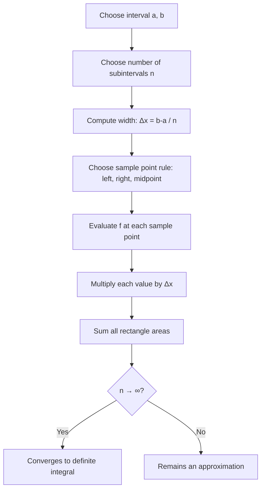

## Riemann Sums

### Definition

A Riemann sum approximates the area under a curve $f(x)$ over an interval $[a, b]$ by partitioning the interval into smaller subintervals, computing the area of a rectangle for each subinterval, and summing these areas.

The general form is:

$$\sum_{i=1}^{n} f(x_i^*) \Delta x$$

where:
- $\Delta x = \frac{b-a}{n}$ is the width of each subinterval
- $n$ is the number of subintervals
- $x_i^*$ is a sample point chosen within the $i$-th subinterval

### Why Riemann Sums Matter for Machine Learning

Riemann sums form the conceptual foundation for numerical integration, which appears in machine learning in contexts such as computing expectations under continuous probability distributions, approximating areas under ROC curves (AUC), evaluating cumulative distribution functions, and understanding the discretization logic behind gradient-based optimization over continuous loss landscapes. [Inference] The connection between Riemann sums and these ML applications is a reasoned extension of the shared mathematical structure (summing weighted function values over a partition), not a claim about any specific ML library's internal implementation.

### Types of Riemann Sums

#### Left Riemann Sum

Uses the left endpoint of each subinterval as $x_i^*$:

$$L_n = \sum_{i=0}^{n-1} f(x_i) \Delta x$$

where $x_i = a + i\Delta x$.

#### Right Riemann Sum

Uses the right endpoint of each subinterval:

$$R_n = \sum_{i=1}^{n} f(x_i) \Delta x$$

where $x_i = a + i\Delta x$.

#### Midpoint Riemann Sum

Uses the midpoint of each subinterval:

$$M_n = \sum_{i=1}^{n} f\left(\frac{x_{i-1} + x_i}{2}\right) \Delta x$$

#### Trapezoidal Sum

Averages the left and right sums, approximating each subinterval with a trapezoid rather than a rectangle:

$$T_n = \frac{\Delta x}{2}\left[f(x_0) + 2f(x_1) + 2f(x_2) + \cdots + 2f(x_{n-1}) + f(x_n)\right]$$

### Visual Comparison

<svg xmlns="http://www.w3.org/2000/svg" viewBox="0 0 700 420">
\<style\>
.lbl { font-family: sans-serif; font-size: 13px; fill: #222; }
.title { font-family: sans-serif; font-size: 15px; fill: #111; font-weight: bold; }
.curve { fill: none; stroke: #1a1a1a; stroke-width: 2; }
.rect-left { fill: #7fb3ff; stroke: #2563eb; stroke-width: 1; fill-opacity: 0.5; }
.rect-right { fill: #ffb37f; stroke: #ea580c; stroke-width: 1; fill-opacity: 0.5; }
\</style\>

<text x="20" y="25" class="title">Left vs Right Riemann Sum on f(x) (svg_diagram)</text>

<text x="60" y="55" class="lbl">Left Riemann Sum</text>
<line x1="50" y1="360" x2="330" y2="360" stroke="#333" stroke-width="1.5" />
<line x1="50" y1="360" x2="50" y2="70" stroke="#333" stroke-width="1.5" />

<rect x="50" y="300" width="35" height="60" class="rect-left" />
<rect x="85" y="260" width="35" height="100" class="rect-left" />
<rect x="120" y="200" width="35" height="160" class="rect-left" />
<rect x="155" y="150" width="35" height="210" class="rect-left" />
<rect x="190" y="120" width="35" height="240" class="rect-left" />
<rect x="225" y="110" width="35" height="250" class="rect-left" />
<rect x="260" y="130" width="35" height="230" class="rect-left" />

<path d="M 50 340 C 100 260, 150 100, 200 100 C 250 100, 280 150, 295 200" class="curve" />

<text x="60" y="385" class="lbl">a</text>
<text x="290" y="385" class="lbl">b</text>

<text x="420" y="55" class="lbl">Right Riemann Sum</text>
<line x1="410" y1="360" x2="690" y2="360" stroke="#333" stroke-width="1.5" />
<line x1="410" y1="360" x2="410" y2="70" stroke="#333" stroke-width="1.5" />

<rect x="410" y="260" width="35" height="100" class="rect-right" />
<rect x="445" y="200" width="35" height="160" class="rect-right" />
<rect x="480" y="150" width="35" height="210" class="rect-right" />
<rect x="515" y="120" width="35" height="240" class="rect-right" />
<rect x="550" y="110" width="35" height="250" class="rect-right" />
<rect x="585" y="130" width="35" height="230" class="rect-right" />
<rect x="620" y="170" width="35" height="190" class="rect-right" />

<path d="M 410 340 C 460 260, 510 100, 560 100 C 610 100, 640 150, 655 200" class="curve" />

<text x="420" y="385" class="lbl">a</text>
<text x="650" y="385" class="lbl">b</text>

<text x="20" y="410" class="lbl">Blue = underestimate on rising curve | Orange = overestimate on rising curve</text>
</svg>

### Sigma Notation Breakdown

| Symbol | Meaning |
|---|---|
| $\sum$ | Summation operator |
| $i=1$ to $n$ | Range of the index variable |
| $f(x_i^*)$ | Function value at the sample point |
| $\Delta x$ | Width of each rectangle (uniform partition) |

### The Limit Definition of the Definite Integral

As $n \to \infty$ (and consequently $\Delta x \to 0$), the Riemann sum converges to the exact area under the curve, defining the definite integral:

$$\int_a^b f(x) \, dx = \lim_{n \to \infty} \sum_{i=1}^{n} f(x_i^*) \Delta x$$

This limit exists whenever $f$ is continuous on $[a, b]$ (a sufficient but not universally necessary condition; some discontinuous functions are also Riemann integrable). [Unverified] The precise conditions on discontinuity sets (e.g., measure-zero discontinuities) that still allow Riemann integrability are a formal real-analysis result and are not restated here as verified without a direct citation.

### Worked Example

Approximate $\int_0^2 x^2 \, dx$ using a right Riemann sum with $n = 4$.

**Setup:**
- $a = 0$, $b = 2$, $n = 4$
- $\Delta x = \frac{2-0}{4} = 0.5$
- Sample points (right endpoints): $x_1 = 0.5,\ x_2 = 1.0,\ x_3 = 1.5,\ x_4 = 2.0$

**Computation:**

$$R_4 = \Delta x \left[f(0.5) + f(1.0) + f(1.5) + f(2.0)\right]$$

$$= 0.5\left[0.25 + 1.0 + 2.25 + 4.0\right] = 0.5 \times 7.5 = 3.75$$

**Exact value** (via the power rule for integration, covered in a later topic):

$$\int_0^2 x^2 \, dx = \left[\frac{x^3}{3}\right]_0^2 = \frac{8}{3} \approx 2.667$$

The right Riemann sum overestimates here because $x^2$ is increasing on $[0, 2]$, so right endpoints sit above the curve's average height on each subinterval.

### Convergence Behavior

<svg xmlns="http://www.w3.org/2000/svg" viewBox="0 0 700 320">
\<style\>
.lbl2 { font-family: sans-serif; font-size: 13px; fill: #222; }
.title2 { font-family: sans-serif; font-size: 15px; fill: #111; font-weight: bold; }
.axis { stroke: #333; stroke-width: 1.5; }
.approx-line { fill: none; stroke: #dc2626; stroke-width: 2; stroke-dasharray: 5,3; }
.true-line { fill: none; stroke: #16a34a; stroke-width: 2; }
.pt { fill: #dc2626; }
\</style\>

<text x="20" y="25" class="title2">Riemann Sum Approximation as n Increases (svg_diagram)</text>

<line x1="60" y1="260" x2="650" y2="260" class="axis" />
<line x1="60" y1="260" x2="60" y2="50" class="axis" />

<text x="620" y="280" class="lbl2">n</text>
<text x="30" y="55" class="lbl2">Area</text>

<line x1="60" y1="150" x2="650" y2="150" class="true-line" />
<text x="560" y="140" class="lbl2" fill="#16a34a">True integral value</text>

<path d="M 100 230 L 200 200 L 300 180 L 400 165 L 500 155 L 600 151" class="approx-line" />
<circle cx="100" cy="230" r="4" class="pt" />
<circle cx="200" cy="200" r="4" class="pt" />
<circle cx="300" cy="180" r="4" class="pt" />
<circle cx="400" cy="165" r="4" class="pt" />
<circle cx="500" cy="155" r="4" class="pt" />
<circle cx="600" cy="151" r="4" class="pt" />

<text x="90" y="248" class="lbl2">n=2</text>
<text x="190" y="248" class="lbl2">n=4</text>
<text x="290" y="248" class="lbl2">n=8</text>
<text x="390" y="248" class="lbl2">n=16</text>
<text x="490" y="248" class="lbl2">n=32</text>
<text x="585" y="248" class="lbl2">n=64</text>
</svg>

### Process Flow

### Error Characteristics by Method

| Method | Typical Error Behavior | Notes |
|---|---|---|
| Left sum | Overestimates on decreasing $f$, underestimates on increasing $f$ | Error is $O(\Delta x)$ |
| Right sum | Underestimates on decreasing $f$, overestimates on increasing $f$ | Error is $O(\Delta x)$ |
| Midpoint | Errors on either side of curvature tend to cancel | Error is $O(\Delta x^2)$ |
| Trapezoidal | Averages left/right error | Error is $O(\Delta x^2)$ |

[Inference] These asymptotic error orders follow from standard numerical analysis derivations (Taylor expansion of $f$ around each subinterval) and are a well-established mathematical result, not a claim specific to any software implementation.

### Relevance to Machine Learning Practice

- **Numerical integration in probabilistic models**: Riemann-sum-like discretization underlies quadrature methods used when a closed-form integral is unavailable (e.g., certain Bayesian posterior computations).
- **Monte Carlo methods as an alternative**: For high-dimensional integrals common in ML, Monte Carlo integration is generally preferred over Riemann-sum-style grid methods due to the curse of dimensionality. [Inference] This preference is a widely cited rationale in numerical methods literature, reasoned from how grid-based quadrature cost scales exponentially with dimension.
- **AUC-ROC computation**: The trapezoidal rule (a refinement of the Riemann sum concept) is commonly used to approximate the area under an ROC curve. [Unverified] Whether a specific library uses trapezoidal vs. another rule depends on its implementation and is not confirmed here without inspecting that library's source.

### Common Pitfalls

- Confusing the *sample point rule* (left/right/midpoint) with the *number of partitions* — both affect accuracy independently.
- Assuming a Riemann sum always converges — it does not for all functions; integrability conditions matter [Unverified] for the full technical boundary of these conditions.
- Forgetting that $\Delta x$ must shrink uniformly (or in a controlled way) as $n \to \infty$ for the standard convergence result to apply.

**Related Topics**
- The Fundamental Theorem of Calculus (linking Riemann sums to antiderivatives)
- Trapezoidal Rule and Simpson's Rule (higher-order numerical integration)
- Monte Carlo Integration (sampling-based alternative for high dimensions)
- Improper Integrals (extending Riemann sums to unbounded intervals or functions)
- Multivariable Integration (double and triple Riemann sums for ML applications like joint distributions)