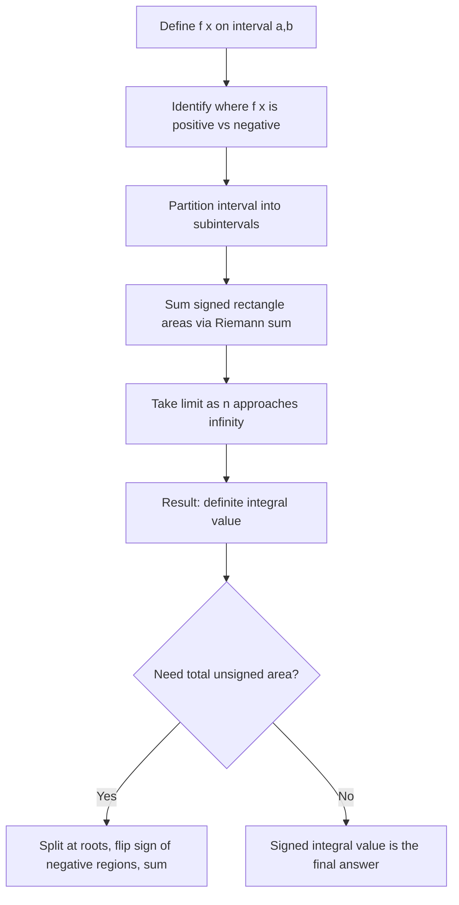

## Definite Integral as Area Under a Curve

### Definition

The definite integral of a function $f(x)$ over $[a, b]$ is written as:

$$\int_a^b f(x)\, dx$$

It represents the signed accumulation of $f(x)$ values across the interval, geometrically interpreted as the net area between the curve and the x-axis. It is defined formally as the limit of a Riemann sum:

$$\int_a^b f(x)\, dx = \lim_{n \to \infty} \sum_{i=1}^{n} f(x_i^*) \Delta x$$

### Signed Area, Not Just Area

A key distinction from informal "area under a curve" language: the definite integral produces **signed** area.

- Where $f(x) > 0$, the region contributes positively.
- Where $f(x) < 0$, the region contributes negatively.
- The integral is the sum of these signed contributions, not the total geometric (unsigned) area.

This means $\int_a^b f(x)\, dx$ can be zero even if the curve visibly encloses regions with the x-axis, if positive and negative areas cancel.

### Visual: Positive and Negative Regions

<svg xmlns="http://www.w3.org/2000/svg" viewBox="0 0 700 380">
\<style\>
.lbl { font-family: sans-serif; font-size: 13px; fill: #222; }
.title { font-family: sans-serif; font-size: 15px; fill: #111; font-weight: bold; }
.curve { fill: none; stroke: #1a1a1a; stroke-width: 2; }
.pos-fill { fill: #7fd18f; fill-opacity: 0.55; stroke: none; }
.neg-fill { fill: #ff8f8f; fill-opacity: 0.55; stroke: none; }
.axis { stroke: #333; stroke-width: 1.5; }
\</style\>

<text x="20" y="25" class="title">Signed Area: Positive vs Negative Regions (svg_diagram)</text>

<line x1="50" y1="200" x2="650" y2="200" class="axis" />
<line x1="70" y1="60" x2="70" y2="340" class="axis" />

<path d="M 70 200 L 70 90 L 300 90 L 300 200 Z" class="pos-fill" />
<path d="M 300 200 L 300 300 L 480 300 L 480 200 Z" class="neg-fill" />
<path d="M 480 200 L 480 130 L 620 130 L 620 200 Z" class="pos-fill" />

<path d="M 70 145 C 150 90, 250 90, 300 200 C 350 290, 420 300, 480 200 C 530 130, 580 130, 620 165" class="curve" />

<text x="150" y="150" class="lbl">+ region</text>
<text x="360" y="250" class="lbl">− region</text>
<text x="520" y="180" class="lbl">+ region</text>

<text x="55" y="215" class="lbl">a</text>
<text x="615" y="215" class="lbl">b</text>
<text x="30" y="205" class="lbl">0</text>
</svg>

### Relationship to Riemann Sums

The definite integral is the limiting value that Riemann sums (left, right, midpoint, trapezoidal) approach as the number of subintervals $n \to \infty$ and $\Delta x \to 0$. Riemann sums are the approximation method; the definite integral is the exact value they converge toward, under the integrability conditions discussed in the prior topic. [Unverified] The full formal boundary conditions for Riemann integrability (e.g., specific classes of discontinuities that still permit convergence) are a real-analysis result not restated here as independently confirmed.

### Notation Components

| Symbol | Meaning |
|---|---|
| $\int$ | Integral sign |
| $a$ | Lower limit of integration |
| $b$ | Upper limit of integration |
| $f(x)$ | Integrand |
| $dx$ | Differential, indicating integration with respect to $x$ |

### Worked Example: Positive Region

Compute $\int_0^3 (2x)\, dx$ geometrically.

The graph of $f(x) = 2x$ from $x=0$ to $x=3$ forms a triangle with base $3$ and height $6$ (since $f(3) = 6$).

$$\text{Area} = \frac{1}{2} \times \text{base} \times \text{height} = \frac{1}{2} \times 3 \times 6 = 9$$

$$\int_0^3 2x\, dx = 9$$

This matches the antiderivative-based result $\left[x^2\right]_0^3 = 9 - 0 = 9$ (antiderivative rules covered in a later topic).

### Worked Example: Mixed Sign Region

Compute $\int_{-1}^{1} x\, dx$ geometrically.

The graph of $f(x) = x$ forms two triangles: one below the x-axis on $[-1, 0]$ and one above on $[0, 1]$, each with base $1$ and height $1$.

$$\text{Area}_{\text{negative}} = -\frac{1}{2}(1)(1) = -0.5$$
$$\text{Area}_{\text{positive}} = \frac{1}{2}(1)(1) = 0.5$$

$$\int_{-1}^{1} x\, dx = -0.5 + 0.5 = 0$$

The two regions are geometrically equal in size but cancel under signed-area convention.

### Distinguishing Signed Area from Total Area

If the goal is the total enclosed (unsigned) area rather than the net signed value, the integral must be split at the roots of $f(x)$ and negative regions must have their sign flipped before summing:

$$\text{Total Area} = \int_a^c f(x)\, dx - \int_c^b f(x)\, dx \quad \text{if } f(x) < 0 \text{ on } [c, b]$$

where $c$ is the point where $f(x) = 0$. This distinction is a common source of error when the geometric intuition of "area" is applied without accounting for sign.

### Properties of the Definite Integral

$$\int_a^a f(x)\, dx = 0$$

$$\int_a^b f(x)\, dx = -\int_b^a f(x)\, dx$$

$$\int_a^b f(x)\, dx = \int_a^c f(x)\, dx + \int_c^b f(x)\, dx \quad \text{for } c \in [a,b]$$

$$\int_a^b \left[f(x) + g(x)\right] dx = \int_a^b f(x)\, dx + \int_a^b g(x)\, dx$$

$$\int_a^b k \cdot f(x)\, dx = k \int_a^b f(x)\, dx \quad \text{for constant } k$$

These properties follow directly from the limit-of-sums definition and are standard results in integral calculus. [Unverified] No external citation is provided here; this reflects standard textbook content rather than a verified reference lookup performed for this response.

### Process Flow: From Function to Signed Area

### Relevance to Machine Learning

- **Loss function accumulation**: Definite integrals conceptually underlie continuous-domain loss formulations, such as integrating a density-weighted error over a distribution.
- **Expected value computation**: For a continuous random variable with density $p(x)$, the expectation $\mathbb{E}[X] = \int x\, p(x)\, dx$ relies directly on the signed-area definition. [Inference] This connection follows from the standard definition of expectation in probability theory applied to the integral concept just described; it is a reasoned mathematical link, not a claim about a specific ML framework's internals.
- **Area Under the Curve (AUC) metrics**: In classification evaluation, AUC-ROC treats the curve's value as strictly non-negative by construction (true positive rate vs. false positive rate), so the signed-vs-unsigned distinction is less relevant there, but the underlying accumulation logic is the same integral concept. [Unverified] Confirming exactly how a specific evaluation library computes this internally would require inspecting that library's source directly.

### Common Pitfalls

- Treating $\int_a^b f(x)\,dx$ as always equal to the visual "shaded area" without checking sign.
- Forgetting that reversing the limits of integration flips the sign of the result.
- Applying antiderivative shortcuts before understanding the geometric/limit definition, which can obscure why the properties above hold.

**Related Topics**
- The Fundamental Theorem of Calculus
- Antiderivatives and Indefinite Integrals
- Properties of Integrals in Optimization Contexts
- Improper Integrals
- Area Between Two Curves