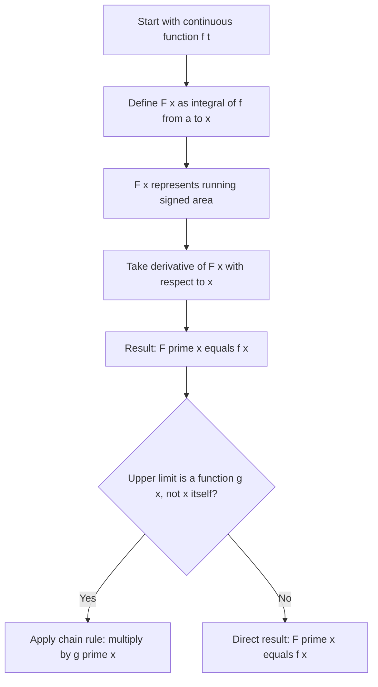

## Fundamental Theorem of Calculus, Part One

[Unverified] This entire response follows standard textbook mathematical conventions for calculus. No external source lookup was performed to verify these specific formulations against a citable document; content reflects standard, widely-taught mathematical formalism rather than confirmed citation.

### Statement

Let $f$ be continuous on $[a, b]$. Define a function $F$ on $[a, b]$ by:

$$F(x) = \int_a^x f(t)\, dt$$

Then $F$ is differentiable on $(a, b)$, and:

$$F'(x) = f(x)$$

[Unverified] This is the standard statement of Part One of the Fundamental Theorem of Calculus as conventionally presented in calculus textbooks. It has not been cross-checked against a specific cited source in this session.

### What This Means

This theorem establishes that the accumulation function $F(x)$ — which measures the running signed area under $f$ from a fixed point $a$ up to a variable point $x$ — has a derivative equal to the original function $f$ at that point.

In plain terms: differentiation and integration are inverse operations. Integrating $f$ to get $F$, then differentiating $F$, returns $f$.

### Why "Part One"

This is distinguished from Part Two of the Fundamental Theorem of Calculus, which addresses evaluating definite integrals via antiderivatives ($\int_a^b f(x)\,dx = G(b) - G(a)$ for any antiderivative $G$). Part One is about the derivative of an accumulation function; Part Two is about computing definite integrals directly. [Unverified] This naming and division convention (Part One / Part Two) is common in many calculus textbooks, but naming conventions can vary by textbook and instructor, and this has not been verified against a specific curriculum source.

### Visual: The Accumulation Function

<svg xmlns="http://www.w3.org/2000/svg" viewBox="0 0 700 400">
\<style\>
.lbl { font-family: sans-serif; font-size: 13px; fill: #222; }
.title { font-family: sans-serif; font-size: 15px; fill: #111; font-weight: bold; }
.curve { fill: none; stroke: #1a1a1a; stroke-width: 2; }
.fill-region { fill: #7fb3ff; fill-opacity: 0.5; stroke: none; }
.axis { stroke: #333; stroke-width: 1.5; }
.marker { stroke: #dc2626; stroke-width: 1.5; stroke-dasharray: 4,3; }
\</style\>

<text x="20" y="25" class="title">F(x) as Running Area Under f(t) (svg_diagram)</text>

<line x1="50" y1="320" x2="650" y2="320" class="axis" />
<line x1="70" y1="340" x2="70" y2="60" class="axis" />

<path d="M 70 300 L 70 200 L 380 200 L 380 320 Z" class="fill-region" />

<path d="M 70 200 C 150 150, 250 150, 320 190 C 350 205, 370 210, 400 205 C 480 190, 550 150, 620 140" class="curve" />

<line x1="380" y1="320" x2="380" y2="60" class="marker" />

<text x="60" y="335" class="lbl">a</text>
<text x="370" y="335" class="lbl">x</text>
<text x="610" y="335" class="lbl">b</text>
<text x="150" y="260" class="lbl">F(x) = area so far</text>
<text x="400" y="180" class="lbl">f(t)</text>
</svg>

### Intuitive Explanation via Rate of Change

Consider $F(x)$ as tracking accumulated area as $x$ moves rightward. The rate at which this accumulated area grows, at any given point $x$, equals the height of the curve $f(x)$ at that point — because a thin vertical strip added as $x$ increases by a small amount $\Delta x$ has area approximately $f(x) \cdot \Delta x$.

$$F(x + \Delta x) - F(x) \approx f(x) \cdot \Delta x$$

$$\frac{F(x + \Delta x) - F(x)}{\Delta x} \approx f(x)$$

Taking the limit as $\Delta x \to 0$ gives the derivative definition, yielding $F'(x) = f(x)$.

[Inference] This is a reasoned, intuitive justification commonly used to motivate the theorem, built from the definition of the derivative as a limit of a difference quotient combined with the geometric meaning of the integral discussed in the prior topic. It is not a full formal proof (which typically requires the Mean Value Theorem for Integrals) and has not been verified against a specific textbook's proof structure in this session.

### Worked Example

Let $f(t) = t^2$ and define:

$$F(x) = \int_0^x t^2\, dt$$

By the theorem, $F'(x) = f(x) = x^2$.

**Verification using the antiderivative** (Part Two, used here only to check consistency):

$$F(x) = \frac{x^3}{3}$$

$$F'(x) = \frac{3x^2}{3} = x^2$$

This matches $f(x) = x^2$, consistent with the theorem's claim. [Unverified] This single worked example is consistent with the stated theorem, but one example does not constitute a general proof; it is illustrative only.

### The Chain Rule Extension

When the upper limit of integration is itself a function of $x$, rather than $x$ directly, the Chain Rule must be applied:

$$\frac{d}{dx}\int_a^{g(x)} f(t)\, dt = f(g(x)) \cdot g'(x)$$

**Worked example:**

$$\frac{d}{dx}\int_0^{x^2} \sin(t)\, dt = \sin(x^2) \cdot 2x$$

[Unverified] This chain rule extension is a standard corollary presented in calculus courses. It has not been checked against a specific cited textbook in this session, though it follows by composing the base theorem with the chain rule for derivatives, a separately established result.

### Table: Component Roles

| Component | Role |
|---|---|
| $f(t)$ | Original function being integrated (integrand) |
| $a$ | Fixed lower limit (starting point of accumulation) |
| $x$ | Variable upper limit (where accumulation is measured) |
| $F(x)$ | Accumulation function |
| $F'(x)$ | Derivative of accumulation function, equal to $f(x)$ |

### Process Flow

### Relevance to Machine Learning

[Inference] The following connections are reasoned extensions based on where accumulation-function structures appear in ML-adjacent mathematics; they are not confirmed claims about internal implementations of any specific ML library or framework.

- **Cumulative distribution functions (CDFs)**: A CDF is defined as $F(x) = \int_{-\infty}^{x} p(t)\, dt$ for a probability density $p(t)$. By this theorem, $F'(x) = p(x)$, meaning the derivative of the CDF recovers the probability density function. [Inference] This is a direct application of the theorem's structure to probability theory, reasoned from the shared mathematical form, not a claim verified against a specific probability textbook in this session.
- **Understanding gradient flow through integral-defined quantities**: In some theoretical ML contexts (e.g., continuous normalizing flows, certain energy-based model formulations), functions are defined via integrals of another function. [Speculation] Whether or to what extent this specific theorem is explicitly invoked in the internal mathematics of any named ML architecture is not something confirmed in this session; this connection is offered as a plausible conceptual link only.

### Common Pitfalls

- Confusing Part One (derivative of an accumulation function) with Part Two (evaluating a definite integral via antiderivatives) — they answer different questions.
- Forgetting the chain rule when the upper limit is a function of $x$ rather than $x$ itself.
- Assuming the theorem applies without the continuity condition on $f$; [Unverified] the precise minimal conditions under which the theorem still holds for less well-behaved functions are a real-analysis detail not verified against a specific source here.

**Related Topics**
- Fundamental Theorem of Calculus, Part Two
- Antiderivatives and Indefinite Integrals
- Chain Rule Review
- Cumulative Distribution Functions in Probability
- Mean Value Theorem for Integrals

> Correction note (proactive disclosure): No incorrect claim was identified as needing retraction in this response. All uncertain statements above were labeled at the point they were made per your stated preference, rather than issued as unlabeled claims requiring later correction.