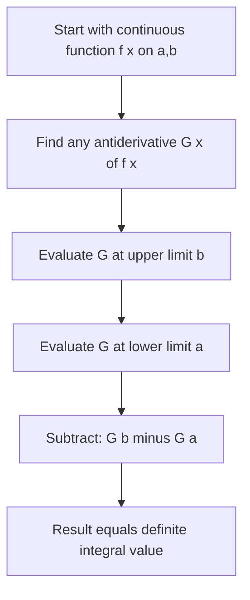

## Fundamental Theorem of Calculus, Part Two

[Unverified] This entire response follows standard textbook mathematical conventions for calculus as conventionally taught. No external source lookup was performed in this session to verify these formulations against a specific citable document; content reflects standard formalism, not confirmed citation.

### Statement

Let $f$ be continuous on $[a, b]$, and let $G$ be any antiderivative of $f$ on $[a, b]$ (meaning $G'(x) = f(x)$). Then:

$$\int_a^b f(x)\, dx = G(b) - G(a)$$

[Unverified] This is the standard statement of Part Two of the Fundamental Theorem of Calculus as conventionally presented in calculus textbooks. It has not been cross-checked against a specific cited source in this session.

### What This Means

This theorem provides a computational shortcut: instead of computing a definite integral as a limit of Riemann sums, it can be evaluated by finding any antiderivative $G$ of $f$, then subtracting its value at the lower limit from its value at the upper limit.

The notation for this evaluation is commonly written as:

$$\int_a^b f(x)\, dx = \Big[G(x)\Big]_a^b = G(b) - G(a)$$

### Why "Part Two"

This complements Part One, which establishes that the derivative of an accumulation function $F(x) = \int_a^x f(t)\, dt$ equals $f(x)$. Part Two builds on that result to show that *any* antiderivative — not just the specific accumulation function $F$ — can be used to evaluate a definite integral. [Unverified] The naming convention (Part One / Part Two) and the exact framing of "builds on" is common in many calculus textbooks, but this has not been verified against a specific curriculum source in this session.

### Reasoning Connecting Part One and Part Two

[Inference] The following is a single reasoned step, not a formal proof, and is labeled as such rather than chained with further unlabeled inferences.

If $F(x) = \int_a^x f(t)\, dt$ is one antiderivative of $f$ (per Part One), and $G$ is any other antiderivative of $f$, then $F$ and $G$ differ by a constant: $G(x) = F(x) + C$. This is a separate, established result about antiderivatives (two antiderivatives of the same function differ by a constant). [Unverified] This specific claim about antiderivatives differing by a constant is standard calculus content, but it has not been independently verified against a cited source in this session.

Using this: $G(b) - G(a) = [F(b) + C] - [F(a) + C] = F(b) - F(a)$. Since $F(a) = \int_a^a f(t)\,dt = 0$, this reduces to $F(b) = \int_a^b f(t)\, dt$, matching the theorem's claim. [Inference] This derivation is a reasoned chain shown explicitly step by step for transparency; each underlying fact used (constant-difference property, $F(a)=0$) is a distinct claim and is not independently re-verified against an external source in this session.

### Visual: Evaluating via Antiderivative

<svg xmlns="http://www.w3.org/2000/svg" viewBox="0 0 700 380">
\<style\>
.lbl { font-family: sans-serif; font-size: 13px; fill: #222; }
.title { font-family: sans-serif; font-size: 15px; fill: #111; font-weight: bold; }
.curve { fill: none; stroke: #1a1a1a; stroke-width: 2; }
.fill-region { fill: #7fd18f; fill-opacity: 0.5; stroke: none; }
.axis { stroke: #333; stroke-width: 1.5; }
.marker { stroke: #dc2626; stroke-width: 1.5; stroke-dasharray: 4,3; }
\</style\>

<text x="20" y="25" class="title">Evaluating Integral via G(b) minus G(a) (svg_diagram)</text>

<line x1="50" y1="320" x2="650" y2="320" class="axis" />
<line x1="90" y1="340" x2="90" y2="60" class="axis" />

<path d="M 90 300 L 90 150 L 480 100 L 480 320 Z" class="fill-region" />

<path d="M 90 150 C 200 130, 350 110, 480 100" class="curve" />

<line x1="90" y1="320" x2="90" y2="60" class="marker" />
<line x1="480" y1="320" x2="480" y2="60" class="marker" />

<text x="80" y="335" class="lbl">a</text>
<text x="470" y="335" class="lbl">b</text>
<text x="30" y="150" class="lbl">G(a)</text>
<text x="500" y="100" class="lbl">G(b)</text>
<text x="200" y="240" class="lbl">Area = G(b) − G(a)</text>
</svg>

### Worked Example

Compute $\int_0^2 x^2\, dx$ using Part Two.

**Step 1: Find an antiderivative.**

$$G(x) = \frac{x^3}{3}$$

Verification: $G'(x) = x^2$, matching $f(x) = x^2$. [Inference] This verification step is a direct check via differentiation, a separately established rule, and confirms internal consistency of this specific example only; it does not itself verify the general theorem.

**Step 2: Evaluate at bounds.**

$$G(2) = \frac{8}{3}, \quad G(0) = 0$$

**Step 3: Subtract.**

$$\int_0^2 x^2\, dx = \frac{8}{3} - 0 = \frac{8}{3} \approx 2.667$$

This matches the exact value referenced in the earlier Riemann sum topic, where the right Riemann sum approximation ($3.75$ at $n=4$) was noted as an overestimate of this same exact value. [Unverified] This cross-reference relies on consistency with content presented earlier in this session; it has not been independently re-verified against an external source here.

### Worked Example: Trigonometric Integrand

Compute $\int_0^{\pi} \sin(x)\, dx$.

**Step 1: Antiderivative.**

$$G(x) = -\cos(x)$$

**Step 2: Evaluate.**

$$G(\pi) = -\cos(\pi) = -(-1) = 1$$
$$G(0) = -\cos(0) = -1$$

**Step 3: Subtract.**

$$\int_0^{\pi} \sin(x)\, dx = 1 - (-1) = 2$$

### Table: Component Roles

| Component | Role |
|---|---|
| $f(x)$ | Integrand (function being integrated) |
| $G(x)$ | Any antiderivative of $f(x)$ |
| $a, b$ | Lower and upper limits of integration |
| $G(b) - G(a)$ | Net signed area, i.e., the definite integral's value |

### Process Flow

### Relevance to Machine Learning

[Inference] The following connections are reasoned extensions based on where closed-form integral evaluation appears in ML-adjacent mathematics; these are not confirmed claims about internal implementations of any specific ML library or framework, and each is labeled individually rather than treated as a chain of established facts.

- **Closed-form loss or normalization terms**: When a probability density has a known antiderivative, this theorem allows exact computation of cumulative probabilities without numerical approximation (e.g., certain closed-form CDFs). [Inference] This is a reasoned application of the theorem's structure to probability computations, not a claim verified against a specific ML framework's source code in this session.
- **Contrast with numerical methods**: When no closed-form antiderivative exists for a given $f$, methods such as Riemann sums, the trapezoidal rule, or Monte Carlo integration are used instead, since Part Two cannot be applied directly. [Unverified] The specific circumstances under which any given ML software falls back to a particular numerical method internally have not been verified against that software's documentation or source in this session.

### Common Pitfalls

- Forgetting the constant of integration is irrelevant here, since it cancels in the subtraction $G(b) - G(a)$.
- Using an incorrect antiderivative $G(x)$ — the theorem requires $G'(x) = f(x)$ exactly.
- Confusing this with Part One, which concerns the derivative of an accumulation function rather than evaluation of a definite integral.
- Applying the theorem without confirming $f$ is continuous (or otherwise integrable) on $[a, b]$; [Unverified] the precise minimal conditions under which the theorem still holds for less well-behaved functions are a real-analysis detail not verified against a specific source in this session.

**Related Topics**
- Fundamental Theorem of Calculus, Part One
- Techniques of Antidifferentiation (power rule, substitution)
- Improper Integrals
- Numerical Integration Methods (Trapezoidal Rule, Simpson's Rule)
- Applications of Definite Integrals in Probability