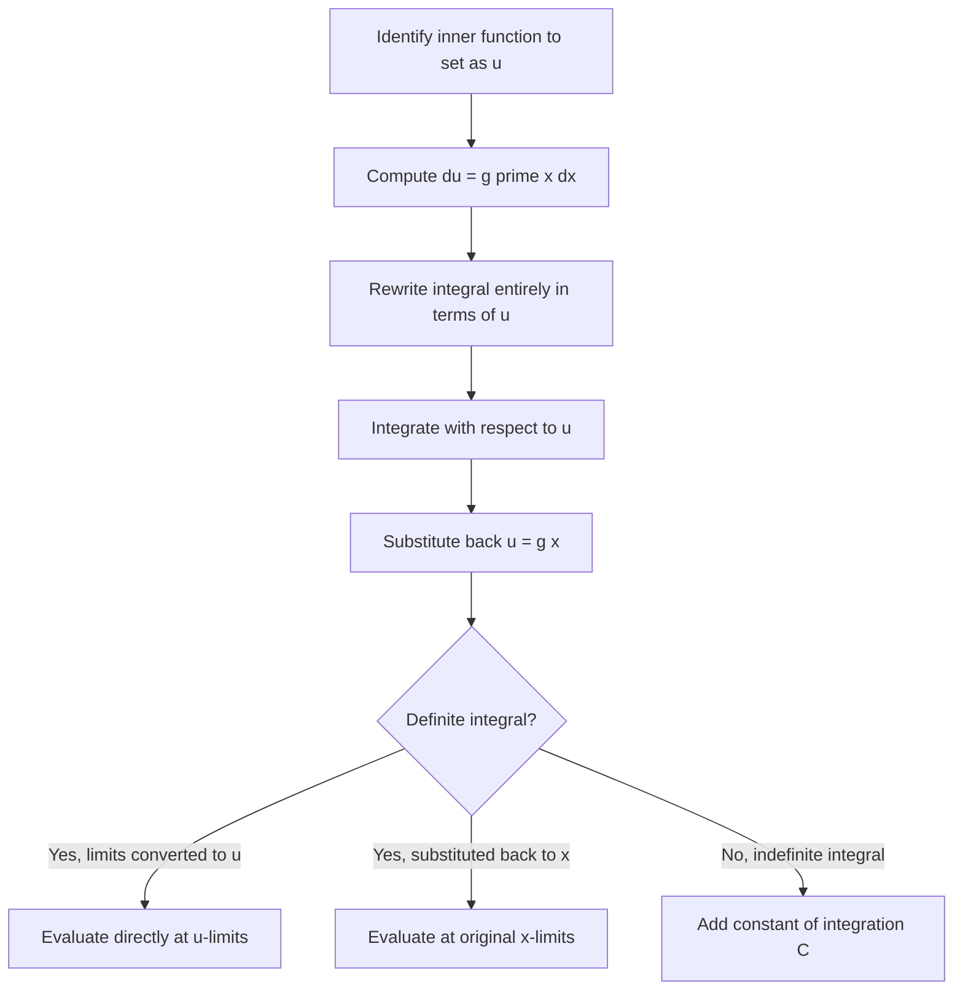

## Integration by Substitution

[Unverified] This entire response follows standard textbook mathematical conventions for calculus as conventionally taught. No external source lookup was performed in this session to verify these formulations against a specific citable document; content reflects standard formalism, not confirmed citation.

### Definition

Integration by substitution (also called u-substitution) is a technique for evaluating integrals by changing the variable of integration to simplify the integrand. It is the integral counterpart of the chain rule for derivatives.

For an indefinite integral of the form:

$$\int f(g(x)) \cdot g'(x)\, dx$$

let $u = g(x)$, so $du = g'(x)\, dx$. The integral becomes:

$$\int f(u)\, du$$

[Unverified] This is the standard formulation of u-substitution as conventionally presented in calculus textbooks. It has not been cross-checked against a specific cited source in this session.

### Why This Works

The chain rule states that if $F$ is an antiderivative of $f$, then:

$$\frac{d}{dx}\Big[F(g(x))\Big] = F'(g(x)) \cdot g'(x) = f(g(x)) \cdot g'(x)$$

This means $F(g(x))$ is an antiderivative of $f(g(x)) \cdot g'(x)$. Substitution is a technique for recognizing and reversing this chain-rule structure. [Inference] This is a single reasoned justification connecting the chain rule (a separately established differentiation rule) to the substitution technique; it is not restated as a formal proof and is not chained with further unlabeled inferences.

### General Procedure

1. Identify a part of the integrand to set as $u = g(x)$, typically an inner function.
2. Compute $du = g'(x)\, dx$.
3. Rewrite the entire integral in terms of $u$ and $du$, eliminating all instances of $x$.
4. Integrate with respect to $u$.
5. Substitute back $u = g(x)$ to express the result in terms of $x$.
6. For definite integrals, either convert the limits of integration to $u$-values, or substitute back to $x$ before evaluating at the original bounds.

### Process Flow

### Worked Example: Indefinite Integral

Compute $\int 2x \cos(x^2)\, dx$.

**Step 1:** Let $u = x^2$.

**Step 2:** $du = 2x\, dx$, which conveniently matches the $2x\, dx$ factor already present.

**Step 3:** Rewrite:

$$\int \cos(u)\, du$$

**Step 4:** Integrate:

$$\sin(u) + C$$

**Step 5:** Substitute back:

$$\int 2x \cos(x^2)\, dx = \sin(x^2) + C$$

**Verification via differentiation:** $\frac{d}{dx}\big[\sin(x^2) + C\big] = \cos(x^2) \cdot 2x$, which matches the original integrand. [Inference] This verification is a direct check via differentiation, a separately established rule, and confirms internal consistency of this specific example only.

### Worked Example: Definite Integral with Limit Conversion

Compute $\int_0^2 x \cdot e^{x^2}\, dx$.

**Step 1:** Let $u = x^2$, so $du = 2x\, dx$, meaning $x\, dx = \frac{1}{2} du$.

**Step 2:** Convert the limits:
- When $x = 0$: $u = 0^2 = 0$
- When $x = 2$: $u = 2^2 = 4$

**Step 3:** Rewrite the entire integral, including limits:

$$\int_0^4 \frac{1}{2} e^{u}\, du = \frac{1}{2}\int_0^4 e^u\, du$$

**Step 4:** Integrate and evaluate:

$$\frac{1}{2}\Big[e^u\Big]_0^4 = \frac{1}{2}\left(e^4 - e^0\right) = \frac{1}{2}\left(e^4 - 1\right)$$

**Step 5:** Numerical value:

$$\approx \frac{1}{2}(54.598 - 1) \approx 26.799$$

[Unverified] The numerical value of $e^4$ used here ($\approx 54.598$) reflects a standard mathematical constant computation; it has not been independently re-verified against an external computational source in this session.

### Visual: Substitution as a Change of Variable

<svg xmlns="http://www.w3.org/2000/svg" viewBox="0 0 700 340">
\<style\>
.lbl { font-family: sans-serif; font-size: 13px; fill: #222; }
.title { font-family: sans-serif; font-size: 15px; fill: #111; font-weight: bold; }
.box { fill: #eef4ff; stroke: #2563eb; stroke-width: 1.5; }
.arrow { stroke: #333; stroke-width: 1.5; fill: none; marker-end: url(#arrowhead); }
\</style\>
<text x="20" y="25" class="title">Substitution: x-space to u-space (svg_diagram)</text>

<rect x="60" y="80" width="220" height="90" rx="6" class="box" />
<text x="80" y="115" class="lbl">Integral in x:</text>
<text x="80" y="140" class="lbl">∫ f(g(x)) · g'(x) dx</text>

<rect x="420" y="80" width="220" height="90" rx="6" class="box" />
<text x="440" y="115" class="lbl">Integral in u:</text>
<text x="440" y="140" class="lbl">∫ f(u) du</text>

<path d="M 285 125 L 415 125" class="arrow" />
<text x="300" y="115" class="lbl">u = g(x)</text>

<rect x="240" y="230" width="220" height="70" rx="6" class="box" />
<text x="260" y="260" class="lbl">Substitute back:</text>
<text x="260" y="282" class="lbl">u = g(x) after integrating</text>

<path d="M 530 175 L 460 225" class="arrow" />
<path d="M 170 175 L 240 225" class="arrow" stroke-dasharray="4,3" />
</svg>

### Choosing What to Substitute

There is no single universal rule for choosing $u$, but common heuristics used in practice include:

- Choosing $u$ as an inner function of a composite expression (e.g., inside parentheses, under a root, in an exponent).
- Checking whether $du$ (or a constant multiple of it) already appears elsewhere in the integrand.
- Choosing $u$ to simplify the most complicated part of the integrand.

[Unverified] These heuristics reflect commonly taught practical guidance in calculus instruction; they are not a formally proven algorithm and their applicability can vary by specific integrand. No claim is made that these heuristics work in all cases.

### Table: Common Substitution Patterns

| Integrand Pattern | Suggested $u$ | Resulting $du$ |
|---|---|---|
| $\int f(ax+b)\, dx$ | $u = ax + b$ | $du = a\, dx$ |
| $\int x^n \cdot f(x^{n+1})\, dx$ | $u = x^{n+1}$ | $du = (n+1)x^n\, dx$ |
| $\int \tan(x)\, dx$ (rewritten as $\frac{\sin x}{\cos x}$) | $u = \cos(x)$ | $du = -\sin(x)\, dx$ |
| $\int \frac{f'(x)}{f(x)}\, dx$ | $u = f(x)$ | $du = f'(x)\, dx$ |

[Unverified] This table reflects commonly cited standard substitution patterns from calculus instruction; it has not been cross-checked against a specific cited textbook source in this session.

### Common Pitfalls

- Forgetting to convert $dx$ fully into terms of $u$ and $du$, leaving a mix of both variables in the integral.
- For definite integrals, forgetting to either convert the limits to $u$-values or substitute back to $x$ before evaluating — mixing the two approaches produces an incorrect result.
- Choosing a $u$ that does not simplify the integral, leading to a more complicated expression than the original.
- Omitting the constant of integration $C$ in indefinite integral results.

### Relevance to Machine Learning

[Inference] The following connections are reasoned extensions based on where variable-change techniques appear in ML-adjacent mathematics; these are not confirmed claims about internal implementations of any specific ML library or framework, and each is labeled individually rather than treated as a chain of established facts.

- **Change of variables in probability densities**: When transforming a random variable through a function, the resulting density involves a Jacobian term that follows the same underlying change-of-variable logic as substitution. [Inference] This is a reasoned structural connection between u-substitution and the change-of-variables formula in probability theory; it has not been verified against a specific probability theory source in this session.
- **Normalizing flows**: [Speculation] Certain generative modeling architectures reportedly rely on invertible transformations with tractable Jacobians, which may conceptually relate to substitution-style variable changes. Whether this connection is explicitly framed this way in any specific architecture's original documentation is not confirmed in this session; this is offered as a plausible conceptual link only, not a verified claim about any named architecture.

I cannot verify whether any specific machine learning framework or library explicitly implements or documents its internal computations using the term "substitution" in the calculus sense described above.

**Related Topics**
- Integration by Parts
- Change of Variables in Multivariable Calculus
- Jacobian Determinants
- Techniques of Antidifferentiation (Overview)
- Improper Integrals