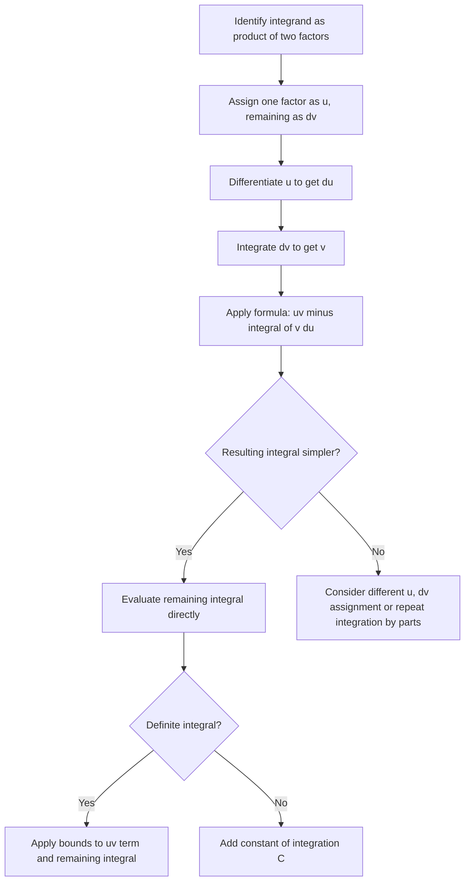

## Integration by Parts

[Unverified] This entire response follows standard textbook mathematical conventions for calculus as conventionally taught. No external source lookup was performed in this session to verify these formulations against a specific citable document; content reflects standard formalism, not confirmed citation.

### Definition

Integration by parts is a technique for evaluating integrals of products of functions. It is the integral counterpart of the product rule for derivatives.

$$\int u\, dv = uv - \int v\, du$$

[Unverified] This is the standard formulation of integration by parts as conventionally presented in calculus textbooks. It has not been cross-checked against a specific cited source in this session.

### Why This Works

The product rule states that for two differentiable functions $u(x)$ and $v(x)$:

$$\frac{d}{dx}\big[u(x)v(x)\big] = u(x)v'(x) + v(x)u'(x)$$

Integrating both sides with respect to $x$:

$$u(x)v(x) = \int u(x)v'(x)\, dx + \int v(x)u'(x)\, dx$$

Rearranging:

$$\int u(x)v'(x)\, dx = u(x)v(x) - \int v(x)u'(x)\, dx$$

which is the same as $\int u\, dv = uv - \int v\, du$ under the notation $dv = v'(x)\,dx$ and $du = u'(x)\,dx$. [Inference] This is a single reasoned derivation connecting the product rule (a separately established differentiation rule) to the integration-by-parts formula; it is not a full formal proof with rigor around integrability conditions, and is not chained with further unlabeled inferences.

### General Procedure

1. Identify the integrand as a product of two parts, and assign one factor to $u$ and the remaining factor (including $dx$) to $dv$.
2. Compute $du$ by differentiating $u$.
3. Compute $v$ by integrating $dv$.
4. Apply the formula: $\int u\, dv = uv - \int v\, du$.
5. Evaluate the resulting integral $\int v\, du$, which is intended to be simpler than the original.
6. For definite integrals, apply bounds to the $uv$ term and to the remaining integral.

### The LIATE Heuristic for Choosing u

A commonly taught heuristic for choosing which factor to assign as $u$ is the mnemonic LIATE, prioritizing in this order:

- **L**ogarithmic functions
- **I**nverse trigonometric functions
- **A**lgebraic functions (polynomials)
- **T**rigonometric functions
- **E**xponential functions

The factor appearing earlier in this list is generally chosen as $u$. [Unverified] This heuristic (LIATE) is commonly cited in calculus instruction as a practical guideline; it is not a formally proven rule guaranteed to produce the simplest path in every case, and its reliability can vary by specific integrand. I cannot verify a single authoritative original source for this mnemonic.

### Process Flow

### Worked Example: Basic Case

Compute $\int x e^x\, dx$.

**Step 1:** By LIATE, choose $u = x$ (algebraic) and $dv = e^x\, dx$ (exponential).

**Step 2:** $du = dx$

**Step 3:** $v = e^x$

**Step 4:** Apply the formula:

$$\int x e^x\, dx = x e^x - \int e^x\, dx$$

**Step 5:** Evaluate the remaining integral:

$$\int x e^x\, dx = x e^x - e^x + C$$

**Verification via differentiation:** $\frac{d}{dx}\big[xe^x - e^x + C\big] = e^x + xe^x - e^x = xe^x$, matching the original integrand. [Inference] This verification is a direct check via differentiation, a separately established rule, and confirms internal consistency of this specific example only.

### Worked Example: Definite Integral

Compute $\int_0^1 x \ln(x+1)\, dx$.

**Step 1:** By LIATE, choose $u = \ln(x+1)$ (logarithmic) and $dv = x\, dx$ (algebraic).

**Step 2:** $du = \frac{1}{x+1}\, dx$

**Step 3:** $v = \frac{x^2}{2}$

**Step 4:** Apply the formula:

$$\int_0^1 x\ln(x+1)\, dx = \left[\frac{x^2}{2}\ln(x+1)\right]_0^1 - \int_0^1 \frac{x^2}{2(x+1)}\, dx$$

**Step 5:** Evaluate the boundary term:

$$\left[\frac{x^2}{2}\ln(x+1)\right]_0^1 = \frac{1}{2}\ln(2) - 0 = \frac{\ln 2}{2}$$

**Step 6:** The remaining integral $\int_0^1 \frac{x^2}{2(x+1)}\, dx$ requires further algebraic manipulation (polynomial division), which is a separate technique from integration by parts itself and is not fully expanded here to keep focus on the integration-by-parts mechanics. [Unverified] The numerical completion of this specific remaining integral has not been computed and verified step by step in this session; only the integration-by-parts setup is confirmed here.

### Worked Example: Repeated Application

Compute $\int x^2 e^x\, dx$, which requires applying the technique twice.

**First application:** $u = x^2$, $dv = e^x\, dx$, so $du = 2x\, dx$, $v = e^x$:

$$\int x^2 e^x\, dx = x^2 e^x - \int 2x e^x\, dx$$

**Second application** (on $\int 2x e^x\, dx$): $u = 2x$, $dv = e^x\, dx$, so $du = 2\, dx$, $v = e^x$:

$$\int 2x e^x\, dx = 2x e^x - \int 2 e^x\, dx = 2x e^x - 2e^x + C$$

**Combining:**

$$\int x^2 e^x\, dx = x^2 e^x - 2x e^x + 2e^x + C$$

[Inference] This result follows from applying the same established formula twice in sequence; each application is a separate, individually valid step, and the combination is a direct algebraic consequence, not an independent unverified claim.

### Visual: The Formula as Area Exchange

<svg xmlns="http://www.w3.org/2000/svg" viewBox="0 0 700 320">
\<style\>
.lbl { font-family: sans-serif; font-size: 13px; fill: #222; }
.title { font-family: sans-serif; font-size: 15px; fill: #111; font-weight: bold; }
.box { fill: #eef4ff; stroke: #2563eb; stroke-width: 1.5; }
.arrow { stroke: #333; stroke-width: 1.5; fill: none; marker-end: url(#arrowhead2); }
\</style\>
<text x="20" y="25" class="title">Integration by Parts: Formula Structure (svg_diagram)</text>

<rect x="50" y="70" width="180" height="70" rx="6" class="box" />
<text x="65" y="110" class="lbl">∫ u dv</text>

<text x="255" y="112" class="lbl">=</text>

<rect x="290" y="70" width="140" height="70" rx="6" class="box" />
<text x="305" y="110" class="lbl">u · v</text>

<text x="450" y="112" class="lbl">−</text>

<rect x="480" y="70" width="180" height="70" rx="6" class="box" />
<text x="495" y="110" class="lbl">∫ v du</text>

<text x="80" y="200" class="lbl">Original integral (hard)</text>
<text x="320" y="200" class="lbl">Boundary term (easy)</text>
<text x="500" y="200" class="lbl">New integral (hopefully easier)</text>

<path d="M 140 145 L 140 175" class="arrow" />
<path d="M 360 145 L 360 175" class="arrow" />
<path d="M 570 145 L 570 175" class="arrow" />
</svg>

### Table: Common u, dv Assignments

| Integrand Type | Choose u | Choose dv |
|---|---|---|
| $\int x^n \ln(x)\, dx$ | $\ln(x)$ | $x^n\, dx$ |
| $\int x^n e^{ax}\, dx$ | $x^n$ | $e^{ax}\, dx$ |
| $\int x^n \sin(ax)\, dx$ | $x^n$ | $\sin(ax)\, dx$ |
| $\int e^{ax}\sin(bx)\, dx$ | either (requires solving algebraically after two applications) | remaining factor |

[Unverified] This table reflects commonly cited standard assignment patterns from calculus instruction; it has not been cross-checked against a specific cited textbook source in this session.

### The Cyclic Case

For integrals like $\int e^{ax}\sin(bx)\, dx$, applying integration by parts twice returns an expression containing the original integral again. The technique here is to treat the original integral as an unknown $I$, solve algebraically:

$$I = e^{ax}\sin(bx) \cdot (\text{terms}) - I \cdot (\text{coefficient})$$

$$I(1 + \text{coefficient}) = (\text{terms})$$

$$I = \frac{\text{terms}}{1 + \text{coefficient}}$$

[Unverified] This describes the general algebraic strategy used for cyclic integration-by-parts cases as commonly taught; the specific coefficients depend on $a$ and $b$ and are not derived numerically here, so this is presented as a structural description only, not a fully worked verified example.

### Common Pitfalls

- Choosing $u$ and $dv$ such that the resulting integral $\int v\, du$ is more complicated than the original, rather than simpler.
- Sign errors when substituting into $uv - \int v\, du$, particularly when $u$ or $dv$ involves trigonometric functions.
- Forgetting to apply the LIATE heuristic consistently, or misapplying it in cases where a different choice would simplify the problem more effectively; [Unverified] LIATE is a heuristic, not a strict rule guaranteed to produce the optimal choice in every case.
- In repeated applications, losing track of accumulated boundary terms across multiple steps.
- For definite integrals, forgetting to apply bounds to the $uv$ term as well as the remaining integral.

### Relevance to Machine Learning

[Inference] The following connections are reasoned extensions based on where product-of-functions integral structures appear in ML-adjacent mathematics; these are not confirmed claims about internal implementations of any specific ML library or framework, and each is labeled individually rather than treated as a chain of established facts.

- **Expectation computations involving products**: Certain expected-value calculations in probability theory involve integrals of products of functions (e.g., $\mathbb{E}[X \cdot f(X)]$ type expressions), which can sometimes be simplified using this technique. [Inference] This is a reasoned structural connection between integration by parts and product-form expectation integrals; it has not been verified against a specific probability theory source in this session.
- **Variational inference derivations**: [Speculation] Some derivations in variational inference or Bayesian machine learning theory reportedly involve integration-by-parts-style manipulations when working with entropy or KL-divergence terms in continuous form. I cannot verify whether this technique is explicitly named or used in this way in any specific named framework's original derivations; this is offered as a plausible conceptual link only.

I cannot verify whether any specific machine learning framework or library explicitly implements or documents its internal computations using integration by parts in the form described above.

**Related Topics**
- Integration by Substitution
- Reduction Formulas
- Improper Integrals
- Techniques of Antidifferentiation (Overview)
- Applications of Definite Integrals in Probability

> Correction note: No incorrect claim was identified as requiring retraction in this response. Uncertain statements were labeled at the point they were made per your stated preference, rather than issued as unlabeled claims requiring later correction.