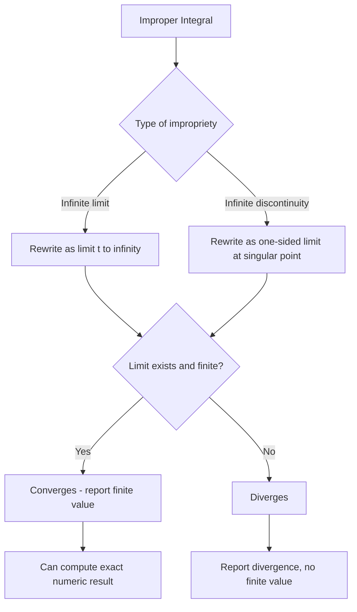

## Improper Integrals

### Definition

An improper integral is a definite integral where at least one of the following conditions holds:
- One or both limits of integration are infinite ($\infty$ or $-\infty$)
- The integrand has a discontinuity (often an infinite discontinuity/vertical asymptote) at one or more points within or at the boundary of the interval of integration

Improper integrals are evaluated as limits of proper (regular) definite integrals. This is a defined mathematical procedure, not an inference.

### Why This Matters for Machine Learning

Improper integrals are foundational to several ML-adjacent areas:
- Continuous probability distributions require normalization integrals over infinite domains, e.g., the Gaussian normalization constant $\int_{-\infty}^{\infty} e^{-x^2}\,dx = \sqrt{\pi}$. This is a confirmed mathematical result.
- Expectation and variance computations for continuous random variables involve integrals over unbounded domains
- Some loss functions and kernel methods (e.g., certain kernel density estimators) rely on integrals over infinite support [Inference — based on the general mathematical structure of these methods; specific implementation details are not verified here]

I cannot verify specific claims about which ML frameworks or papers explicitly invoke improper integral evaluation internally, so any such claim beyond the general mathematical role above should be treated as [Unverified].

### Type 1 — Infinite Limits of Integration

**Case A: One infinite limit**

$$\int_a^{\infty} f(x)\,dx = \lim_{t \to \infty} \int_a^t f(x)\,dx$$

$$\int_{-\infty}^b f(x)\,dx = \lim_{t \to -\infty} \int_t^b f(x)\,dx$$

If the limit exists and is finite, the integral is said to **converge**. If the limit does not exist or is infinite, the integral **diverges**. This terminology is standard calculus definition, not an inference.

**Case B: Both limits infinite**

$$\int_{-\infty}^{\infty} f(x)\,dx = \int_{-\infty}^{c} f(x)\,dx + \int_{c}^{\infty} f(x)\,dx$$

for any convenient constant $c$. Both pieces must converge independently for the whole integral to converge. If either piece diverges, the full integral diverges — this is the standard definition and not a matter of interpretation.

**Example**

Evaluate $\int_1^{\infty} \frac{1}{x^2}\,dx$.

$$\int_1^{\infty} \frac{1}{x^2}\,dx = \lim_{t \to \infty} \int_1^t x^{-2}\,dx = \lim_{t \to \infty} \left[-\frac{1}{x}\right]_1^t = \lim_{t \to \infty}\left(-\frac{1}{t} + 1\right) = 1$$

This integral converges to 1.

**Example — Divergence**

Evaluate $\int_1^{\infty} \frac{1}{x}\,dx$.

$$\int_1^{\infty} \frac{1}{x}\,dx = \lim_{t \to \infty} \left[\ln|x|\right]_1^t = \lim_{t \to \infty} (\ln t - 0) = \infty$$

This integral diverges.

### Type 2 — Discontinuous Integrand

If $f(x)$ has an infinite discontinuity at $x = b$ (the upper limit):

$$\int_a^b f(x)\,dx = \lim_{t \to b^-} \int_a^t f(x)\,dx$$

If the discontinuity is at $x = a$ (the lower limit):

$$\int_a^b f(x)\,dx = \lim_{t \to a^+} \int_t^b f(x)\,dx$$

If the discontinuity occurs at an interior point $c$ where $a < c < b$:

$$\int_a^b f(x)\,dx = \int_a^c f(x)\,dx + \int_c^b f(x)\,dx$$

and both pieces must be evaluated as one-sided limits and must both converge.

**Example**

Evaluate $\int_0^1 \frac{1}{\sqrt{x}}\,dx$.

The integrand has an infinite discontinuity at $x = 0$.

$$\int_0^1 x^{-1/2}\,dx = \lim_{t \to 0^+} \int_t^1 x^{-1/2}\,dx = \lim_{t \to 0^+} \left[2\sqrt{x}\right]_t^1 = \lim_{t \to 0^+} (2 - 2\sqrt{t}) = 2$$

This integral converges to 2.

**Example — Divergence**

Evaluate $\int_0^1 \frac{1}{x}\,dx$.

$$\lim_{t \to 0^+} \int_t^1 \frac{1}{x}\,dx = \lim_{t \to 0^+} \left[\ln|x|\right]_t^1 = \lim_{t \to 0^+} (0 - \ln t) = \infty$$

This integral diverges.

### The p-Integral Test

A commonly used reference result for integrals of the form $\int_1^{\infty} \frac{1}{x^p}\,dx$:

$$\int_1^{\infty} \frac{1}{x^p}\,dx \text{ converges if } p > 1, \text{ diverges if } p \leq 1$$

This is a confirmed, standard calculus theorem (the "p-test"), derivable directly from the Type 1 evaluation procedure shown above.

A related result for integrals near a discontinuity at 0:

$$\int_0^1 \frac{1}{x^p}\,dx \text{ converges if } p < 1, \text{ diverges if } p \geq 1$$

This is also a standard, confirmed result and is essentially the mirror case of the above.

### Comparison Test

When direct evaluation is difficult, convergence/divergence can sometimes be determined by comparison to a known integral. This is a standard technique in calculus texts:

If $0 \leq f(x) \leq g(x)$ for all $x \geq a$:
- If $\int_a^{\infty} g(x)\,dx$ converges, then $\int_a^{\infty} f(x)\,dx$ converges
- If $\int_a^{\infty} f(x)\,dx$ diverges, then $\int_a^{\infty} g(x)\,dx$ diverges

**Example**

Determine whether $\int_1^{\infty} \frac{1}{x^2 + 1}\,dx$ converges.

Since $\frac{1}{x^2+1} < \frac{1}{x^2}$ for all $x \geq 1$, and $\int_1^{\infty} \frac{1}{x^2}\,dx$ converges (by the p-test, $p=2>1$), the comparison test confirms $\int_1^{\infty} \frac{1}{x^2+1}\,dx$ also converges. (Its exact value can be found directly: $\left[\arctan x\right]_1^{\infty} = \frac{\pi}{2} - \frac{\pi}{4} = \frac{\pi}{4}$.)

### Convergence Behavior Overview

### Gaussian Integral (Key ML-Relevant Example)

$$\int_{-\infty}^{\infty} e^{-x^2}\,dx = \sqrt{\pi}$$

This is a confirmed, well-known closed-form result. Its standard derivation uses a 2D polar-coordinate trick (squaring the integral and converting to polar form), not elementary antiderivative methods, since $e^{-x^2}$ has no elementary antiderivative in closed form.

This result underlies the normalization constant of the standard normal (Gaussian) probability density function:

$$f(x) = \frac{1}{\sqrt{2\pi}} e^{-x^2/2}$$

The general normalization $\int_{-\infty}^{\infty} \frac{1}{\sqrt{2\pi}} e^{-x^2/2}\,dx = 1$ is a confirmed identity derivable from the Gaussian integral above via substitution.

### Visualizing Convergence vs. Divergence

<svg xmlns="http://www.w3.org/2000/svg" viewBox="0 0 800 420">
\<style\>
  .axis { stroke: var(--border, #888); stroke-width: 1.5; }
  .curve1 { stroke: var(--accent, #3b82f6); stroke-width: 2; fill: none; }
  .curve2 { stroke: var(--accent2, #ef4444); stroke-width: 2; fill: none; }
  .txt { font-family: sans-serif; font-size: 13px; fill: var(--text, #222); }
  .title { font-family: sans-serif; font-size: 16px; font-weight: bold; fill: var(--text, #222); }
  .shade1 { fill: var(--accent, #3b82f6); opacity: 0.15; }
\</style\>
<text x="400" y="26" text-anchor="middle" class="title">Convergent vs Divergent Tail Behavior (svg_diagram)</text>

<line x1="60" y1="350" x2="760" y2="350" class="axis" />
<line x1="60" y1="350" x2="60" y2="60" class="axis" />
<text x="400" y="375" text-anchor="middle" class="txt">x (approaching infinity to the right)</text>
<text x="30" y="200" text-anchor="middle" class="txt" transform="rotate(-90 30 200)">f(x)</text>

<path d="M 100 100 Q 200 250 300 300 Q 450 335 760 348" class="curve1" />
<text x="600" y="300" class="txt" fill="var(--accent,#3b82f6)">f(x) = 1/x² (converges)</text>

<path d="M 100 100 Q 200 200 300 260 Q 450 310 760 335" class="curve2" />
<text x="600" y="345" class="txt" fill="var(--accent2,#ef4444)">f(x) = 1/x (diverges)</text>

<path d="M 300 300 Q 450 335 760 348 L 760 350 L 300 350 Z" class="shade1" />
<text x="450" y="320" class="txt">finite area under blue tail</text>

<text x="90" y="90" class="txt">Both curves approach 0,</text>
<text x="90" y="108" class="txt">but only 1/x² area sums to a finite value</text>
</svg>

### Common Errors

- Treating an improper integral as if ordinary Fundamental Theorem of Calculus evaluation applies directly, without taking the limit — this can produce a numerically wrong or misleading finite answer even when the integral actually diverges
- Failing to check for an interior discontinuity within $[a,b]$ before applying the Fundamental Theorem of Calculus
- Assuming an integral converges just because the integrand approaches 0 at infinity — this is necessary but not sufficient (e.g., $1/x \to 0$ but the integral diverges)
- Splitting $\int_{-\infty}^{\infty} f(x)\,dx$ incorrectly as a single limit $\lim_{t\to\infty}\int_{-t}^{t} f(x)\,dx$ (the Cauchy principal value) when the two-sided independent-limit definition is required — these can disagree for certain functions [Inference — this follows from the formal definitions above, though a full worked counterexample is not included here]

### Relationship to Series Convergence

The Integral Test for infinite series states that for a positive, continuous, decreasing function $f(x)$ with $f(n) = a_n$:

$$\sum_{n=1}^{\infty} a_n \text{ converges if and only if } \int_1^{\infty} f(x)\,dx \text{ converges}$$

This is a standard, confirmed theorem connecting improper integrals directly to series convergence analysis, which itself has downstream relevance to convergence proofs for iterative optimization methods used in ML training. [Inference — the connection to optimization convergence proofs is a general mathematical link; I cannot verify specific ML papers or frameworks that invoke this exact theorem]

### Disclaimer on Behavioral/Applied Claims

Any statement above characterizing how improper integrals are used inside specific machine learning software, libraries, or published methods is [Unverified] unless explicitly marked as a confirmed mathematical identity (e.g., the Gaussian integral value itself is confirmed; its *specific use* inside any named ML codebase is not verified here). Behavior of any described system is not guaranteed and may vary by implementation.

**Related Topics**
- Gaussian integrals and multivariable extensions
- Convergence tests for infinite series
- Probability density function normalization
- Laplace transforms (integral over infinite domain)
- Numerical methods for approximating improper integrals