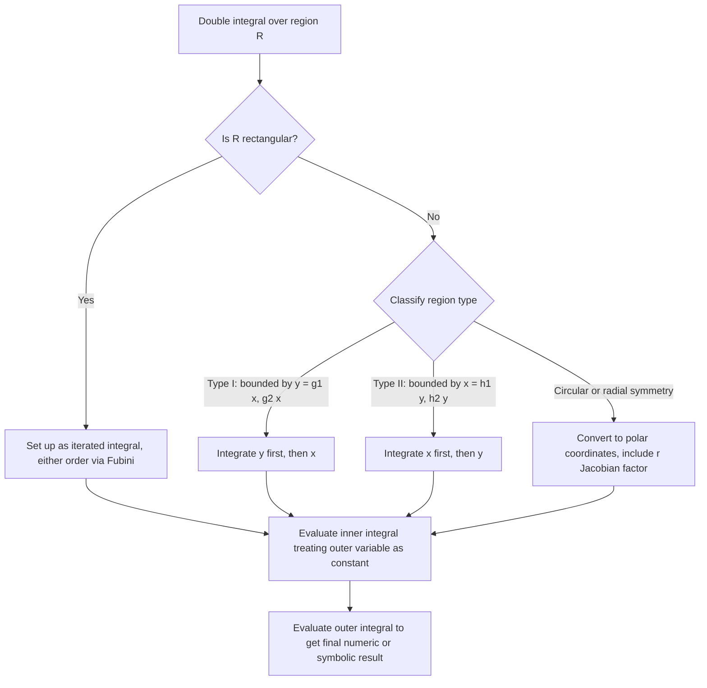

## Double Integrals

### Definition

A double integral extends the concept of a single-variable definite integral to functions of two variables $f(x,y)$ over a two-dimensional region $R$:

$$\iint_R f(x,y)\,dA$$

This represents the signed volume between the surface $z = f(x,y)$ and the $xy$-plane over the region $R$, when $f(x,y) \geq 0$. This is a standard, confirmed definition from multivariable calculus.

### Why This Matters for Machine Learning

Double integrals connect to ML in the following ways:
- Joint probability density functions of two continuous random variables require double integrals for normalization and for computing joint/marginal probabilities. [Inference — this follows from the standard mathematical definition of joint continuous distributions; I cannot verify specific implementation details of any named ML library]
- Computing expectations, covariances, and marginal distributions from a joint density $f(x,y)$ involves double integration. [Inference]
- I do not have access to information confirming which specific ML frameworks perform symbolic or numeric double integration internally, so any claim beyond the general mathematical structure above should be treated as [Unverified].

### Iterated Integrals

Double integrals over rectangular regions are typically evaluated as **iterated integrals**:

$$\iint_R f(x,y)\,dA = \int_a^b \int_c^d f(x,y)\,dy\,dx$$

The inner integral is computed first, treating the outer variable as a constant, then the result is integrated with respect to the outer variable. This is the standard, confirmed evaluation procedure (justified formally by Fubini's Theorem, described below).

**Example**

Evaluate $\int_0^2 \int_0^1 (x^2 + y)\,dy\,dx$.

Inner integral (treat $x$ as constant, integrate with respect to $y$):

$$\int_0^1 (x^2 + y)\,dy = \left[x^2y + \frac{y^2}{2}\right]_0^1 = x^2 + \frac{1}{2}$$

Outer integral:

$$\int_0^2 \left(x^2 + \frac{1}{2}\right)dx = \left[\frac{x^3}{3} + \frac{x}{2}\right]_0^2 = \frac{8}{3} + 1 = \frac{11}{3}$$

Result: $\frac{11}{3}$.

### Fubini's Theorem

Fubini's Theorem states that if $f(x,y)$ is continuous on a rectangular region $R = [a,b]\times[c,d]$, then the order of integration can be swapped without changing the result:

$$\int_a^b \int_c^d f(x,y)\,dy\,dx = \int_c^d \int_a^b f(x,y)\,dx\,dy$$

This is a standard, confirmed theorem from real analysis / multivariable calculus. It requires continuity (or more generally, integrability) of $f$ on $R$; without such conditions, order-swapping is not guaranteed to be valid.

### Double Integrals over Non-Rectangular Regions

For a region $R$ bounded by $y = g_1(x)$ (lower) and $y = g_2(x)$ (upper), with $x \in [a,b]$ (a **Type I** region):

$$\iint_R f(x,y)\,dA = \int_a^b \int_{g_1(x)}^{g_2(x)} f(x,y)\,dy\,dx$$

For a region bounded by $x = h_1(y)$ (left) and $x = h_2(y)$ (right), with $y \in [c,d]$ (a **Type II** region):

$$\iint_R f(x,y)\,dA = \int_c^d \int_{h_1(y)}^{h_2(y)} f(x,y)\,dx\,dy$$

This classification (Type I / Type II) is standard terminology found in multivariable calculus references.

**Example**

Evaluate $\iint_R xy\,dA$ where $R$ is bounded by $y = x^2$ and $y = x$ for $x \in [0,1]$.

Since $x \geq x^2$ on $[0,1]$, the region is Type I with $g_1(x) = x^2$, $g_2(x) = x$.

$$\int_0^1 \int_{x^2}^{x} xy\,dy\,dx = \int_0^1 x\left[\frac{y^2}{2}\right]_{x^2}^{x} dx = \int_0^1 x\left(\frac{x^2}{2} - \frac{x^4}{2}\right)dx$$

$$= \int_0^1 \left(\frac{x^3}{2} - \frac{x^5}{2}\right)dx = \left[\frac{x^4}{8} - \frac{x^6}{12}\right]_0^1 = \frac{1}{8} - \frac{1}{12} = \frac{1}{24}$$

### Region Type Visualization

<svg xmlns="http://www.w3.org/2000/svg" viewBox="0 0 800 420">
\<style\>
  .axis { stroke: var(--border, #888); stroke-width: 1.5; }
  .curve { stroke: var(--accent, #3b82f6); stroke-width: 2; fill: none; }
  .curve2 { stroke: var(--accent2, #ef4444); stroke-width: 2; fill: none; }
  .region { fill: var(--accent, #3b82f6); opacity: 0.15; }
  .txt { font-family: sans-serif; font-size: 13px; fill: var(--text, #222); }
  .title { font-family: sans-serif; font-size: 16px; font-weight: bold; fill: var(--text, #222); }
\</style\>
<text x="400" y="26" text-anchor="middle" class="title">Type I Region Between Two Curves (svg_diagram)</text>

<line x1="100" y1="350" x2="100" y2="60" class="axis" />
<line x1="100" y1="350" x2="700" y2="350" class="axis" />
<text x="700" y="345" class="txt">x</text>
<text x="80" y="70" class="txt">y</text>

<path d="M 100 350 Q 300 220 500 100" class="curve" />
<text x="520" y="95" class="txt" fill="var(--accent,#3b82f6)">y = g₂(x) (upper)</text>

<path d="M 100 350 Q 300 320 500 260" class="curve2" />
<text x="520" y="255" class="txt" fill="var(--accent2,#ef4444)">y = g₁(x) (lower)</text>

<path d="M 100 350 Q 300 220 500 100 Q 300 320 500 260 Z" class="region" />

<line x1="100" y1="350" x2="500" y2="350" stroke="var(--border,#888)" stroke-width="1" stroke-dasharray="4,3" />
<text x="120" y="370" class="txt">a</text>
<text x="480" y="370" class="txt">b</text>

<line x1="300" y1="270" x2="300" y2="180" stroke="var(--text,#333)" stroke-width="1.5" stroke-dasharray="2,2" />
<text x="310" y="225" class="txt">vertical strip: integrate y from g₁(x) to g₂(x) first</text>

<rect x="150" y="380" width="500" height="30" rx="4" fill="none" />
<text x="400" y="400" text-anchor="middle" class="txt">For Type I: fix x, integrate over y-range of the strip, then sweep x from a to b</text>
</svg>

### Polar Coordinates for Double Integrals

When the region $R$ is circular or has radial symmetry, converting to polar coordinates often simplifies the integral. The conversion uses:

$$x = r\cos\theta, \quad y = r\sin\theta, \quad dA = r\,dr\,d\theta$$

$$\iint_R f(x,y)\,dA = \iint_{R'} f(r\cos\theta, r\sin\theta)\,r\,dr\,d\theta$$

The extra factor of $r$ arises from the Jacobian of the polar transformation. This is a standard, confirmed result from multivariable calculus (a specific case of the general change-of-variables / Jacobian formula, described below).

**Example**

Evaluate $\iint_R e^{-(x^2+y^2)}\,dA$ where $R$ is the entire plane (this connects directly to the Gaussian integral discussed under improper integrals).

Converting to polar coordinates over $r \in [0,\infty)$, $\theta \in [0, 2\pi)$:

$$\int_0^{2\pi}\int_0^{\infty} e^{-r^2}\,r\,dr\,d\theta$$

Inner integral (substitution $u = r^2$, $du = 2r\,dr$):

$$\int_0^{\infty} e^{-r^2} r\,dr = \frac{1}{2}\int_0^{\infty} e^{-u}\,du = \frac{1}{2}$$

Outer integral:

$$\int_0^{2\pi} \frac{1}{2}\,d\theta = \pi$$

Result: $\iint_R e^{-(x^2+y^2)}\,dA = \pi$. This confirmed result is the standard method used to derive the 1D Gaussian integral value $\sqrt{\pi}$ mentioned in the improper integrals topic (by squaring the 1D integral and converting the resulting 2D integral to polar form).

### Change of Variables (General Jacobian Formula)

For a general substitution $x = x(u,v)$, $y = y(u,v)$:

$$\iint_R f(x,y)\,dA = \iint_{R'} f(x(u,v),y(u,v))\,|J|\,du\,dv$$

where $J$ is the Jacobian determinant:

$$J = \begin{vmatrix}\dfrac{\partial x}{\partial u} & \dfrac{\partial x}{\partial v} \\[6pt] \dfrac{\partial y}{\partial u} & \dfrac{\partial y}{\partial v}\end{vmatrix}$$

This is a standard, confirmed formula from multivariable calculus. The polar coordinate case above is a specific instance where $|J| = r$.

### Applications: Area and Average Value

**Area of a region:**
$$\text{Area}(R) = \iint_R 1\,dA$$

**Average value of $f$ over $R$:**
$$f_{\text{avg}} = \frac{1}{\text{Area}(R)}\iint_R f(x,y)\,dA$$

Both are standard, confirmed definitions directly derived from the double integral definition.

### Connection to Machine Learning: Joint Distributions

For a joint probability density function $f(x,y)$ of two continuous random variables:

$$\iint_{\mathbb{R}^2} f(x,y)\,dA = 1 \quad \text{(normalization condition)}$$

$$P(a \leq X \leq b, c \leq Y \leq d) = \int_a^b\int_c^d f(x,y)\,dy\,dx$$

**Marginal density** (integrating out one variable):
$$f_X(x) = \int_{-\infty}^{\infty} f(x,y)\,dy$$

These are standard, confirmed definitions from probability theory. Their general mathematical role in ML tasks involving joint distributions (e.g., some generative models, covariance estimation) is [Inference], since I do not have access to information confirming specific internal usage inside any named ML system.

### Structure of Evaluation Process

### Common Errors

- Setting up integration bounds in the wrong order or using constant bounds for a non-rectangular region — bounds for the inner variable generally must depend on the outer variable for Type I/II regions
- Forgetting the extra factor of $r$ when converting to polar coordinates (a common source of an incorrect final answer by a factor related to the missing Jacobian)
- Applying Fubini's Theorem to swap integration order without verifying continuity/integrability conditions hold
- Misidentifying a region as Type I when it is more naturally Type II (or requires splitting into multiple sub-regions), leading to an unnecessarily complex or incorrect bounds setup

### Disclaimer on Behavioral/Applied Claims

Statements above connecting double integrals to specific machine learning systems, libraries, or published methods are labeled [Inference] or [Unverified] as appropriate. I cannot verify internal implementation details of any named or unnamed ML system, and behavior of any such system is not guaranteed and may vary by implementation, version, or configuration.

**Related Topics**
- Triple integrals and general multiple integrals
- Joint, marginal, and conditional probability distributions
- Change of variables and the general Jacobian formula
- Polar, cylindrical, and spherical coordinate systems
- Covariance and correlation via double integral expectations