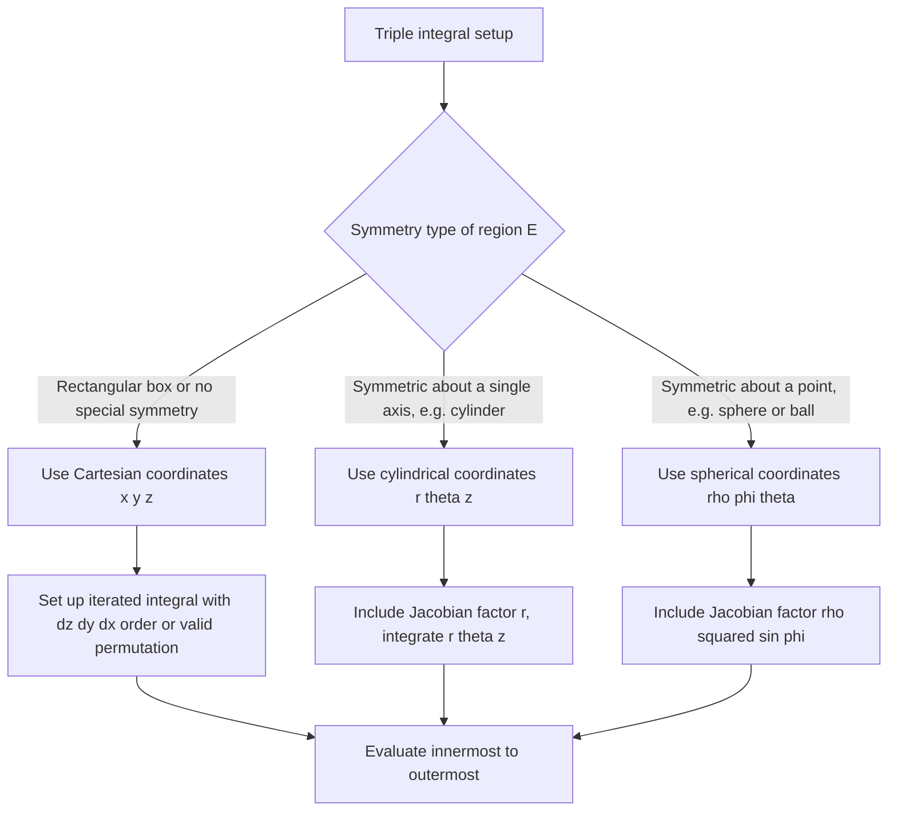

## Triple Integrals

### Definition

A triple integral extends integration to functions of three variables $f(x,y,z)$ over a three-dimensional region $E$:

$$\iiint_E f(x,y,z)\,dV$$

This represents a generalized accumulation of $f$ over a volume, reducing to the volume of $E$ itself when $f(x,y,z) = 1$. This is a standard, confirmed definition from multivariable calculus.

### Why This Matters for Machine Learning

Triple integrals connect to ML in the following ways:
- Joint probability density functions of three continuous random variables require triple integrals for normalization and probability computation. [Inference — this follows from the standard mathematical definition of joint continuous distributions extended to three variables; I cannot verify specific implementation details of any named ML library]
- Some physics-informed ML models and 3D spatial data problems (e.g., volumetric data, point clouds, 3D density estimation) may involve triple integration. [Inference]
- I do not have access to information confirming which specific ML frameworks or published methods perform triple integration internally, so any claim beyond the general mathematical structure above should be treated as [Unverified].

### Iterated Triple Integrals over a Rectangular Box

For a rectangular box $B = [a,b]\times[c,d]\times[p,q]$:

$$\iiint_B f(x,y,z)\,dV = \int_a^b\int_c^d\int_p^q f(x,y,z)\,dz\,dy\,dx$$

The integration proceeds innermost-first, holding the outer variables constant at each stage. This is the standard, confirmed evaluation procedure. As with double integrals, Fubini's Theorem confirms the order of integration can be swapped freely (in any of the six possible orderings) provided $f$ is continuous on $B$.

**Example**

Evaluate $\int_0^1\int_0^2\int_0^3 xyz\,dz\,dy\,dx$.

Innermost integral (with respect to $z$):

$$\int_0^3 xyz\,dz = xy\left[\frac{z^2}{2}\right]_0^3 = \frac{9xy}{2}$$

Middle integral (with respect to $y$):

$$\int_0^2 \frac{9xy}{2}\,dy = \frac{9x}{2}\left[\frac{y^2}{2}\right]_0^2 = \frac{9x}{2}(2) = 9x$$

Outer integral (with respect to $x$):

$$\int_0^1 9x\,dx = 9\left[\frac{x^2}{2}\right]_0^1 = \frac{9}{2}$$

Result: $\frac{9}{2}$.

### Triple Integrals over General Regions

For a general solid region $E$ bounded below by $z = u_1(x,y)$ and above by $z = u_2(x,y)$, with $(x,y)$ ranging over a 2D projection region $D$:

$$\iiint_E f(x,y,z)\,dV = \iint_D \left[\int_{u_1(x,y)}^{u_2(x,y)} f(x,y,z)\,dz\right] dA$$

The outer double integral over $D$ is then evaluated using the Type I/Type II methods described for double integrals. This is a standard, confirmed procedure — the triple integral is reduced to an inner single integral followed by a double integral.

**Example**

Evaluate $\iiint_E z\,dV$ where $E$ is bounded by $z = 0$, $z = 1-x-y$, with $x,y \geq 0$ and $x+y \leq 1$.

Inner integral (with respect to $z$, from $0$ to $1-x-y$):

$$\int_0^{1-x-y} z\,dz = \frac{(1-x-y)^2}{2}$$

This must now be integrated over the triangular region $D$: $x \in [0,1]$, $y \in [0, 1-x]$.

$$\int_0^1\int_0^{1-x} \frac{(1-x-y)^2}{2}\,dy\,dx$$

Let $w = 1-x-y$ in the inner integral (with $y$ as the variable, $x$ fixed): when $y=0$, $w=1-x$; when $y=1-x$, $w=0$; $dw = -dy$.

$$\int_0^{1-x} \frac{(1-x-y)^2}{2}\,dy = \frac{1}{2}\int_0^{1-x} w^2\,dw = \frac{1}{2}\cdot\frac{(1-x)^3}{3} = \frac{(1-x)^3}{6}$$

Outer integral:

$$\int_0^1 \frac{(1-x)^3}{6}\,dx = \frac{1}{6}\left[-\frac{(1-x)^4}{4}\right]_0^1 = \frac{1}{6}\left(0 - \left(-\frac{1}{4}\right)\right) = \frac{1}{24}$$

Result: $\frac{1}{24}$.

### Region Structure Visualization

<svg xmlns="http://www.w3.org/2000/svg" viewBox="0 0 800 420">
\<style\>
  .axis { stroke: var(--border, #888); stroke-width: 1.5; }
  .txt { font-family: sans-serif; font-size: 13px; fill: var(--text, #222); }
  .title { font-family: sans-serif; font-size: 16px; font-weight: bold; fill: var(--text, #222); }
  .box { fill: var(--accent, #3b82f6); opacity: 0.15; stroke: var(--accent, #3b82f6); stroke-width: 1.5; }
  .plane { fill: var(--accent2, #ef4444); opacity: 0.2; stroke: var(--accent2, #ef4444); stroke-width: 1.5; }
\</style\>
<text x="400" y="26" text-anchor="middle" class="title">Triple Integral Reduction Structure (svg_diagram)</text>

<polygon points="150,300 350,300 420,250 220,250" class="plane" />
<text x="270" y="330" text-anchor="middle" class="txt">2D projection region D (in x-y plane)</text>

<line x1="250" y1="270" x2="250" y2="130" stroke="var(--text,#333)" stroke-width="2" stroke-dasharray="3,2" />
<line x1="320" y1="255" x2="320" y2="150" stroke="var(--text,#333)" stroke-width="2" stroke-dasharray="3,2" />
<text x="255" y="120" class="txt">vertical fiber:</text>
<text x="255" y="138" class="txt">integrate z from u₁(x,y) to u₂(x,y)</text>

<path d="M 180 280 Q 300 200 450 190" class="axis" fill="none" stroke="var(--accent2,#ef4444)" />
<text x="460" y="190" class="txt" fill="var(--accent2,#ef4444)">z = u₂(x,y) upper surface</text>

<path d="M 180 300 Q 300 290 450 285" class="axis" fill="none" stroke="var(--accent,#3b82f6)" />
<text x="460" y="290" class="txt" fill="var(--accent,#3b82f6)">z = u₁(x,y) lower surface</text>

<rect x="120" y="360" width="560" height="50" rx="6" fill="var(--bg2,#f0f0f0)" stroke="var(--border,#888)" stroke-width="1.5" />
<text x="400" y="380" text-anchor="middle" class="txt">Step 1: integrate over z (inner, single integral)</text>
<text x="400" y="398" text-anchor="middle" class="txt">Step 2: integrate result over D (outer, double integral)</text>
</svg>

### Cylindrical Coordinates

For regions with symmetry around an axis (commonly the $z$-axis), cylindrical coordinates simplify the integral:

$$x = r\cos\theta, \quad y = r\sin\theta, \quad z = z, \quad dV = r\,dz\,dr\,d\theta$$

$$\iiint_E f(x,y,z)\,dV = \iiint_{E'} f(r\cos\theta, r\sin\theta, z)\,r\,dz\,dr\,d\theta$$

This is a standard, confirmed result — essentially the polar-coordinate double integral extended with an unmodified $z$-axis. The Jacobian factor is $r$, identical to the polar case.

**Example**

Evaluate $\iiint_E z\,dV$ where $E$ is the solid inside the cylinder $x^2+y^2 \leq 4$, between $z=0$ and $z=3$.

In cylindrical coordinates: $r \in [0,2]$, $\theta \in [0,2\pi)$, $z \in [0,3]$.

$$\int_0^{2\pi}\int_0^2\int_0^3 z \cdot r\,dz\,dr\,d\theta$$

Innermost (with respect to $z$):

$$\int_0^3 z\,dz = \frac{9}{2}$$

Middle (with respect to $r$):

$$\int_0^2 \frac{9}{2}r\,dr = \frac{9}{2}\cdot\frac{r^2}{2}\Big|_0^2 = \frac{9}{2}(2) = 9$$

Outer (with respect to $\theta$):

$$\int_0^{2\pi} 9\,d\theta = 18\pi$$

Result: $18\pi$.

### Spherical Coordinates

For regions with symmetry around a point (commonly the origin), spherical coordinates are used:

$$x = \rho\sin\phi\cos\theta, \quad y = \rho\sin\phi\sin\theta, \quad z = \rho\cos\phi, \quad dV = \rho^2\sin\phi\,d\rho\,d\phi\,d\theta$$

where $\rho \geq 0$ is the distance from the origin, $\phi \in [0,\pi]$ is the angle from the positive $z$-axis, and $\theta \in [0,2\pi)$ is the standard azimuthal angle. The Jacobian factor $\rho^2\sin\phi$ is a standard, confirmed result derivable from the general Jacobian determinant formula.

**Example**

Evaluate the volume of a sphere of radius $R$ using spherical coordinates.

$$V = \int_0^{2\pi}\int_0^{\pi}\int_0^{R} \rho^2\sin\phi\,d\rho\,d\phi\,d\theta$$

Innermost:
$$\int_0^R \rho^2\,d\rho = \frac{R^3}{3}$$

Middle:
$$\int_0^{\pi} \sin\phi\,d\phi = 2$$

Outer:
$$\int_0^{2\pi} d\theta = 2\pi$$

$$V = \frac{R^3}{3}\cdot 2\cdot 2\pi = \frac{4}{3}\pi R^3$$

This matches the standard, confirmed geometric formula for the volume of a sphere.

### Coordinate System Selection

### Applications: Volume and Mass

**Volume of a solid region:**
$$\text{Volume}(E) = \iiint_E 1\,dV$$

**Mass of a solid with density function $\rho(x,y,z)$:**
$$m = \iiint_E \rho(x,y,z)\,dV$$

**Center of mass coordinates:**
$$\bar{x} = \frac{1}{m}\iiint_E x\,\rho(x,y,z)\,dV, \quad \bar{y} = \frac{1}{m}\iiint_E y\,\rho(x,y,z)\,dV, \quad \bar{z} = \frac{1}{m}\iiint_E z\,\rho(x,y,z)\,dV$$

These are standard, confirmed definitions from multivariable calculus and classical mechanics.

### Connection to Machine Learning: Trivariate Distributions

For a joint probability density function $f(x,y,z)$ of three continuous random variables:

$$\iiint_{\mathbb{R}^3} f(x,y,z)\,dV = 1 \quad \text{(normalization condition)}$$

**Marginal density** (integrating out two variables to get the marginal of one, or one variable to get a joint marginal of two):

$$f_X(x) = \iint_{\mathbb{R}^2} f(x,y,z)\,dy\,dz$$

These are standard, confirmed definitions from probability theory extended to three dimensions. I cannot verify specific claims about how any named ML framework implements trivariate density computations internally, so such claims are [Unverified] unless independently confirmed. General relevance to volumetric/3D data modeling in ML is [Inference], not a confirmed implementation detail.

### Common Errors

- Using an invalid or inconsistent order of integration where an inner variable's bounds depend on a variable that is integrated after it (bounds must only depend on variables not yet integrated, reading from innermost to outermost)
- Forgetting the Jacobian factor $r$ (cylindrical) or $\rho^2\sin\phi$ (spherical) when converting from Cartesian coordinates — a common source of answers that are systematically off by a variable factor
- Misidentifying the correct range for $\phi$ in spherical coordinates (using $[0,2\pi]$ instead of the correct $[0,\pi]$ range from the positive z-axis)
- Setting up the projection region $D$ incorrectly when reducing a triple integral to an inner single integral plus outer double integral

### Disclaimer on Behavioral/Applied Claims

Statements above connecting triple integrals to specific machine learning systems, libraries, or published methods are labeled [Inference] or [Unverified] as appropriate. I cannot verify internal implementation details of any named or unnamed ML system, and behavior of such systems is not guaranteed to match any general description above — actual behavior may vary by implementation, version, or configuration.

**Related Topics**
- Cylindrical and spherical coordinate transformations in general
- Trivariate and multivariate joint probability distributions
- Center of mass and moment of inertia calculations
- General $n$-dimensional multiple integrals
- Divergence theorem and its relationship to triple integrals over solid regions