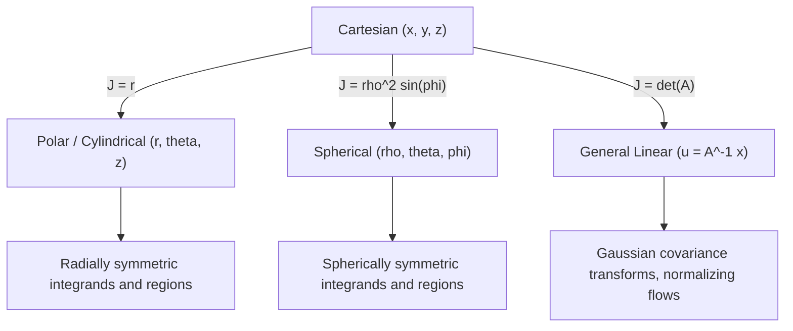

## Change of Variables in Multiple Integrals

### Motivation

Many integrals over regions in $\mathbb{R}^n$ are difficult or impossible to evaluate directly in the given coordinate system due to the shape of the region or the form of the integrand. Change of variables transforms an integral from one coordinate system to another — commonly Cartesian to polar, cylindrical, or spherical — to simplify either the region of integration, the integrand, or both. This is the multivariable generalization of $u$-substitution from single-variable calculus.

In machine learning, this technique underlies probability density transformations, normalizing flows, and integration over parameter spaces with natural symmetries (radial, angular).

### The General Transformation Formula

Let $T: \mathbb{R}^n \to \mathbb{R}^n$ be a transformation mapping coordinates $(u_1, u_2, \dots, u_n)$ to $(x_1, x_2, \dots, x_n)$, such that:

$$x_1 = x_1(u_1, \dots, u_n), \quad x_2 = x_2(u_1, \dots, u_n), \quad \dots, \quad x_n = x_n(u_1, \dots, u_n)$$

If $T$ is a bijection (one-to-one) from a region $S$ in $u$-space onto a region $R$ in $x$-space, and $T$ is continuously differentiable, then for an integrable function $f$:

$$\int_R f(x_1, \dots, x_n) \, dx_1 \cdots dx_n = \int_S f(T(u_1, \dots, u_n)) \, |J| \, du_1 \cdots du_n$$

where $J$ is the **Jacobian determinant** of the transformation.

### The Jacobian Determinant

For a transformation from $(u, v)$ to $(x, y)$:

$$J = \frac{\partial(x, y)}{\partial(u, v)} = \det \begin{bmatrix} \dfrac{\partial x}{\partial u} & \dfrac{\partial x}{\partial v} \\[6pt] \dfrac{\partial y}{\partial u} & \dfrac{\partial y}{\partial v} \end{bmatrix} = \frac{\partial x}{\partial u}\frac{\partial y}{\partial v} - \frac{\partial x}{\partial v}\frac{\partial y}{\partial u}$$

For three variables $(u, v, w) \to (x, y, z)$, the Jacobian is the determinant of the corresponding $3 \times 3$ matrix of partial derivatives.

**Key Points**
- The absolute value $|J|$ is used because the Jacobian can be negative depending on orientation; area/volume scaling factors must be nonnegative.
- $J$ measures the local factor by which the transformation stretches or compresses area (2D) or volume (3D) at each point.
- If $J = 0$ at a point, the transformation is singular there (not locally invertible), and that point typically requires separate handling.

<svg xmlns="http://www.w3.org/2000/svg" viewBox="0 0 700 340">
  <text x="350" y="25" font-size="15" font-weight="bold" text-anchor="middle" fill="#222">Jacobian as Local Area Scaling (svg_diagram)</text>

  <text x="130" y="55" font-size="13" fill="#333" text-anchor="middle">u-v plane</text>
  <rect x="60" y="70" width="140" height="140" fill="none" stroke="#888" stroke-width="1" />
  <rect x="90" y="100" width="30" height="30" fill="#a8d8ff" stroke="#2266aa" stroke-width="1.5" />
  <text x="105" y="98" font-size="11" text-anchor="middle" fill="#2266aa">dA = du dv</text>
  <line x1="60" y1="140" x2="200" y2="140" stroke="#ccc" stroke-width="1" />
  <line x1="130" y1="70" x2="130" y2="210" stroke="#ccc" stroke-width="1" />
  <text x="200" y="225" font-size="11" fill="#666">u</text>
  <text x="55" y="70" font-size="11" fill="#666">v</text>

  <path d="M 220 140 L 300 140" stroke="#333" stroke-width="1.5" marker-end="url(#arrow1)" />
  <text x="260" y="130" font-size="12" text-anchor="middle" fill="#333">T(u,v)</text>
  <text x="530" y="55" font-size="13" fill="#333" text-anchor="middle">x-y plane</text>
  <path d="M 400 90 Q 460 70 560 90 Q 600 150 560 210 Q 460 230 400 210 Q 380 150 400 90 Z" fill="none" stroke="#888" stroke-width="1" />
  <path d="M 470 130 L 505 125 L 515 155 L 480 165 Z" fill="#ffd28a" stroke="#cc7a1e" stroke-width="1.5" />
  <text x="497" y="118" font-size="11" text-anchor="middle" fill="#cc7a1e">dA' = |J| du dv</text>

  <text x="130" y="260" font-size="12" text-anchor="middle" fill="#444">Small square, area = du dv</text>
  <text x="490" y="260" font-size="12" text-anchor="middle" fill="#444">Distorted parallelogram, area scaled by |J|</text>

  <text x="350" y="300" font-size="12.5" text-anchor="middle" fill="#333">The Jacobian |J(u,v)| is the local stretch/shrink factor of area under T</text>
</svg>

### Polar Coordinates (2D Case)

The most common change of variables. With $x = r\cos\theta$, $y = r\sin\theta$:

$$J = \det \begin{bmatrix} \cos\theta & -r\sin\theta \\ \sin\theta & r\cos\theta \end{bmatrix} = r\cos^2\theta + r\sin^2\theta = r$$

So $dx\,dy = r \, dr \, d\theta$.

**Example**

Evaluate $\displaystyle\iint_R e^{-(x^2+y^2)} \, dA$ where $R$ is the entire plane (this is the Gaussian integral, foundational to probability and ML).

In polar coordinates:

$$\int_0^{2\pi} \int_0^{\infty} e^{-r^2} \, r \, dr \, d\theta$$

Let $s = r^2$, $ds = 2r\,dr$:

$$= \int_0^{2\pi} \left[ -\tfrac{1}{2} e^{-r^2} \right]_0^{\infty} d\theta = \int_0^{2\pi} \tfrac{1}{2} \, d\theta = \pi$$

This confirms $\displaystyle\int_{-\infty}^{\infty} e^{-x^2}\,dx = \sqrt{\pi}$, since squaring the 1D integral over $x$ and $y$ gives this 2D result. This identity underlies the normalization constant of the Gaussian (normal) distribution used throughout probabilistic ML.

### Cylindrical Coordinates (3D)

With $x = r\cos\theta$, $y = r\sin\theta$, $z = z$:

$$J = r \quad \Rightarrow \quad dV = r \, dr \, d\theta \, dz$$

Useful for integrands and regions with axial symmetry (e.g., radially symmetric potential functions, cylindrical constraint regions in optimization).

### Spherical Coordinates (3D)

With $x = \rho\sin\phi\cos\theta$, $y = \rho\sin\phi\sin\theta$, $z = \rho\cos\phi$ (where $\rho \geq 0$ is radius, $\phi \in [0, \pi]$ is polar angle, $\theta \in [0, 2\pi)$ is azimuthal angle):

$$J = \rho^2 \sin\phi \quad \Rightarrow \quad dV = \rho^2 \sin\phi \, d\rho \, d\phi \, d\theta$$

**Example**

The multivariate Gaussian normalization constant in $n$ dimensions is often derived using spherical-type coordinate changes generalized to $n$ dimensions, leveraging the same $r$-power scaling pattern seen in 2D and 3D cases.

### General Linear Change of Variables

For a linear transformation $x = Au$ where $A$ is a constant $n \times n$ matrix:

$$J = \det(A)$$

This is constant (independent of $u$), which simplifies integrals over linearly transformed regions:

$$\int_R f(x) \, dx = \int_S f(Au) \, |\det(A)| \, du$$

**Key Points**
- This case is directly relevant to ML: covariance transformations of multivariate Gaussians use exactly this formula, where $A$ relates to the Cholesky factor or square root of a covariance matrix.
- If $\Sigma = AA^T$, then $\det(\Sigma) = \det(A)^2$, connecting the Jacobian to the covariance determinant appearing in the multivariate Gaussian density formula.

### Relevance to Machine Learning

**Probability density transformations.** If $y = g(x)$ is an invertible, differentiable transformation of a random variable with density $p_X(x)$, the transformed density is:

$$p_Y(y) = p_X(g^{-1}(y)) \left| \det \frac{\partial g^{-1}}{\partial y} \right|$$

This is the change-of-variables formula from probability theory, and it is mathematically identical to the Jacobian formula for multiple integrals — the "integration region" is replaced by "probability mass."

**Normalizing flows.** A class of generative models constructs complex distributions by applying a sequence of invertible transformations $f_1, f_2, \dots, f_k$ to a simple base distribution (e.g., a standard Gaussian). Computing the resulting log-density requires the log-determinant of the Jacobian at every step:

$$\log p_Y(y) = \log p_X(x) - \sum_{i=1}^{k} \log \left| \det J_{f_i} \right|$$

[Inference] Because computing a full Jacobian determinant is $O(n^3)$ for a generic transformation, practical normalizing flow architectures (e.g., coupling layers as in RealNVP or Glow) are specifically designed so their Jacobian is triangular, making the determinant a simple product of diagonal entries computable in $O(n)$. This design constraint is a well-documented motivation in the normalizing flows literature, though the specific architectural tradeoffs of any given implementation should be verified against its source paper. [Unverified — verify against the specific paper/implementation in question]

**Monte Carlo integration and sampling.** Change of variables is used to convert sampling problems between coordinate systems — e.g., sampling uniformly on a sphere is done by generating points in a simpler space and mapping them via a transformation with known Jacobian, correcting for the resulting density distortion.

### Worked Multivariable Example

Evaluate $\displaystyle\iint_R (x + y) \, dA$ where $R$ is the parallelogram with vertices $(0,0)$, $(2,0)$, $(3,1)$, $(1,1)$.

Define $u = x - y$ and $v$ such that the transformation simplifies the boundary. Using $x = u + v$, $y = v$ maps the region to a rectangle in $u$-$v$ space (specifically $u \in [0,2]$, $v \in [0,1]$, matching the parallelogram's slanted sides to straight lines).

Jacobian:

$$J = \det\begin{bmatrix} 1 & 1 \\ 0 & 1 \end{bmatrix} = 1$$

Transformed integral:

$$\int_0^1 \int_0^2 (u + v + v) \, du \, dv = \int_0^1 \int_0^2 (u + 2v) \, du \, dv$$

$$= \int_0^1 \left[ \tfrac{u^2}{2} + 2vu \right]_0^2 dv = \int_0^1 (2 + 4v) \, dv = \left[2v + 2v^2\right]_0^1 = 4$$

**Output**

$$\iint_R (x+y)\, dA = 4$$

### Choosing a Substitution

**Key Points**
- Choose new coordinates that make the region of integration rectangular or otherwise simple in the new coordinate system.
- Choose new coordinates that simplify the integrand's algebraic form (e.g., $x^2 + y^2 \to r^2$).
- Always recompute the Jacobian for the specific transformation — it is not preserved across different substitutions.
- Always convert the limits of integration to match the new variables; forgetting this is one of the most common errors in applying this technique.

### Common Pitfalls

- Omitting the Jacobian factor entirely (a frequent error when transforming density functions in ML pipelines).
- Using the Jacobian of the forward map when the inverse map's Jacobian is required, or vice versa — note that $J_{T^{-1}} = 1/J_T$ when $T$ is invertible.
- Failing to account for sign/orientation, which is why $|J|$ (absolute value) is used rather than the signed determinant when computing integrals.
- Applying the transformation over a region where $T$ is not one-to-one, which invalidates the direct substitution formula without further decomposition of the region.

### Diagram: Coordinate Systems Summary

**Related Topics**
- Jacobian matrices in multivariate calculus (foundation for this topic)
- Multivariate Gaussian distributions and covariance matrices
- Normalizing flows and invertible neural network architectures
- Divergence theorem and Green's/Stokes' theorem (related integral transformation tools)
- Monte Carlo integration and importance sampling
- Probability density functions under nonlinear transformations
- Numerical computation of Jacobian determinants (autodiff-based methods)