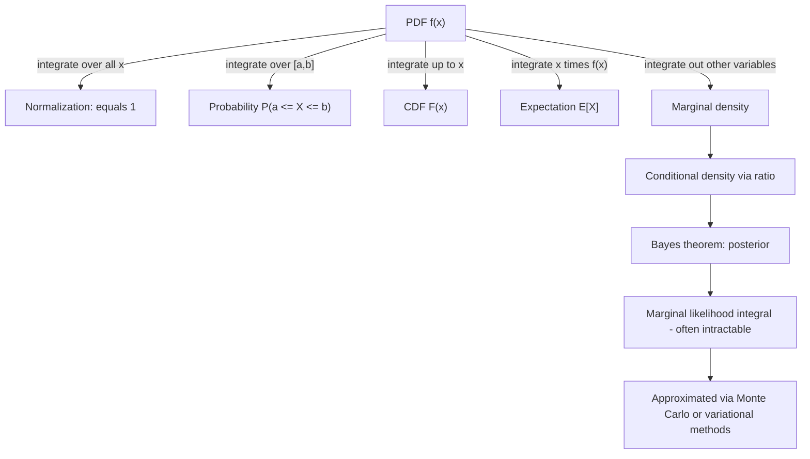

## Integrals in Probability Density Functions

### Foundational Definition

A probability density function (PDF) $f(x)$ for a continuous random variable $X$ must satisfy two conditions:

$$f(x) \geq 0 \quad \text{for all } x$$

$$\int_{-\infty}^{\infty} f(x) \, dx = 1$$

This normalization condition is a defining requirement of a valid PDF, not an inference — it follows directly from the axioms of probability (total probability over the sample space equals 1).

The probability that $X$ falls within an interval $[a, b]$ is:

$$P(a \leq X \leq b) = \int_a^b f(x) \, dx$$

**Key Points**
- Unlike a probability mass function for discrete variables, $f(x)$ itself is not a probability — it is a density. Only the integral of $f(x)$ over an interval yields a probability.
- $f(x)$ can exceed 1 at a point; only the total area under the curve is constrained to equal 1.
- $P(X = a) = 0$ for any single point $a$ under a continuous distribution, since $\int_a^a f(x)\,dx = 0$.

<svg xmlns="http://www.w3.org/2000/svg" viewBox="0 0 700 320">
  <text x="350" y="25" font-size="15" font-weight="bold" text-anchor="middle" fill="#222">PDF and Probability as Area (svg_diagram)</text>

  <line x1="60" y1="260" x2="640" y2="260" stroke="#333" stroke-width="1.5" />
  <line x1="60" y1="260" x2="60" y2="50" stroke="#333" stroke-width="1.5" />
  <text x="640" y="278" font-size="12" fill="#333">x</text>
  <text x="45" y="50" font-size="12" fill="#333">f(x)</text>

  <path d="M 60 260 C 150 260, 200 60, 350 60 C 500 60, 550 260, 640 260" fill="none" stroke="#2266aa" stroke-width="2" />

  <path d="M 280 260 C 300 150, 330 75, 350 65 C 370 75, 400 150, 420 260 Z" fill="#a8d8ff" fill-opacity="0.6" stroke="none" transform="translate(0,0)" />

  <path d="M 250 260 L 250 130 Q 300 75 350 65 Q 400 75 430 175 L 430 260 Z" fill="#ffd28a" fill-opacity="0.7" stroke="#cc7a1e" stroke-width="1.5" />

  <line x1="250" y1="260" x2="250" y2="120" stroke="#cc7a1e" stroke-width="1" stroke-dasharray="4,3" />
  <line x1="430" y1="260" x2="430" y2="175" stroke="#cc7a1e" stroke-width="1" stroke-dasharray="4,3" />

  <text x="250" y="280" font-size="12" text-anchor="middle" fill="#333">a</text>
  <text x="430" y="280" font-size="12" text-anchor="middle" fill="#333">b</text>

  <text x="340" y="180" font-size="13" text-anchor="middle" fill="#994c00">P(a ≤ X ≤ b)</text>
  <text x="340" y="197" font-size="12" text-anchor="middle" fill="#994c00">= area under curve</text>

  <text x="350" y="300" font-size="12.5" text-anchor="middle" fill="#333">Total area under f(x) over all x equals 1</text>
</svg>

### The Gaussian (Normal) Distribution

The univariate Gaussian PDF:

$$f(x) = \frac{1}{\sigma\sqrt{2\pi}} \exp\left(-\frac{(x-\mu)^2}{2\sigma^2}\right)$$

The normalization constant $\frac{1}{\sigma\sqrt{2\pi}}$ is derived by requiring the integral over all $x$ to equal 1. This derivation relies on the Gaussian integral:

$$\int_{-\infty}^{\infty} e^{-x^2} \, dx = \sqrt{\pi}$$

This result is a confirmed, standard identity in analysis, typically proven using polar-coordinate change of variables on the squared integral $\left(\int e^{-x^2}dx\right)^2 = \iint e^{-(x^2+y^2)}\,dx\,dy$, as covered in the prior topic on change of variables.

**Example**

Verify that the standard normal PDF ($\mu = 0$, $\sigma = 1$) integrates to 1:

$$\int_{-\infty}^{\infty} \frac{1}{\sqrt{2\pi}} e^{-x^2/2} \, dx$$

Substitute $u = x/\sqrt{2}$, $du = dx/\sqrt{2}$:

$$= \frac{1}{\sqrt{2\pi}} \int_{-\infty}^{\infty} e^{-u^2} \sqrt{2}\, du = \frac{\sqrt{2}}{\sqrt{2\pi}} \cdot \sqrt{\pi} = \frac{\sqrt{2\pi}}{\sqrt{2\pi}} = 1$$

**Output**

$$\int_{-\infty}^{\infty} \frac{1}{\sqrt{2\pi}} e^{-x^2/2}\,dx = 1 \quad \checkmark$$

### Cumulative Distribution Function (CDF)

The CDF is defined as the integral of the PDF up to a point:

$$F(x) = P(X \leq x) = \int_{-\infty}^{x} f(t) \, dt$$

By the Fundamental Theorem of Calculus, $F'(x) = f(x)$ wherever $f$ is continuous. This relationship is a direct, confirmed consequence of the FTC and is not an inference.

**Key Points**
- $F(x)$ is nondecreasing, with $\lim_{x \to -\infty} F(x) = 0$ and $\lim_{x \to \infty} F(x) = 1$.
- For distributions without closed-form CDFs (such as the Gaussian), numerical integration or special functions (e.g., the error function $\text{erf}$) are used in practice.

### Expectation as an Integral

The expected value of a continuous random variable is defined as:

$$E[X] = \int_{-\infty}^{\infty} x f(x) \, dx$$

More generally, for a function $g(X)$:

$$E[g(X)] = \int_{-\infty}^{\infty} g(x) f(x) \, dx$$

This integral formula is the standard definition used throughout probability theory and machine learning (e.g., in loss function expectations, Bayesian posterior means).

**Example**

For the standard normal distribution, $E[X] = \int_{-\infty}^{\infty} x \cdot \frac{1}{\sqrt{2\pi}} e^{-x^2/2}\,dx = 0$, since the integrand $x e^{-x^2/2}$ is an odd function and the integral is taken over a symmetric interval $(-\infty, \infty)$. This is a confirmed algebraic consequence of odd-function symmetry, not an inference.

### Variance as an Integral

$$\text{Var}(X) = E[(X - \mu)^2] = \int_{-\infty}^{\infty} (x - \mu)^2 f(x) \, dx$$

For the standard normal distribution, this integral evaluates to 1, matching the parameter $\sigma^2 = 1$. The general derivation uses integration by parts along with the Gaussian integral identity above.

### Multivariate Case: Joint Densities

For a random vector $X \in \mathbb{R}^n$ with joint density $f(x_1, \dots, x_n)$, normalization requires:

$$\int_{\mathbb{R}^n} f(x_1, \dots, x_n) \, dx_1 \cdots dx_n = 1$$

The multivariate Gaussian density:

$$f(\mathbf{x}) = \frac{1}{(2\pi)^{n/2} |\Sigma|^{1/2}} \exp\left( -\tfrac{1}{2}(\mathbf{x}-\boldsymbol{\mu})^T \Sigma^{-1} (\mathbf{x}-\boldsymbol{\mu}) \right)$$

The normalization constant $(2\pi)^{n/2}|\Sigma|^{1/2}$ is derived using the linear change-of-variables formula from the prior topic: if $\mathbf{x} = \boldsymbol{\mu} + A\mathbf{u}$ with $\Sigma = AA^T$, the Jacobian $|\det A| = |\Sigma|^{1/2}$ enters the normalization directly. This derivation is a standard, confirmed result in multivariate statistics.

**Key Points**
- $\Sigma$ must be symmetric positive-definite for $f(\mathbf{x})$ to be a valid density (ensuring $|\Sigma| > 0$ and $\Sigma^{-1}$ exists).
- Marginal densities are obtained by integrating out a subset of variables: $f(x_1) = \int_{\mathbb{R}^{n-1}} f(x_1, \dots, x_n) \, dx_2 \cdots dx_n$.

### Marginalization

Given a joint density $f(x, y)$, the marginal density of $X$ is:

$$f_X(x) = \int_{-\infty}^{\infty} f(x, y) \, dy$$

This operation is central to Bayesian machine learning, where marginalizing out latent variables or nuisance parameters is a routine step in computing posterior predictive distributions.

**Example**

For a joint density $f(x,y) = \begin{cases} 6xy^2 & 0 \le x \le 1,\ 0 \le y \le 1 \\ 0 & \text{otherwise} \end{cases}$ (verify this is valid: $\int_0^1\int_0^1 6xy^2\,dy\,dx = \int_0^1 6x \cdot \tfrac{1}{3}\,dx = \int_0^1 2x\,dx = 1$ ✓):

$$f_X(x) = \int_0^1 6xy^2 \, dy = 6x \left[\frac{y^3}{3}\right]_0^1 = 2x, \quad 0 \le x \le 1$$

**Output**

$$f_X(x) = 2x \text{ on } [0,1]$$

### Conditional Densities and Bayes' Theorem

The conditional density is defined via a ratio involving joint and marginal integrals:

$$f(y \mid x) = \frac{f(x, y)}{f_X(x)}, \quad \text{where } f_X(x) = \int f(x,y)\,dy > 0$$

Bayes' theorem in continuous form:

$$f(\theta \mid D) = \frac{f(D \mid \theta) \, f(\theta)}{\int f(D \mid \theta') f(\theta') \, d\theta'}$$

**Key Points**
- The denominator $\int f(D \mid \theta') f(\theta')\,d\theta'$ is the marginal likelihood (evidence). It is frequently intractable in closed form for complex models — this intractability is a well-documented, confirmed issue in Bayesian machine learning, not a speculative claim.
- Because this integral is often intractable, approximate methods are commonly used, including variational inference and Markov Chain Monte Carlo (MCMC) sampling. [Inference] The specific choice between these methods in any given ML system depends on model structure and computational constraints, and the relative performance of one approach versus another is implementation- and problem-dependent; I cannot verify a general ranking of these methods without reference to a specific comparative study.

### Relevance to Machine Learning

**Maximum Likelihood Estimation.** Fitting a probability model to data involves integrals when the model includes latent variables:

$$L(\theta) = \prod_{i=1}^{N} f(x_i \mid \theta), \quad \text{or with latents: } f(x \mid \theta) = \int f(x, z \mid \theta) \, dz$$

**Variational inference.** Approximates intractable posterior integrals by optimizing a tractable lower bound (the ELBO), converting an integration problem into an optimization problem. [Inference] This reframing is the standard motivation given in variational inference literature; I cannot verify whether this framing applies identically across every variational method without checking the specific source.

**KL divergence**, used extensively as a training objective (e.g., in VAEs), is itself defined as an integral:

$$D_{KL}(p \| q) = \int p(x) \log\frac{p(x)}{q(x)} \, dx$$

**Cross-entropy loss**, foundational in classification, arises from an integral (continuous case) or sum (discrete case) over the true and predicted distributions:

$$H(p, q) = -\int p(x) \log q(x) \, dx$$

### Numerical Integration in Practice

[Unverified] I do not have access to specific benchmark data comparing numerical integration methods across ML frameworks, so no comparative performance claim is made here.

In practice, many PDF-related integrals in ML lack closed-form solutions and are approximated using:
- **Monte Carlo integration**: approximating $\int f(x) g(x)\,dx \approx \frac{1}{N}\sum_{i=1}^N g(x_i)$ where $x_i \sim f$
- **Quadrature methods**: for low-dimensional integrals with smooth integrands
- **Numerical software libraries**: general-purpose integration routines available in common scientific computing packages

[Unverified] Naming of specific current library functions is omitted here since library APIs change over time and I cannot confirm current version-specific behavior without checking documentation directly.

### Common Pitfalls

- Treating $f(x)$ as a probability rather than a density — this conflation produces incorrect reasoning about values exceeding 1.
- Forgetting to verify normalization ($\int f = 1$) before using a proposed function as a PDF.
- Incorrect order of integration or missing Jacobian terms when transforming a PDF under a change of variables (see prior topic).
- Assuming a marginal likelihood integral is tractable without checking the specific model form; this assumption does not hold generally and should be verified per model, not treated as a default.

### Diagram: Integral Relationships in Probability

**Related Topics**
- Change of variables in multiple integrals (prerequisite, prior topic)
- Multivariate Gaussian distributions and covariance structure
- Monte Carlo integration and importance sampling
- Variational inference and the Evidence Lower Bound (ELBO)
- KL divergence and its role in generative model training
- Markov Chain Monte Carlo (MCMC) methods
- Expectation-Maximization algorithm (integrals over latent variables)