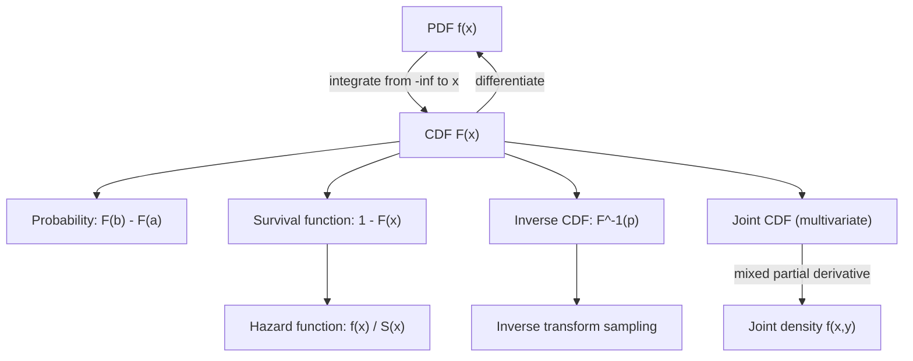

## Probability Density Functions and Cumulative Distribution Functions

### Defining Relationship

A cumulative distribution function (CDF) $F(x)$ and probability density function (PDF) $f(x)$ are linked by:

$$F(x) = \int_{-\infty}^{x} f(t) \, dt$$

$$f(x) = \frac{d}{dx} F(x) \quad \text{(wherever } F \text{ is differentiable)}$$

This is a direct consequence of the Fundamental Theorem of Calculus. It is a confirmed mathematical relationship, not an inference.

**Key Points**
- $F(x)$ is defined for every real-valued random variable, discrete or continuous. $f(x)$ in the density sense exists only for continuous (or mixed) random variables.
- $F(x)$ is always nondecreasing and right-continuous by definition of cumulative probability.
- $f(x) \geq 0$ everywhere it is defined, but $f(x)$ itself is not bounded above by 1 — only $F(x)$ is bounded in $[0,1]$.

### Required Properties of $F(x)$

For $F(x)$ to be a valid CDF, it must satisfy:

$$\lim_{x \to -\infty} F(x) = 0, \qquad \lim_{x \to \infty} F(x) = 1$$

$$F \text{ is nondecreasing: } \quad a \le b \implies F(a) \le F(b)$$

$$F \text{ is right-continuous: } \quad \lim_{x \to a^+} F(x) = F(a)$$

These are standard axiomatic requirements from probability theory, confirmed and not subject to interpretation.

<svg xmlns="http://www.w3.org/2000/svg" viewBox="0 0 700 340">
  <text x="350" y="25" font-size="15" font-weight="bold" text-anchor="middle" fill="#222">PDF and CDF Relationship (svg_diagram)</text>

  <text x="180" y="55" font-size="13" text-anchor="middle" fill="#333">f(x) — density</text>
  <line x1="60" y1="180" x2="320" y2="180" stroke="#333" stroke-width="1.2" />
  <line x1="60" y1="180" x2="60" y2="60" stroke="#333" stroke-width="1.2" />
  <path d="M 60 180 C 120 180, 150 70, 190 70 C 230 70, 260 180, 320 180" fill="none" stroke="#2266aa" stroke-width="2" />
  <path d="M 100 180 L 100 150 Q 145 75 190 71 L 190 180 Z" fill="#a8d8ff" fill-opacity="0.6" stroke="#2266aa" stroke-width="1" />
  <text x="145" y="200" font-size="11" text-anchor="middle" fill="#333">shaded area = F(x)</text>
  <text x="190" y="218" font-size="11" text-anchor="middle" fill="#333">x</text>

  <path d="M 350 120 L 410 120" stroke="#333" stroke-width="1.5" marker-end="url(#arrow2)" />
  <text x="380" y="110" font-size="11" text-anchor="middle" fill="#333">integrate</text>
  <path d="M 410 150 L 350 150" stroke="#333" stroke-width="1.5" marker-end="url(#arrow2)" />
  <text x="380" y="168" font-size="11" text-anchor="middle" fill="#333">differentiate</text>
  <text x="530" y="55" font-size="13" text-anchor="middle" fill="#333">F(x) — cumulative</text>
  <line x1="440" y1="180" x2="640" y2="180" stroke="#333" stroke-width="1.2" />
  <line x1="440" y1="180" x2="440" y2="60" stroke="#333" stroke-width="1.2" />
  <path d="M 440 180 C 460 180, 490 175, 520 130 C 550 90, 580 70, 640 68" fill="none" stroke="#cc7a1e" stroke-width="2" />
  <line x1="470" y1="180" x2="470" y2="180" stroke="#999" stroke-dasharray="3,3" />
  <text x="640" y="200" font-size="11" text-anchor="middle" fill="#333">x</text>
  <line x1="440" y1="68" x2="640" y2="68" stroke="#ccc" stroke-width="1" stroke-dasharray="3,3" />
  <text x="425" y="72" font-size="10" fill="#666">1</text>
  <line x1="440" y1="180" x2="640" y2="180" stroke="#ccc" stroke-width="1" stroke-dasharray="3,3" />
  <text x="425" y="184" font-size="10" fill="#666">0</text>

  <text x="350" y="300" font-size="12.5" text-anchor="middle" fill="#333">F(x) = area under f(t) from -infinity to x; f(x) = slope of F(x)</text>
</svg>

### Computing Probabilities from Either Function

Using the CDF directly:

$$P(a \le X \le b) = F(b) - F(a)$$

Using the PDF via integration:

$$P(a \le X \le b) = \int_a^b f(x) \, dx$$

Both formulas are equivalent by the Fundamental Theorem of Calculus, since $F(b) - F(a) = \int_a^x f(t)\,dt \Big|_a^b = \int_a^b f(t)\,dt$.

**Example**

Given $f(x) = 3x^2$ for $0 \le x \le 1$ (and $0$ elsewhere):

Verify normalization: $\int_0^1 3x^2\,dx = [x^3]_0^1 = 1$ ✓

Find the CDF:

$$F(x) = \int_0^x 3t^2\,dt = [t^3]_0^x = x^3, \quad 0 \le x \le 1$$

Compute $P(0.2 \le X \le 0.5)$:

$$F(0.5) - F(0.2) = 0.5^3 - 0.2^3 = 0.125 - 0.008 = 0.117$$

**Output**

$$F(x) = x^3 \text{ on } [0,1], \qquad P(0.2 \le X \le 0.5) = 0.117$$

### Inverse CDF (Quantile Function)

The inverse CDF, $F^{-1}(p)$, returns the value $x$ such that $F(x) = p$. It is defined for $p \in (0,1)$ where $F$ is strictly increasing (or via a generalized inverse otherwise):

$$F^{-1}(p) = \inf\{x : F(x) \ge p\}$$

**Key Points**
- The inverse CDF is the basis of **inverse transform sampling**: generating samples from an arbitrary distribution by drawing $u \sim \text{Uniform}(0,1)$ and computing $x = F^{-1}(u)$.
- This works because if $U \sim \text{Uniform}(0,1)$, then $F^{-1}(U)$ has CDF $F$. This is a confirmed result from probability theory (the probability integral transform), not an inference.
- Many common distributions (e.g., Gaussian) lack a closed-form inverse CDF, requiring numerical approximation. [Unverified] I do not have access to current implementation-specific details of any particular numerical library's approximation method, so no specific algorithm is named here.

### Relationship to Survival and Hazard Functions

The survival function is defined as:

$$S(x) = 1 - F(x) = \int_x^{\infty} f(t)\,dt$$

The hazard function (used in survival analysis and some ML applications like churn modeling):

$$h(x) = \frac{f(x)}{S(x)} = \frac{f(x)}{1 - F(x)}$$

These definitions are standard in survival analysis literature and are confirmed mathematical constructs.

### Differentiability and Discontinuities

$F(x)$ is continuous for any distribution possessing a PDF, but $F(x)$ need not be differentiable everywhere even when it is continuous overall — for example, at points where $f(x)$ has a jump discontinuity, $F(x)$ remains continuous but its derivative is undefined exactly at that point. This is a standard calculus fact concerning piecewise-defined densities, confirmed and not inferential.

For mixed random variables (part discrete, part continuous), $F(x)$ has jump discontinuities at the discrete mass points, and $f(x)$ in the usual sense does not exist at those points — such distributions require a mixed representation (a density plus a set of discrete point masses) rather than a single PDF.

### Multivariate Extension: Joint CDF

For a random vector $(X, Y)$ with joint density $f(x, y)$:

$$F(x, y) = P(X \le x, Y \le y) = \int_{-\infty}^{x} \int_{-\infty}^{y} f(s, t) \, dt \, ds$$

Recovering the density requires mixed partial differentiation:

$$f(x, y) = \frac{\partial^2 F(x, y)}{\partial x \, \partial y}$$

This follows directly from the multivariate Fundamental Theorem of Calculus and is a confirmed relationship.

### Relevance to Machine Learning

**Sampling algorithms.** Inverse transform sampling using $F^{-1}$ is one method used to generate samples from target distributions in generative modeling and simulation-based inference.

**Evaluation metrics.** Empirical CDFs (built from integrating an empirical density estimate or directly from sorted data) are integral to metrics such as the Kolmogorov-Smirnov statistic, which measures the maximum distance between two CDFs:

$$D = \sup_x |F_1(x) - F_2(x)|$$

**Normalizing flows.** [Inference] Some normalizing flow constructions use the CDF-based transform (mapping through $F$ and $F^{-1}$ of different distributions) as one specific method of building invertible transformations. I cannot verify how commonly this specific approach is used relative to other invertible-transform constructions without checking specific current literature, so no relative-frequency claim is made.

**Calibration in classifiers.** Comparing the CDF of predicted probabilities against the empirical CDF of true outcomes is one diagnostic used to assess whether a classifier's probability outputs are well-calibrated. [Unverified] I do not have access to a specific source confirming which calibration diagnostic is most standard across current ML practice, so this is described only as "one diagnostic," not the standard one.

### Common Pitfalls

- Confusing $f(x)$ with $F(x)$ — a $y$-axis value of $f(x)$ is not a probability, while a $y$-axis value of $F(x)$ is a cumulative probability in $[0,1]$.
- Assuming $F^{-1}$ exists in closed form; for many distributions it does not, and numerical root-finding is required instead.
- Forgetting that differentiating $F(x)$ only recovers $f(x)$ at points of differentiability; this can fail at boundaries of piecewise densities.
- Applying the univariate inverse-transform sampling method directly to multivariate distributions without accounting for the joint/conditional structure — the multivariate case requires either the full joint inverse CDF or a sequential conditional sampling approach.

### Diagram: PDF-CDF Workflow

**Related Topics**
- Integrals in probability density functions (prerequisite, prior topic)
- Change of variables in multiple integrals (prerequisite)
- Inverse transform sampling and generative modeling
- Kolmogorov-Smirnov test and distributional comparison metrics
- Survival analysis and hazard functions
- Normalizing flows and invertible transformations
- Empirical distribution functions and nonparametric estimation