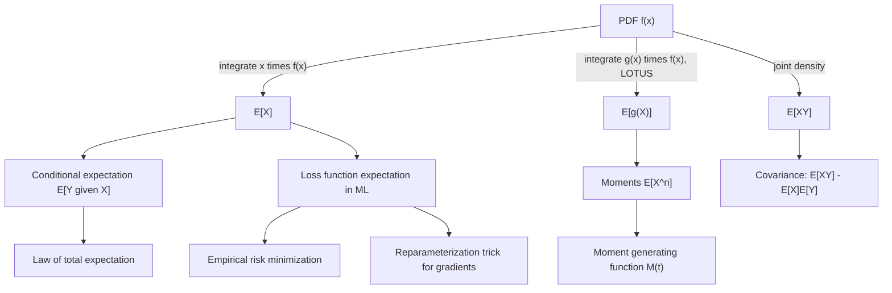

## Expectation as an Integral

### Definition

For a continuous random variable $X$ with probability density function $f(x)$, the expectation (expected value) is defined as:

$$E[X] = \int_{-\infty}^{\infty} x \, f(x) \, dx$$

This is the standard definition used throughout probability theory, provided the integral converges absolutely (i.e., $\int_{-\infty}^{\infty} |x| f(x)\,dx < \infty$). If this condition fails, $E[X]$ is undefined. This is a confirmed mathematical definition, not an inference.

**Key Points**
- Expectation is a weighted average of all possible values of $X$, where the weight at each point is given by the density $f(x)$.
- $E[X]$ need not equal any value $X$ can actually take (e.g., the expectation of a fair die roll analog in continuous form can fall between attainable values).
- $E[X]$ may fail to exist for distributions with sufficiently heavy tails (e.g., the Cauchy distribution), since the defining integral does not converge absolutely in that case.

### Expectation of a Function of X

For a function $g(X)$, the expectation is computed without first finding the distribution of $g(X)$:

$$E[g(X)] = \int_{-\infty}^{\infty} g(x) \, f(x) \, dx$$

This is known as the **law of the unconscious statistician (LOTUS)**. It is a standard, confirmed result in probability theory.

**Example**

Let $f(x) = 2x$ for $0 \le x \le 1$ (verify normalization: $\int_0^1 2x\,dx = [x^2]_0^1 = 1$ ✓). Find $E[X^2]$:

$$E[X^2] = \int_0^1 x^2 (2x) \, dx = \int_0^1 2x^3 \, dx = \left[\frac{x^4}{2}\right]_0^1 = \frac{1}{2}$$

**Output**

$$E[X^2] = \frac{1}{2}$$

<svg xmlns="http://www.w3.org/2000/svg" viewBox="0 0 700 320">
  <text x="350" y="25" font-size="15" font-weight="bold" text-anchor="middle" fill="#222">Expectation as a Weighted Balance Point (svg_diagram)</text>

  <line x1="60" y1="240" x2="640" y2="240" stroke="#333" stroke-width="1.5" />
  <text x="640" y="258" font-size="12" fill="#333">x</text>

  <path d="M 60 240 C 150 240, 200 90, 300 70 C 400 90, 450 240, 640 240" fill="none" stroke="#2266aa" stroke-width="2" />
  <path d="M 60 240 C 150 240, 200 90, 300 70 C 400 90, 450 240, 640 240 L 640 240 L 60 240 Z" fill="#a8d8ff" fill-opacity="0.4" stroke="none" />

  <polygon points="300,240 290,220 310,220" fill="#cc7a1e" />
  <line x1="300" y1="240" x2="300" y2="220" stroke="#cc7a1e" stroke-width="2" />
  <text x="300" y="270" font-size="13" text-anchor="middle" fill="#994c00">E[X]</text>
  <text x="300" y="288" font-size="11" text-anchor="middle" fill="#666">balance point of the density</text>

  <text x="350" y="305" font-size="12.5" text-anchor="middle" fill="#333">E[X] is the "center of mass" of f(x) along the x-axis</text>
</svg>

### Linearity of Expectation

For constants $a, b$ and random variables $X, Y$:

$$E[aX + b] = aE[X] + b$$

$$E[X + Y] = E[X] + E[Y]$$

Both properties follow directly from the linearity of integration and hold regardless of whether $X$ and $Y$ are independent. This is a confirmed, standard result — independence is not required for linearity of expectation, only for factorization of expectations of products ($E[XY] = E[X]E[Y]$ when $X \perp Y$).

**Derivation of scaling property:**

$$E[aX+b] = \int_{-\infty}^{\infty} (ax+b) f(x)\, dx = a\int_{-\infty}^{\infty} x f(x)\,dx + b\int_{-\infty}^{\infty} f(x)\,dx = aE[X] + b \cdot 1$$

### Multivariate Expectation

For a joint density $f(x, y)$:

$$E[g(X,Y)] = \int_{-\infty}^{\infty} \int_{-\infty}^{\infty} g(x,y) \, f(x,y) \, dx \, dy$$

**Example**

$$E[XY] = \int\int xy \, f(x,y)\,dx\,dy$$

This quantity is used directly in the definition of covariance:

$$\text{Cov}(X,Y) = E[XY] - E[X]E[Y]$$

### Conditional Expectation

The conditional expectation of $Y$ given $X = x$ is:

$$E[Y \mid X=x] = \int_{-\infty}^{\infty} y \, f(y \mid x) \, dy$$

where $f(y\mid x) = f(x,y)/f_X(x)$ is the conditional density.

**Law of total expectation** (confirmed result, derivable via Fubini's theorem under standard integrability conditions):

$$E[Y] = E_X\big[E[Y \mid X]\big] = \int_{-\infty}^{\infty} E[Y\mid X=x] \, f_X(x) \, dx$$

**Key Points**
- Conditional expectation $E[Y\mid X]$ is itself a random variable (a function of $X$) before any particular value of $X$ is observed.
- This law underlies iterative computation strategies in probabilistic models, including sum-product and message-passing style algorithms. [Inference] The specific algorithmic framing used in any particular implementation is architecture-dependent, and I cannot verify implementation details of a specific library or system without checking its documentation directly.

### Moments and Moment Generating Functions

The $n$-th moment of $X$:

$$E[X^n] = \int_{-\infty}^{\infty} x^n f(x)\,dx$$

The moment generating function (MGF), when it exists:

$$M_X(t) = E[e^{tX}] = \int_{-\infty}^{\infty} e^{tx} f(x) \, dx$$

Moments can be recovered by differentiating the MGF and evaluating at $t=0$:

$$E[X^n] = M_X^{(n)}(0)$$

**Key Points**
- The MGF does not exist for all distributions (the integral may diverge for $t \neq 0$); when it does exist in a neighborhood of $t=0$, it uniquely determines the distribution. This is a confirmed result from probability theory.
- The characteristic function $\phi_X(t) = E[e^{itX}]$ is a related tool that always exists (since $|e^{itx}|=1$), unlike the MGF.

### Expectation in Loss Functions

Machine learning training objectives are frequently defined as expectations over a data distribution:

$$\mathcal{L}(\theta) = E_{(x,y)\sim p_{\text{data}}}\big[\ell(f_\theta(x), y)\big] = \int \ell(f_\theta(x), y) \, p(x,y) \, dx\, dy$$

Since $p_{\text{data}}$ is generally unknown, this integral is approximated using the empirical distribution over a finite dataset — this is the standard justification for minimizing average loss over a training set as a proxy for the true expected risk. This approximation strategy (empirical risk minimization) is a well-established, confirmed framework in statistical learning theory.

**Key Points**
- Empirical risk minimization replaces $E_{p_{\text{data}}}[\ell]$ with $\frac{1}{N}\sum_{i=1}^N \ell(f_\theta(x_i), y_i)$, which is itself an expectation under the empirical distribution (a sum of point masses), consistent with the discrete-case definition of expectation.
- [Inference] The gap between empirical risk and true expected risk (generalization gap) is studied extensively in statistical learning theory, but I cannot verify specific numerical generalization bounds without reference to a specific theorem and its stated assumptions, so no bound is stated here.

### Expectation via the Reparameterization Trick

In variational inference and generative modeling, gradients of an expectation with respect to distributional parameters are often needed:

$$\nabla_\theta E_{z \sim q_\theta(z)}[g(z)]$$

Direct differentiation under the integral sign is complicated when $\theta$ parameterizes the distribution itself. The **reparameterization trick** rewrites $z = h(\theta, \epsilon)$ for a fixed base distribution on $\epsilon$ (e.g., $\epsilon \sim \mathcal{N}(0,1)$), converting the expectation to one over a $\theta$-independent distribution:

$$E_{z\sim q_\theta(z)}[g(z)] = E_{\epsilon}[g(h(\theta,\epsilon))]$$

allowing the gradient to be moved inside the expectation:

$$\nabla_\theta E_\epsilon[g(h(\theta,\epsilon))] = E_\epsilon[\nabla_\theta g(h(\theta,\epsilon))]$$

[Inference] This technique is described in the variational autoencoder literature as a way to obtain lower-variance gradient estimates compared to some alternative estimators (such as the score function/REINFORCE estimator) under certain conditions. I cannot verify the precise conditions or magnitude of variance reduction claimed in any specific paper without checking that source directly, so no general quantitative claim is made here.

### Differentiating Under the Integral Sign

The interchange of differentiation and integration used above,

$$\frac{\partial}{\partial \theta} \int g(x,\theta)\,dx = \int \frac{\partial}{\partial \theta} g(x,\theta) \, dx$$

is valid under regularity conditions (e.g., dominated convergence — requiring an integrable bound on $|\partial g/\partial\theta|$ uniform in $\theta$ near the point of interest). This is a standard theorem in real analysis (Leibniz integral rule / dominated convergence theorem) and is confirmed, though I cannot verify without deriving it explicitly whether the regularity conditions hold for an arbitrary unspecified $g$ — this must be checked case by case.

### Common Pitfalls

- Assuming $E[X]$ exists for every distribution; heavy-tailed distributions may have undefined or infinite expectation.
- Assuming $E[XY] = E[X]E[Y]$ without confirming independence — this factorization fails in general for dependent variables.
- Applying linearity of expectation correctly, but incorrectly assuming the same property (e.g., $E[g(X)+h(Y)] = g(E[X])+h(E[Y])$) holds for nonlinear $g,h$ — it generally does not (Jensen's inequality governs the direction of the gap for convex/concave $g$).
- Interchanging differentiation and integration without verifying the regularity conditions required (dominated convergence or equivalent) — this interchange is not universally valid.

### Diagram: Expectation Concepts

**Related Topics**
- Probability density functions and cumulative distribution functions (prerequisite, prior topic)
- Integrals in probability density functions (prerequisite)
- Variance and higher moments as integrals
- Jensen's inequality and convexity in expectation
- Empirical risk minimization and statistical learning theory
- Reparameterization trick and gradient estimation in variational inference
- Law of total expectation and total variance