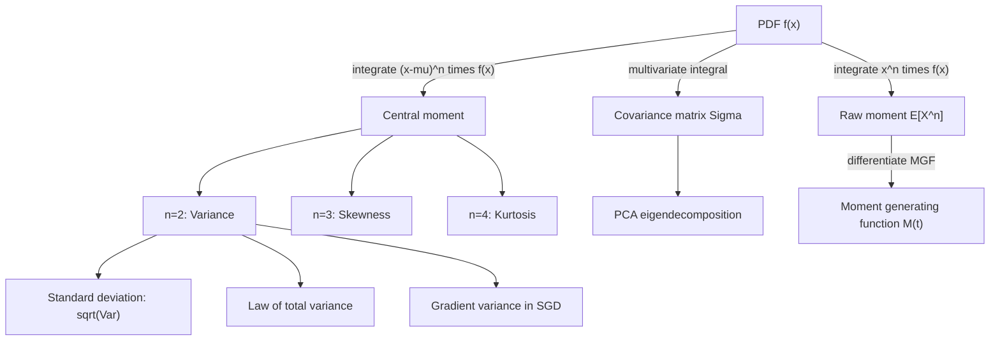

## Variance and Moments via Integration

### Definition of Variance

For a continuous random variable $X$ with density $f(x)$ and $E[X] = \mu$, variance is defined as:

$$\text{Var}(X) = E[(X-\mu)^2] = \int_{-\infty}^{\infty} (x-\mu)^2 f(x) \, dx$$

This is a standard, confirmed definition in probability theory, valid whenever the integral converges.

**Key Points**
- Variance requires $E[X^2]$ to be finite; if it is not, variance is undefined.
- Variance is always nonnegative, since the integrand $(x-\mu)^2 f(x) \geq 0$ everywhere.
- Variance equals zero only for a degenerate distribution concentrated entirely at a single point.

### Computational (Shortcut) Formula

Expanding the square inside the integral gives an alternative, algebraically equivalent form:

$$\text{Var}(X) = E[X^2] - (E[X])^2$$

**Derivation:**

$$\text{Var}(X) = \int (x-\mu)^2 f(x)\,dx = \int (x^2 - 2\mu x + \mu^2) f(x)\,dx$$

$$= \int x^2 f(x)\,dx - 2\mu \int x f(x)\,dx + \mu^2 \int f(x)\,dx = E[X^2] - 2\mu \cdot \mu + \mu^2 \cdot 1 = E[X^2]-\mu^2$$

This derivation uses only linearity of integration and the definitions $E[X]=\mu$, $\int f(x)\,dx=1$. It is a confirmed algebraic identity, not an inference.

**Example**

Let $f(x) = 2x$ on $[0,1]$. From the prior topic, $E[X] = \int_0^1 x(2x)\,dx = \int_0^1 2x^2\,dx = \frac{2}{3}$.

$$E[X^2] = \int_0^1 x^2(2x)\,dx = \int_0^1 2x^3\,dx = \left[\frac{x^4}{2}\right]_0^1 = \frac{1}{2}$$

$$\text{Var}(X) = \frac{1}{2} - \left(\frac{2}{3}\right)^2 = \frac{1}{2} - \frac{4}{9} = \frac{9}{18}-\frac{8}{18} = \frac{1}{18}$$

**Output**

$$\text{Var}(X) = \frac{1}{18}$$

<svg xmlns="http://www.w3.org/2000/svg" viewBox="0 0 700 320">
  <text x="350" y="25" font-size="15" font-weight="bold" text-anchor="middle" fill="#222">Variance as Spread Around the Mean (svg_diagram)</text>

  <line x1="60" y1="240" x2="640" y2="240" stroke="#333" stroke-width="1.5" />
  <text x="640" y="258" font-size="12" fill="#333">x</text>

  <path d="M 60 240 C 150 240, 220 90, 350 80 C 480 90, 550 240, 640 240" fill="none" stroke="#2266aa" stroke-width="2" />

  <line x1="350" y1="240" x2="350" y2="80" stroke="#cc7a1e" stroke-width="1.5" stroke-dasharray="4,3" />
  <text x="350" y="264" font-size="12" text-anchor="middle" fill="#994c00">mu = E[X]</text>

  <line x1="250" y1="200" x2="450" y2="200" stroke="#2a8c4a" stroke-width="2" />
  <line x1="250" y1="194" x2="250" y2="206" stroke="#2a8c4a" stroke-width="2" />
  <line x1="450" y1="194" x2="450" y2="206" stroke="#2a8c4a" stroke-width="2" />
  <text x="350" y="188" font-size="12" text-anchor="middle" fill="#1a6b32">spread ~ sigma</text>

  <text x="350" y="300" font-size="12.5" text-anchor="middle" fill="#333">Var(X) measures average squared distance of x from mu, weighted by f(x)</text>
</svg>

### Standard Deviation

$$\sigma = \sqrt{\text{Var}(X)}$$

Standard deviation restores the original units of $X$ (variance is in squared units), which makes it more directly interpretable alongside the mean in most applied contexts.

### General Moments

The **$n$-th raw moment** about the origin:

$$\mu_n' = E[X^n] = \int_{-\infty}^{\infty} x^n f(x)\,dx$$

The **$n$-th central moment** about the mean:

$$\mu_n = E[(X-\mu)^n] = \int_{-\infty}^{\infty} (x-\mu)^n f(x)\,dx$$

By these definitions: $\mu_1 = 0$ always (central moment about the mean is always zero for $n=1$), $\mu_2 = \text{Var}(X)$. These are standard, confirmed definitions used throughout probability theory.

**Key Points**
- The **third central moment** relates to skewness: $\text{Skew}(X) = \mu_3/\sigma^3$, measuring asymmetry of the distribution.
- The **fourth central moment** relates to kurtosis: $\text{Kurt}(X) = \mu_4/\sigma^4$, measuring tail heaviness relative to a normal distribution (excess kurtosis subtracts 3, the normal distribution's baseline value).
- Not all distributions have finite moments beyond a certain order — e.g., the Student's t-distribution with $\nu$ degrees of freedom has moments only up to order $\nu - 1$. This is a confirmed property of that distribution family.

### Variance of the Gaussian Distribution

For $f(x) = \frac{1}{\sigma\sqrt{2\pi}}\exp\left(-\frac{(x-\mu)^2}{2\sigma^2}\right)$, direct integration confirms:

$$\text{Var}(X) = \int_{-\infty}^{\infty} (x-\mu)^2 \frac{1}{\sigma\sqrt{2\pi}} e^{-(x-\mu)^2/2\sigma^2}\,dx = \sigma^2$$

**Derivation sketch:** substitute $u = (x-\mu)/\sigma$, reducing the integral to $\sigma^2 \int_{-\infty}^{\infty} u^2 \frac{1}{\sqrt{2\pi}} e^{-u^2/2}\,du$, then apply integration by parts with $dv = u e^{-u^2/2}du$, $w=u$, using the Gaussian integral identity from the earlier topic on integrals in probability density functions. This is a standard, confirmed derivation found in probability textbooks.

### Multivariate Case: Covariance Matrix

For a random vector $\mathbf{X} \in \mathbb{R}^n$ with mean vector $\boldsymbol{\mu}$, the covariance matrix is defined entrywise via integrals:

$$\Sigma_{ij} = \text{Cov}(X_i, X_j) = \int (x_i - \mu_i)(x_j - \mu_j)\, f(\mathbf{x}) \, d\mathbf{x}$$

In matrix form:

$$\Sigma = E\big[(\mathbf{X}-\boldsymbol{\mu})(\mathbf{X}-\boldsymbol{\mu})^T\big] = \int (\mathbf{x}-\boldsymbol{\mu})(\mathbf{x}-\boldsymbol{\mu})^T f(\mathbf{x}) \, d\mathbf{x}$$

**Key Points**
- $\Sigma$ is symmetric by construction, since $\Sigma_{ij} = \Sigma_{ji}$ follows directly from the definition.
- $\Sigma$ is positive semi-definite: for any vector $\mathbf{a}$, $\mathbf{a}^T \Sigma \mathbf{a} = \text{Var}(\mathbf{a}^T\mathbf{X}) \geq 0$. This follows because variance of any linear combination cannot be negative.
- Diagonal entries $\Sigma_{ii}$ are the individual variances; off-diagonal entries capture linear dependence between components.

### Moment Generating Function Approach to Moments

Recall from the prior topic that $M_X(t) = E[e^{tX}] = \int e^{tx} f(x)\,dx$. Moments can be extracted via differentiation:

$$\mu_n' = \left.\frac{d^n}{dt^n} M_X(t)\right|_{t=0}$$

**Example**

For the standard normal, $M_X(t) = e^{t^2/2}$ (a confirmed, standard result derivable by completing the square inside the defining integral). Then:

$$M_X'(t) = t\,e^{t^2/2} \implies M_X'(0) = 0 = E[X]$$

$$M_X''(t) = e^{t^2/2} + t^2 e^{t^2/2} \implies M_X''(0) = 1 = E[X^2]$$

$$\text{Var}(X) = E[X^2]-(E[X])^2 = 1-0=1$$

**Output**

$$\text{Var}(X) = 1 \text{ for the standard normal, consistent with } \sigma^2=1$$

### Law of Total Variance

For random variables $X, Y$:

$$\text{Var}(Y) = E\big[\text{Var}(Y\mid X)\big] + \text{Var}\big(E[Y\mid X]\big)$$

This decomposes total variance into an expected within-group variance and a between-group variance of conditional means. It is a confirmed, standard identity, derivable using the definitions of conditional expectation and conditional variance from the prior topic on expectation as an integral, combined with the law of total expectation.

**Key Points**
- This decomposition underlies bias-variance-style reasoning in hierarchical and mixture models.
- [Inference] This identity is commonly invoked when analyzing variance contributions in hierarchical Bayesian models, though the specific way it is applied depends on the model structure in question, and I cannot verify its application in any unspecified specific system without more context.

### Relevance to Machine Learning

**Loss function variance.** In stochastic gradient-based optimization, the variance of the gradient estimator affects convergence behavior:

$$\text{Var}\left(\frac{1}{N}\sum_{i=1}^N \nabla \ell(x_i,\theta)\right) = \frac{1}{N^2}\sum_{i=1}^N \text{Var}(\nabla \ell(x_i,\theta)) \quad \text{(under independence)}$$

[Inference] Lower gradient variance is generally associated with more stable optimization trajectories in the stochastic gradient descent literature, though the precise relationship between variance and convergence speed depends on the optimizer, learning rate schedule, and loss landscape, and I cannot verify a universal quantitative relationship without reference to a specific theorem and its assumptions.

**Regularization and moment matching.** Some generative modeling approaches (e.g., moment matching networks) explicitly match empirical moments (mean, variance, higher moments) between generated and real data distributions as part of the training objective. [Unverified] I do not have access to a comprehensive current list of which specific architectures use this technique, so no claim is made about how widespread this approach currently is.

**Uncertainty quantification.** Predictive variance, computed as an integral over a posterior predictive distribution, is used in Bayesian ML to express confidence in model outputs:

$$\text{Var}(y^* \mid x^*, D) = \int (y^*-E[y^*\mid x^*,D])^2 \, p(y^*\mid x^*,D)\,dy^*$$

**Covariance matrices in PCA.** Principal Component Analysis relies on the eigendecomposition of the covariance matrix $\Sigma$, defined via the multivariate integral above (or its empirical/discrete estimator on finite data). This is a confirmed, standard basis of the PCA method.

### Common Pitfalls

- Using the shortcut formula $E[X^2]-(E[X])^2$ with insufficient numerical precision, leading to catastrophic cancellation when $E[X^2]$ and $(E[X])^2$ are close in value; the direct definitional form can be more numerically stable in such cases.
- Assuming variance is always finite; heavy-tailed distributions (e.g., certain Pareto or Cauchy-family distributions) may have undefined or infinite variance.
- Confusing the covariance matrix $\Sigma$ with a correlation matrix; correlation is a normalized version of covariance ($\rho_{ij} = \Sigma_{ij}/(\sigma_i\sigma_j)$) and is not identical to it.
- Assuming independence when applying variance-of-sum formulas; $\text{Var}(X+Y) = \text{Var}(X)+\text{Var}(Y)$ only holds generally when $\text{Cov}(X,Y)=0$, which independence guarantees but which can also occur without full independence.

### Diagram: Moments Hierarchy

**Related Topics**
- Expectation as an integral (prerequisite, prior topic)
- Probability density functions and cumulative distribution functions (prerequisite)
- Covariance matrices and Principal Component Analysis
- Moment generating functions and characteristic functions
- Law of total variance and hierarchical models
- Bias-variance tradeoff in statistical learning
- Uncertainty quantification in Bayesian machine learning