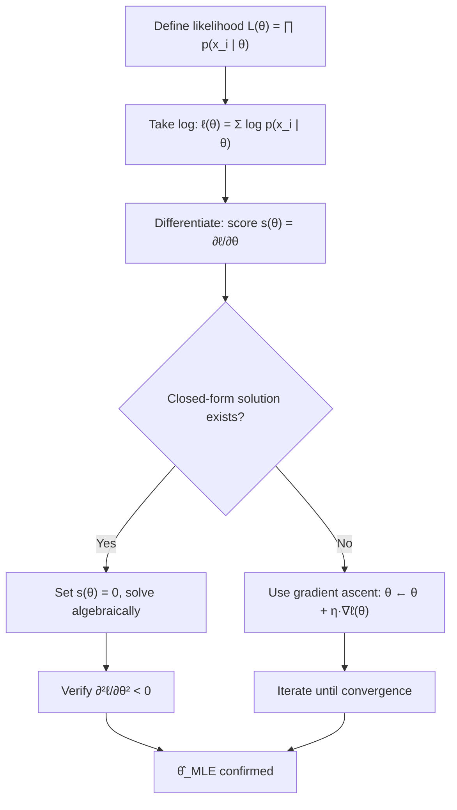

## Maximum Likelihood Estimation and Derivatives

### Conceptual Foundation

Maximum likelihood estimation (MLE) is a method for choosing parameters $\theta$ of a probability model so that the observed data has the highest possible probability (or probability density) under that model. Given a dataset $\{x_1, x_2, \dots, x_n\}$ assumed independently and identically distributed (i.i.d.) from a distribution $p(x \mid \theta)$, the likelihood function is:

$$L(\theta) = \prod_{i=1}^{n} p(x_i \mid \theta)$$

The goal is to find:

$$\hat{\theta}_{MLE} = \arg\max_{\theta} L(\theta)$$

**Key Points**
- MLE reframes a statistical estimation problem as a calculus optimization problem — this is the direct bridge between probability/statistics and differential calculus in ML.
- The parameters $\theta$ could represent a mean and variance (Gaussian), a probability of success (Bernoulli), or weights in a regression model.
- Products of probabilities shrink very quickly toward zero as $n$ grows, which creates numerical underflow — this motivates the log transform discussed next.

### Why the Log-Likelihood Is Used

Since $\log$ is a strictly increasing function, maximizing $L(\theta)$ is equivalent to maximizing $\log L(\theta)$, but the log converts a product into a sum, which is far easier to differentiate:

$$\ell(\theta) = \log L(\theta) = \sum_{i=1}^{n} \log p(x_i \mid \theta)$$

**Key Points**
- Differentiating a sum term-by-term is mechanically simpler than applying the product rule repeatedly across $n$ factors.
- Sums are numerically stable in floating-point computation; products of many small probabilities are not. [Inference] — this follows from standard floating-point behavior, though exact underflow thresholds depend on the numerical library and data type in use, and I cannot verify library-specific behavior without inspecting that library directly.

### The Score Function

The derivative of the log-likelihood with respect to $\theta$ is called the **score function**:

$$s(\theta) = \frac{\partial \ell(\theta)}{\partial \theta} = \sum_{i=1}^{n} \frac{\partial}{\partial \theta} \log p(x_i \mid \theta)$$

Setting the score function to zero and solving for $\theta$ gives the critical point(s) of the log-likelihood:

$$s(\hat{\theta}) = 0$$

**Key Points**
- This is a direct application of first-derivative optimization: critical points occur where the gradient (or derivative, in 1D) vanishes.
- A zero of the score function is a candidate for a maximum, minimum, or saddle point — the second derivative test (below) is required to confirm it is a maximum.

### Second-Order Condition: Confirming a Maximum

To confirm a critical point $\hat{\theta}$ is a maximum (not a minimum or saddle point), the second derivative of the log-likelihood must be negative:

$$\frac{\partial^2 \ell(\theta)}{\partial \theta^2} \Big|_{\theta = \hat{\theta}} < 0$$

This connects to the **Fisher Information**, defined as:

$$I(\theta) = -\mathbb{E}\left[\frac{\partial^2}{\partial \theta^2} \log p(x \mid \theta)\right]$$

**Key Points**
- Fisher Information quantifies how sharply peaked the log-likelihood is around $\hat{\theta}$ — a sharper peak (higher curvature magnitude) implies the estimator is more precise.
- In multivariate settings, this generalizes to the Hessian matrix, and the maximum condition becomes: the Hessian is negative semi-definite at $\hat{\theta}$.
- Fisher Information underlies the Cramér–Rao lower bound, which describes a theoretical minimum variance for unbiased estimators. [Unverified] — the exact bound value and its applicability conditions depend on regularity assumptions specific to the distribution family being used, and I cannot verify those hold generally without the specific model in question.

<svg xmlns="http://www.w3.org/2000/svg" viewBox="0 0 700 420">
  <text x="350" y="30" font-size="18" font-weight="bold" text-anchor="middle" fill="#1a1a1a">Log-Likelihood Curve and Critical Point (svg_diagram)</text>
  
  
  <line x1="80" y1="360" x2="650" y2="360" stroke="#333" stroke-width="2" />
  <line x1="80" y1="360" x2="80" y2="60" stroke="#333" stroke-width="2" />
  <text x="660" y="365" font-size="14" fill="#333">θ</text>
  <text x="55" y="65" font-size="14" fill="#333">ℓ(θ)</text>

  
  <path d="M 120 340 Q 350 60 580 340" stroke="#2b6cb0" stroke-width="3" fill="none" />

  
  <circle cx="350" cy="95" r="6" fill="#c0392b" />
  <line x1="350" y1="95" x2="350" y2="360" stroke="#c0392b" stroke-width="1.5" stroke-dasharray="5,4" />
  <text x="330" y="385" font-size="14" fill="#c0392b" font-weight="bold">θ̂ (MLE)</text>

  
  <line x1="270" y1="95" x2="430" y2="95" stroke="#27ae60" stroke-width="2" stroke-dasharray="3,3" />
  <text x="440" y="90" font-size="13" fill="#27ae60">slope = 0 (score = 0)</text>

  
  <text x="120" y="150" font-size="13" fill="#555">Concave down region</text>
  <text x="120" y="170" font-size="13" fill="#555">(second derivative &lt; 0)</text>

  
  <text x="140" y="320" font-size="12" fill="#7f8c8d">slope &gt; 0</text>
  <text x="540" y="320" font-size="12" fill="#7f8c8d">slope &lt; 0</text>
</svg>

### Worked Example: MLE for a Gaussian Mean

Suppose $x_1, \dots, x_n$ are i.i.d. samples from $\mathcal{N}(\mu, \sigma^2)$ with known $\sigma^2$. The probability density is:

$$p(x_i \mid \mu) = \frac{1}{\sqrt{2\pi\sigma^2}} \exp\left(-\frac{(x_i - \mu)^2}{2\sigma^2}\right)$$

The log-likelihood is:

$$\ell(\mu) = -\frac{n}{2} \log(2\pi\sigma^2) - \frac{1}{2\sigma^2} \sum_{i=1}^{n} (x_i - \mu)^2$$

Taking the derivative with respect to $\mu$:

$$\frac{\partial \ell}{\partial \mu} = \frac{1}{\sigma^2} \sum_{i=1}^{n} (x_i - \mu)$$

Setting this to zero:

$$\sum_{i=1}^{n} (x_i - \mu) = 0 \quad \Rightarrow \quad \hat{\mu} = \frac{1}{n} \sum_{i=1}^{n} x_i$$

**Output**
The MLE for the Gaussian mean is exactly the sample mean $\hat{\mu} = \bar{x}$. Confirming this is a maximum: $\frac{\partial^2 \ell}{\partial \mu^2} = -\frac{n}{\sigma^2} < 0$, satisfying the second-order condition.

### Worked Example: MLE for Bernoulli Probability

For a binary outcome $x_i \in \{0, 1\}$ with $p(x_i \mid \theta) = \theta^{x_i}(1-\theta)^{1-x_i}$, the log-likelihood is:

$$\ell(\theta) = \sum_{i=1}^{n} \left[x_i \log \theta + (1 - x_i)\log(1 - \theta)\right]$$

Differentiating:

$$\frac{\partial \ell}{\partial \theta} = \sum_{i=1}^{n} \left[\frac{x_i}{\theta} - \frac{1 - x_i}{1 - \theta}\right]$$

Setting to zero and solving:

$$\hat{\theta} = \frac{1}{n}\sum_{i=1}^{n} x_i$$

**Output**
The MLE for a Bernoulli parameter equals the sample proportion of successes.

### Gradient-Based MLE for Models Without Closed Form

Many ML models — logistic regression, neural networks, mixture models — have log-likelihoods with no closed-form maximum. Instead, the score function is used inside iterative gradient-based optimization:

$$\theta_{t+1} = \theta_t + \eta \, \nabla_\theta \ell(\theta_t)$$

This is **gradient ascent** on the log-likelihood, equivalent to gradient descent on the negative log-likelihood (NLL), which is the standard loss function formulation used in most ML training loops:

$$\text{NLL}(\theta) = -\ell(\theta)$$

**Key Points**
- Cross-entropy loss in classification is a direct instance of negative log-likelihood under a categorical or Bernoulli model.
- Mean squared error loss in regression corresponds to the negative log-likelihood under a Gaussian noise assumption with fixed variance. [Inference] — this equivalence is a standard derivation in statistical ML literature, though I cannot verify without the specific textbook or paper being cited that this framing is used identically across all sources.
- In practice, second-order methods (Newton-Raphson) use the Hessian of the log-likelihood, while first-order methods (SGD, Adam) rely only on the gradient.

### Multivariate Case: Gradient and Hessian

When $\theta$ is a vector (e.g., regression weights $\mathbf{w}$), the score function becomes the gradient vector:

$$\nabla_\theta \ell(\theta) = \left[\frac{\partial \ell}{\partial \theta_1}, \frac{\partial \ell}{\partial \theta_2}, \dots, \frac{\partial \ell}{\partial \theta_k}\right]^\top$$

and the second-order condition uses the Hessian matrix $H$:

$$H_{ij} = \frac{\partial^2 \ell}{\partial \theta_i \partial \theta_j}$$

A critical point is a maximum when $H$ is negative semi-definite (all eigenvalues $\leq 0$).

**Key Points**
- This is the direct multivariable extension of the single-variable second derivative test, drawing on eigenvalue analysis from linear algebra.
- Newton-Raphson updates for MLE use the Hessian directly: $\theta_{t+1} = \theta_t - H^{-1} \nabla_\theta \ell(\theta_t)$.
- Computing and inverting the Hessian is computationally expensive for high-dimensional models, which is a primary reason first-order methods dominate large-scale ML training. [Inference] — this is a widely cited rationale in optimization literature, but relative cost tradeoffs depend on model size and hardware, so I cannot verify this holds as a fixed rule across every architecture.

### Relationship to Loss Functions in ML Training

| Model Assumption | Negative Log-Likelihood Form | Common Name |
|---|---|---|
| Gaussian noise, fixed variance | $\frac{1}{2}\sum (y_i - f(x_i))^2 + \text{const}$ | Mean Squared Error |
| Bernoulli output | $-\sum [y_i \log \hat{y}_i + (1-y_i)\log(1-\hat{y}_i)]$ | Binary Cross-Entropy |
| Categorical output | $-\sum \sum_k y_{ik} \log \hat{y}_{ik}$ | Categorical Cross-Entropy |
| Laplace noise | $\sum |y_i - f(x_i)|$ | Mean Absolute Error |

**Key Points**
- This table shows why "loss functions" in deep learning are not arbitrary — they are typically derived from an assumed noise or output distribution via MLE.
- Choosing a different noise assumption directly changes the derivative structure used during backpropagation.

### Conclusion

Maximum likelihood estimation converts a statistical inference problem into a calculus optimization problem, using first derivatives to locate critical points of the log-likelihood and second derivatives (or the Hessian, in higher dimensions) to confirm those points are maxima. This differentiation machinery — score functions, gradients, and Hessians — is the same machinery used throughout ML training, meaning loss functions such as MSE and cross-entropy are not independently invented but are direct consequences of applying MLE under specific distributional assumptions.

**Related Topics**
- Bayesian estimation and Maximum A Posteriori (MAP) — adding a prior term and its derivative to the log-likelihood
- Expectation-Maximization (EM) algorithm and its use of derivatives under latent variables
- Newton-Raphson and Fisher scoring for iterative MLE optimization
- Cramér-Rao lower bound and estimator efficiency
- Multivariate Hessian analysis and positive/negative definiteness in optimization
- Backpropagation as gradient computation for cross-entropy and MSE loss
- Regularization terms (L1/L2) as penalty additions to the negative log-likelihood