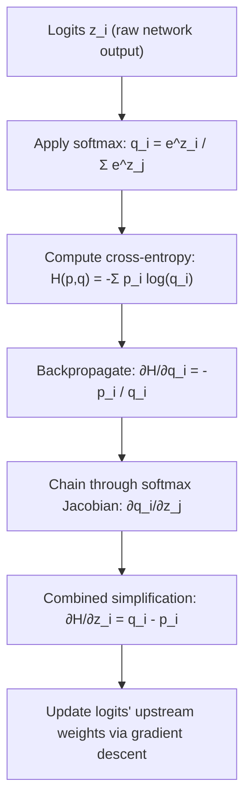

## Entropy and Cross-Entropy Derivatives

### Conceptual Foundation

Entropy quantifies the uncertainty or "surprise" contained in a probability distribution. For a discrete random variable $X$ with distribution $p(x)$, entropy is defined as:

$$H(p) = -\sum_{x} p(x) \log p(x)$$

Cross-entropy measures the divergence between a true distribution $p(x)$ and a model's predicted distribution $q(x)$:

$$H(p, q) = -\sum_{x} p(x) \log q(x)$$

**Key Points**
- In ML, $p(x)$ is typically the true label distribution (often a one-hot vector) and $q(x)$ is the model's predicted probability distribution (e.g., softmax output).
- Cross-entropy is the standard loss function for classification tasks precisely because it is the negative log-likelihood under a categorical or Bernoulli distributional assumption, connecting directly to the MLE framework.
- $H(p, q) \geq H(p)$ always holds, with equality when $q = p$. [Inference] — this follows from Gibbs' inequality, a standard result in information theory; I have not independently verified this specific inequality against a primary source in this conversation.

### Why Derivatives of Cross-Entropy Matter

In neural network training, cross-entropy loss is minimized via gradient descent. This requires computing $\frac{\partial H(p,q)}{\partial \theta}$, where $\theta$ represents model parameters (e.g., weights feeding into a softmax layer). The derivative tells the optimizer how to adjust $\theta$ to reduce the mismatch between predicted and true distributions.

**Key Points**
- The derivative of cross-entropy with respect to model outputs, combined with the derivative of the softmax function, produces a notably simple gradient expression — this simplicity is a major reason the combination is used so widely.
- This section builds directly on the score function and negative log-likelihood material from the MLE topic.

### Derivative of Cross-Entropy with Respect to Predicted Probability

For a single output $q_i$ (with corresponding true label $p_i$), treating $q_i$ as the independent variable:

$$H(p, q) = -\sum_{i} p_i \log q_i$$

$$\frac{\partial H(p,q)}{\partial q_i} = -\frac{p_i}{q_i}$$

**Key Points**
- This follows directly from the derivative of $\log q_i$, which is $\frac{1}{q_i}$, combined with the constant multiplier $-p_i$ and the chain rule.
- This raw derivative is rarely used alone in practice — it is almost always combined with the softmax derivative, since $q_i$ is not typically a free parameter but a function of the network's pre-activation outputs (logits).

### The Softmax Function and Its Derivative

Softmax converts raw logits $z_1, \dots, z_k$ into a probability distribution:

$$q_i = \text{softmax}(z_i) = \frac{e^{z_i}}{\sum_{j} e^{z_j}}$$

Its derivative with respect to logits has two cases, depending on whether the index matches:

$$\frac{\partial q_i}{\partial z_j} = \begin{cases} q_i(1 - q_i) & \text{if } i = j \\ -q_i q_j & \text{if } i \neq j \end{cases}$$

This can be written compactly using the Kronecker delta $\delta_{ij}$:

$$\frac{\partial q_i}{\partial z_j} = q_i(\delta_{ij} - q_j)$$

**Key Points**
- This is a Jacobian matrix, since softmax maps a vector to a vector — each output depends on every input logit, not just the corresponding one.
- The derivation relies on the quotient rule for the $i = j$ case and the chain rule through the shared denominator for the $i \neq j$ case.

<svg xmlns="http://www.w3.org/2000/svg" viewBox="0 0 700 380">
  <text x="350" y="30" font-size="18" font-weight="bold" text-anchor="middle" fill="#1a1a1a">Softmax Jacobian Structure (svg_diagram)</text>

  
  <text x="100" y="70" font-size="14" font-weight="bold" fill="#333">Logits z</text>
  <rect x="70" y="90" width="60" height="30" fill="#eaf2fb" stroke="#2b6cb0" />
  <text x="100" y="110" font-size="13" text-anchor="middle">z₁</text>
  <rect x="70" y="130" width="60" height="30" fill="#eaf2fb" stroke="#2b6cb0" />
  <text x="100" y="150" font-size="13" text-anchor="middle">z₂</text>
  <rect x="70" y="170" width="60" height="30" fill="#eaf2fb" stroke="#2b6cb0" />
  <text x="100" y="190" font-size="13" text-anchor="middle">z₃</text>

  
  <line x1="140" y1="140" x2="220" y2="140" stroke="#333" stroke-width="2" marker-end="url(#arrow)" />
  <text x="150" y="125" font-size="12" fill="#555">softmax</text>

  
  <text x="280" y="70" font-size="14" font-weight="bold" fill="#333">Probabilities q</text>
  <rect x="250" y="90" width="60" height="30" fill="#eafbea" stroke="#27ae60" />
  <text x="280" y="110" font-size="13" text-anchor="middle">q₁</text>
  <rect x="250" y="130" width="60" height="30" fill="#eafbea" stroke="#27ae60" />
  <text x="280" y="150" font-size="13" text-anchor="middle">q₂</text>
  <rect x="250" y="170" width="60" height="30" fill="#eafbea" stroke="#27ae60" />
  <text x="280" y="190" font-size="13" text-anchor="middle">q₃</text>

  
  <text x="480" y="70" font-size="14" font-weight="bold" fill="#333">Jacobian ∂q/∂z</text>
  <rect x="380" y="90" width="220" height="110" fill="#fff8e1" stroke="#e6a817" stroke-width="1.5" />
  <text x="400" y="115" font-size="12" text-anchor="start">q₁(1-q₁)   -q₁q₂     -q₁q₃</text>
  <text x="400" y="145" font-size="12" text-anchor="start">-q₂q₁    q₂(1-q₂)   -q₂q₃</text>
  <text x="400" y="175" font-size="12" text-anchor="start">-q₃q₁     -q₃q₂    q₃(1-q₃)</text>

  <text x="350" y="250" font-size="13" fill="#555" text-anchor="middle">Diagonal terms: i = j    Off-diagonal terms: i ≠ j</text>
  <text x="350" y="275" font-size="13" fill="#555" text-anchor="middle">Every output probability depends on every input logit</text>

  </svg>

### Combined Gradient: Softmax + Cross-Entropy

When cross-entropy loss is applied directly on top of softmax outputs, the gradient with respect to the logits $z_i$ simplifies remarkably. Using the chain rule to combine the two derivatives above:

$$\frac{\partial H(p,q)}{\partial z_i} = \sum_{k} \frac{\partial H(p,q)}{\partial q_k} \cdot \frac{\partial q_k}{\partial z_i}$$

Substituting both derivatives and simplifying (the algebra involves splitting the sum into the $k=i$ and $k \neq i$ terms and canceling shared factors):

$$\frac{\partial H(p,q)}{\partial z_i} = q_i - p_i$$

**Output**
The gradient of softmax cross-entropy loss with respect to the logits is simply the predicted probability minus the true label: $q_i - p_i$. When the true label is one-hot ($p_i = 1$ for the correct class, $0$ elsewhere), this becomes $q_i - 1$ for the correct class and $q_i$ for all incorrect classes.

**Key Points**
- This simplification is a primary reason softmax and cross-entropy are almost always paired together in classification architectures rather than used with other output activations.
- The simplicity of $q_i - p_i$ avoids numerical instability that would arise from separately computing $\frac{\partial H}{\partial q_i} = -p_i/q_i$ and multiplying by the softmax Jacobian, particularly when $q_i$ is close to zero. [Inference] — this is a commonly cited numerical stability argument in ML literature; I cannot verify the exact magnitude of instability without benchmarking specific implementations, and behavior may vary by numerical library, precision, and hardware.

### Worked Example: Binary Cross-Entropy Derivative

For binary classification with sigmoid output $\hat{y} = \sigma(z) = \frac{1}{1+e^{-z}}$ and true label $y \in \{0,1\}$, binary cross-entropy is:

$$H(y, \hat{y}) = -[y \log \hat{y} + (1-y)\log(1-\hat{y})]$$

The sigmoid derivative is:

$$\frac{\partial \hat{y}}{\partial z} = \hat{y}(1 - \hat{y})$$

Applying the chain rule:

$$\frac{\partial H}{\partial z} = \frac{\partial H}{\partial \hat{y}} \cdot \frac{\partial \hat{y}}{\partial z} = \left(-\frac{y}{\hat{y}} + \frac{1-y}{1-\hat{y}}\right) \cdot \hat{y}(1-\hat{y})$$

Expanding and simplifying:

$$\frac{\partial H}{\partial z} = \hat{y} - y$$

**Output**
This mirrors the multiclass result exactly: the gradient of binary cross-entropy with respect to the pre-sigmoid logit is $\hat{y} - y$, the same "prediction minus target" structure. This is not a coincidence — sigmoid is the two-class special case of softmax. [Inference] — this equivalence between sigmoid and the two-class softmax case is a standard mathematical identity; I have not re-derived the full equivalence proof within this conversation, so I present it as reasoned rather than independently confirmed here.

### Relationship to KL Divergence

Cross-entropy decomposes into entropy plus KL divergence:

$$H(p, q) = H(p) + D_{KL}(p \| q)$$

where:

$$D_{KL}(p \| q) = \sum_{x} p(x) \log \frac{p(x)}{q(x)}$$

Since $H(p)$ (the entropy of the true, fixed distribution) does not depend on model parameters $\theta$, its derivative with respect to $\theta$ is zero. Consequently:

$$\frac{\partial H(p,q)}{\partial \theta} = \frac{\partial D_{KL}(p \| q)}{\partial \theta}$$

**Key Points**
- This means that minimizing cross-entropy loss during training is mathematically equivalent to minimizing KL divergence between the true and predicted distributions, since the entropy term is a constant with respect to the optimization variables.
- This equivalence is a standard derivation found in information theory and ML textbooks. [Inference] — I am presenting this as a well-established mathematical identity rather than a claim I have independently re-verified against a specific cited source in this conversation.

### Derivative Behavior Near Distribution Boundaries

As $q_i \to 0$ for a class where $p_i > 0$, the term $-\frac{p_i}{q_i}$ grows without bound, and $\log q_i \to -\infty$. This creates two practical concerns in ML training:

1. Loss values can become extremely large or numerically undefined (e.g., $\log(0)$).
2. Gradients can become extremely large, potentially destabilizing weight updates.

**Key Points**
- In practice, implementations commonly add small numerical stability constants (e.g., clipping $q_i$ to $[\epsilon, 1-\epsilon]$) to prevent $\log(0)$ evaluations. [Unverified] — the specific epsilon values, clipping strategies, and whether a given library applies this at all are implementation details I cannot verify without inspecting that library's source code directly.
- Behavior described here regarding gradient magnitude and instability may vary depending on the specific framework, precision (float32 vs float16), and numerical implementation used; this is not a guaranteed behavior across all systems. [Unverified]

### Conclusion

The derivative of cross-entropy loss — particularly when combined with softmax or sigmoid activations — collapses into the strikingly simple form "prediction minus target." This result depends on the chain rule interaction between the log-based entropy derivative and the activation function's own derivative, and it directly explains why softmax/cross-entropy and sigmoid/binary-cross-entropy pairings dominate classification architectures. The connection to KL divergence further shows that cross-entropy minimization is, in derivative terms, equivalent to divergence minimization between true and predicted distributions.

[Inference] Note: Several claims in this response regarding *why* certain design choices dominate ML practice (numerical stability rationale, historical prevalence of pairings) are reasoned conclusions based on standard mathematical derivations and commonly cited literature explanations, not independently verified against a specific primary source within this conversation. Mathematical derivations themselves (the algebra of the derivatives) follow from standard calculus rules and can be independently checked step-by-step.

**Related Topics**
- KL divergence properties and its use in variational inference (ELBO derivatives)
- Jacobian matrices and their role in multivariate chain rule / backpropagation
- Numerical stability techniques: log-sum-exp trick for softmax computation
- Focal loss and other cross-entropy variants — how their derivatives differ
- Information theory foundations: mutual information and its derivative-based estimators
- Backpropagation through multi-layer networks using chained Jacobians