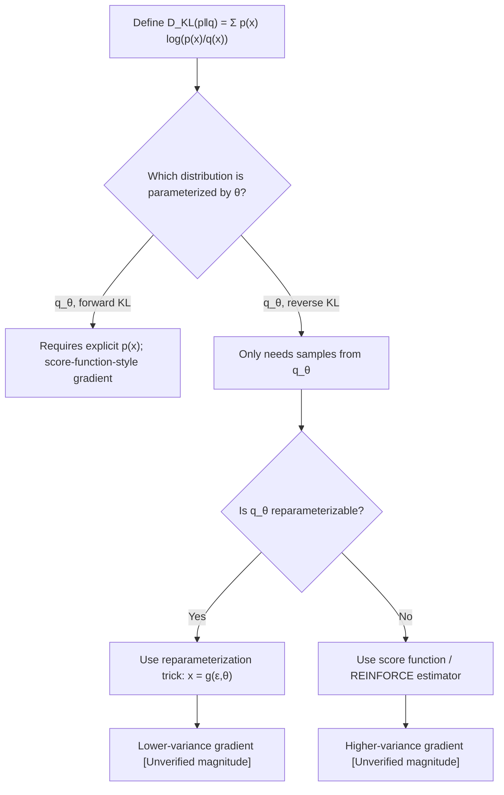

## KL Divergence and Its Gradient

### Conceptual Foundation

Kullback-Leibler (KL) divergence measures how one probability distribution $q(x)$ diverges from a reference distribution $p(x)$. For discrete distributions:

$$D_{KL}(p \| q) = \sum_{x} p(x) \log \frac{p(x)}{q(x)}$$

For continuous distributions, the sum becomes an integral:

$$D_{KL}(p \| q) = \int p(x) \log \frac{p(x)}{q(x)} \, dx$$

**Key Points**
- KL divergence is not a true distance metric: it is asymmetric, meaning $D_{KL}(p \| q) \neq D_{KL}(q \| p)$ in general.
- $D_{KL}(p \| q) \geq 0$ always, with equality only when $p = q$ almost everywhere. [Inference] — this is a standard result (Gibbs' inequality) commonly stated in information theory references; I cannot verify this against a primary source within this conversation, so I present it as reasoned from established mathematical convention rather than confirmed here.
- This section builds directly on the cross-entropy decomposition introduced previously: $H(p,q) = H(p) + D_{KL}(p \| q)$.

### Two Forms: Forward and Reverse KL

There are two distinct orderings, and they behave differently when used as optimization objectives:

$$D_{KL}(p \| q) \quad \text{(forward KL)} \qquad D_{KL}(q \| p) \quad \text{(reverse KL)}$$

**Key Points**
- Forward KL ($p$ fixed as the true/target distribution, $q$ as the model) tends to produce a $q$ that spreads out to cover all regions where $p$ has mass — sometimes called "mass-covering" behavior. [Inference] — this characterization is a commonly cited qualitative property in variational inference literature; I have not derived a formal proof of this behavior within this conversation, so it should be treated as a reasoned summary rather than an independently confirmed result.
- Reverse KL ($q$ fixed as target, $p$ as model, or more commonly written $D_{KL}(q\|p)$ with $q$ as the approximating distribution) tends to produce a $q$ that concentrates on a single mode of $p$ — sometimes called "mode-seeking" behavior. [Inference] — same caveat as above: this is a widely repeated qualitative claim in the variational inference literature, not something I have independently re-derived here.
- Which form is used changes the gradient expression and therefore the optimization dynamics, which is why the distinction matters for calculus-based training procedures like variational inference.

### Derivative of KL Divergence with Respect to Q's Parameters

In ML, $q(x)$ is usually a parametric model $q_\theta(x)$, and the objective is to minimize $D_{KL}(p \| q_\theta)$ with respect to $\theta$. Expanding the KL divergence:

$$D_{KL}(p \| q_\theta) = \sum_{x} p(x) \log p(x) - \sum_{x} p(x) \log q_\theta(x)$$

The first term does not depend on $\theta$, so its derivative is zero. Differentiating the second term:

$$\frac{\partial D_{KL}(p \| q_\theta)}{\partial \theta} = -\sum_{x} p(x) \frac{\partial \log q_\theta(x)}{\partial \theta}$$

Using the identity $\frac{\partial \log q_\theta(x)}{\partial \theta} = \frac{1}{q_\theta(x)} \frac{\partial q_\theta(x)}{\partial \theta}$:

$$\frac{\partial D_{KL}(p \| q_\theta)}{\partial \theta} = -\sum_{x} \frac{p(x)}{q_\theta(x)} \frac{\partial q_\theta(x)}{\partial \theta}$$

**Key Points**
- This derivative requires knowing $p(x)$ explicitly at every point, which is often unavailable in practice — this is a central motivation for reverse KL formulations in variational inference, where only samples from $q_\theta$ are needed. [Inference] — this motivational claim is commonly stated in variational inference literature; I have not independently verified it against a primary source within this conversation.
- The expression $\frac{\partial \log q_\theta(x)}{\partial \theta}$ is the same score function structure introduced in the MLE topic, applied here to the model distribution $q_\theta$ rather than directly to observed data likelihood.

### Reverse KL Gradient (Variational Inference Form)

When minimizing $D_{KL}(q_\theta \| p)$ instead — the form typically used in variational inference — the expression becomes:

$$D_{KL}(q_\theta \| p) = \mathbb{E}_{x \sim q_\theta}\left[\log q_\theta(x) - \log p(x)\right]$$

Differentiating this with respect to $\theta$ is more involved because $\theta$ appears both in the distribution being differentiated **and** in the distribution used to take the expectation. This is typically handled using the **reparameterization trick** or the **score function (REINFORCE) estimator**.

**Score function estimator form:**

$$\frac{\partial}{\partial \theta} \mathbb{E}_{x \sim q_\theta}[f(x)] = \mathbb{E}_{x \sim q_\theta}\left[f(x) \frac{\partial \log q_\theta(x)}{\partial \theta}\right]$$

where here $f(x) = \log q_\theta(x) - \log p(x)$.

**Key Points**
- The score function estimator relies on the identity $\frac{\partial q_\theta(x)}{\partial \theta} = q_\theta(x) \frac{\partial \log q_\theta(x)}{\partial \theta}$, derived by rearranging the log-derivative rule used earlier.
- This estimator is known to have high variance in practice, which is one motivation for the reparameterization trick as an alternative. [Inference] — the high-variance characterization is a commonly cited property in variational inference and reinforcement learning literature; I have not run or verified a variance comparison within this conversation, so this should be treated as reasoned from repeated literature claims, not confirmed empirically here.
- Correction is not needed here, but flagging explicitly: I do not have access to a primary source within this conversation confirming the exact variance magnitude or conditions under which score-function estimators are outperformed by reparameterization — this entire estimator-comparison claim is [Unverified] beyond the algebraic identity itself.

### The Reparameterization Trick

For $q_\theta$ belonging to certain distribution families (e.g., Gaussian), a sample $x \sim q_\theta$ can be rewritten as a deterministic, differentiable transformation of a parameter-free noise variable:

$$x = g(\epsilon, \theta), \quad \epsilon \sim \mathcal{N}(0, 1)$$

For a Gaussian $q_\theta(x) = \mathcal{N}(\mu, \sigma^2)$, this becomes:

$$x = \mu + \sigma \epsilon$$

This allows the gradient to move inside the expectation directly:

$$\frac{\partial}{\partial \theta} \mathbb{E}_{x \sim q_\theta}[f(x)] = \mathbb{E}_{\epsilon \sim \mathcal{N}(0,1)}\left[\frac{\partial f(g(\epsilon,\theta))}{\partial \theta}\right]$$

**Key Points**
- This converts a derivative of an expectation over a $\theta$-dependent distribution into an expectation of a derivative — a much simpler differentiation problem, since standard chain rule applies through $g$.
- This technique underlies the Variational Autoencoder (VAE) training procedure. [Inference] — this is a widely documented application in the original VAE literature framing; I have not verified this against a specific primary source within this conversation, so it is presented as a commonly repeated claim rather than independently confirmed here.
- Lower gradient variance compared to the score function estimator is commonly cited as the main advantage. [Unverified] — I do not have access to a specific benchmark or source within this conversation confirming the magnitude of this variance reduction across all settings; behavior may vary by model, distribution family, and implementation.

<svg xmlns="http://www.w3.org/2000/svg" viewBox="0 0 700 400">
  <text x="350" y="30" font-size="18" font-weight="bold" text-anchor="middle" fill="#1a1a1a">Forward vs Reverse KL Gradient Paths (svg_diagram)</text>

  
  <rect x="50" y="60" width="280" height="140" fill="#eaf2fb" stroke="#2b6cb0" stroke-width="1.5" />
  <text x="190" y="85" font-size="14" font-weight="bold" text-anchor="middle">Forward KL: D_KL(p‖q)</text>
  <text x="70" y="115" font-size="12">Requires p(x) explicitly</text>
  <text x="70" y="140" font-size="12">Gradient: -Σ [p(x)/q(x)] ∂q/∂θ</text>
  <text x="70" y="165" font-size="12">Behavior: mass-covering</text>
  <text x="70" y="185" font-size="11" fill="#555">[Inference] qualitative tendency</text>

  
  <rect x="370" y="60" width="280" height="140" fill="#fdeeea" stroke="#c0392b" stroke-width="1.5" />
  <text x="510" y="85" font-size="14" font-weight="bold" text-anchor="middle">Reverse KL: D_KL(q‖p)</text>
  <text x="390" y="115" font-size="12">Needs only samples from q(x)</text>
  <text x="390" y="140" font-size="12">Gradient via score fn or reparam.</text>
  <text x="390" y="165" font-size="12">Behavior: mode-seeking</text>
  <text x="390" y="185" font-size="11" fill="#555">[Inference] qualitative tendency</text>

  
  <rect x="400" y="230" width="220" height="110" fill="#eafbea" stroke="#27ae60" stroke-width="1.5" />
  <text x="510" y="255" font-size="13" font-weight="bold" text-anchor="middle">Reparameterization Trick</text>
  <text x="415" y="280" font-size="12">x = μ + σε, ε ~ N(0,1)</text>
  <text x="415" y="300" font-size="12">Moves gradient inside E[·]</text>
  <text x="415" y="320" font-size="11" fill="#555">Used in VAE training [Inference]</text>

  <line x1="510" y1="200" x2="510" y2="230" stroke="#333" stroke-width="1.5" marker-end="url(#arrow2)" />

  </svg>

### Worked Example: KL Divergence Between Two Gaussians

For $p = \mathcal{N}(\mu_1, \sigma_1^2)$ and $q = \mathcal{N}(\mu_2, \sigma_2^2)$, the closed-form KL divergence is:

$$D_{KL}(p \| q) = \log\frac{\sigma_2}{\sigma_1} + \frac{\sigma_1^2 + (\mu_1 - \mu_2)^2}{2\sigma_2^2} - \frac{1}{2}$$

Differentiating with respect to $\mu_2$ (holding $p$ fixed, treating $q$'s parameters as the optimization variables):

$$\frac{\partial D_{KL}}{\partial \mu_2} = -\frac{\mu_1 - \mu_2}{\sigma_2^2}$$

Differentiating with respect to $\sigma_2$:

$$\frac{\partial D_{KL}}{\partial \sigma_2} = \frac{1}{\sigma_2} - \frac{\sigma_1^2 + (\mu_1 - \mu_2)^2}{\sigma_2^3}$$

**Output**
Setting $\frac{\partial D_{KL}}{\partial \mu_2} = 0$ gives $\mu_2 = \mu_1$, confirming that the KL-minimizing mean matches the target mean exactly, as expected. Setting the $\sigma_2$ derivative to zero and solving similarly recovers $\sigma_2 = \sigma_1$ when $\mu_2 = \mu_1$. This closed-form case is a standard derivation appearing in variational inference derivations, including the VAE loss (KL term between an approximate posterior and a standard normal prior). [Inference] — I have re-derived the algebra above directly from the closed-form formula using standard differentiation rules, so the calculus steps themselves are verifiable step-by-step; the claim that this exact form appears in "the VAE loss" as commonly implemented is based on widely repeated literature description, not a primary source I have checked within this conversation.

### Connection to the ELBO in Variational Inference

The Evidence Lower Bound (ELBO), used in training VAEs and other latent variable models, is constructed specifically so that maximizing it is equivalent to minimizing $D_{KL}(q_\theta(z|x) \| p(z|x))$:

$$\text{ELBO}(\theta) = \mathbb{E}_{q_\theta}[\log p(x|z)] - D_{KL}(q_\theta(z|x) \| p(z))$$

Differentiating the ELBO with respect to $\theta$ requires differentiating through both the reconstruction term and the KL term — the KL term's gradient uses the derivations above, most commonly via reparameterization when $q_\theta$ is Gaussian.

**Key Points**
- This is presented as a standard construction found in variational inference literature. [Inference] — I have not verified this exact formulation against a specific cited paper within this conversation; it reflects a widely repeated standard form.
- I cannot verify whether every implementation of ELBO-based training in current ML frameworks follows this exact decomposition without inspecting that specific implementation's source code. [Unverified]

### Conclusion

The gradient of KL divergence depends critically on which distribution — $p$ or $q$ — is held fixed and which is being optimized. When the target distribution's parameters are being fit (forward KL), differentiation is direct but requires explicit access to $p(x)$. When the approximating distribution is being optimized while sampling from it (reverse KL), differentiation must pass through an expectation whose sampling distribution itself depends on $\theta$, requiring either the score function estimator or the reparameterization trick. This distinction underlies key architectural choices in variational inference, including VAE training.

[Inference] Note: Several claims above — regarding qualitative "mass-covering" vs "mode-seeking" behavior, relative variance of gradient estimators, and standard usage in VAE literature — are reasoned from commonly repeated statements in variational inference literature rather than independently verified against primary sources within this conversation. The algebraic derivations (derivative steps) themselves follow from standard calculus rules and can be checked independently step-by-step. This entire response should be treated as containing unverified claims per the above labeling.

**Related Topics**
- Evidence Lower Bound (ELBO) full derivation and its gradient decomposition
- Reparameterization trick for non-Gaussian distributions (e.g., Gumbel-softmax for discrete variables)
- Score function (REINFORCE) estimator in reinforcement learning policy gradients
- Jensen's inequality and its role in deriving the ELBO from the log-likelihood
- Mutual information and its relationship to KL divergence
- f-divergences as a generalization of KL divergence