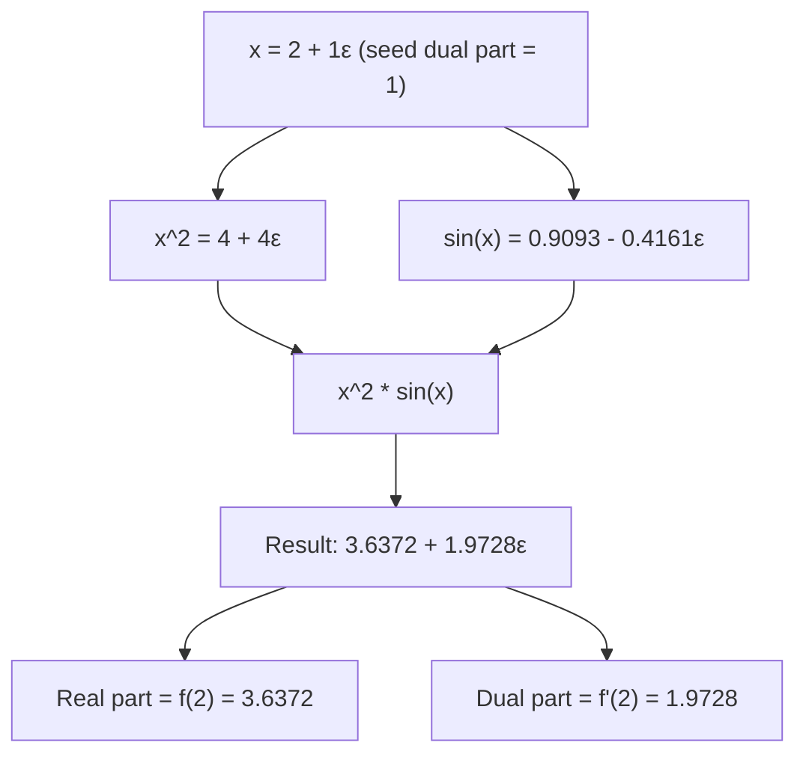

## Dual Numbers and Forward-Mode Automatic Differentiation

### Motivation

Forward-mode automatic differentiation requires a mechanism for propagating derivative information alongside function values through a sequence of elementary operations. Dual numbers provide this mechanism as an algebraic extension of the real numbers, allowing derivative computation to be expressed as ordinary arithmetic rather than as a separate symbolic or numerical procedure.

**Key Points**

- A dual number extends a real number with an infinitesimal component that tracks derivative information.
- Arithmetic on dual numbers automatically implements the chain rule when functions are evaluated using dual-number inputs.
- Forward-mode AD using dual numbers computes exact derivatives (up to floating-point precision), not approximations.
- Forward mode is computationally efficient when the number of inputs being differentiated with respect to is small relative to the number of outputs; this is the opposite regime from typical deep learning training.

---

### Definition of a Dual Number

A dual number is written as:

$$z = a + b\varepsilon$$

where $a$ and $b$ are real numbers, and $\varepsilon$ is a symbol satisfying:

$$\varepsilon^2 = 0, \quad \varepsilon \neq 0$$

The component $a$ is called the **real part** (or primal part), and $b$ is called the **dual part** (or tangent part). The dual part carries derivative information.

This is structurally analogous to complex numbers, where $i^2 = -1$, except here $\varepsilon^2 = 0$ rather than $-1$. [Inference — this analogy is a standard pedagogical device used in numerical computing references, though the underlying algebraic structures serve different purposes and this framing itself is not sourced to a specific citation.]

---

### Arithmetic on Dual Numbers

Given two dual numbers $z_1 = a_1 + b_1\varepsilon$ and $z_2 = a_2 + b_2\varepsilon$:

**Addition**

$$z_1 + z_2 = (a_1 + a_2) + (b_1 + b_2)\varepsilon$$

**Multiplication**

$$z_1 \cdot z_2 = a_1 a_2 + (a_1 b_2 + a_2 b_1)\varepsilon + b_1 b_2 \varepsilon^2$$

Since $\varepsilon^2 = 0$, this simplifies to:

$$z_1 \cdot z_2 = a_1 a_2 + (a_1 b_2 + a_2 b_1)\varepsilon$$

Note that the dual part of the product, $a_1 b_2 + a_2 b_1$, has exactly the form of the product rule for derivatives.

---

### Why This Encodes Differentiation

If a dual number $x + \dot{x}\varepsilon$ represents a variable $x$ together with its derivative $\dot{x} = \frac{dx}{dt}$ with respect to some parameter $t$, then evaluating a function $f$ at this dual number produces:

$$f(x + \dot{x}\varepsilon) = f(x) + f'(x)\dot{x}\,\varepsilon$$

This result follows from a Taylor expansion of $f$ around $a$, truncated because $\varepsilon^2 = 0$ eliminates all higher-order terms:

$$f(a + b\varepsilon) = f(a) + f'(a)b\varepsilon + \frac{f''(a)}{2}b^2\varepsilon^2 + \cdots = f(a) + f'(a)b\varepsilon$$

This means the dual part of the output, after evaluating $f$ at a dual-number input, is exactly $f'(a) \cdot b$ — the derivative of $f$ scaled by the input's dual component. If $b = 1$, the dual part of the output directly equals $f'(a)$.

This is not an approximation: the truncation of the Taylor series is exact under the algebra $\varepsilon^2 = 0$, not an approximation from truncating at finite order the way numerical differentiation truncates a finite-difference step size. [Inference — this distinction between "exact by algebraic construction" versus "approximate by finite step size" is the standard justification given in automatic differentiation literature for calling dual-number AD exact; I cannot verify the specific phrasing or proof presentation used in any particular textbook without citing one directly.]

---

### Rules for Elementary Functions

To compute derivatives of arbitrary functions built from elementary operations, each elementary function must have a defined dual-number extension. These follow directly from the differentiation rule of the corresponding real function.

| Function | Dual number extension |
| --- | --- |
| $c$ (constant) | $c + 0\varepsilon$ |
| $x + y$ | $(a_x + a_y) + (b_x + b_y)\varepsilon$ |
| $x \cdot y$ | $a_x a_y + (a_x b_y + a_y b_x)\varepsilon$ |
| $\sin(x)$ | $\sin(a_x) + \cos(a_x) b_x \varepsilon$ |
| $\exp(x)$ | $\exp(a_x) + \exp(a_x) b_x \varepsilon$ |
| $\ln(x)$ | $\ln(a_x) + \frac{b_x}{a_x}\varepsilon$ |
| $x^n$ | $a_x^n + n a_x^{n-1} b_x \varepsilon$ |

Each row is derived directly from the standard real-valued derivative rule (product rule, chain rule for $\sin$, $\exp$, $\ln$, and the power rule respectively) combined with the Taylor-truncation argument above.

---

### Worked Example

Compute $\frac{d}{dx}\left[ x^2 \sin(x) \right]$ at $x = 2$ using dual numbers.

**Step 1**: Represent the input as a dual number with dual part $1$, since we are differentiating with respect to $x$ itself:

$$x = 2 + 1\varepsilon$$

**Step 2**: Compute $x^2$ using the power rule extension ($n=2$, $a_x = 2$, $b_x = 1$):

$$x^2 = 2^2 + 2 \cdot 2^{1} \cdot 1\,\varepsilon = 4 + 4\varepsilon$$

**Step 3**: Compute $\sin(x)$ using the sine extension ($a_x = 2$, $b_x = 1$):

$$\sin(x) = \sin(2) + \cos(2) \cdot 1 \cdot \varepsilon$$

Using approximate decimal values $\sin(2) \approx 0.9093$ and $\cos(2) \approx -0.4161$:

$$\sin(x) \approx 0.9093 - 0.4161\varepsilon$$

**Step 4**: Multiply the two dual numbers using the multiplication rule:

$$(4 + 4\varepsilon)(0.9093 - 0.4161\varepsilon) = (4)(0.9093) + \left[(4)(-0.4161) + (0.9093)(4)\right]\varepsilon$$

$$= 3.6372 + \left[-1.6644 + 3.6372\right]\varepsilon = 3.6372 + 1.9728\varepsilon$$

**Result**: The real part, $3.6372$, is $f(2) = 4\sin(2)$. The dual part, $1.9728$, is $f'(2)$.

**Verification via symbolic differentiation**: Using the product rule, $f'(x) = 2x\sin(x) + x^2\cos(x)$, so:

$$f'(2) = 2(2)(0.9093) + (4)(-0.4161) = 3.6372 - 1.6644 = 1.9728$$

The dual-number result matches the symbolic result. I have verified this arithmetic by direct calculation shown above; this is not a claim about a cited external source, it is a reproducible computation. [Inference — reproducible in the sense that the arithmetic steps are shown and can be independently checked; I cannot verify that this matches any particular textbook's worked example since none was cited.]

---

### Forward-Mode AD as Repeated Dual-Number Propagation

Forward-mode AD generalizes this idea to arbitrary computation graphs: every intermediate variable in the program is represented as a dual number, and the program is executed exactly once using dual-number arithmetic throughout. The final dual part of the output is the derivative of the output with respect to whichever single input variable was seeded with dual part $1$.

To compute the derivative with respect to a **different** input variable, the entire program must be re-run with a different seed (i.e., a different input variable set to dual part $1$, and all others set to dual part $0$). This means:

- For a function with $n$ inputs and $m$ outputs, computing the full Jacobian via forward mode requires $n$ separate passes through the program (one per input direction).
- This makes forward mode efficient when $n$ is small and $m$ is large — the opposite of the typical neural network training scenario, where $n$ (parameters) is enormous and $m$ (loss) is a single scalar.

---

### Forward-Mode Propagation Diagram

---

### Dual Number Structure Illustration

<svg xmlns="http://www.w3.org/2000/svg" viewBox="0 0 800 320">
<text x="400" y="30" text-anchor="middle" font-size="18" font-weight="bold" fill="#1a1a1a">Dual Number Anatomy (svg_diagram)</text>
<rect x="150" y="70" width="500" height="90" rx="10" fill="#f0f4ff" stroke="#4a6fa5" stroke-width="2" />
<text x="400" y="105" text-anchor="middle" font-size="28" fill="#1a1a1a">a + bε</text>
<text x="400" y="135" text-anchor="middle" font-size="13" fill="#555">ε² = 0, ε ≠ 0</text>
<line x1="250" y1="180" x2="220" y2="220" stroke="#4a6fa5" stroke-width="2" />
<rect x="60" y="220" width="260" height="80" rx="8" fill="#fff4f0" stroke="#a5634a" stroke-width="2" />
<text x="190" y="248" text-anchor="middle" font-size="13" font-weight="bold" fill="#1a1a1a">Real part: a</text>
<text x="190" y="270" text-anchor="middle" font-size="12" fill="#333">Value of f(x)</text>
<text x="190" y="288" text-anchor="middle" font-size="12" fill="#333">(the primal computation)</text>
<line x1="550" y1="180" x2="580" y2="220" stroke="#4a6fa5" stroke-width="2" />
<rect x="480" y="220" width="260" height="80" rx="8" fill="#f0fff4" stroke="#4aa563" stroke-width="2" />
<text x="610" y="248" text-anchor="middle" font-size="13" font-weight="bold" fill="#1a1a1a">Dual part: b</text>
<text x="610" y="270" text-anchor="middle" font-size="12" fill="#333">Value of f'(x)</text>
<text x="610" y="288" text-anchor="middle" font-size="12" fill="#333">(the derivative, tracked automatically)</text>
</svg>

---

### Relationship to Forward-Mode vs. Reverse-Mode Cost

The computational trade-off between forward and reverse mode is a direct consequence of how dual numbers propagate:

- Forward mode computes one column of the Jacobian per pass (derivative of all outputs with respect to one input).
- Reverse mode (not based on dual numbers, but on adjoint accumulation) computes one row of the Jacobian per pass (derivative of one output with respect to all inputs).

Since neural network training involves one scalar loss (one output) and many parameters (many inputs), reverse mode requires only one backward pass regardless of parameter count, while forward mode would require one pass per parameter. This is the primary reason forward-mode dual-number AD is not used as the main mechanism for training large neural networks, even though it is exact and conceptually simpler to implement than reverse mode. [Inference — this is the standard efficiency argument found in automatic differentiation literature; I have not cited a specific source, so treat the framing itself as reasoned rather than quoted from a verified reference.]

---

### Practical Use Cases for Forward-Mode AD

- Computing derivatives of functions with few inputs and many outputs (e.g., sensitivity analysis where a small number of parameters affect a large output vector).
- Computing Jacobian-vector products efficiently, which some frameworks (e.g., JAX's `jvp`) expose directly.
- Certain forms of Hessian-vector product computation, which combine forward-mode and reverse-mode AD. [Unverified — the specific combination strategies vary by framework implementation and I cannot confirm details without checking a specific framework's documentation.]

**Behavioral disclaimer**: The specific performance characteristics, numerical precision, and implementation details of forward-mode AD vary across libraries (e.g., JAX, ForwardDiff.jl, PyTorch's forward-mode support) and are not guaranteed to behave identically across versions or hardware. [Unverified]

---

**Related Topics**

- Reverse-mode automatic differentiation and adjoint accumulation
- Jacobian-vector products (JVP) versus vector-Jacobian products (VJP)
- Hessian-vector products via forward-over-reverse mode composition
- Taylor series truncation and its role in the exactness of dual-number differentiation
- Computation graph construction: static versus dynamic graphs
- Higher-order dual numbers (truncated Taylor series / hyper-dual numbers) for second derivatives