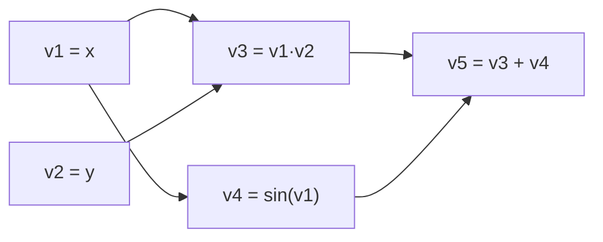

## Computational Graph Construction (svg_diagram)

### Definition and Purpose

A computational graph is a directed acyclic graph (DAG) representation of a mathematical expression, where nodes represent variables or operations and edges represent data dependencies. Each node stores the result of applying an operation to its inputs. This structure is the foundation of automatic differentiation (AD), since it allows a systematic traversal for computing derivatives via the chain rule.

Two categories of nodes typically appear:
- **Leaf nodes**: input variables or constants (e.g., $x$, $w$, $b$)
- **Interior nodes**: intermediate results from unary or binary operations (e.g., addition, multiplication, $\sin$, $\exp$)

### Why Graphs Instead of Direct Formulas

Directly differentiating a nested closed-form expression by hand becomes intractable as depth increases, especially in neural networks with millions of composed operations. A computational graph decomposes a complex function into a sequence of elementary operations, each with a known, simple derivative. The chain rule is then applied mechanically along graph edges rather than symbolically across the entire expression.

[Inference] This decomposition is generally considered the reason AD scales to deep architectures where manual or naive symbolic differentiation would be computationally impractical, though exact scaling behavior depends on graph size, framework, and hardware.

### Example Expression

Consider:

$$f(x, y) = (x \cdot y) + \sin(x)$$

This can be decomposed into elementary sub-expressions:

$$
\begin{aligned}
v_1 &= x \\
v_2 &= y \\
v_3 &= v_1 \cdot v_2 \\
v_4 &= \sin(v_1) \\
v_5 &= v_3 + v_4
\end{aligned}
$$

Here, $v_5$ is the output node, $v_1$ and $v_2$ are leaf nodes, and $v_3, v_4, v_5$ are interior nodes.

### Graph Structure

<svg xmlns="http://www.w3.org/2000/svg" viewBox="0 0 640 380" font-family="sans-serif">
  <text x="20" y="24" font-size="15" font-weight="bold">Computational Graph for f(x,y) = (x·y) + sin(x) (svg_diagram)</text>

  
  <circle cx="100" cy="100" r="28" fill="none" stroke="black" stroke-width="2" />
  <text x="100" y="105" font-size="14" text-anchor="middle">v1 = x</text>

  <circle cx="100" cy="260" r="28" fill="none" stroke="black" stroke-width="2" />
  <text x="100" y="265" font-size="14" text-anchor="middle">v2 = y</text>

  
  <circle cx="300" cy="180" r="30" fill="none" stroke="black" stroke-width="2" />
  <text x="300" y="176" font-size="13" text-anchor="middle">v3 =</text>
  <text x="300" y="192" font-size="13" text-anchor="middle">v1·v2</text>

  <circle cx="300" cy="60" r="30" fill="none" stroke="black" stroke-width="2" />
  <text x="300" y="56" font-size="13" text-anchor="middle">v4 =</text>
  <text x="300" y="72" font-size="13" text-anchor="middle">sin(v1)</text>

  
  <circle cx="500" cy="120" r="32" fill="none" stroke="black" stroke-width="2" />
  <text x="500" y="116" font-size="13" text-anchor="middle">v5 =</text>
  <text x="500" y="132" font-size="13" text-anchor="middle">v3+v4</text>

  
  <line x1="126" y1="100" x2="278" y2="170" stroke="black" stroke-width="1.5" />
  <line x1="126" y1="100" x2="278" y2="70" stroke="black" stroke-width="1.5" />
  <line x1="115" y1="240" x2="285" y2="195" stroke="black" stroke-width="1.5" />
  <line x1="328" y1="170" x2="475" y2="135" stroke="black" stroke-width="1.5" />
  <line x1="328" y1="70" x2="475" y2="108" stroke="black" stroke-width="1.5" />

  <text x="560" y="120" font-size="13" font-style="italic">output</text>
</svg>

### Forward Pass Construction

During the forward pass, the graph is built (or traversed, if static) in topological order — parents before children — evaluating each node's numerical value from its inputs. Frameworks generally fall into two construction strategies:

- **Static graph construction**: the graph is fully defined before execution (e.g., early TensorFlow 1.x `tf.Graph`). Enables ahead-of-time optimization but is less flexible for dynamic control flow. [Unverified] Specific framework behavior may differ by version; consult current documentation for exact semantics.
- **Dynamic graph construction ("define-by-run")**: the graph is built implicitly as operations execute (e.g., PyTorch's autograd, TensorFlow 2.x eager mode). This allows native use of Python control flow (loops, conditionals) at the cost of some per-step overhead. [Unverified] Performance characteristics vary by implementation, hardware, and workload; no absolute performance claim is made here.

### Node Attributes

Each node in a practical AD implementation typically stores:
- The computed numeric **value** (from the forward pass)
- A reference to the **operation** that produced it
- References to **parent nodes** (inputs)
- A **gradient accumulator** (populated during the backward pass, covered in a later topic)

### Topological Ordering

Because a computational graph is a DAG, evaluation order matters. A node cannot be evaluated until all of its inputs have been computed. This is enforced via topological sort, guaranteeing:

$$\text{if } (u \to v) \in E, \text{ then } u \text{ is ordered before } v$$

Mermaid representation of topological flow for the example:



### Shared Subexpressions and Fan-Out

Note that $v_1$ (the variable $x$) feeds into **two** downstream nodes ($v_3$ and $v_4$). This fan-out is significant for the backward pass: gradients flowing back through multiple paths to the same node must be **summed**, not overwritten. This is a common source of implementation bugs when building AD systems manually.

[Inference] Correct gradient accumulation at fan-out nodes is generally required for AD correctness under the multivariable chain rule, though the specific accumulation mechanism (in-place addition, gradient tapes, etc.) is framework-dependent.

### Memory Considerations

Every interior node's value is typically retained in memory during the forward pass, since it may be needed for gradient computation in the backward pass. For deep or wide graphs, this can create substantial memory overhead.

- **Gradient checkpointing** is one mitigation strategy: recomputing certain intermediate values during the backward pass instead of storing them, trading compute for memory. [Unverified] The effectiveness of this tradeoff depends on model architecture and hardware constraints; no guarantee of improvement applies universally.

### Practical Implementation Sketch (Python-like pseudocode)

```python
class Node:
    def __init__(self, value, parents=None, op=None):
        self.value = value
        self.parents = parents or []
        self.op = op
        self.grad = 0.0

def add(a, b):
    return Node(a.value + b.value, parents=[a, b], op='add')

def mul(a, b):
    return Node(a.value * b.value, parents=[a, b], op='mul')

def sin_node(a):
    import math
    return Node(math.sin(a.value), parents=[a], op='sin')

x = Node(2.0)
y = Node(3.0)
v3 = mul(x, y)
v4 = sin_node(x)
v5 = add(v3, v4)
```

This sketch constructs the graph shown above but does not yet implement gradient propagation, which depends on traversing `parents` in reverse topological order (covered separately under backward-pass mechanics).

### Key Points

- A computational graph decomposes a composite function into elementary operations connected by a DAG.
- Leaf nodes are inputs; interior nodes are operations; edges encode data dependency.
- Construction may be static (defined ahead of execution) or dynamic (built during execution).
- Topological ordering guarantees valid evaluation sequencing.
- Fan-out nodes require gradient summation during backpropagation — a critical correctness requirement.
- Memory overhead from storing intermediate values motivates strategies like gradient checkpointing.

### Related Topics

- Reverse-mode automatic differentiation (backward pass mechanics)
- Forward-mode automatic differentiation and dual numbers
- Chain rule formalization for multivariable composite functions
- Jacobian-vector products and vector-Jacobian products
- Gradient accumulation and in-place operation hazards
- Gradient checkpointing strategies
- Comparison: symbolic differentiation vs. numerical differentiation vs. automatic differentiation