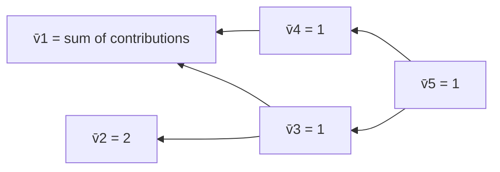

## Backpropagation as Reverse-Mode Autodiff (svg_diagram)

### Definition and Core Idea

Backpropagation is the application of reverse-mode automatic differentiation to compute gradients of a scalar output with respect to all input variables in a computational graph. It consists of two passes:

1. **Forward pass**: evaluate the graph node by node, computing and storing all intermediate values.
2. **Backward pass**: traverse the graph in reverse topological order, propagating derivatives from the output back to each input using the chain rule.

The defining efficiency property is that a single backward pass computes the gradient with respect to **all** inputs simultaneously, regardless of how many inputs there are — provided the output is scalar.

[Inference] This property is generally why reverse mode is preferred over forward mode for training neural networks, since loss functions are typically scalar-valued and models often have far more parameters than outputs. This is a reasoned conclusion based on the mathematical structure described below, not an external confirmed source.

### Adjoint (Cotangent) Definition

For each node $v_i$ in the graph, define the **adjoint**:

$$\bar{v}_i = \frac{\partial L}{\partial v_i}$$

where $L$ is the final scalar output (e.g., a loss function). The adjoint represents how much a small change in $v_i$ affects the final output.

The backward pass initializes:

$$\bar{v}_n = 1 \quad \text{(the output node's adjoint with respect to itself)}$$

and propagates backward using the multivariable chain rule:

$$\bar{v}_i = \sum_{j \in \text{children}(i)} \bar{v}_j \cdot \frac{\partial v_j}{\partial v_i}$$

This sum-over-children form is what handles fan-out nodes correctly, as introduced in the prior topic on graph construction.

### Worked Example

Using the same expression from the previous topic:

$$f(x, y) = (x \cdot y) + \sin(x)$$

with intermediate variables:

$$
\begin{aligned}
v_1 &= x \\
v_2 &= y \\
v_3 &= v_1 \cdot v_2 \\
v_4 &= \sin(v_1) \\
v_5 &= v_3 + v_4
\end{aligned}
$$

**Forward pass** (using $x = 2, y = 3$):

$$
\begin{aligned}
v_1 &= 2 \\
v_2 &= 3 \\
v_3 &= 2 \cdot 3 = 6 \\
v_4 &= \sin(2) \approx 0.909 \\
v_5 &= 6 + 0.909 = 6.909
\end{aligned}
$$

**Backward pass** (computing adjoints in reverse order):

$$
\begin{aligned}
\bar{v}_5 &= 1 \\
\bar{v}_4 &= \bar{v}_5 \cdot \frac{\partial v_5}{\partial v_4} = 1 \cdot 1 = 1 \\
\bar{v}_3 &= \bar{v}_5 \cdot \frac{\partial v_5}{\partial v_3} = 1 \cdot 1 = 1 \\
\bar{v}_2 &= \bar{v}_3 \cdot \frac{\partial v_3}{\partial v_2} = 1 \cdot v_1 = 1 \cdot 2 = 2 \\
\bar{v}_1 &= \underbrace{\bar{v}_3 \cdot \frac{\partial v_3}{\partial v_1}}_{\text{via } v_3} + \underbrace{\bar{v}_4 \cdot \frac{\partial v_4}{\partial v_1}}_{\text{via } v_4} = (1 \cdot v_2) + (1 \cdot \cos(v_1)) = 3 + \cos(2) \approx 3 - 0.416 = 2.584
\end{aligned}
$$

So $\frac{\partial f}{\partial x} \approx 2.584$ and $\frac{\partial f}{\partial y} = 2$. Note how $\bar{v}_1$ required summing contributions from both $v_3$ and $v_4$ — this is the fan-out accumulation rule applied concretely.

### Graph with Adjoint Flow

<svg xmlns="http://www.w3.org/2000/svg" viewBox="0 0 680 420" font-family="sans-serif">
  <text x="20" y="24" font-size="15" font-weight="bold">Forward (black) and Backward (red) Passes (svg_diagram)</text>

  <circle cx="110" cy="120" r="28" fill="none" stroke="black" stroke-width="2" />
  <text x="110" y="125" font-size="13" text-anchor="middle">v1=x=2</text>

  <circle cx="110" cy="290" r="28" fill="none" stroke="black" stroke-width="2" />
  <text x="110" y="295" font-size="13" text-anchor="middle">v2=y=3</text>

  <circle cx="320" cy="205" r="32" fill="none" stroke="black" stroke-width="2" />
  <text x="320" y="200" font-size="12" text-anchor="middle">v3=v1·v2</text>
  <text x="320" y="215" font-size="12" text-anchor="middle">=6</text>

  <circle cx="320" cy="70" r="32" fill="none" stroke="black" stroke-width="2" />
  <text x="320" y="65" font-size="12" text-anchor="middle">v4=sin(v1)</text>
  <text x="320" y="80" font-size="12" text-anchor="middle">≈0.909</text>

  <circle cx="530" cy="140" r="34" fill="none" stroke="black" stroke-width="2" />
  <text x="530" y="135" font-size="12" text-anchor="middle">v5=v3+v4</text>
  <text x="530" y="150" font-size="12" text-anchor="middle">≈6.909</text>

  
  <line x1="136" y1="120" x2="296" y2="190" stroke="black" stroke-width="1.5" />
  <line x1="136" y1="120" x2="296" y2="80" stroke="black" stroke-width="1.5" />
  <line x1="125" y1="270" x2="305" y2="220" stroke="black" stroke-width="1.5" />
  <line x1="350" y1="195" x2="505" y2="150" stroke="black" stroke-width="1.5" />
  <line x1="350" y1="80" x2="505" y2="128" stroke="black" stroke-width="1.5" />

  
  <text x="420" y="130" font-size="12" fill="red">v̄4=1</text>
  <text x="420" y="185" font-size="12" fill="red">v̄3=1</text>
  <text x="200" y="150" font-size="12" fill="red">via v3: v2=3</text>
  <text x="200" y="60" font-size="12" fill="red">via v4: cos(2)≈-0.416</text>
  <text x="60" y="200" font-size="12" fill="red" font-weight="bold">v̄1≈2.584</text>
  <text x="60" y="330" font-size="12" fill="red" font-weight="bold">v̄2=2</text>

  <text x="600" y="140" font-size="12" fill="red">v̄5=1</text>
</svg>

### Reverse-Mode Traversal Order

The backward pass must visit nodes in **reverse topological order** — children before parents — so that a node's adjoint is fully accumulated (all incoming contributions summed) before it is propagated further backward.



### Local Derivative Rules

Each operation type contributes a known local derivative rule, applied at its node during the backward pass:

| Operation | Forward | Local derivative(s) |
|---|---|---|
| Addition | $v_i = a + b$ | $\partial v_i/\partial a = 1$, $\partial v_i/\partial b = 1$ |
| Multiplication | $v_i = a \cdot b$ | $\partial v_i/\partial a = b$, $\partial v_i/\partial b = a$ |
| Sine | $v_i = \sin(a)$ | $\partial v_i/\partial a = \cos(a)$ |
| Exponential | $v_i = e^a$ | $\partial v_i/\partial a = e^a$ |
| Natural log | $v_i = \ln(a)$ | $\partial v_i/\partial a = 1/a$ |

These local rules are composed automatically by the graph traversal — no global symbolic expression for the derivative needs to be constructed at any point, which distinguishes AD from symbolic differentiation. [Unverified] Whether a given framework internally avoids symbolic expression construction entirely, or uses hybrid tracing/symbolic techniques, depends on the specific implementation; consult framework documentation for exact internals.

### Practical Implementation Sketch (Python-like pseudocode)

```python
class Node:
    def __init__(self, value, parents=None, backward_fn=None):
        self.value = value
        self.parents = parents or []
        self.backward_fn = backward_fn  # computes local grads given upstream grad
        self.grad = 0.0

def add(a, b):
    out = Node(a.value + b.value, parents=[a, b])
    def backward(upstream):
        a.grad += upstream * 1.0
        b.grad += upstream * 1.0
    out.backward_fn = backward
    return out

def mul(a, b):
    out = Node(a.value * b.value, parents=[a, b])
    def backward(upstream):
        a.grad += upstream * b.value
        b.grad += upstream * a.value
    out.backward_fn = backward
    return out

def backward_pass(output_node):
    output_node.grad = 1.0
    topo_order = build_reverse_topo_order(output_node)  # children before parents
    for node in topo_order:
        if node.backward_fn:
            node.backward_fn(node.grad)
```

[Unverified] This sketch omits memory management, operation registration for arbitrary functions, and handling of higher-order derivatives; production AD systems (e.g., PyTorch autograd, JAX) implement substantially more machinery. No claim is made that this pseudocode matches any specific framework's internal implementation.

### Cost Comparison: Reverse Mode vs. Forward Mode

- **Reverse mode**: one backward pass yields gradients with respect to **all** $n$ inputs. Cost is roughly proportional to a small constant multiple of the forward pass cost, independent of $n$. [Unverified] Exact constant-factor overhead depends on implementation and hardware; no specific multiplier is guaranteed.
- **Forward mode**: computes the derivative with respect to **one** input per pass (via dual numbers or tangent propagation). For $n$ inputs, this requires $n$ passes.

Since neural network training involves scalar loss functions with potentially millions or billions of parameters, reverse mode is structurally favored. [Inference] This is a reasoned conclusion from the cost structure described above, not a claim sourced from an external benchmark.

### Common Implementation Pitfalls

- **Gradient overwriting instead of accumulation** at fan-out nodes, producing incorrect results silently.
- **In-place operations** on tensors that are still needed for backward computation, which can corrupt stored forward-pass values. [Unverified] The specific error behavior (silent corruption vs. raised exception) is framework- and version-dependent.
- **Failing to zero gradients** between training iterations when using frameworks that accumulate gradients by default, leading to incorrect updates across steps. [Unverified] Default accumulation behavior varies by framework; consult current documentation.

### Key Points

- Backpropagation = reverse-mode autodiff applied to a scalar-output computational graph.
- Two passes: forward (compute and store values), backward (compute and accumulate adjoints).
- Adjoints are accumulated via summation at fan-out nodes — this is a hard correctness requirement, not an optimization detail.
- Reverse mode computes all input gradients in one backward pass, making it structurally suited to scalar-loss, high-parameter-count settings like neural network training.
- Local derivative rules per operation are composed mechanically; no global symbolic derivative expression is required.

### Related Topics

- Forward-mode automatic differentiation and dual numbers
- Jacobian-vector products (JVP) vs. vector-Jacobian products (VJP)
- Higher-order derivatives via nested autodiff
- Gradient checkpointing and memory-compute tradeoffs
- Numerical stability issues in backpropagation (vanishing/exploding gradients)
- Custom gradient definitions and stop-gradient operations
- Autodiff implementations across frameworks (conceptual comparison only, no version-specific claims)