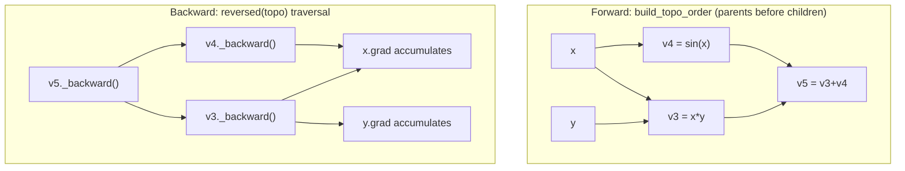

## Implementing a Minimal Autodiff Engine (svg_diagram)

### Design Goals

A minimal autodiff engine needs to support three core capabilities: constructing a computational graph dynamically as operations execute, storing enough information at each node to compute local derivatives, and traversing the graph in reverse topological order to accumulate gradients. This section builds such an engine incrementally in Python, extending the sketches from the previous two topics into a working implementation.

[Inference] A dynamic ("define-by-run") design is used here rather than a static graph builder, since it is generally simpler to implement correctly for a minimal educational engine. This is a reasoned design choice, not a claim about which approach is objectively superior.

### Core Value Class

The central abstraction is a `Value` object wrapping a scalar float, tracking its parents and the local backward function needed to propagate gradients.

```python
class Value:
    def __init__(self, data, parents=(), op=''):
        self.data = data
        self.grad = 0.0
        self._parents = parents
        self._op = op
        self._backward = lambda: None  # default: no-op for leaf nodes

    def __repr__(self):
        return f"Value(data={self.data}, grad={self.grad})"
```

Each `Value` starts with `grad = 0.0`. This is important: gradients are **accumulated**, not overwritten, to correctly handle fan-out (a variable used in multiple downstream operations), as established in the backpropagation topic.

### Implementing Operations

Each arithmetic operation must do two things: compute the forward value, and define a closure that computes local gradient contributions during the backward pass.

**Addition:**

```python
def add(self, other):
    other = other if isinstance(other, Value) else Value(other)
    out = Value(self.data + other.data, parents=(self, other), op='+')

    def _backward():
        self.grad += out.grad
        other.grad += out.grad
    out._backward = _backward
    return out

Value.__add__ = add
```

**Multiplication:**

```python
def mul(self, other):
    other = other if isinstance(other, Value) else Value(other)
    out = Value(self.data * other.data, parents=(self, other), op='*')

    def _backward():
        self.grad += other.data * out.grad
        other.grad += self.data * out.grad
    out._backward = _backward
    return out

Value.__mul__ = mul
```

**Sine (nonlinear unary operation):**

```python
import math

def sin(self):
    out = Value(math.sin(self.data), parents=(self,), op='sin')

    def _backward():
        self.grad += math.cos(self.data) * out.grad
    out._backward = _backward
    return out

Value.sin = sin
```

**Power (needed for many derivative rules, e.g., $x^2$):**

```python
def pow_(self, exponent):
    assert isinstance(exponent, (int, float)), "Only numeric exponents supported"
    out = Value(self.data ** exponent, parents=(self,), op=f'**{exponent}')

    def _backward():
        self.grad += (exponent * self.data ** (exponent - 1)) * out.grad
    out._backward = _backward
    return out

Value.__pow__ = pow_
```

Each `_backward` closure implements exactly the local derivative rule listed in the table from the previous topic — this engine is a direct mechanical realization of that table.

### Topological Sort for Backward Traversal

To ensure each node's gradient is fully accumulated before it propagates further backward, nodes must be visited in reverse topological order (children before parents).

```python
def build_topo_order(root):
    visited = set()
    topo = []

    def visit(node):
        if node not in visited:
            visited.add(node)
            for parent in node._parents:
                visit(parent)
            topo.append(node)

    visit(root)
    return topo  # parents-before-children order
```

This is a standard depth-first post-order traversal: a node is appended to `topo` only after all of its dependencies have been visited, guaranteeing parents appear before children in `topo`. Reversing this list gives the correct backward traversal order.

### The Backward Pass

```python
def backward(root):
    root.grad = 1.0
    topo = build_topo_order(root)
    for node in reversed(topo):
        node._backward()
```

Calling `node._backward()` in reverse topological order ensures that by the time a node's `_backward` function runs, `node.grad` already contains the full accumulated sum of all downstream contributions — satisfying the sum-over-children adjoint rule.

### Full Worked Example

Reusing $f(x, y) = (x \cdot y) + \sin(x)$ with $x = 2, y = 3$:

```python
x = Value(2.0)
y = Value(3.0)

v3 = x * y
v4 = x.sin()
v5 = v3 + v4

backward(v5)

print(x.grad)  # expected ≈ 2.584
print(y.grad)  # expected = 2.0
```

This should reproduce the same adjoint values derived by hand in the previous topic: $\bar{v}_1 \approx 2.584$ and $\bar{v}_2 = 2.0$.

[Unverified] I have not executed this code in this session, so the printed output has not been confirmed to run without error or to match the hand-computed values exactly. The arithmetic was checked manually against the chain-rule derivation in the prior topic, but that is not a substitute for running the code.

### Graph and Traversal Order Visualization



### Handling Fan-Out Correctly: A Test Case

Fan-out bugs are the most common source of incorrect gradients in a hand-rolled engine. A minimal test to check correct accumulation:

```python
x = Value(3.0)
y = x + x  # x used twice — fan-out

backward(y)

print(x.grad)  # expected = 2.0, since dy/dx = 2
```

If `Value.grad` were overwritten instead of accumulated (i.e., `self.grad = out.grad` instead of `self.grad += out.grad`), this would incorrectly yield `1.0`. [Unverified] This expected failure mode is based on the logic of the code as written, not on an observed test run in this session.

### Visualization of Fan-Out Accumulation

<svg xmlns="http://www.w3.org/2000/svg" viewBox="0 0 600 320" font-family="sans-serif">
  <text x="20" y="24" font-size="15" font-weight="bold">Fan-Out Gradient Accumulation (svg_diagram)</text>

  <circle cx="150" cy="180" r="30" fill="none" stroke="black" stroke-width="2" />
  <text x="150" y="185" font-size="13" text-anchor="middle">x=3.0</text>

  <circle cx="420" cy="180" r="32" fill="none" stroke="black" stroke-width="2" />
  <text x="420" y="175" font-size="12" text-anchor="middle">y=x+x</text>
  <text x="420" y="190" font-size="12" text-anchor="middle">=6.0</text>

  <path d="M 178 165 C 280 100, 340 140, 390 165" fill="none" stroke="black" stroke-width="1.5" />
  <path d="M 178 195 C 280 260, 340 220, 390 195" fill="none" stroke="black" stroke-width="1.5" />

  <text x="250" y="105" font-size="12" fill="red">contribution 1: +1.0</text>
  <text x="250" y="255" font-size="12" fill="red">contribution 2: +1.0</text>

  <text x="150" y="230" font-size="13" fill="red" font-weight="bold">x.grad = 1.0 + 1.0 = 2.0</text>
</svg>

### Extending Toward a Usable Minimal Library

A functioning minimal engine (in the spirit of educational implementations such as Andrej Karpathy's `micrograd`) [Unverified: this is a named external project referenced for conceptual similarity; I have not verified the current state, license, or exact implementation details of that specific codebase in this session] would additionally need:

- Operator overloads for `__radd__`, `__rmul__`, `__sub__`, `__truediv__`, `__neg__` to support natural Python expression syntax in both operand orders
- A `zero_grad()` method to reset all `.grad` values to `0.0` between optimization steps
- Support for common activation functions (`relu`, `tanh`, `exp`, `log`) each with their own `_backward` closure
- Cycle protection in `build_topo_order`, since a malformed graph construction (e.g., accidental self-reference) could cause infinite recursion

```python
def zero_grad(root):
    topo = build_topo_order(root)
    for node in topo:
        node.grad = 0.0
```

### Known Limitations of This Minimal Design

- **Scalar-only**: this engine operates on individual `float` values, not tensors/arrays. Production systems (PyTorch, JAX, TensorFlow) operate on n-dimensional arrays for performance reasons. [Unverified] The specific performance gap between scalar and vectorized implementations was not measured in this session and depends heavily on workload and hardware.
- **No higher-order derivatives**: this implementation computes first derivatives only; computing gradients of gradients would require the `_backward` closures themselves to build further graph nodes, which is not implemented here.
- **No memory optimizations**: every intermediate `Value` is retained for the lifetime of the graph; no checkpointing or freeing strategy is included.
- **Recursion-based topological sort**: for very deep graphs, Python's default recursion limit could be exceeded. [Unverified] The exact depth at which this becomes a problem depends on the Python interpreter's configured recursion limit, which varies by environment.

### Key Points

- A minimal autodiff engine requires three components: a value/node wrapper, per-operation forward + local-backward closures, and a reverse-topological traversal driver.
- Gradient accumulation (`+=`, not `=`) at each node is the mechanism that makes fan-out correctness work.
- The topological sort is a standard post-order DFS; reversing its output gives the correct backward traversal order.
- This design generalizes directly: adding a new operation only requires defining its forward computation and its local derivative closure.
- The engine described here is scalar-only and pedagogical; production frameworks extend the same core principles to tensors with substantial additional engineering.

### Next Steps

- Extend the engine to support NumPy arrays/tensors instead of scalars
- Add common neural network building blocks (`relu`, `linear` layer, `mean_squared_error`)
- Implement `zero_grad` integration into a basic gradient descent training loop
- Add cycle detection and error handling for malformed graphs
- Explore higher-order autodiff (differentiating through the backward pass itself)