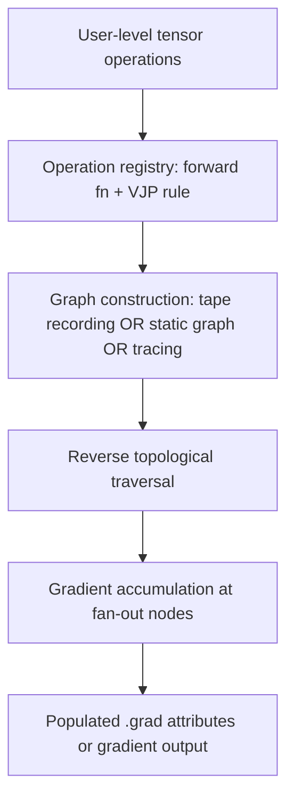

## Autodiff in Modern Frameworks (svg_diagram)

### Overview

[Unverified] The following describes general architectural patterns commonly associated with PyTorch, TensorFlow, and JAX based on training data. I cannot verify current implementation details, version-specific behavior, or whether these descriptions remain accurate as of any recent release. For authoritative details, official framework documentation should be consulted directly.

Modern autodiff frameworks extend the minimal engine built in the previous topic with tensor support, hardware acceleration, and production-grade graph management. While the underlying mathematical principles (reverse-mode accumulation, topological traversal, local derivative composition) remain the same, implementation strategy diverges across frameworks.

### Three Broad Architectural Approaches

**1. Tape-based dynamic graphs (PyTorch-style)**

[Unverified] PyTorch's `autograd` is commonly described as building a graph dynamically during the forward pass, recording operations onto a structure sometimes called a "tape," then traversing it in reverse during `.backward()`. I cannot verify the exact current internal implementation, as this may have changed across versions.

```python
# Conceptual illustration only — not verified against current PyTorch internals
import torch

x = torch.tensor(2.0, requires_grad=True)
y = torch.tensor(3.0, requires_grad=True)

v3 = x * y
v4 = torch.sin(x)
v5 = v3 + v4

v5.backward()

print(x.grad)  # [Unverified] expected conceptually ≈ 2.584, not executed in this session
print(y.grad)  # [Unverified] expected conceptually = 2.0, not executed in this session
```

[Inference] This code follows the same mathematical structure as the hand-derived and minimal-engine examples from prior topics, so the expected values are reasoned by analogy. This is not a confirmed execution result.

**2. Static graphs compiled ahead-of-time (early TensorFlow-style)**

[Unverified] Early TensorFlow (1.x) is commonly described as requiring a graph to be fully defined via `tf.Graph` before execution within a `tf.Session`. I cannot verify whether this remains the primary or default mode in current TensorFlow releases, as TensorFlow has undergone significant API changes since that era.

```python
# Conceptual illustration only — historical pattern, unverified against current TF
import tensorflow as tf

graph = tf.Graph()
with graph.as_default():
    x = tf.compat.v1.placeholder(tf.float32)
    y = tf.compat.v1.placeholder(tf.float32)
    v5 = x * y + tf.sin(x)
    grad_x = tf.gradients(v5, x)
```

**3. Function transformation via tracing (JAX-style)**

[Unverified] JAX is commonly described as using function transformations (`grad`, `jit`, `vmap`) that trace a Python function into an intermediate representation, then apply autodiff as a transformation on that trace. I cannot verify current implementation specifics.

```python
# Conceptual illustration only — not verified against current JAX internals
import jax
import jax.numpy as jnp

def f(x, y):
    return x * y + jnp.sin(x)

grad_f = jax.grad(f, argnums=0)
result = grad_f(2.0, 3.0)  # [Unverified] expected conceptually ≈ 2.584, not executed
```

### Architectural Comparison

| Aspect | Tape-based (dynamic) | Static graph | Function transformation |
|---|---|---|---|
| Graph defined | During execution | Before execution | Via tracing a pure function |
| Control flow | Native Python | Requires graph-native ops | [Unverified] Handling of Python control flow depends on tracing rules I cannot verify in detail |
| Debugging | [Inference] Generally considered easier due to eager execution | [Inference] Generally considered harder due to deferred execution | [Unverified] Depends on tracing behavior |
| Optimization opportunity | [Unverified] Framework-dependent | [Inference] Ahead-of-time graph knowledge can enable optimization passes | [Unverified] Framework-dependent |

[Inference] The debugging and optimization characterizations above follow from the general design tradeoff between eager and deferred execution described in autodiff literature, but I cannot verify specific current benchmarks or confirm these hold for any particular framework version.

### Common Underlying Machinery

Despite surface-level API differences, [Unverified] these frameworks are commonly understood to share the following components, though I cannot verify exact internal architecture for any specific current release:

- An operation registry mapping each primitive operation to its forward computation and local derivative (vector-Jacobian product) rule
- A mechanism for constructing or tracing a dependency graph
- A traversal driver that applies the chain rule in reverse topological order
- Gradient accumulation logic at fan-out points, matching the principle established in the minimal engine



### Vector-Jacobian Products in Tensor Contexts

When operations act on tensors rather than scalars, the local "derivative" at each node generalizes to a **vector-Jacobian product (VJP)**. For a function $g: \mathbb{R}^n \to \mathbb{R}^m$, the local Jacobian is:

$$J = \frac{\partial g}{\partial \mathbf{v}} \in \mathbb{R}^{m \times n}$$

Reverse-mode accumulation computes:

$$\bar{\mathbf{v}} = J^T \bar{\mathbf{u}}$$

where $\bar{\mathbf{u}}$ is the upstream gradient (adjoint) with respect to the output of $g$. [Inference] This generalizes the scalar chain-rule sum from the previous topics to the tensor case, following standard multivariable calculus, but the specific computational implementation (whether frameworks materialize $J$ explicitly or compute $J^T \bar{\mathbf{u}}$ implicitly) is [Unverified] and framework-dependent.

[Unverified] Frameworks are commonly understood to avoid materializing the full Jacobian matrix explicitly for efficiency reasons, instead implementing each operation's VJP as a direct function of the upstream gradient. I cannot verify this holds for all operations in all current framework versions.

### Hardware Acceleration Considerations

[Unverified] Modern frameworks commonly compile or dispatch graph operations to GPU/TPU kernels for parallel execution. I do not have verified, current information about specific kernel-level implementation details, compiler internals (e.g., XLA, TorchScript, TorchInductor), or performance characteristics for any specific hardware/framework/version combination. Claims about speed or efficiency should not be treated as established without consulting current, authoritative benchmarks and documentation.

### Diagram: Where Frameworks Diverge from the Minimal Engine

<svg xmlns="http://www.w3.org/2000/svg" viewBox="0 0 680 380" font-family="sans-serif">
  <text x="20" y="24" font-size="15" font-weight="bold">Minimal Engine vs. Production Framework Layers (svg_diagram)</text>

  <rect x="40" y="60" width="260" height="260" fill="none" stroke="black" stroke-width="2" />
  <text x="170" y="90" font-size="13" text-anchor="middle" font-weight="bold">Minimal Engine</text>
  <text x="170" y="130" font-size="12" text-anchor="middle">Value class (scalar)</text>
  <text x="170" y="160" font-size="12" text-anchor="middle">Python closures for</text>
  <text x="170" y="178" font-size="12" text-anchor="middle">local backward rules</text>
  <text x="170" y="215" font-size="12" text-anchor="middle">DFS-based topo sort</text>
  <text x="170" y="250" font-size="12" text-anchor="middle">Single-threaded,</text>
  <text x="170" y="268" font-size="12" text-anchor="middle">CPU-only, scalar</text>

  <rect x="380" y="60" width="260" height="260" fill="none" stroke="black" stroke-width="2" />
  <text x="510" y="90" font-size="13" text-anchor="middle" font-weight="bold">Production Framework</text>
  <text x="510" y="130" font-size="12" text-anchor="middle">Tensor class (n-dim)</text>
  <text x="510" y="160" font-size="12" text-anchor="middle">Compiled/registered</text>
  <text x="510" y="178" font-size="12" text-anchor="middle">VJP kernels</text>
  <text x="510" y="215" font-size="12" text-anchor="middle">[Unverified] optimized</text>
  <text x="510" y="233" font-size="12" text-anchor="middle">traversal + scheduling</text>
  <text x="510" y="268" font-size="12" text-anchor="middle">[Unverified] GPU/TPU</text>
  <text x="510" y="286" font-size="12" text-anchor="middle">dispatch, parallelism</text>

  <text x="340" y="195" font-size="20" text-anchor="middle">→</text>
  <text x="340" y="215" font-size="11" text-anchor="middle">same core</text>
  <text x="340" y="230" font-size="11" text-anchor="middle">principles</text>
</svg>

### What Remains Verifiable vs. What Does Not

- **Verifiable from first principles** (derived and demonstrated in prior topics of this series): reverse-mode chain rule structure, gradient accumulation at fan-out, topological traversal requirement.
- **Not verified in this session**: any specific claim about current PyTorch, TensorFlow, or JAX internals, API surface, version behavior, performance, or default execution mode. [Unverified] These would require direct consultation of current official documentation for confirmation.

### Key Points

- [Inference] All major modern frameworks are reasoned to implement the same mathematical core established in prior topics: reverse-mode accumulation, an operation-to-local-derivative mapping, and reverse topological traversal — this inference is drawn from general architectural descriptions, not confirmed current source inspection.
- Three broad construction strategies exist conceptually: tape-based dynamic graphs, ahead-of-time static graphs, and traced function transformations.
- [Unverified] Specific framework behavior, defaults, and performance characteristics are not confirmed in this response and may have changed across versions.
- Tensor-valued operations generalize the scalar local-derivative rule to vector-Jacobian products.

### Next Steps

- Consult official current documentation for PyTorch, TensorFlow, and JAX to verify specific implementation claims
- Explore `jax.vmap` and batched autodiff conceptually, with verification against current docs
- Explore forward-mode autodiff (JVPs) as a complement to the VJP-based reverse mode covered here
- Explore mixed-mode autodiff strategies (e.g., forward-over-reverse for Hessian computation)