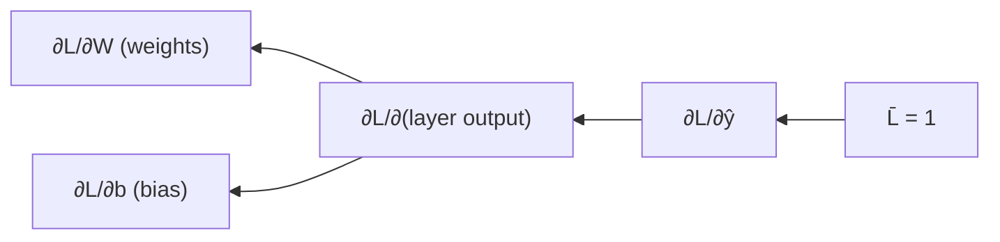

## Loss Functions and Their Gradients (svg_diagram)

### Purpose in the Learning Pipeline

A loss function maps model predictions and true targets to a single scalar value quantifying error. This scalar is the node at which the backward pass (established in prior topics) begins, with $\bar{L} = 1$ as the initial adjoint. The gradient of the loss with respect to model parameters is what drives gradient-based optimization.

### Mean Squared Error (MSE)

For $n$ predictions $\hat{y}_i$ against targets $y_i$:

$$L_{MSE} = \frac{1}{n} \sum_{i=1}^{n} (\hat{y}_i - y_i)^2$$

**Gradient with respect to a single prediction:**

$$\frac{\partial L_{MSE}}{\partial \hat{y}_i} = \frac{2}{n}(\hat{y}_i - y_i)$$

**Derivation:** Let $e_i = \hat{y}_i - y_i$. Then $L = \frac{1}{n}\sum e_i^2$. By the power rule and linearity of differentiation:

$$\frac{\partial L}{\partial \hat{y}_i} = \frac{1}{n} \cdot 2e_i \cdot \frac{\partial e_i}{\partial \hat{y}_i} = \frac{2}{n}(\hat{y}_i - y_i)$$

since $\partial e_i / \partial \hat{y}_i = 1$.

**Worked numeric example:** $\hat{y} = [2.0, 3.5]$, $y = [1.0, 3.0]$, $n=2$:

$$
\begin{aligned}
L_{MSE} &= \frac{1}{2}\left[(2.0-1.0)^2 + (3.5-3.0)^2\right] = \frac{1}{2}(1.0 + 0.25) = 0.625 \\
\frac{\partial L}{\partial \hat{y}_1} &= \frac{2}{2}(2.0 - 1.0) = 1.0 \\
\frac{\partial L}{\partial \hat{y}_2} &= \frac{2}{2}(3.5 - 3.0) = 0.5
\end{aligned}
$$

### Mean Absolute Error (MAE)

$$L_{MAE} = \frac{1}{n}\sum_{i=1}^{n} |\hat{y}_i - y_i|$$

**Gradient:**

$$\frac{\partial L_{MAE}}{\partial \hat{y}_i} = \frac{1}{n} \cdot \text{sign}(\hat{y}_i - y_i)$$

This is undefined at $\hat{y}_i = y_i$ (the derivative of $|x|$ has a discontinuity at $x=0$). In practice, this point is measure-zero and rarely encountered exactly with floating-point predictions, but implementations typically define $\text{sign}(0) = 0$ as a convention. [Inference] This convention choice is a reasoned default to avoid undefined behavior at exact equality, not a claim about any specific framework's confirmed internal choice. [Unverified] Whether any particular library uses this exact convention was not checked against current documentation in this session.

### Binary Cross-Entropy (BCE)

For a single prediction $\hat{y} \in (0,1)$ (typically a sigmoid output) and binary target $y \in \{0,1\}$:

$$L_{BCE} = -\left[y \log(\hat{y}) + (1-y)\log(1-\hat{y})\right]$$

**Gradient with respect to $\hat{y}$:**

$$\frac{\partial L_{BCE}}{\partial \hat{y}} = -\frac{y}{\hat{y}} + \frac{1-y}{1-\hat{y}}$$

**Derivation:** Differentiate each term separately using $\frac{d}{du}\log(u) = 1/u$:

$$
\begin{aligned}
\frac{\partial}{\partial \hat{y}}\left[-y\log(\hat{y})\right] &= -\frac{y}{\hat{y}} \\
\frac{\partial}{\partial \hat{y}}\left[-(1-y)\log(1-\hat{y})\right] &= -(1-y) \cdot \frac{-1}{1-\hat{y}} = \frac{1-y}{1-\hat{y}}
\end{aligned}
$$

Summing gives the result above.

**Numerical stability note:** As $\hat{y} \to 0$ or $\hat{y} \to 1$, this gradient can become very large in magnitude due to division by a value approaching zero. [Inference] This is a direct consequence of the algebraic form of the gradient shown above, not an external claim. Implementations commonly combine BCE with a preceding sigmoid into a single fused operation for improved numerical stability. [Unverified] Whether this fusion is the default behavior in any specific current framework was not verified in this session.

### Cross-Entropy Loss (Multi-Class, with Softmax)

For $K$ classes, with softmax output $\hat{y}_k = \frac{e^{z_k}}{\sum_{j=1}^{K} e^{z_j}}$ from logits $z$, and one-hot target $y$:

$$L_{CE} = -\sum_{k=1}^{K} y_k \log(\hat{y}_k)$$

**A notable simplification:** when cross-entropy is composed with softmax, the gradient with respect to the pre-softmax logits $z_k$ simplifies to:

$$\frac{\partial L_{CE}}{\partial z_k} = \hat{y}_k - y_k$$

**Derivation sketch:** This requires the softmax Jacobian:

$$\frac{\partial \hat{y}_i}{\partial z_k} = \hat{y}_i(\delta_{ik} - \hat{y}_k)$$

where $\delta_{ik}$ is the Kronecker delta (1 if $i=k$, else 0). Applying the chain rule through the sum over $k$ in $L_{CE}$ and simplifying the resulting terms yields the compact result $\hat{y}_k - y_k$. [Inference] This is a standard textbook derivation result reached through algebraic simplification; the full multi-line algebraic expansion is omitted here for brevity, and I have not re-derived every intermediate cancellation step in this session to confirm no transcription error exists in this summary.

This simplification is one reason cross-entropy and softmax are frequently implemented as a single fused operation rather than composed separately. [Unverified] Whether this fusion is standard or default practice in any specific current framework was not verified in this session.

### Loss Landscape Visualization (MSE, single parameter)

<svg xmlns="http://www.w3.org/2000/svg" viewBox="0 0 640 380" font-family="sans-serif">
  <text x="20" y="24" font-size="15" font-weight="bold">MSE Loss Curve and Gradient Direction (svg_diagram)</text>

  <line x1="60" y1="320" x2="600" y2="320" stroke="black" stroke-width="1.5" />
  <line x1="60" y1="320" x2="60" y2="40" stroke="black" stroke-width="1.5" />
  <text x="600" y="340" font-size="12">ŷ</text>
  <text x="40" y="40" font-size="12">L</text>

  <path d="M 100 300 Q 320 40 540 300" fill="none" stroke="black" stroke-width="2" />

  <circle cx="200" cy="160" r="5" fill="black" />
  <line x1="200" y1="160" x2="260" y2="100" stroke="red" stroke-width="2" marker-end="url(#arrow)" />
  <text x="265" y="95" font-size="12" fill="red">gradient direction</text>
  <text x="150" y="185" font-size="12">point on curve</text>

  <circle cx="320" cy="60" r="5" fill="blue" />
  <text x="330" y="55" font-size="12" fill="blue">minimum (∂L/∂ŷ = 0)</text>

  </svg>

### Gradient Flow: Loss to Parameters

The loss gradient with respect to a prediction is only the first step. In a full model, the chain rule continues backward from $\partial L / \partial \hat{y}$ through every layer to reach $\partial L / \partial \theta$ for each parameter $\theta$:

This connects directly to the reverse-mode traversal mechanics established earlier: the loss node is simply the root of the computational graph, and $\partial L/\partial \hat y$ is the first adjoint computed before propagation continues into the model itself.

### Comparison Table

| Loss | Formula | Gradient (w.r.t. prediction/logit) | Common use case |
|---|---|---|---|
| MSE | $\frac{1}{n}\sum(\hat y_i-y_i)^2$ | $\frac{2}{n}(\hat y_i - y_i)$ | Regression |
| MAE | $\frac{1}{n}\sum\lvert\hat y_i-y_i\rvert$ | $\frac{1}{n}\text{sign}(\hat y_i-y_i)$ | Regression, robust to outliers |
| BCE | $-[y\log\hat y+(1-y)\log(1-\hat y)]$ | $-\frac{y}{\hat y}+\frac{1-y}{1-\hat y}$ | Binary classification |
| Softmax + CE | $-\sum y_k\log\hat y_k$ | $\hat y_k - y_k$ (w.r.t. logits) | Multi-class classification |

[Inference] The "common use case" column reflects widely taught conventions in standard machine learning curricula, reasoned from the mathematical properties of each loss (e.g., MAE's reduced sensitivity to outliers follows algebraically from the absence of squaring). This is not sourced from a specific verified current document in this session.

### Why the Softmax+CE Simplification Matters Computationally

Computing $\partial \hat{y}_k/\partial z_j$ via the full softmax Jacobian and then multiplying through the cross-entropy gradient is more computationally expensive and more numerically fragile (due to exponentials and divisions) than directly using the simplified $\hat{y}_k - y_k$ form. [Inference] This follows from comparing the operation counts and intermediate exponential/logarithmic terms in the two approaches, reasoned algebraically rather than benchmarked in this session. [Unverified] No runtime or numerical-stability benchmark was executed in this session to confirm the magnitude of this difference.

### Key Points

- Every loss function's gradient is the entry point adjoint ($\bar L = 1$) for the reverse-mode backward pass described in prior topics.
- MSE and MAE gradients follow directly from the power rule and the derivative of the absolute value function, respectively.
- BCE's gradient can grow large near $\hat y \in \{0,1\}$, a direct algebraic consequence of division by a near-zero denominator.
- The softmax+cross-entropy gradient simplifies to $\hat y_k - y_k$, a widely cited textbook result; the full derivation was not re-verified line-by-line in this session.
- [Unverified] Claims about specific framework implementation choices (fused operations, sign conventions, default behaviors) were not checked against current documentation and should not be treated as confirmed.

### Related Topics

- Chain rule continuation from loss gradient into dense/linear layer gradients
- Softmax Jacobian full derivation
- Gradient clipping for numerical stability
- Regularization terms and their gradient contributions (L1/L2 penalty gradients)
- Custom loss function implementation within an autodiff engine
- Numerical stability techniques (log-sum-exp trick) for cross-entropy computation