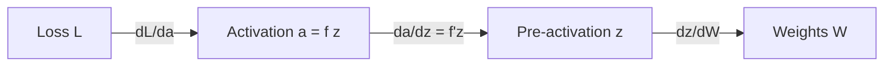
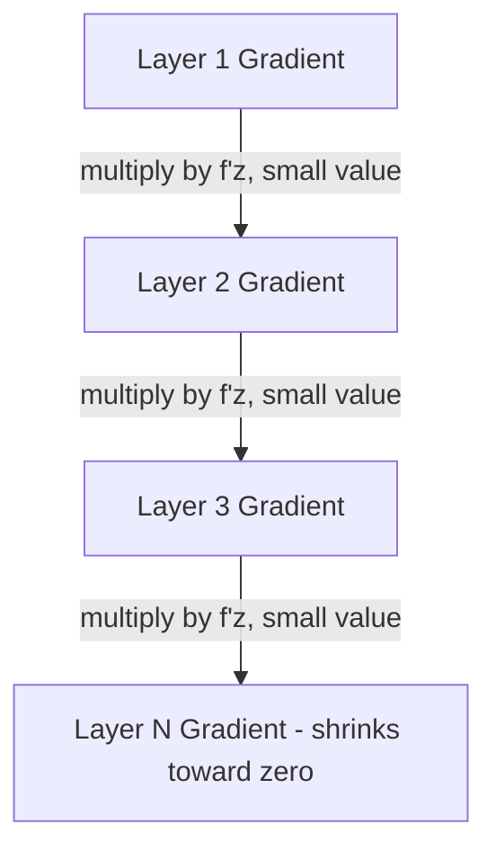

## Backpropagation Through Activation Functions

### Role of Activation Functions in Backpropagation

Activation functions introduce nonlinearity into neural networks, allowing them to approximate complex functions. During backpropagation, the derivative of each activation function determines how error signals (gradients) flow backward through the network. This is a direct application of the chain rule from calculus.

For a neuron with pre-activation value $z$ and activation output $a = f(z)$, the gradient of the loss $L$ with respect to $z$ is:

$$\frac{\partial L}{\partial z} = \frac{\partial L}{\partial a} \cdot \frac{\partial a}{\partial z} = \frac{\partial L}{\partial a} \cdot f'(z)$$

This local derivative $f'(z)$ is computed at every layer and multiplied through the chain during the backward pass.

### The Chain Rule Recap

For a network layer defined as:

$$z = Wx + b, \quad a = f(z)$$

The gradient with respect to weights $W$ requires three chained derivatives:

$$\frac{\partial L}{\partial W} = \frac{\partial L}{\partial a} \cdot \frac{\partial a}{\partial z} \cdot \frac{\partial z}{\partial W}$$

The activation function contributes the middle term, $\frac{\partial a}{\partial z} = f'(z)$. If this term is very small or very large, it directly affects gradient magnitude propagated to earlier layers.

### Common Activation Functions and Their Derivatives

**Sigmoid**

$$f(z) = \frac{1}{1 + e^{-z}}$$

$$f'(z) = f(z)\big(1 - f(z)\big)$$

The derivative is expressed conveniently in terms of the function's own output, which is computationally efficient during backpropagation.

**Key Points**

- Maximum derivative value is $0.25$, occurring at $z = 0$.
- For large $|z|$, $f'(z) \to 0$, contributing to the vanishing gradient problem.
- [Inference] Because gradients through sigmoid layers are bounded above by $0.25$, stacking many sigmoid layers tends to shrink gradients multiplicatively during backpropagation. This is a mathematical consequence of the derivative's bound, not an empirical claim about any specific model.

**Tanh**

$$f(z) = \tanh(z) = \frac{e^z - e^{-z}}{e^z + e^{-z}}$$

$$f'(z) = 1 - \tanh^2(z)$$

**Key Points**

- Output range is $(-1, 1)$, zero-centered, which [Inference] can make optimization more stable than sigmoid in some architectures, though this depends on the specific network and data.
- Maximum derivative value is $1$, at $z = 0$.
- Still saturates for large $|z|$, so vanishing gradients remain possible.

**ReLU (Rectified Linear Unit)**

$$f(z) = \max(0, z)$$

$$f'(z) = \begin{cases} 1 & z > 0 \\ 0 & z < 0 \\ \text{undefined} & z = 0 \end{cases}$$

In practice, the derivative at $z = 0$ is typically set to $0$ or $1$ by convention in most deep learning frameworks. [Unverified] The exact convention used may differ between specific libraries and versions, so this should be confirmed against the documentation of the framework in use.

**Key Points**

- Does not saturate for $z > 0$, which helps gradients propagate through many layers.
- Can cause the "dying ReLU" problem, where neurons with $z < 0$ persistently output zero gradient and stop updating. [Inference] This is a mathematical consequence of the derivative being zero for negative inputs, though whether it occurs in a given trained network is an empirical matter that depends on initialization, learning rate, and data.

**Leaky ReLU**

$$f(z) = \begin{cases} z & z > 0 \\ \alpha z & z \leq 0 \end{cases}, \quad \alpha \text{ typically small (e.g., } 0.01\text{)}$$

$$f'(z) = \begin{cases} 1 & z > 0 \\ \alpha & z \leq 0 \end{cases}$$

**Key Points**

- Allows a small, nonzero gradient when $z \leq 0$.
- [Inference] This design is intended to address the dying ReLU problem by keeping the derivative nonzero for negative inputs, though whether it fully addresses the issue in a specific network is not guaranteed and depends on training dynamics.

**Softmax**

Used typically in output layers for multi-class classification:

$$f(z_i) = \frac{e^{z_i}}{\sum_{j} e^{z_j}}$$

The Jacobian of softmax is more complex than the other functions since each output depends on all inputs:

$$\frac{\partial a_i}{\partial z_j} = a_i(\delta_{ij} - a_j)$$

where $\delta_{ij}$ is the Kronecker delta ($1$ if $i = j$, $0$ otherwise).

**Key Points**

- Softmax is commonly paired with cross-entropy loss, which [Inference] often simplifies the combined gradient to $a_i - y_i$ (predicted minus true label), reducing computational complexity. This simplification is a known mathematical result for that specific loss-activation pairing; it does not generalize to arbitrary loss functions paired with softmax.

### Visualizing Derivative Behavior

<svg xmlns="http://www.w3.org/2000/svg" viewBox="0 0 700 420" font-family="sans-serif">
<text x="350" y="25" text-anchor="middle" font-size="16" font-weight="bold">Activation Function Derivatives (svg_diagram)</text>

<line x1="60" y1="350" x2="650" y2="350" stroke="black" stroke-width="1.5" />
<line x1="60" y1="350" x2="60" y2="50" stroke="black" stroke-width="1.5" />
<text x="355" y="380" text-anchor="middle" font-size="13">z</text>
<text x="30" y="200" text-anchor="middle" font-size="13" transform="rotate(-90 30 200)">f'(z)</text>

<line x1="60" y1="200" x2="650" y2="200" stroke="#ccc" stroke-dasharray="4" />
<text x="45" y="204" text-anchor="end" font-size="11">0</text>

<path d="M 60 340 C 150 340, 250 100, 355 90 C 460 100, 560 340, 650 340" fill="none" stroke="`#2563eb`" stroke-width="2.5" />

<text x="480" y="120" fill="`#2563eb`" font-size="12" font-weight="bold">Sigmoid f'(z)</text>

<path d="M 60 345 C 180 345, 280 60, 355 55 C 430 60, 530 345, 650 345" fill="none" stroke="`#16a34a`" stroke-width="2.5" />

<text x="380" y="45" fill="`#16a34a`" font-size="12" font-weight="bold">Tanh f'(z)</text>

<line x1="60" y1="345" x2="355" y2="345" stroke="#dc2626" stroke-width="2.5" />
<line x1="355" y1="345" x2="355" y2="80" stroke="#dc2626" stroke-width="2.5" stroke-dasharray="3" />
<line x1="355" y1="80" x2="650" y2="80" stroke="#dc2626" stroke-width="2.5" />
<text x="500" y="70" fill="#dc2626" font-size="12" font-weight="bold">ReLU f'(z)</text>

<line x1="355" y1="350" x2="355" y2="355" stroke="black" stroke-width="1.5" />
<text x="355" y="368" text-anchor="middle" font-size="11">0</text>
</svg>

### Layer-by-Layer Backward Pass Example

Consider a simple two-layer network:

$$z_1 = W_1 x + b_1, \quad a_1 = \sigma(z_1)$$

$$z_2 = W_2 a_1 + b_2, \quad a_2 = \sigma(z_2)$$

$$L = \text{loss}(a_2, y)$$

Backward pass, step by step:

1. Compute $\frac{\partial L}{\partial a_2}$ from the loss function.
2. Compute $\frac{\partial L}{\partial z_2} = \frac{\partial L}{\partial a_2} \cdot \sigma'(z_2)$.
3. Compute $\frac{\partial L}{\partial W_2} = \frac{\partial L}{\partial z_2} \cdot a_1^T$ and $\frac{\partial L}{\partial b_2} = \frac{\partial L}{\partial z_2}$.
4. Propagate to previous layer: $\frac{\partial L}{\partial a_1} = W_2^T \cdot \frac{\partial L}{\partial z_2}$.
5. Compute $\frac{\partial L}{\partial z_1} = \frac{\partial L}{\partial a_1} \cdot \sigma'(z_1)$.
6. Compute $\frac{\partial L}{\partial W_1} = \frac{\partial L}{\partial z_1} \cdot x^T$ and $\frac{\partial L}{\partial b_1} = \frac{\partial L}{\partial z_1}$.

**Example**

Suppose $z_1 = 0.5$ using sigmoid activation.

$$\sigma(0.5) \approx 0.622$$

$$\sigma'(0.5) = 0.622 \times (1 - 0.622) \approx 0.235$$

If the upstream gradient $\frac{\partial L}{\partial a_1} = 0.8$, then:

$$\frac{\partial L}{\partial z_1} = 0.8 \times 0.235 \approx 0.188$$

This computed value shows how the local derivative scales the gradient passed backward. [Unverified] Exact numerical results in a real implementation may differ slightly due to floating-point precision and framework-specific computation order.

### Vanishing and Exploding Gradients

When many layers use saturating activation functions (sigmoid, tanh), repeated multiplication of small derivatives during the chain rule can cause gradients to shrink toward zero in early layers. [Inference] This is a mathematical consequence of multiplying several numbers less than 1 together across layers, though the practical severity depends on network depth, weight initialization, and specific architecture.

Conversely, if weight magnitudes are large, gradients can grow exponentially through the layers, a phenomenon known as exploding gradients. [Inference] This is also a consequence of the chain rule's multiplicative structure, not a guaranteed outcome in every network.

**Key Points**

- Techniques such as ReLU-family activations, batch normalization, residual connections, and careful weight initialization are commonly used to address these issues. [Unverified] The degree to which each technique mitigates vanishing or exploding gradients varies by architecture and is an active area of empirical research; no single technique removes the issue in all cases.
- Gradient clipping is a technique often applied specifically to address exploding gradients by capping gradient magnitude during training.

### Computational Efficiency in Derivative Calculation

Many activation function derivatives are expressed in terms of the function's own forward-pass output (e.g., sigmoid and tanh), which allows frameworks to reuse already-computed values rather than recomputing them from $z$. [Inference] This is a common implementation optimization based on the mathematical form of these derivatives, though specific framework implementations may vary and should be verified against official documentation if precise behavior is needed.

### Conclusion

Backpropagation through activation functions is a direct application of the calculus chain rule, where each layer's local derivative scales the gradient signal passed backward. The choice of activation function affects gradient magnitude, training stability, and susceptibility to vanishing or exploding gradients. Understanding these derivatives analytically is foundational to understanding why certain architectural choices are made in practice.

**Related Topics**

- Chain rule fundamentals for multivariable functions
- Partial derivatives and the Jacobian matrix
- Vanishing and exploding gradient problem in depth
- Weight initialization strategies (Xavier, He initialization)
- Batch normalization and its calculus-based derivation
- Gradient descent optimization algorithms
- Second-order derivatives and the Hessian matrix in optimization
- Computational graphs and automatic differentiation