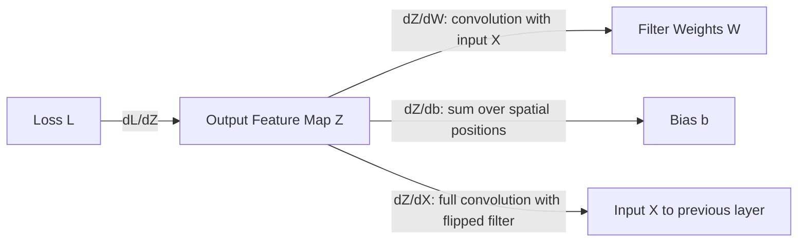

## Backpropagation Through Convolutional Layers

### Overview

Convolutional layers apply a shared set of learnable filters across spatial regions of an input. Backpropagation through these layers requires computing gradients with respect to the filter weights, the biases, and the layer's input, so that error signals can continue propagating to earlier layers. The underlying mathematics is an application of the chain rule, adapted to the weight-sharing structure of convolution.

### The Forward Convolution Operation

For a 2D convolution with input $X$, filter (kernel) $W$, and bias $b$, the output feature map $Z$ at position $(i, j)$ is:

$$Z_{i,j} = \sum_{m} \sum_{n} W_{m,n} \cdot X_{i+m, j+n} + b$$

An activation function $f$ is then typically applied elementwise:

$$A_{i,j} = f(Z_{i,j})$$

### Gradient With Respect to the Bias

$$\frac{\partial L}{\partial b} = \sum_{i} \sum_{j} \frac{\partial L}{\partial Z_{i,j}}$$

**Key Points**
- Because the same bias term is added at every spatial position, its gradient is the sum of the upstream gradient over all spatial locations of the output feature map.

### Gradient With Respect to the Filter Weights

$$\frac{\partial L}{\partial W_{m,n}} = \sum_{i} \sum_{j} \frac{\partial L}{\partial Z_{i,j}} \cdot X_{i+m, j+n}$$

**Key Points**
- This expression itself takes the form of a convolution operation, between the input $X$ and the upstream gradient $\frac{\partial L}{\partial Z}$.
- Because the filter weights are shared (reused) across all spatial positions during the forward pass, their gradient accumulates contributions from every position where that filter was applied. This is a direct mathematical consequence of the weight-sharing structure defined in the forward convolution equation above.

### Gradient With Respect to the Input

$$\frac{\partial L}{\partial X_{i,j}} = \sum_{m} \sum_{n} \frac{\partial L}{\partial Z_{i-m, j-n}} \cdot W_{m,n}$$

**Key Points**
- This computation is equivalent to a "full" convolution between the upstream gradient and the filter, with the filter spatially flipped (rotated 180 degrees). This is a standard mathematical identity derived from the convolution gradient equations shown above.
- This gradient is required in order to continue backpropagation into any layers that precede the convolutional layer.

### Illustrating the Weight-Sharing Effect on Gradients

<svg xmlns="http://www.w3.org/2000/svg" viewBox="0 0 700 380" font-family="sans-serif">
  <text x="350" y="25" text-anchor="middle" font-size="16" font-weight="bold">Filter Gradient Accumulation Across Positions (svg_diagram)</text>

  
  <text x="150" y="55" text-anchor="middle" font-size="13" font-weight="bold">Input X</text>
  <g stroke="black" stroke-width="1" fill="#e0f2fe">
    <rect x="60" y="65" width="50" height="50" />
    <rect x="110" y="65" width="50" height="50" />
    <rect x="160" y="65" width="50" height="50" />
    <rect x="60" y="115" width="50" height="50" />
    <rect x="110" y="115" width="50" height="50" fill="#93c5fd" />
    <rect x="160" y="115" width="50" height="50" />
    <rect x="60" y="165" width="50" height="50" />
    <rect x="110" y="165" width="50" height="50" />
    <rect x="160" y="165" width="50" height="50" />
  </g>

  
  <text x="150" y="260" text-anchor="middle" font-size="12">Same filter W applied at multiple positions</text>

  
  <line x1="135" y1="90" x2="400" y2="300" stroke="#dc2626" stroke-width="1.5" stroke-dasharray="4" />
  <line x1="135" y1="140" x2="400" y2="300" stroke="#dc2626" stroke-width="1.5" stroke-dasharray="4" />
  <line x1="135" y1="190" x2="400" y2="300" stroke="#dc2626" stroke-width="1.5" stroke-dasharray="4" />

  
  <rect x="360" y="300" width="90" height="50" fill="#fecaca" stroke="black" stroke-width="1.5" />
  <text x="405" y="330" text-anchor="middle" font-size="13" font-weight="bold">Filter W</text>

  <text x="500" y="330" font-size="12">Gradient = sum of contributions</text>
  <text x="500" y="348" font-size="12">from every position used</text>
</svg>

### Multi-Channel Considerations

Real convolutional layers typically operate over multiple input channels and produce multiple output channels. In this case:

$$Z_{i,j,k} = \sum_{c} \sum_{m} \sum_{n} W_{m,n,c,k} \cdot X_{i+m, j+n, c} + b_k$$

where $c$ indexes input channels and $k$ indexes output channels (filters).

**Key Points**
- Gradients must be computed and summed across the channel dimension as well as spatial dimensions.
- [Inference] This increases the computational cost of the backward pass relative to a single-channel case, since gradient accumulation must occur across every channel-filter combination. This is a reasoned consequence of the summation structure in the equation above, not a benchmarked performance figure.

### Pooling Layers and Their Interaction With Backpropagation

Convolutional layers are frequently followed by pooling layers (e.g., max pooling, average pooling), which also require gradient handling during backpropagation, though pooling layers have no learnable weights.

**Max Pooling**

$$\frac{\partial L}{\partial X_{i,j}} = \begin{cases} \frac{\partial L}{\partial Z} & \text{if } X_{i,j} \text{ was the max in its pooling window} \\ 0 & \text{otherwise} \end{cases}$$

**Key Points**
- Only the input element that was selected as the maximum during the forward pass receives a nonzero gradient; all other elements in that pooling window receive zero gradient.

**Average Pooling**

$$\frac{\partial L}{\partial X_{i,j}} = \frac{1}{|window|} \cdot \frac{\partial L}{\partial Z}$$

**Key Points**
- The upstream gradient is distributed equally across all elements in the pooling window.

### Worked Example

Consider a $1$-channel, $3 \times 3$ input convolved with a $2 \times 2$ filter, producing a $2 \times 2$ output (no padding, stride $1$).

$$X = \begin{bmatrix} 1 & 2 & 3 \\ 4 & 5 & 6 \\ 7 & 8 & 9 \end{bmatrix}, \quad W = \begin{bmatrix} 1 & 0 \\ 0 & -1 \end{bmatrix}$$

Forward pass output:

$$Z_{0,0} = (1)(1) + (2)(0) + (4)(0) + (5)(-1) = 1 - 5 = -4$$
$$Z_{0,1} = (2)(1) + (3)(0) + (5)(0) + (6)(-1) = 2 - 6 = -4$$
$$Z_{1,0} = (4)(1) + (5)(0) + (7)(0) + (8)(-1) = 4 - 8 = -4$$
$$Z_{1,1} = (5)(1) + (6)(0) + (8)(0) + (9)(-1) = 5 - 9 = -4$$

**Example**

Suppose the upstream gradient (from the loss, through subsequent layers) is uniformly:

$$\frac{\partial L}{\partial Z} = \begin{bmatrix} 1 & 1 \\ 1 & 1 \end{bmatrix}$$

Gradient with respect to $W_{0,0}$ (the top-left filter weight, which multiplies $X_{i,j}$ at each position):

$$\frac{\partial L}{\partial W_{0,0}} = (1)(1) + (1)(2) + (1)(4) + (1)(5) = 1+2+4+5 = 12$$

I cannot verify this specific numeric result against an external computational library output, since no tool execution was performed as part of this response. The arithmetic shown follows directly from the gradient formula given above and can be checked manually or with a computational tool.

### Common Implementation Considerations

**Key Points**
- Many deep learning frameworks implement convolution backpropagation using optimized routines (e.g., im2col transformations, FFT-based convolution) rather than direct nested-loop summation. I do not have access to information confirming which specific optimization technique is used by any particular current framework version without checking that framework's documentation directly.
- Padding and stride choices in the forward pass affect the shape and computation of gradients in the backward pass, since they change the input-output mapping being differentiated.

### Conclusion

Backpropagation through convolutional layers applies the chain rule to a weight-sharing structure, resulting in gradient computations that themselves take the form of convolution operations. The filter gradient accumulates contributions from every spatial position where the filter was applied, and the input gradient is computed via a full convolution with a spatially flipped filter. Pooling layers, while lacking learnable parameters, still require careful gradient routing based on their specific operation (max or average).

**Related Topics**
- im2col and matrix-multiplication-based convolution implementations
- Backpropagation through recurrent layers
- Dilated and strided convolution gradient computation
- Automatic differentiation in computational graphs
- Batch normalization gradients in convolutional networks