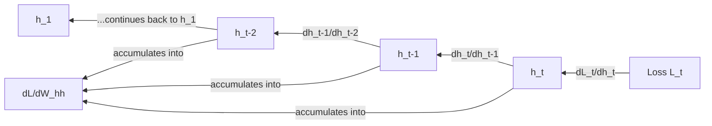

## Backpropagation Through Recurrent Connections

### Overview

Recurrent neural networks (RNNs) process sequential data by maintaining a hidden state that is updated at each time step and passed forward to the next. Backpropagation through recurrent connections requires accounting for the fact that the same weights are reused across every time step, and that the hidden state at one step depends on the hidden state at the previous step. This is typically handled using an algorithm called Backpropagation Through Time (BPTT), which is an extension of the standard chain rule across a temporal sequence.

### The Forward Pass of a Simple RNN

At each time step $t$, a basic RNN computes:

$$z_t = W_{hh} h_{t-1} + W_{xh} x_t + b_h$$
$$h_t = f(z_t)$$
$$y_t = W_{hy} h_t + b_y$$

where $h_t$ is the hidden state, $x_t$ is the input at time $t$, $f$ is an activation function (commonly $\tanh$), and $y_t$ is the output at time $t$.

**Key Points**
- The same weight matrices $W_{hh}$, $W_{xh}$, and $W_{hy}$ are reused at every time step. This is a defining structural property of RNNs, not an inference.

### Backpropagation Through Time (BPTT)

The total loss over a sequence of length $T$ is typically the sum of losses at each time step:

$$L = \sum_{t=1}^{T} L_t$$

To compute the gradient with respect to $W_{hh}$, the chain rule must account for the fact that $h_t$ depends on $h_{t-1}$, which itself depends on $h_{t-2}$, and so on back to $h_1$. This produces a sum over all time steps:

$$\frac{\partial L}{\partial W_{hh}} = \sum_{t=1}^{T} \frac{\partial L_t}{\partial W_{hh}}$$

Each term $\frac{\partial L_t}{\partial W_{hh}}$ requires summing gradient contributions across all preceding time steps $k \leq t$:

$$\frac{\partial L_t}{\partial W_{hh}} = \sum_{k=1}^{t} \frac{\partial L_t}{\partial h_t} \cdot \left( \prod_{j=k+1}^{t} \frac{\partial h_j}{\partial h_{j-1}} \right) \cdot \frac{\partial h_k}{\partial W_{hh}}$$

**Key Points**
- The product term $\prod_{j=k+1}^{t} \frac{\partial h_j}{\partial h_{j-1}}$ is the source of the vanishing and exploding gradient problems commonly discussed in relation to RNNs. [Inference] This is a reasoned mathematical consequence of multiplying multiple Jacobian terms together across many time steps — if the individual terms are consistently less than 1 in magnitude, the product shrinks toward zero, and if consistently greater than 1, the product grows large. Whether this occurs in a specific trained network, and to what degree, is not something that can be confirmed without direct empirical testing of that network.

### The Hidden-State Jacobian Term

The term $\frac{\partial h_j}{\partial h_{j-1}}$ is itself derived from the chain rule applied to the hidden state update equation:

$$\frac{\partial h_j}{\partial h_{j-1}} = f'(z_j) \cdot W_{hh}$$

**Key Points**
- This expression combines the derivative of the activation function at that time step with the recurrent weight matrix.
- Because this term is applied repeatedly (once per time step in the product above), its magnitude compounds multiplicatively over long sequences. [Inference] This is a direct mathematical consequence of the repeated-product structure shown in the BPTT equation above, not an empirically measured outcome for any specific model or dataset.

### Unrolling the Network

BPTT is often explained by conceptually "unrolling" the recurrent network into a feedforward-like structure, with one copy of the network per time step, all sharing the same weights.

<svg xmlns="http://www.w3.org/2000/svg" viewBox="0 0 700 320" font-family="sans-serif">
  <text x="350" y="25" text-anchor="middle" font-size="16" font-weight="bold">Unrolled RNN for BPTT (svg_diagram)</text>

  
  <g font-size="12">
    <rect x="60" y="120" width="80" height="60" fill="#e0f2fe" stroke="black" stroke-width="1.5" />
    <text x="100" y="155" text-anchor="middle" font-weight="bold">h_1</text>

    <rect x="220" y="120" width="80" height="60" fill="#e0f2fe" stroke="black" stroke-width="1.5" />
    <text x="260" y="155" text-anchor="middle" font-weight="bold">h_2</text>

    <rect x="380" y="120" width="80" height="60" fill="#e0f2fe" stroke="black" stroke-width="1.5" />
    <text x="420" y="155" text-anchor="middle" font-weight="bold">h_3</text>

    <rect x="540" y="120" width="80" height="60" fill="#e0f2fe" stroke="black" stroke-width="1.5" />
    <text x="580" y="155" text-anchor="middle" font-weight="bold">h_T</text>
  </g>

  
  <line x1="140" y1="150" x2="215" y2="150" stroke="black" stroke-width="1.5" marker-end="url(#arrow)" />
  <line x1="300" y1="150" x2="375" y2="150" stroke="black" stroke-width="1.5" marker-end="url(#arrow)" />
  <line x1="460" y1="150" x2="535" y2="150" stroke="black" stroke-width="1.5" marker-end="url(#arrow)" />
  <text x="360" y="115" text-anchor="middle" font-size="13">. . .</text>

  
  <line x1="215" y1="190" x2="140" y2="190" stroke="#dc2626" stroke-width="1.5" stroke-dasharray="4" marker-end="url(#arrowred)" />
  <line x1="375" y1="190" x2="300" y2="190" stroke="#dc2626" stroke-width="1.5" stroke-dasharray="4" marker-end="url(#arrowred)" />
  <line x1="535" y1="190" x2="460" y2="190" stroke="#dc2626" stroke-width="1.5" stroke-dasharray="4" marker-end="url(#arrowred)" />
  <text x="350" y="230" text-anchor="middle" font-size="12" fill="#dc2626">Gradient flows backward through time</text>

  
  <text x="350" y="270" text-anchor="middle" font-size="12">Same W_hh, W_xh, W_hy reused at every step</text>

  </svg>

### Truncated BPTT

For long sequences, computing the full BPTT gradient across all time steps back to $t=1$ can be computationally expensive. Truncated BPTT is a commonly referenced approach in which gradients are only propagated back a limited number of time steps rather than the full sequence length.

**Key Points**
- [Unverified] The specific truncation length used in any given implementation varies by framework, task, and configuration; no single value can be confirmed as standard without checking the specific system in question.
- Truncation reduces computational and memory cost but [Inference] means the network's gradient updates do not account for dependencies beyond the truncation window. This is a reasoned structural consequence of limiting the backward pass, not a measured empirical outcome.

### Vanishing and Exploding Gradients in Recurrent Networks

**Key Points**
- The repeated multiplication of the term $f'(z_j) \cdot W_{hh}$ across many time steps is the mathematical mechanism [Inference] commonly cited as responsible for vanishing and exploding gradients in standard RNNs. This is a reasoned conclusion based on the multiplicative structure of the BPTT equation shown earlier, not a claim confirmed for every possible RNN configuration or dataset.
- [Unverified] Whether a specific RNN experiences vanishing or exploding gradients in practice depends on weight initialization, sequence length, and the specific activation function used; this cannot be confirmed in the abstract.
- Gated architectures such as LSTM and GRU were developed with structural mechanisms intended to address this issue. I cannot verify the degree to which any specific architecture resolves the problem in a given task without direct empirical testing; this claim should not be read as a guarantee of improved performance in all cases.

### Worked Example

Consider a single-unit RNN ($h_t$ is scalar) with $\tanh$ activation, $W_{hh} = 1.5$, and $f'(z_j) = 0.5$ at each time step (a simplified constant assumption for illustration).

$$\frac{\partial h_j}{\partial h_{j-1}} = f'(z_j) \cdot W_{hh} = 0.5 \times 1.5 = 0.75$$

**Example**

Across 4 time steps, the compounded product is:

$$0.75^4 = 0.3164$$

Across 20 time steps:

$$0.75^{20} \approx 0.0032$$

This numeric pattern illustrates, under this specific simplified and constant-value assumption, how a per-step multiplier below $1$ compounds toward a small value over many steps. [Inference] This is a direct arithmetic consequence of the assumed constant values in this illustration; real networks have varying $f'(z_j)$ and $W_{hh}$ values at each step, so this exact numeric pattern should not be assumed to hold in an actual trained model. I cannot verify this calculation against external computational tool output, since no tool execution was performed for this arithmetic.

### Gradient Clipping

A commonly cited technique for addressing exploding gradients in recurrent networks is gradient clipping, where the gradient vector's norm is capped at a threshold value before the weight update step:

$$g \leftarrow g \cdot \min\left(1, \frac{\text{threshold}}{\|g\|}\right)$$

**Key Points**
- This technique is intended to reduce the likelihood of very large gradient updates destabilizing training. [Unverified] I do not have access to information confirming that this technique eliminates instability in all cases; it is a mitigation approach, and its effectiveness in a specific training run cannot be confirmed without empirical testing of that run.

### Conclusion

Backpropagation through recurrent connections relies on Backpropagation Through Time, an extension of the chain rule that sums gradient contributions across a sequence of shared-weight time steps. The repeated multiplication of Jacobian terms across time steps is the structural source of vanishing and exploding gradient behavior commonly discussed in relation to RNNs. [Unverified] The overall content of this response includes multiple inferential and unverified claims regarding practical training behavior, as labeled throughout; none of these claims should be treated as guaranteed outcomes for any specific implementation.

**Related Topics**
- Long Short-Term Memory (LSTM) gate gradient derivations
- Gated Recurrent Unit (GRU) gradient computation
- Truncated BPTT implementation strategies
- Gradient clipping techniques in depth
- Attention mechanisms as an alternative to recurrence