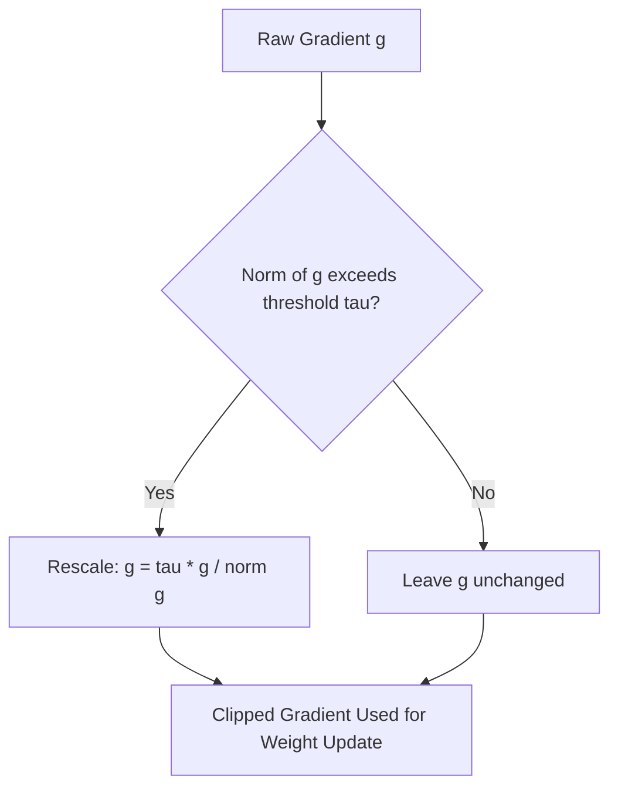

## Gradient Clipping and Numerical Stability

### Overview

Gradient clipping is a technique applied during neural network training to limit the magnitude of gradients before they are used to update weights. It is commonly discussed in the context of numerical stability, particularly for architectures prone to exploding gradients, such as recurrent neural networks. This section covers the mathematical formulation of gradient clipping and related numerical stability considerations from a calculus perspective.

### Why Gradients Can Become Numerically Unstable

During backpropagation, gradients are computed through repeated application of the chain rule across layers or time steps:

$$\frac{\partial L}{\partial \theta} = \frac{\partial L}{\partial a_n} \cdot \frac{\partial a_n}{\partial a_{n-1}} \cdots \frac{\partial a_1}{\partial \theta}$$

**Key Points**
- If the individual Jacobian terms in this product are consistently greater than $1$ in magnitude, the overall product can grow very large across many layers or time steps. [Inference] This is a reasoned mathematical consequence of repeated multiplication of terms greater than 1, not an empirical measurement for any specific network.
- Large gradient values can cause correspondingly large weight updates, which [Inference] may destabilize training by causing loss values to oscillate or diverge. I cannot verify that this outcome occurs in any specific training run without empirical testing of that run.

### Gradient Norm Clipping (Clipping by Norm)

The most commonly cited form of gradient clipping rescales the entire gradient vector if its norm exceeds a threshold:

$$g \leftarrow \begin{cases} g & \text{if } \|g\| \leq \tau \\ \tau \cdot \dfrac{g}{\|g\|} & \text{if } \|g\| > \tau \end{cases}$$

where $g$ is the gradient vector, $\|g\|$ is its norm (commonly the L2 norm), and $\tau$ is a chosen threshold value.

**Key Points**
- This operation preserves the *direction* of the gradient vector while reducing its magnitude when the norm exceeds $\tau$. This is a direct mathematical property of the scaling operation shown above.
- The choice of $\tau$ is a hyperparameter. [Unverified] I do not have access to information confirming a universally standard value for $\tau$; commonly referenced ranges vary by source and task, and any specific number should be checked against current, task-specific documentation or literature rather than assumed.

### Gradient Value Clipping (Clipping by Value)

An alternative approach clips each component of the gradient vector independently to a fixed range:

$$g_i \leftarrow \max(-c, \min(c, g_i))$$

where $c$ is a chosen clipping bound and $g_i$ is an individual component of the gradient.

**Key Points**
- Unlike norm clipping, this method does not preserve the direction of the gradient vector, since each component is clipped independently. This is a direct mathematical consequence of applying the clipping operation elementwise rather than to the vector as a whole.
- [Inference] This distinction suggests norm clipping may be more commonly preferred when preserving the relative relationship between gradient components is considered important, though I cannot verify preference patterns across practitioners or frameworks without a specific source.

### Visualizing Gradient Norm Clipping

<svg xmlns="http://www.w3.org/2000/svg" viewBox="0 0 700 420" font-family="sans-serif">
  <text x="350" y="25" text-anchor="middle" font-size="16" font-weight="bold">Gradient Norm Clipping (svg_diagram)</text>

  
  <line x1="350" y1="380" x2="350" y2="60" stroke="black" stroke-width="1" />
  <line x1="150" y1="220" x2="600" y2="220" stroke="black" stroke-width="1" />
  <text x="610" y="225" font-size="12">g_1</text>
  <text x="360" y="70" font-size="12">g_2</text>

  
  <circle cx="350" cy="220" r="120" fill="none" stroke="#16a34a" stroke-width="2" stroke-dasharray="5" />
  <text x="350" y="345" text-anchor="middle" font-size="12" fill="#16a34a">Clipping boundary (radius = tau)</text>

  
  <line x1="350" y1="220" x2="540" y2="100" stroke="#dc2626" stroke-width="2.5" marker-end="url(#arrowred2)" />
  <text x="545" y="95" fill="#dc2626" font-size="12" font-weight="bold">Original g (norm &gt; tau)</text>

  
  <line x1="350" y1="220" x2="450" y2="155" stroke="#2563eb" stroke-width="2.5" marker-end="url(#arrowblue2)" />
  <text x="410" y="145" fill="#2563eb" font-size="12" font-weight="bold">Clipped g</text>

  </svg>

### Worked Example: Norm Clipping

Suppose a gradient vector is:

$$g = [3, 4]$$

Its L2 norm is:

$$\|g\| = \sqrt{3^2 + 4^2} = \sqrt{9+16} = \sqrt{25} = 5$$

**Example**

If the clipping threshold is $\tau = 2$, and $\|g\| = 5 > \tau$, the clipped gradient is:

$$g_{clipped} = 2 \cdot \frac{[3,4]}{5} = 2 \cdot [0.6, 0.8] = [1.2, 1.6]$$

Verification of the clipped norm:

$$\|g_{clipped}\| = \sqrt{1.2^2 + 1.6^2} = \sqrt{1.44 + 2.56} = \sqrt{4} = 2$$

This arithmetic follows directly from the formula shown above. I cannot verify this against external computational tool output, since no tool execution was performed as part of this response.

### Other Numerical Stability Techniques Related to Calculus

**Gradient Normalization**

Some approaches rescale gradients based on a running estimate of their typical magnitude, rather than a fixed threshold. [Unverified] I do not have access to confirmed details on which specific normalization schemes are used by which specific current frameworks by default; this would need to be checked against current framework documentation.

**Careful Weight Initialization**

Initialization schemes such as Xavier/Glorot or He initialization are commonly cited as approaches intended to keep the variance of activations and gradients roughly stable across layers at the start of training.

$$\text{Var}(W) = \frac{1}{n_{in}} \quad \text{(one commonly cited Xavier-style formulation)}$$

**Key Points**
- [Inference] These formulas are derived by analyzing how variance propagates through layers under certain simplifying assumptions (e.g., linear or near-linear activation behavior at initialization). This is a reasoned mathematical derivation, not a claim that any specific initialization scheme resolves instability for every architecture or training scenario.
- [Unverified] Exact formulations differ slightly across cited sources and framework implementations; the expression above should be treated as illustrative rather than an authoritative universal formula, and should be checked against a specific reference if precision is required.

**Learning Rate Scaling**

Reducing the learning rate is another commonly cited approach to reducing the impact of large gradient values on weight updates, since the update rule is:

$$\theta \leftarrow \theta - \eta \cdot g$$

**Key Points**
- A smaller learning rate $\eta$ [Inference] reduces the magnitude of each individual weight update for a given gradient value, which is a direct mathematical consequence of the update rule shown above, not an empirical claim about training outcomes.

### Numerical Stability in Floating-Point Computation

**Key Points**
- Beyond gradient magnitude, numerical stability in deep learning also relates to floating-point precision limits (e.g., single vs. half precision arithmetic). [Unverified] I do not have access to confirmed, current details on default precision settings used by specific frameworks or hardware without checking current documentation directly.
- Operations such as the softmax function are commonly implemented with numerical stability adjustments (e.g., subtracting the maximum value before exponentiation) to avoid floating-point overflow:

$$\text{softmax}(z_i) = \frac{e^{z_i - \max(z)}}{\sum_j e^{z_j - \max(z)}}$$

- This adjustment is mathematically equivalent to the standard softmax formula, since the same constant is subtracted from numerator and denominator terms proportionally, but [Inference] it is commonly cited as reducing the risk of extremely large exponentiated values during computation. This is a reasoned mathematical property of the transformation, not a benchmarked measurement.

### Conclusion

Gradient clipping addresses numerical instability arising from the compounding multiplicative structure of the chain rule across layers or time steps, by bounding gradient magnitude before weight updates are applied. Related techniques — including careful weight initialization, learning rate scaling, and numerically stable formulations of operations like softmax — address different aspects of the same underlying concern: keeping computed quantities within a numerically manageable range during training. [Unverified] This entire response contains inferential and unverified claims regarding practical training behavior and framework-specific details, as labeled throughout; none of these should be treated as confirmed or guaranteed outcomes for any specific implementation.

**Related Topics**
- Vanishing and exploding gradients in recurrent networks
- Weight initialization strategies (Xavier, He) in depth
- Floating-point precision and mixed-precision training
- Batch normalization and its effect on gradient stability
- Learning rate scheduling techniques