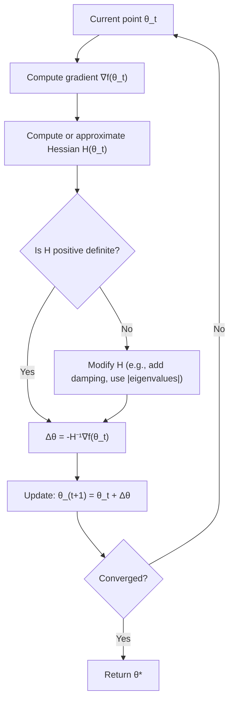

## Second-Order Optimization Methods

### Overview

First-order optimization methods, such as gradient descent, use only the gradient (first derivative) of the loss function to determine an update direction. Second-order methods additionally incorporate curvature information from the **Hessian matrix** (second derivatives), enabling more informed step sizes and directions. This can lead to faster convergence, particularly near a minimum, at the cost of significantly higher computational and memory requirements.

### The Hessian Matrix

For a function $f: \mathbb{R}^n \to \mathbb{R}$, the Hessian is the matrix of all second-order partial derivatives:

$$H_{ij} = \frac{\partial^2 f}{\partial x_i \partial x_j}$$

**Key Points**
- The Hessian is symmetric when $f$ has continuous second partial derivatives (by Clairaut's theorem / Schwarz's theorem).
- It describes the local curvature of the loss surface: positive eigenvalues indicate upward curvature (locally convex direction), negative eigenvalues indicate downward curvature, and eigenvalues near zero indicate flat regions.
- For a function of $n$ parameters, the Hessian is an $n \times n$ matrix, so its storage cost grows quadratically with the number of parameters — prohibitive for large neural networks with millions or billions of parameters.

### Newton's Method

Newton's method uses a second-order Taylor expansion of the loss function around the current point $\theta_t$:

$$f(\theta_t + \Delta\theta) \approx f(\theta_t) + \nabla f(\theta_t)^T \Delta\theta + \frac{1}{2} \Delta\theta^T H(\theta_t) \Delta\theta$$

Minimizing this quadratic approximation with respect to $\Delta\theta$ gives the Newton update:

$$\theta_{t+1} = \theta_t - H(\theta_t)^{-1} \nabla f(\theta_t)$$

**Key Points**
- Unlike gradient descent, Newton's method has no learning rate hyperparameter in its pure form — the step size and direction are both determined by the curvature.
- Converges quadratically near a well-behaved local minimum, meaning the number of correct digits roughly doubles each iteration, compared to the linear convergence typical of gradient descent. [Inference] This rapid convergence generally holds only in a neighborhood close to the minimum where the quadratic approximation is accurate.
- Requires the Hessian to be positive definite for the update to move toward a minimum; if the Hessian has negative eigenvalues (as is common on non-convex loss surfaces), the method can move toward a saddle point or maximum instead.
- Computing $H^{-1}$ directly costs $O(n^3)$ using standard matrix inversion, which is computationally infeasible for deep learning models with large parameter counts.

### Visualizing Curvature-Aware Steps

### Why Pure Newton's Method Is Impractical for Deep Learning

**Key Points**
- **Computational cost**: forming the full Hessian requires $O(n^2)$ storage and computing/inverting it costs $O(n^3)$, both infeasible when $n$ is in the millions.
- **Non-convexity**: deep learning loss landscapes are highly non-convex, containing many saddle points where the Hessian has mixed-sign eigenvalues; naive Newton steps can be attracted to these saddle points rather than minima.
- **Mini-batch noise**: stochastic estimates of the Hessian from mini-batches can be very noisy, making curvature estimates unreliable from one batch to the next.
- These limitations motivate a range of approximate second-order methods that capture some curvature benefit without the full cost.

### Quasi-Newton Methods

Quasi-Newton methods approximate the inverse Hessian using only gradient information gathered over iterations, avoiding explicit second-derivative computation.

**BFGS (Broyden–Fletcher–Goldfarb–Shanno)**

Maintains and iteratively updates an approximation $B_t$ to the inverse Hessian using successive gradient and parameter differences:

$$s_t = \theta_{t+1} - \theta_t, \quad y_t = \nabla f(\theta_{t+1}) - \nabla f(\theta_t)$$

The approximation is updated using a rank-two formula involving $s_t$ and $y_t$ that satisfies the **secant equation**, $B_{t+1} y_t = s_t$.

**Key Points**
- Storage cost is $O(n^2)$ for the dense inverse Hessian approximation — better than forming the true Hessian but still impractical at neural network scale.
- Generally converges faster than plain gradient descent on smooth, well-behaved problems, though [Inference] this advantage is less consistently observed on the highly non-convex, stochastic loss surfaces typical of deep learning.

**L-BFGS (Limited-memory BFGS)**

A memory-efficient variant that avoids storing the full $n \times n$ approximation, instead keeping only a small number (typically 5–20) of recent $(s_t, y_t)$ vector pairs to implicitly reconstruct Hessian-vector products.

**Key Points**
- Storage cost is $O(mn)$ where $m$ is the number of stored pairs (small constant), making it far more scalable than full BFGS.
- Used in some full-batch or small-dataset ML settings, and historically prominent in classical machine learning (e.g., logistic regression, CRFs) before stochastic first-order methods became dominant for deep learning.
- Less commonly used for large-scale deep neural network training, primarily because it is typically formulated for full-batch (deterministic) optimization and does not naturally accommodate the mini-batch stochasticity central to modern deep learning training.

### Hessian-Free / Truncated Newton Methods

Rather than forming the Hessian explicitly, these methods compute **Hessian-vector products** $Hv$ directly, without ever materializing $H$.

$$Hv = \nabla_\theta \left( (\nabla_\theta f(\theta))^T v \right)$$

This can be computed efficiently via automatic differentiation (a technique sometimes called the "Pearlmutter trick" or double backpropagation), at a cost comparable to a small constant multiple of a single gradient computation, rather than $O(n^2)$.

**Key Points**
- The Newton update direction $\Delta\theta = -H^{-1}\nabla f$ is then approximated by solving the linear system $H \Delta\theta = -\nabla f$ using an iterative method such as **conjugate gradient**, which only requires repeated Hessian-vector products rather than the explicit inverse.
- This avoids both the $O(n^2)$ storage and $O(n^3)$ inversion cost of full Newton's method.
- [Unverified] Hessian-free optimization has been explored for training certain neural network architectures, though it has not become a standard default optimizer for general deep learning practice, largely due to the practical effectiveness and simplicity of adaptive first-order methods.

### Natural Gradient Descent

A related second-order-flavored method that uses the **Fisher Information Matrix** $F$ instead of the Hessian to precondition the gradient:

$$\theta_{t+1} = \theta_t - \eta F^{-1} \nabla f(\theta_t)$$

**Key Points**
- The Fisher Information Matrix captures curvature with respect to changes in the probability distribution parameterized by the model, rather than curvature of the raw loss surface.
- Motivated by the idea that gradient descent in raw parameter space is not invariant to reparameterization, while natural gradient descent is approximately invariant, following the steepest descent direction in distribution space rather than parameter space.
- Like the Hessian, $F$ is generally infeasible to compute and invert exactly for large models, leading to approximations such as block-diagonal or Kronecker-factored approximations (e.g., K-FAC).

### Approximate and Practical Second-Order-Inspired Methods

Several widely used optimizers incorporate limited curvature-like information without full second-order computation:

**Key Points**
- **Adam, RMSprop, Adagrad**: use per-parameter adaptive learning rates based on running estimates of squared gradients — a diagonal approximation loosely related to curvature, but not a true second-order method since it does not capture cross-parameter (off-diagonal) curvature information.
- **K-FAC (Kronecker-Factored Approximate Curvature)**: approximates the Fisher Information Matrix using a block-diagonal, Kronecker-factored structure aligned with network layers, making natural gradient-like updates more tractable for larger networks.
- **Shampoo**: a more recent optimizer that maintains structured (e.g., Kronecker-factored) preconditioners per layer, incorporating curvature-aware updates while remaining more scalable than full second-order methods. [Unverified — implementation details and adoption vary; consult current framework documentation for specifics.]

### Trade-offs Summary

| Aspect | First-Order (e.g., SGD, Adam) | Second-Order (e.g., Newton, BFGS) |
|---|---|---|
| Information used | Gradient only | Gradient + curvature (Hessian or approximation) |
| Convergence rate near minimum | Linear (typically) | Quadratic (Newton, under favorable conditions) |
| Memory cost | $O(n)$ | $O(n^2)$ (full), $O(mn)$ (L-BFGS), varies by approximation |
| Per-step computational cost | Low | High (full Hessian) to moderate (approximations) |
| Robustness to non-convexity | Generally more robust in practice for deep learning | Can be attracted to saddle points without modification |
| Typical use in deep learning | Dominant default | Rare in pure form; used via approximations (K-FAC, Shampoo) |

### Practical Implications for ML Practitioners

- Pure Newton's method and full BFGS are rarely used directly for training large neural networks due to memory and computational constraints.
- L-BFGS remains practical for smaller-scale or full-batch optimization problems, such as certain classical ML models or fine-tuning scenarios with limited parameters.
- Curvature-aware approximations (K-FAC, Shampoo, and similar) represent an active area of research aimed at capturing some benefits of second-order information while remaining scalable. [Speculation] Their adoption relative to well-tuned first-order adaptive methods may continue to depend on the specific trade-off between implementation complexity and observed convergence benefits for a given architecture and scale.
- Second-order concepts remain highly relevant even when not directly used as optimizers — the Hessian's eigenvalue spectrum is often used to analyze loss landscape sharpness, generalization behavior, and the effectiveness of first-order optimizers.

**Next Steps**
- Hessian-vector products and efficient computation via automatic differentiation
- Conjugate gradient method for solving linear systems
- Fisher Information Matrix and its role in natural gradient descent
- K-FAC and Kronecker-factored curvature approximations
- Saddle points and non-convex optimization landscapes in deep learning
- Adaptive first-order optimizers (Adam, RMSprop) and their relationship to curvature