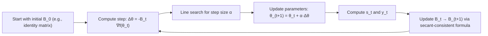

## Newton and Quasi-Newton Methods

### Overview

This topic builds directly on second-order optimization concepts, focusing specifically on Newton's method and its quasi-Newton derivatives as applied in machine learning contexts — including where they succeed, where they fail, and how modified variants attempt to make curvature-aware optimization tractable.

### Newton's Method: Derivation Recap

Newton's method for optimization arises from setting the gradient of a second-order Taylor approximation to zero. Starting from:

$$f(\theta + \Delta\theta) \approx f(\theta) + \nabla f(\theta)^T \Delta\theta + \frac{1}{2}\Delta\theta^T H(\theta) \Delta\theta$$

Differentiating with respect to $\Delta\theta$ and setting the result to zero yields:

$$\nabla f(\theta) + H(\theta)\Delta\theta = 0 \implies \Delta\theta = -H(\theta)^{-1}\nabla f(\theta)$$

**Key Points**
- This is equivalent to applying the multivariate Newton-Raphson root-finding method to $\nabla f(\theta) = 0$, treating optimization as the problem of finding a stationary point.
- The method assumes the quadratic approximation is locally accurate; convergence guarantees weaken as the true function deviates from this assumption.

### Damped and Regularized Newton's Method

Pure Newton steps can overshoot or move in unhelpful directions when the quadratic approximation is poor or the Hessian is not positive definite. Practical variants address this.

**Damped Newton's method** introduces a step size $\alpha_t$ (often chosen via line search):

$$\theta_{t+1} = \theta_t - \alpha_t H(\theta_t)^{-1} \nabla f(\theta_t)$$

**Levenberg–Marquardt-style damping** adds a regularization term to guarantee positive definiteness:

$$\theta_{t+1} = \theta_t - \left(H(\theta_t) + \lambda I\right)^{-1} \nabla f(\theta_t)$$

**Key Points**
- As $\lambda \to 0$, this recovers pure Newton's method; as $\lambda \to \infty$, the update direction approaches a scaled gradient descent step.
- This interpolation is one reason Levenberg–Marquardt-style damping is a practical bridge between the fast local convergence of Newton's method and the robustness of gradient descent when curvature information is unreliable.
- $\lambda$ is typically adjusted adaptively during optimization — increased when a step fails to reduce the objective, decreased when steps succeed.

### The Saddle Point Problem

Non-convex loss surfaces, characteristic of deep neural networks, contain many saddle points — points where the gradient is zero but the Hessian has both positive and negative eigenvalues.

**Key Points**
- Pure Newton's method is attracted to any stationary point, including saddle points, since it only uses the condition $\nabla f(\theta) = 0$ without distinguishing minima from saddles.
- [Inference] This is frequently cited as a key reason plain Newton's method is considered poorly suited to deep learning optimization, since high-dimensional non-convex landscapes are believed to contain a large number of saddle points relative to true local minima.
- Modifications such as **trust-region methods** or eigenvalue modification (e.g., flipping the sign of negative eigenvalues, or taking $|H|$) attempt to redirect steps away from saddle points toward directions of descent.

### Trust-Region Methods

An alternative to line-search damping, trust-region methods constrain the step to a region where the quadratic model is trusted to be accurate:

$$\Delta\theta = \arg\min_{\|\Delta\theta\| \le r} \left[ \nabla f(\theta)^T \Delta\theta + \frac{1}{2}\Delta\theta^T H(\theta) \Delta\theta \right]$$

**Key Points**
- The trust-region radius $r$ is expanded when the quadratic model predicts the true function's behavior well, and contracted when it does not.
- Naturally handles indefinite Hessians (mixed-sign eigenvalues) without requiring explicit regularization, since the constrained subproblem remains well-defined regardless of the Hessian's definiteness.
- More robust than simple damped Newton in highly non-convex regions, at the cost of solving a constrained subproblem at each iteration.

### Quasi-Newton Methods Revisited: The Secant Condition

Quasi-Newton methods build an approximation $B_t \approx H(\theta_t)^{-1}$ using only gradient evaluations, avoiding explicit second-derivative computation. The core requirement is the **secant equation**:

$$B_{t+1} y_t = s_t, \quad \text{where } s_t = \theta_{t+1} - \theta_t, \; y_t = \nabla f(\theta_{t+1}) - \nabla f(\theta_t)$$

This condition ensures the approximate inverse Hessian is consistent with the observed change in gradient over the observed change in parameters.

### DFP and BFGS Update Formulas

**DFP (Davidon–Fletcher–Powell)**, an earlier quasi-Newton formula:

$$B_{t+1} = B_t + \frac{s_t s_t^T}{s_t^T y_t} - \frac{B_t y_t y_t^T B_t}{y_t^T B_t y_t}$$

**BFGS**, generally regarded as more robust in practice:

$$B_{t+1} = \left(I - \frac{s_t y_t^T}{y_t^T s_t}\right) B_t \left(I - \frac{y_t s_t^T}{y_t^T s_t}\right) + \frac{s_t s_t^T}{y_t^T s_t}$$

**Key Points**
- Both formulas are rank-two updates, meaning each update modifies $B_t$ using only outer products of the vectors $s_t$ and $y_t$, which keeps the update computationally cheap relative to recomputing a full Hessian approximation from scratch.
- BFGS tends to self-correct better from inaccurate curvature estimates and is generally preferred over DFP in practical implementations. [Inference] This preference is a long-standing convention in numerical optimization rather than a guarantee that holds for every problem instance.
- Both require $y_t^T s_t > 0$ (the **curvature condition**) to maintain a positive definite $B_t$; line search strategies such as the Wolfe conditions are often used to help ensure this holds.

### L-BFGS: Making BFGS Scalable

L-BFGS avoids storing the dense $n \times n$ matrix $B_t$ by keeping only the most recent $m$ pairs $\{(s_i, y_i)\}$ and using a two-loop recursion to compute the matrix-vector product $B_t \nabla f(\theta_t)$ implicitly.

**Key Points**
- Memory cost is $O(mn)$ rather than $O(n^2)$, with $m$ typically between 5 and 20.
- The two-loop recursion computes the search direction directly without ever forming $B_t$ explicitly, using only stored vector pairs and inner products.
- Because older $(s_i, y_i)$ pairs are discarded, L-BFGS implicitly assumes the local curvature structure is relatively stable over the retained window of iterations — an assumption that can be violated in highly stochastic mini-batch training.

### Why Quasi-Newton Methods Struggle in Deep Learning

**Key Points**
- **Stochasticity**: BFGS and L-BFGS were originally designed for deterministic (full-batch) objectives. Mini-batch gradients introduce noise into $y_t$, which can corrupt the secant condition and destabilize the curvature approximation across iterations.
- **Non-convexity and saddle points**: like Newton's method, quasi-Newton methods can behave unpredictably near saddle points, though trust-region variants mitigate this to some degree.
- **Scale**: even L-BFGS's $O(mn)$ memory cost, while far better than $O(n^2)$, adds non-trivial overhead compared to first-order methods at the scale of modern large neural networks.
- [Unverified] Some research and specialized libraries have adapted L-BFGS-style methods for stochastic or large-batch deep learning settings with reported success in specific scenarios, but these variants have not displaced adaptive first-order methods (e.g., Adam, SGD with momentum) as the default choice for general deep learning practice.

### Where Newton and Quasi-Newton Methods Remain Practical in ML

**Key Points**
- **Classical/shallow models**: logistic regression, conditional random fields, and other convex or near-convex models with a moderate number of parameters are well suited to L-BFGS, and it remains a common solver choice in some statistical and classical ML libraries.
- **Fine-tuning small parameter sets**: scenarios with relatively few trainable parameters (e.g., certain calibration or small linear probing tasks) can benefit from quasi-Newton convergence speed without prohibitive memory cost.
- **Full-batch, small-to-moderate scale optimization**: problems where the entire dataset fits comfortably for gradient computation and stochasticity is not a dominant concern.
- **Scientific computing and simulation-based ML**: contexts outside standard deep learning training, such as parameter estimation in differentiable simulators, sometimes favor Newton-type convergence properties over first-order methods' scalability.

### Comparison Summary

| Method | Curvature Source | Memory Cost | Handles Non-Convexity | Typical Deep Learning Use |
|---|---|---|---|---|
| Pure Newton | Exact Hessian | $O(n^2)$ | Poor (attracted to saddles) | Rare |
| Damped/Regularized Newton | Exact Hessian + damping | $O(n^2)$ | Improved | Rare |
| Trust-Region Newton | Exact or approx. Hessian | $O(n^2)$ (or approx.) | Good | Occasional (specialized) |
| BFGS | Approximate inverse Hessian | $O(n^2)$ | Moderate | Rare |
| L-BFGS | Approximate inverse Hessian (limited memory) | $O(mn)$ | Moderate | Classical ML, small-scale fine-tuning |
| Adam / first-order adaptive | Diagonal gradient-based approximation | $O(n)$ | Practically robust | Dominant default |

### Practical Implications for ML Practitioners

- For most large-scale deep learning training, adaptive first-order methods remain the practical default due to their favorable memory and computational scaling.
- L-BFGS is a reasonable choice to consider for smaller, full-batch, or convex-like optimization problems where its faster convergence can be realized without the drawbacks of stochastic noise.
- Understanding Newton and quasi-Newton methods provides conceptual grounding for interpreting more scalable curvature-aware techniques (e.g., K-FAC, Shampoo), which apply similar mathematical principles under structural approximations that make them tractable at scale.
- [Speculation] Continued interest in structured curvature approximations suggests that ideas originating from Newton and quasi-Newton methods may keep influencing new optimizer designs, even as pure implementations remain uncommon in mainstream deep learning training.

**Related Topics**
- Hessian-free (truncated Newton) optimization and conjugate gradient
- Trust-region methods in constrained and unconstrained optimization
- K-FAC and Kronecker-factored curvature approximations
- Line search methods and the Wolfe conditions
- Convergence rate analysis: linear vs. superlinear vs. quadratic
- Saddle point escape strategies in non-convex optimization