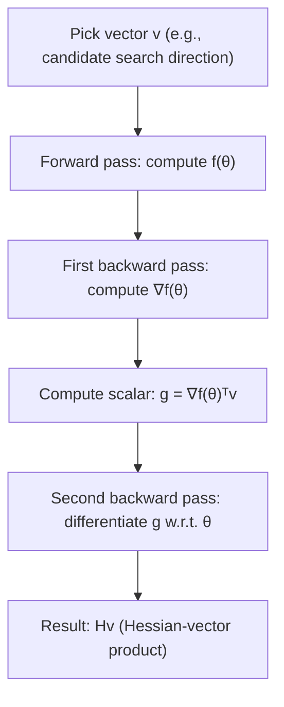

## Hessian-Free Optimization

### Overview

Hessian-free optimization (HF), also known as truncated Newton method, is a second-order optimization approach that captures curvature information without ever forming or storing the full Hessian matrix. It was notably applied to deep neural network training by Martens (2010), demonstrating that carefully implemented second-order methods could train deep networks that were, at the time, difficult to optimize with standard first-order methods.

### Core Idea

Instead of computing the Hessian $H$ explicitly and inverting it, Hessian-free optimization computes only **Hessian-vector products** $Hv$ for arbitrary vectors $v$, and uses these products within an iterative linear solver to approximately solve the Newton system:

$$H(\theta_t) \, \Delta\theta = -\nabla f(\theta_t)$$

**Key Points**
- The Hessian itself is never materialized in memory — it exists only implicitly, accessed through its action on vectors.
- This sidesteps the $O(n^2)$ storage and $O(n^3)$ inversion costs of pure Newton's method.
- The name "truncated Newton" refers to the fact that the linear system is solved only approximately (truncated early), rather than to full precision.

### Computing Hessian-Vector Products Efficiently

The key enabling technique is the ability to compute $Hv$ at a cost comparable to a small constant multiple of a single gradient evaluation, rather than $O(n^2)$.

$$Hv = \nabla_\theta \left[ \left(\nabla_\theta f(\theta)\right)^T v \right]$$

This is computed by differentiating the directional derivative $(\nabla_\theta f(\theta))^T v$ (a scalar) with respect to $\theta$ again — effectively a second application of backpropagation. This is sometimes referred to as the **Pearlmutter trick** (R-operator method).

**Key Points**
- Because $v$ is treated as a constant during the differentiation, the computation reduces to two passes of automatic differentiation rather than computing the full $n \times n$ matrix.
- Cost is typically a small constant multiple (roughly comparable in order of magnitude) of the cost of one gradient computation, not $O(n^2)$.
- This is the same underlying mechanism used for computing Hessian-vector products in other contexts, such as certain curvature-analysis tools or higher-order optimization research.

### Solving the Newton System with Conjugate Gradient

Given the ability to compute $Hv$, the linear system $H\Delta\theta = -\nabla f(\theta)$ is solved using the **conjugate gradient (CG)** method, an iterative algorithm for solving symmetric positive-definite linear systems that requires only matrix-vector products, never the explicit matrix.

**Key Points**
- CG builds up an approximate solution over a sequence of iterations, with each iteration requiring one Hessian-vector product.
- In exact arithmetic, CG converges to the exact solution in at most $n$ iterations for an $n$-dimensional system, but in practice it is stopped early ("truncated") after far fewer iterations, since an approximate Newton direction is often sufficient and full convergence is computationally unnecessary.
- Early truncation is also a form of implicit regularization — very early CG iterations tend to capture the directions of largest curvature first, which are often the most informative for optimization.
- CG formally requires the system matrix to be positive definite; since the Hessian on a non-convex loss surface may not be, practical implementations use damping or other modifications to maintain well-behaved CG iterations.

### Damping in Hessian-Free Optimization

To handle indefinite Hessians and to prevent overly aggressive steps based on an inaccurate local quadratic model, Hessian-free optimization typically solves a damped system:

$$(H(\theta_t) + \lambda I)\Delta\theta = -\nabla f(\theta_t)$$

**Key Points**
- This is conceptually the same Levenberg–Marquardt-style damping used in regularized Newton's method, applied here within the Hessian-free framework.
- $\lambda$ is commonly adjusted adaptively across outer iterations using a heuristic such as the Levenberg–Marquardt trust-region ratio, which compares the actual reduction in the objective to the reduction predicted by the quadratic model.
- [Inference] Effective damping schedules are generally considered important to the practical success of Hessian-free optimization; poorly tuned damping can lead to either overly conservative steps or instability.
- Martens' original formulation also proposed using the **Gauss-Newton matrix** as a positive semi-definite substitute for the true Hessian in certain settings, avoiding indefiniteness issues altogether for objectives with particular structure (e.g., squared error or certain likelihood-based losses).

### Gauss-Newton Approximation as an Alternative Curvature Matrix

For objectives of the form $f(\theta) = \frac{1}{2}\|r(\theta)\|^2$ (or similar structured losses), the **Gauss-Newton matrix** $G$ approximates the Hessian using only first-order Jacobian information:

$$G = J^T J$$

where $J$ is the Jacobian of the residual (or output) with respect to parameters.

**Key Points**
- $G$ is guaranteed positive semi-definite by construction, avoiding the indefiniteness problems of the true Hessian near saddle points.
- It omits second-order terms involving the residual itself, making it an approximation rather than the exact Hessian, but this approximation is often considered reasonable near a good fit where residuals are small.
- Gauss-Newton-vector products can be computed with a similar efficiency to Hessian-vector products, using combinations of forward-mode and reverse-mode automatic differentiation.
- This connects Hessian-free optimization to the broader family of Gauss-Newton and generalized Gauss-Newton methods used in some neural network optimization research.

### The Outer-Inner Loop Structure

Hessian-free optimization has a characteristic two-level iterative structure:

**Key Points**
- **Outer loop**: standard optimization iterations, updating $\theta_t \to \theta_{t+1}$.
- **Inner loop**: at each outer iteration, run conjugate gradient (with early truncation) to approximately solve for the Newton direction $\Delta\theta$, using repeated Hessian-vector (or Gauss-Newton-vector) product evaluations.
- This nested structure means each outer iteration is substantially more expensive than a single first-order optimization step, since it requires multiple inner CG iterations, each involving its own gradient-like computation.
- [Inference] The higher per-iteration cost is intended to be offset by requiring fewer outer iterations overall to reach a comparable or better solution, though whether this trade-off is favorable depends heavily on the specific problem and implementation.

### Mini-Batching Considerations

**Key Points**
- Martens' original approach generally used larger batches (or subsets) for the Hessian-vector product computations within the CG inner loop than might be typical for standard first-order mini-batch training, since curvature estimates from very small or highly stochastic batches can be unreliable across CG iterations.
- [Unverified] The appropriate batch size strategy for Hessian-free methods is implementation- and problem-dependent, and using highly stochastic, very small batches for curvature estimation is generally considered more problematic for HF-style methods than for first-order methods.
- This need for larger or more stable batches for curvature estimation is one practical factor limiting the direct compatibility of Hessian-free optimization with the small-batch, highly stochastic training regimes common in modern large-scale deep learning.

### Historical Context and Relevance

**Key Points**
- Hessian-free optimization gained attention as one of the methods that enabled training of certain deep architectures that were considered difficult to optimize with the first-order methods and initialization schemes available at the time.
- [Unverified] Subsequent advances in initialization schemes (e.g., Xavier/Glorot, He initialization), normalization techniques (e.g., batch normalization), and improved adaptive first-order optimizers (e.g., Adam) are generally credited with substantially reducing the specific optimization difficulties that motivated early interest in Hessian-free methods for deep learning, though the relative contribution of each factor is not precisely quantifiable.
- As a result, Hessian-free optimization is not commonly used as a default training method in current mainstream deep learning practice, but it remains conceptually important and has continued relevance in specialized settings and in research on curvature-aware optimization more broadly.

### Comparison to Other Second-Order Approaches

| Aspect | Pure Newton | L-BFGS | Hessian-Free (Truncated Newton) |
|---|---|---|---|
| Curvature representation | Explicit full Hessian | Implicit, built from gradient history | Implicit, accessed via Hv products |
| Memory cost | $O(n^2)$ | $O(mn)$ | $O(n)$ (no matrix storage) |
| Requires explicit second derivatives | Yes | No | Yes (via Hv products, not full matrix) |
| Handles indefinite curvature | Poorly (without modification) | Moderately | Via damping / Gauss-Newton substitution |
| Suited to stochastic mini-batch training | No | Limited | Limited (prefers more stable curvature estimates) |

### Practical Implications for ML Practitioners

- Hessian-free optimization illustrates a general and reusable idea — accessing curvature only through Hessian-vector products — that appears in other contexts beyond full training, such as certain second-order analyses of trained models, curvature-based regularization research, and some meta-learning or bilevel optimization formulations.
- The Pearlmutter trick (efficient Hv computation via automatic differentiation) is a broadly useful building block, independent of whether the full Hessian-free optimization pipeline (with CG and damping) is used.
- For most standard deep learning training pipelines today, well-tuned adaptive first-order methods remain the practical default, with Hessian-free and related second-order methods more relevant in specialized research settings or problems with particular structure favoring curvature-aware approaches.
- [Speculation] Interest in efficient curvature-vector product techniques may continue to be relevant as building blocks for other applications, such as sharpness-aware optimization research or model analysis, even independent of their use in mainline training.

**Next Steps**
- Conjugate gradient method: derivation and convergence properties
- Gauss-Newton and generalized Gauss-Newton matrices
- The Pearlmutter trick and forward-over-reverse automatic differentiation
- Trust-region methods and Levenberg–Marquardt damping
- K-FAC as an alternative scalable curvature approximation
- Loss landscape sharpness and its relationship to Hessian eigenvalues