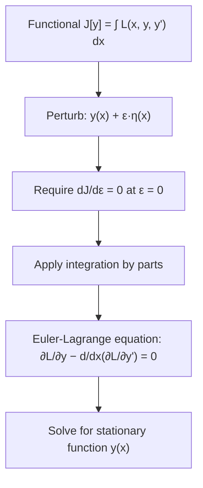

## Calculus of Variations as a Bridge to Advanced ML Theory

### Overview

The calculus of variations extends ordinary calculus from optimizing over points (vectors in $\mathbb{R}^n$) to optimizing over **functions** or **functionals** — quantities that take entire functions as input and return a scalar. While ordinary calculus asks "what value of $x$ minimizes $f(x)$?", the calculus of variations asks "what function $y(x)$ minimizes a given functional $J[y]$?" This shift in perspective underlies several areas of machine learning theory, including optimal control connections to deep learning, certain generative modeling frameworks, and the theoretical study of gradient descent as a continuous-time process.

### Functionals

A **functional** is a mapping from a space of functions to the real numbers. A common form encountered in the calculus of variations is:

$$J[y] = \int_{a}^{b} L\big(x, y(x), y'(x)\big)\, dx$$

where $L$ is called the **Lagrangian** (in this context, distinct from but related to the Lagrangian of constrained optimization), and $y(x)$ is the function being optimized over.

**Key Points**
- The input to $J$ is an entire function $y(x)$, not a single number or vector — this is the key conceptual shift from ordinary multivariable calculus.
- The goal is typically to find the function $y(x)$ (subject to boundary conditions, e.g., fixed endpoints $y(a)$ and $y(b)$) that minimizes or maximizes $J[y]$.
- Classic examples include finding the shortest path between two points (geodesics) and finding the path of least time (the brachistochrone problem).

### The Euler-Lagrange Equation

Just as ordinary calculus uses $f'(x) = 0$ to find stationary points, the calculus of variations uses the **Euler-Lagrange equation** to find stationary functions:

$$\frac{\partial L}{\partial y} - \frac{d}{dx}\left(\frac{\partial L}{\partial y'}\right) = 0$$

**Key Points**
- This equation is derived by considering a small perturbation $y(x) + \epsilon \eta(x)$ to a candidate function, requiring the perturbed functional's derivative with respect to $\epsilon$ to vanish at $\epsilon = 0$ (an approach directly analogous to setting the ordinary derivative to zero at a stationary point), and applying integration by parts.
- Any function $y(x)$ satisfying the Euler-Lagrange equation is a stationary point of the functional — a candidate for a minimum, maximum, or saddle, analogous to how $f'(x) = 0$ identifies candidate extrema in ordinary calculus.
- The perturbation function $\eta(x)$ is typically required to vanish at the boundaries ($\eta(a) = \eta(b) = 0$) when endpoints are fixed, ensuring the perturbed function satisfies the same boundary conditions.

### Connection to Ordinary Optimization

**Key Points**
- Ordinary gradient-based optimization in ML minimizes a function of finitely many parameters, $f(\theta)$ where $\theta \in \mathbb{R}^n$; the calculus of variations generalizes this to minimizing over an infinite-dimensional space of functions.
- [Inference] This generalization is conceptually useful because several ML settings — such as certain formulations of optimal control, some neural ODE frameworks, and certain generative modeling objectives — are naturally posed as optimization over functions or continuous-time trajectories rather than fixed parameter vectors.
- The Euler-Lagrange equation plays a role in these settings analogous to the role $\nabla f(\theta) = 0$ plays in standard finite-dimensional optimization.

### Gradient Descent as a Continuous-Time Process

One important bridge to ML theory reframes discrete gradient descent as a discretization of a continuous-time differential equation, connecting to variational reasoning.

$$\frac{d\theta(t)}{dt} = -\nabla f(\theta(t))$$

This is known as **gradient flow**.

**Key Points**
- Standard discrete gradient descent, $\theta_{t+1} = \theta_t - \eta \nabla f(\theta_t)$, can be viewed as an Euler discretization of this continuous-time ODE, with $\eta$ playing the role of the discretization step size.
- Analyzing the continuous-time gradient flow ODE using tools from dynamical systems and variational calculus can provide insight into convergence behavior, stability, and the effect of learning rate, in a way that is sometimes more mathematically tractable than analyzing the discrete update rule directly.
- [Inference] This continuous-time perspective is a recurring theoretical tool in optimization research, used to analyze and motivate variants such as momentum-based methods (which relate to second-order ODEs, such as those studied in the context of Nesterov acceleration) and certain adaptive methods.

### Connection to Neural ODEs

**Neural Ordinary Differential Equations (Neural ODEs)** parameterize the hidden state trajectory of a network as the solution to a differential equation:

$$\frac{dh(t)}{dt} = f_\theta(h(t), t)$$

rather than as a sequence of discrete layers.

**Key Points**
- Training a Neural ODE requires computing gradients of a loss with respect to $\theta$, where the loss depends on the solution of a differential equation — a setting that connects directly to variational and optimal control formulations.
- The **adjoint sensitivity method**, used to compute these gradients efficiently, is derived using variational-calculus-style reasoning applied to the constraint that $h(t)$ satisfies the ODE, and has close mathematical ties to the adjoint equations of optimal control theory.
- [Unverified] The extent to which Neural ODEs and adjoint-based training are used in mainstream production ML systems, as opposed to research contexts, varies and should be checked against current literature and framework support for a given application.

### Connection to Optimal Control Theory

The calculus of variations is foundational to **optimal control theory**, which studies how to choose a control function (analogous to a policy or set of parameters) over time to minimize a cost functional, subject to dynamics constraints.

**Key Points**
- **Pontryagin's Minimum (or Maximum) Principle**, a generalization of the Euler-Lagrange equation that incorporates constraints via a Hamiltonian formulation, is used in some theoretical treatments connecting deep learning training to optimal control — for example, framing the layers of a deep network as discrete time steps of a controlled dynamical system.
- [Inference] This "deep learning as optimal control" perspective is an active theoretical research direction rather than a standard practical training framework, and its practical influence on everyday ML engineering is generally more indirect (through conceptual insight) than direct (through widely deployed algorithms).
- Reinforcement learning, particularly continuous-control settings, also draws on optimal control theory, and some connections between policy optimization and variational/optimal-control formulations have been explored in the research literature.

### Connection to Generative Modeling: Diffusion and Score-Based Models

**Key Points**
- Score-based generative models and diffusion models are often formulated using stochastic differential equations (SDEs) that describe how data is progressively noised (forward process) and denoised (reverse process).
- [Unverified] The precise mathematical connections between diffusion model formulations and classical calculus of variations / optimal transport theory are an active area of theoretical ML research, and specific claims about equivalence or direct derivation should be checked against current papers rather than assumed.
- **Optimal transport theory**, which studies the most efficient way to transform one probability distribution into another, shares mathematical machinery with the calculus of variations (both involve minimizing functionals over spaces of functions or measures) and has become an influential framework in some generative modeling and domain adaptation research.

### Why This Matters Conceptually for ML Practitioners

**Key Points**
- The calculus of variations provides the mathematical language for reasoning about optimization when the object being optimized is a function or trajectory rather than a fixed-size parameter vector — a recurring theme in continuous-time and generative modeling research.
- Even for practitioners who never directly derive an Euler-Lagrange equation in applied work, exposure to this framework can aid in reading and understanding research papers in areas such as Neural ODEs, diffusion models, optimal control-based RL, and continuous-time optimization analysis.
- [Speculation] As continuous-time and infinite-dimensional formulations continue to appear in ML research (e.g., in generative modeling and theoretical analysis of training dynamics), familiarity with calculus of variations concepts may become increasingly useful for engaging with the theoretical ML literature, even if it remains a secondary tool relative to standard finite-dimensional calculus for most applied deep learning work.

### Summary Comparison

| Aspect | Ordinary Calculus / Optimization | Calculus of Variations |
|---|---|---|
| Object being optimized | A point $\theta \in \mathbb{R}^n$ | A function $y(x)$ or trajectory |
| Stationarity condition | $\nabla f(\theta) = 0$ | Euler-Lagrange equation |
| Typical ML use | Standard parameter training (SGD, Adam, etc.) | Neural ODEs, optimal control framings, some generative model theory |
| Core tool | Gradient / Hessian | Functional derivative, Euler-Lagrange equation |

**Next Steps**
- Neural ODEs and the adjoint sensitivity method
- Gradient flow and continuous-time analysis of optimization dynamics
- Optimal control theory and Pontryagin's Minimum Principle
- Optimal transport theory and its role in generative modeling
- Diffusion models and score-based generative modeling foundations
- Lagrangian and Hamiltonian mechanics as mathematical prerequisites