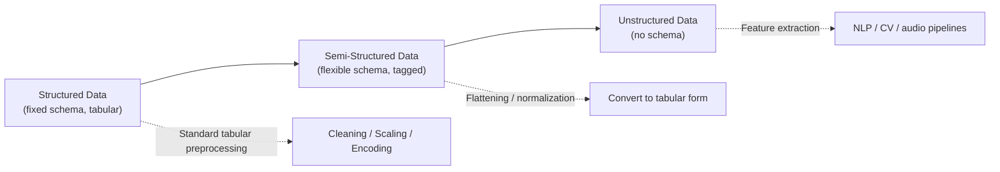

## Structured, Semi-Structured, and Unstructured Data

### Overview

Machine learning datasets originate from sources that differ widely in how rigidly their information is organized. Data is commonly classified into three categories — structured, semi-structured, and unstructured — based on the presence and rigidity of a predefined schema. This classification affects which preprocessing techniques are applicable, how much manual schema definition is required, and how much transformation is needed before the data can be fed into a model.

### Structured Data

**Definition**: Structured data conforms to a fixed, predefined schema, typically organized into rows and columns with defined data types for each field, such as data stored in relational databases or well-formed spreadsheets.

**Key Points**
- Each record has the same set of fields, and each field has a consistent data type (numeric, categorical, date, boolean, etc.).
- Structured data is the easiest category to validate, query, and preprocess using standard tabular tools (e.g., SQL, pandas).
- Common sources: relational databases, CSV/Excel files, transactional systems, sensor logs stored in tabular form.

**Example**

| CustomerID | Age | Income | Country |
|---|---|---|---|
| 1 | 34 | 52000 | USA |
| 2 | 29 | 61000 | Canada |

Every row shares the same fields and types. Preprocessing for structured data typically involves the techniques covered elsewhere in this series: missing value imputation, scaling, encoding, and outlier handling.

### Semi-Structured Data

**Definition**: Semi-structured data does not conform to a fixed tabular schema but still contains organizational markers — tags, keys, or hierarchical nesting — that separate and label different elements within the data.

**Key Points**
- Common formats include JSON, XML, YAML, and log files with consistent but non-tabular structure.
- Records may have varying fields (e.g., optional keys present in some JSON objects but not others), which structured data typically does not allow.
- Preprocessing semi-structured data usually involves a **flattening** or **normalization** step to convert nested structures into a tabular form before further processing.

**Example**

```json
{
  "customer_id": 1,
  "name": "Alice",
  "address": {
    "city": "Manila",
    "country": "PH"
  },
  "orders": [
    {"order_id": 101, "amount": 250},
    {"order_id": 102, "amount": 90}
  ]
}
```

To use this in a tabular ML pipeline, nested fields like `address.city` typically need to be flattened into their own columns, and repeating structures like `orders` often need to be aggregated (e.g., total order count, total amount) or exploded into separate rows, depending on the modeling goal.

### Unstructured Data

**Definition**: Unstructured data has no predefined schema or organizational structure at all — it does not separate content into discrete, labeled fields.

**Key Points**
- Common forms: free text (documents, reviews, chat logs), images, audio, and video.
- Unstructured data typically requires a **feature extraction** step to convert it into a numerical representation before it can be used in most machine learning models — for example, tokenization and embedding for text, or pixel-array extraction and convolutional feature extraction for images.
- The line between "unstructured" and "usable structured input" is bridged by domain-specific preprocessing pipelines (NLP pipelines for text, computer vision pipelines for images), which are substantial topics of their own.

**Example**

A raw customer review:

> "Delivery was late but the product quality is great."

This string has no inherent fields the way a database row does. To use it in a model, it typically must go through steps such as tokenization, normalization (lowercasing, punctuation removal), and vectorization (e.g., TF-IDF or embeddings) — each a distinct preprocessing stage covered in dedicated text-preprocessing topics.

### Comparison

| Aspect | Structured | Semi-Structured | Unstructured |
|---|---|---|---|
| Schema | Fixed, predefined | Flexible, self-describing | None |
| Typical formats | SQL tables, CSV | JSON, XML, YAML | Text, images, audio, video |
| Storage | Relational databases | Document stores, NoSQL | File systems, blob storage, data lakes |
| Preprocessing focus | Cleaning, scaling, encoding | Flattening, schema normalization | Feature extraction, representation learning |
| Ease of direct ML use | Highest | Moderate | Lowest (without extraction step) |

### Visualizing the Spectrum



### Why This Classification Matters for Preprocessing

The category of a dataset determines the starting point of the preprocessing workflow:

- Structured data can often go nearly directly into standard cleaning and transformation steps.
- Semi-structured data requires an additional flattening/reshaping stage before standard tabular techniques apply.
- Unstructured data requires domain-specific representation learning or feature extraction before it resembles a form that traditional preprocessing techniques can act on.

[Inference] This ordering (structured requiring the least transformation, unstructured requiring the most) follows directly from how each type is defined, but the actual amount of preprocessing effort in a specific project also depends on data volume, quality, and the modeling task, so it should not be treated as a fixed rule for effort estimation.

### Common Pitfalls

- Treating semi-structured data as if it were fully structured (assuming all records have the same keys), which can silently drop or misalign fields with inconsistent schemas.
- Applying tabular preprocessing techniques (e.g., mean imputation) to unstructured data without first extracting meaningful numeric features.
- Flattening nested semi-structured data without considering how repeating substructures (like the `orders` array above) should be aggregated, which can change the meaning of the resulting rows.

### Conclusion

Structured, semi-structured, and unstructured data represent a spectrum of schema rigidity, and each category requires a different starting approach before standard machine learning preprocessing techniques can be applied. Recognizing which category a dataset falls into is typically one of the first diagnostic steps in designing a preprocessing pipeline, since it determines whether the immediate next step is direct cleaning, schema flattening, or feature extraction.

**Related Topics**
- Flattening and Normalizing Nested JSON/XML Data
- Text Preprocessing Fundamentals (Tokenization, Normalization, Vectorization)
- Image Preprocessing Fundamentals for Computer Vision
- Working with NoSQL and Document-Store Data in ML Pipelines
- Feature Extraction Techniques by Data Modality
- Schema Validation Tools for Semi-Structured Data

I cannot verify claims about industry-wide prevalence or typical effort levels beyond what is stated above as [Inference]; the rest of this response describes standard, well-documented data-format concepts and does not require additional labeling.