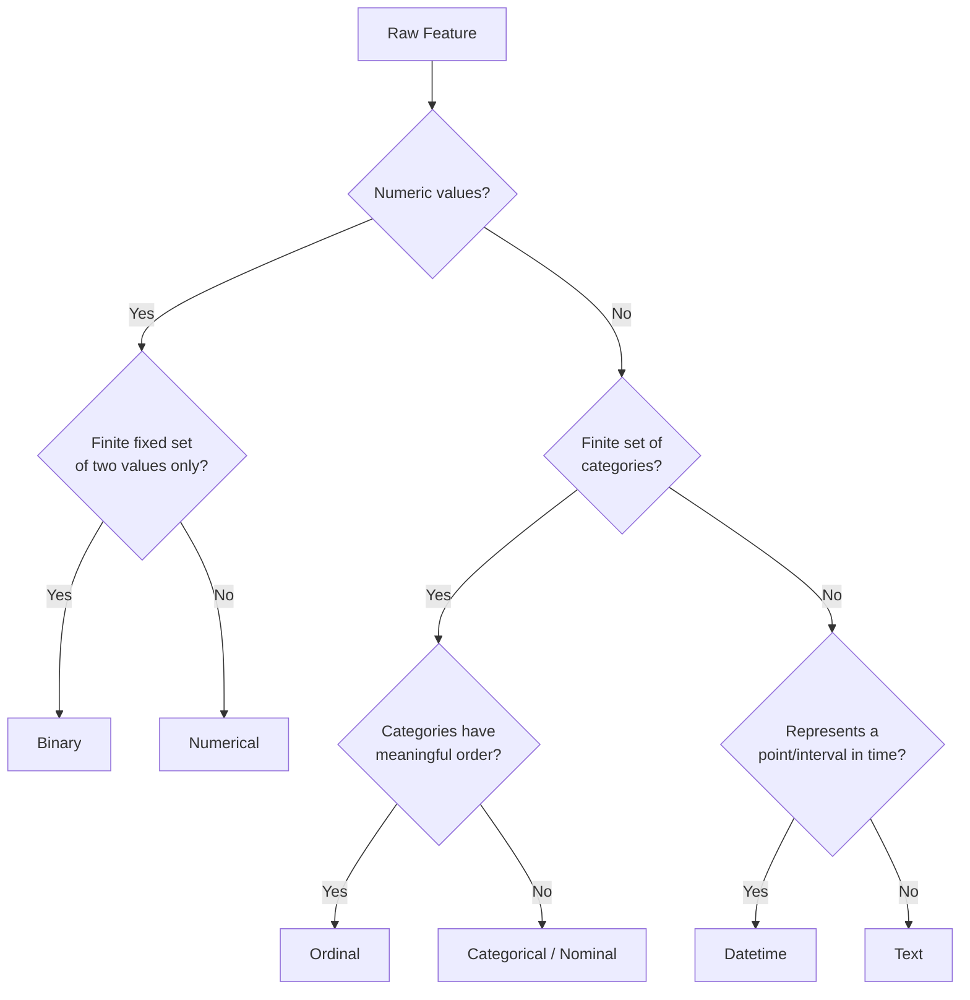

## Data Types: Numerical, Categorical, Ordinal, Binary, Text, Datetime

### Overview

Every feature in a dataset belongs to a data type that determines which preprocessing techniques, statistical summaries, and modeling assumptions apply to it. Correctly identifying data type is one of the earliest and most consequential steps in preprocessing, since treating a variable as the wrong type can silently produce meaningless models — for example, computing an average on a categorical code, or one-hot encoding a continuous variable.

### Numerical Data

**Definition**: Numerical data represents quantities that can be measured on a scale and support arithmetic operations (addition, averaging, comparison of magnitude).

**Key Points**
- Divided into two subtypes:
  - **Continuous**: can take any value within a range (e.g., height, temperature, income).
  - **Discrete**: countable, typically integer values (e.g., number of children, number of purchases).
- Supports statistical operations like mean, standard deviation, correlation.
- Common preprocessing: scaling/normalization, outlier detection, binning, log/power transforms for skewed distributions.

**Example**

| CustomerID | Age (discrete) | Income (continuous) |
|---|---|---|
| 1 | 34 | 52,000.00 |
| 2 | 29 | 61,500.50 |

### Categorical Data

**Definition**: Categorical (nominal) data represents values drawn from a finite set of unordered categories, where no category is inherently "greater" or "less" than another.

**Key Points**
- Examples: country, color, product type, marital status.
- Arithmetic operations are not meaningful (e.g., averaging category codes produces a number with no valid interpretation).
- Common preprocessing: one-hot encoding, target encoding, frequency encoding — covered in dedicated encoding topics.
- High-cardinality categorical variables (many unique categories, e.g., ZIP code) often require special handling to avoid excessive dimensionality after encoding.

**Example**

| CustomerID | Country |
|---|---|
| 1 | USA |
| 2 | Canada |
| 3 | Philippines |

There is no inherent order between "USA," "Canada," and "Philippines" — they are distinct, unranked labels.

### Ordinal Data

**Definition**: Ordinal data represents categories that have a meaningful relative order, but the intervals between categories are not necessarily equal or numerically defined.

**Key Points**
- Examples: education level (High School < Bachelor's < Master's < PhD), customer satisfaction rating (Low < Medium < High), clothing size (S < M < L < XL).
- The order carries information that categorical (nominal) encoding would discard, but the "distance" between categories is not necessarily uniform (the gap between "Low" and "Medium" satisfaction is not guaranteed to equal the gap between "Medium" and "High").
- Common preprocessing: ordinal encoding (mapping categories to integers that preserve order), which is distinct from one-hot encoding used for nominal categorical data.

**Example**

| CustomerID | Satisfaction |
|---|---|
| 1 | Low |
| 2 | High |
| 3 | Medium |

Encoded ordinally, this might become Low=1, Medium=2, High=3 — preserving rank order without asserting that the numeric gaps are equal in real-world terms.

### Binary Data

**Definition**: Binary data is a special case of categorical data restricted to exactly two possible values, often representing presence/absence, yes/no, or true/false states.

**Key Points**
- Examples: churn (yes/no), email opened (0/1), gender in a two-category encoding, disease diagnosis (positive/negative).
- Frequently stored directly as 0/1 integers or boolean values, which requires no additional encoding step for most algorithms.
- Class imbalance (e.g., 95% "no" vs. 5% "yes") is a common issue specific to binary variables, particularly when used as a target/label rather than a feature.

**Example**

| CustomerID | Churned |
|---|---|
| 1 | 0 |
| 2 | 1 |

### Text Data

**Definition**: Text data consists of unstructured natural language strings of variable length and content, without an inherent fixed schema at the character or word level.

**Key Points**
- Examples: product reviews, support tickets, free-text survey responses, chat logs.
- Cannot be used directly by most machine learning algorithms; requires transformation into numeric representations (tokenization, vectorization, embeddings), covered in dedicated NLP preprocessing topics.
- Text preprocessing considerations include case normalization, punctuation/stopword handling, stemming/lemmatization, and handling of multiple languages or encodings.

**Example**

> "The delivery was fast but packaging was damaged."

This single string cannot be fed into a standard tabular model until converted into a structured numeric form, such as a bag-of-words vector or an embedding.

### Datetime Data

**Definition**: Datetime data represents points in time or durations, typically stored as timestamps, dates, or time intervals.

**Key Points**
- Examples: signup date, transaction timestamp, log event time.
- Raw datetime values are rarely used directly by models; they are typically **decomposed** into derived features (year, month, day of week, hour, is_weekend) or transformed into cyclical representations for periodic features (e.g., hour of day, month of year).
- Time zone handling and inconsistent date formats (e.g., `MM/DD/YYYY` vs `DD/MM/YYYY`) are common sources of error during preprocessing.
- For periodic components, cyclical encoding is a standard technique to avoid discontinuity at period boundaries (e.g., December (12) and January (1) being numerically far apart despite being adjacent in time):

$$
x_{\sin} = \sin\left(\frac{2\pi \cdot \text{month}}{12}\right), \quad x_{\cos} = \cos\left(\frac{2\pi \cdot \text{month}}{12}\right)
$$

**Example**

| CustomerID | Signup_Date |
|---|---|
| 1 | 2023-01-05 |
| 2 | 2023-06-17 |

This might be decomposed into `signup_year=2023`, `signup_month=1`, `signup_dayofweek=3` (Thursday), etc., depending on which temporal patterns are relevant to the modeling task.

### Comparison Table

| Type | Order Matters? | Arithmetic Valid? | Example Values | Typical Preprocessing |
|---|---|---|---|---|
| Numerical | Yes (magnitude) | Yes | 34, 52000.00 | Scaling, binning, transforms |
| Categorical | No | No | USA, Canada | One-hot / target encoding |
| Ordinal | Yes (rank) | No (intervals undefined) | Low, Medium, High | Ordinal encoding |
| Binary | N/A | Limited (0/1 as indicator) | 0, 1 | Usually none, or treated as categorical |
| Text | No (sequence matters) | No | Free-form strings | Tokenization, vectorization |
| Datetime | Yes (temporal) | Partial (durations) | 2023-01-05 | Decomposition, cyclical encoding |

### Data Type Identification Workflow

[Inference] This workflow reflects a standard, commonly taught approach to data type classification, but real-world features can be ambiguous (e.g., a numeric code that is actually categorical, such as a ZIP code), so automated type inference should generally be checked against domain knowledge rather than relied on alone.

### Common Pitfalls

- Treating numeric-looking codes (ZIP codes, phone numbers, ID numbers) as numerical data and applying scaling or averaging, when they are actually categorical.
- Applying one-hot encoding to ordinal data, which discards the order information the variable carries.
- Storing datetime values as plain strings, which prevents time-based sorting, arithmetic, and decomposition without an explicit parsing step.
- Assuming binary variables stored as text ("Yes"/"No") are already model-ready without converting them to a numeric or boolean form.

### Conclusion

Correctly classifying each feature as numerical, categorical, ordinal, binary, text, or datetime determines which family of preprocessing techniques is appropriate and prevents statistically invalid operations, such as averaging unordered categories or one-hot encoding data with meaningful rank. This classification step generally precedes and informs the encoding, scaling, and transformation topics covered later in this series.

**Related Topics**
- Encoding Categorical and Ordinal Variables
- Feature Scaling and Normalization Techniques
- Datetime Feature Engineering and Cyclical Encoding
- Handling High-Cardinality Categorical Features
- Text Preprocessing Fundamentals (Tokenization, Normalization, Vectorization)
- Detecting Mislabeled or Miscoded Data Types Automatically

Correction note: no corrections needed in this response — claims about standard data-type definitions and encoding practices reflect well-established, documented conventions in data science, and the two [Inference] statements above are flagged because they involve reasoning about real-world variability rather than fixed facts.