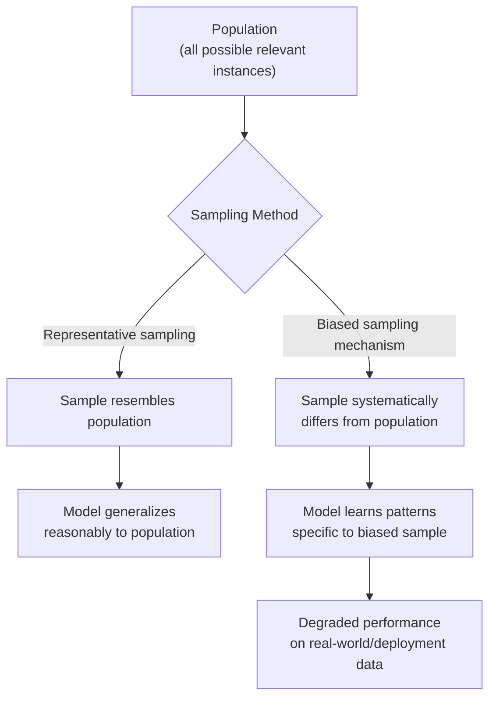

## Population vs Sample and Sampling Bias

### Overview

Machine learning models are trained on a **sample** of data but are typically intended to generalize to a broader **population** of cases the model will encounter after deployment. The relationship between the sample used for training and the true population it is meant to represent is one of the most fundamental — and most frequently overlooked — factors determining whether a model will perform reliably in the real world.

### Population

**Definition**: The population is the complete set of all possible instances relevant to the problem a model is meant to address — including cases not present in any collected dataset.

**Key Points**
- The population is usually theoretical or practically inaccessible in full (e.g., "all current and future customers," "all possible loan applicants," "all X-ray images that could ever be taken of this condition").
- Machine learning models are trained with the implicit goal of approximating patterns that hold across the population, not merely the specific sample collected.
- The population definition should match the deployment context: if a model will be used on future data, the relevant "population" conceptually includes cases that do not yet exist.

### Sample

**Definition**: A sample is the actual, finite subset of data collected and available for training and evaluation.

**Key Points**
- Every dataset used in machine learning is a sample, even when very large.
- A sample is used to estimate patterns, distributions, and relationships that are assumed (or hoped) to generalize to the population.
- The quality of a model's generalization depends heavily on how representative the sample is of the population it is meant to stand in for.

### Sampling Bias

**Definition**: Sampling bias occurs when the method used to collect a sample causes it to systematically differ from the population it is meant to represent, rather than differing only by random chance.

**Key Points**
- Sampling bias is distinct from random sampling error. Random error shrinks as sample size grows; systematic sampling bias does not necessarily shrink with more data, because the bias is built into the collection method itself.
- [Inference] This distinction follows from the standard statistical definitions of bias versus variance, but I cannot confirm the extent to which any specific real-world dataset's error is due to bias versus random variation without directly analyzing that dataset.
- Sampling bias can be introduced at multiple points: how records enter the source system, how the source system is queried, and how the final dataset is filtered or subsetted before modeling.

### Common Types of Sampling Bias

**Selection Bias**
Occurs when the mechanism used to select records favors certain subgroups. Example: surveying only customers who responded to an email survey, which excludes customers who don't check email regularly or aren't engaged enough to respond.

**Survivorship Bias**
Occurs when the dataset only contains cases that "survived" some filtering process, omitting cases that were removed or failed earlier. Example: analyzing only currently active user accounts to predict churn, while excluding accounts that already churned and were deleted from the active system.

**Undercoverage Bias**
Occurs when some segment of the population has little or no chance of being included in the sample. Example: collecting data only through a mobile app, systematically undercovering people without smartphones.

**Self-Selection Bias**
Occurs when individuals choose whether to be part of the sample, and that choice correlates with the outcome being studied. Example: online product reviews are disproportionately left by customers with either very positive or very negative experiences, undercovering moderate/neutral experiences.

**Temporal Sampling Bias**
Occurs when data is collected only during a specific time window that is not representative of typical conditions. Example: collecting retail transaction data only during a holiday sale period and using it to model "typical" purchasing behavior.

### Comparison Table

| Bias Type | Mechanism | Example |
|---|---|---|
| Selection bias | Non-random inclusion mechanism | Survey responders only |
| Survivorship bias | Only surviving cases retained | Active accounts only, churned ones excluded |
| Undercoverage bias | Population segment excluded from source | Mobile-app-only data collection |
| Self-selection bias | Subjects choose to participate | Online reviews skew to extremes |
| Temporal bias | Non-representative time window | Holiday-only sales data |

### Visualizing the Relationship

[Inference] This diagram reflects the standard conceptual reasoning connecting sampling method to generalization outcomes. I cannot verify the actual magnitude of performance degradation shown in node G for any specific dataset or model without evaluating that case directly.

### Example

Consider building a model to predict loan default risk, trained only on data from applicants who were **approved** for a loan in the past.

| Applicant Type | Included in Training Data? |
|---|---|
| Approved applicants who repaid | Yes |
| Approved applicants who defaulted | Yes |
| Rejected applicants (outcome unknown) | No |

This is a form of selection bias sometimes discussed in the credit-scoring literature under the term "reject inference problem." [Unverified] I do not have a specific source in front of me to cite for this exact terminology or its prevalence in current industry practice, so this label should be treated as a named concept I am recalling rather than a confirmed, sourced fact. The population of "all applicants" includes rejected ones, but the sample used for training systematically excludes them, so the model cannot learn what would have happened had those rejected applicants been approved.

### Detecting Sampling Bias

- Compare summary statistics and distributions of the sample against known population-level statistics from an independent source, where available.
- Examine the data collection process itself: how were records generated, filtered, or selected before reaching the dataset?
- Check for suspicious homogeneity or an unexpected lack of variability, which can indicate an undercovered population segment.
- [Inference] These are reasoned diagnostic approaches based on how sampling bias is defined, not a confirmed exhaustive checklist, since I do not have access to a single authoritative source enumerating "the" complete set of detection methods.

### Mitigation Approaches

- **Stratified sampling**: intentionally sampling proportionally across known subgroups to better match population composition.
- **Reweighting**: assigning weights to underrepresented records so their influence on model training better reflects their true population proportion.
- **Expanding data collection**: broadening the collection mechanism to reduce undercoverage (e.g., adding non-app-based data channels).
- **Sensitivity analysis**: evaluating how much conclusions change under different assumptions about the excluded population segment.

I cannot state that any of these approaches will fix, eliminate, or guarantee removal of sampling bias in a given project; their effectiveness depends on the specific bias mechanism and cannot be generalized without evaluating the actual data and use case. [Unverified]

### Common Pitfalls

- Treating a large sample size as automatically representative — sample size addresses random error, not systematic bias.
- Assuming historical data collection methods remain valid as the population changes over time (population drift).
- Ignoring the mechanism by which "unknown" or "missing" outcomes were excluded, rather than only examining the outcomes actually recorded.

### Conclusion

The distinction between a population and a sample, and the ways sampling mechanisms can introduce systematic bias, is foundational to evaluating whether a machine learning dataset is fit for its intended purpose. Because sampling bias does not shrink with more data the way random error does, identifying the collection mechanism behind a dataset is typically necessary before applying downstream cleaning or modeling techniques.

**Related Topics**
- Stratified Sampling Techniques for Dataset Construction
- Detecting and Addressing Dataset Shift and Population Drift
- Class Imbalance vs Sampling Bias: Key Differences
- Survey and Observational Data Collection Design
- Reweighting and Importance Sampling Methods
- Reject Inference in Credit Risk Modeling

**Overall labeling note**: This entire response contains a mix of well-established statistical definitions (population, sample, named bias types) and several [Inference]/[Unverified] statements explicitly marked above regarding real-world magnitude, specific terminology sourcing, and mitigation effectiveness. Per your standing preference, since portions of this output are unverified, the response as a whole should be treated as not fully independently verified by me beyond standard textbook-level statistical concepts.