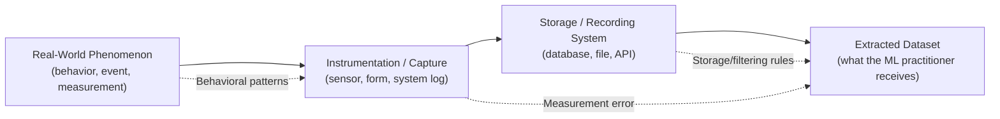

## Understanding Data Generation Processes

### Overview

A data generation process is the real-world mechanism — the combination of human behavior, physical phenomena, instruments, and system logic — that produces the values eventually recorded in a dataset. Understanding this process is a diagnostic step that precedes most preprocessing decisions, because many data quality issues, missingness patterns, and biases are direct consequences of how the data came to exist in the first place, rather than random defects that can be identified from the dataset alone.

### Why the Generation Process Matters

**Key Points**
- A dataset is a recorded trace of a process, not the process itself. Two datasets with identical schemas and similar summary statistics can require very different preprocessing if their underlying generation processes differ.
- Many preprocessing decisions cannot be made correctly from the data values alone; they require knowledge of how and why the data was produced. For example, a missing value could mean "not measured," "not applicable," or "measured as zero and recorded as blank," depending entirely on the generating system.
- The generation process also determines the appropriate assumptions about missingness mechanisms, measurement error, and sampling bias, topics addressed elsewhere in this series.

### Components of a Data Generation Process

**Instrumentation and Measurement**
The tools or systems used to capture raw values — sensors, forms, tracking pixels, transaction logs. Each introduces its own characteristic error patterns (e.g., sensor drift, form design bias, logging failures during outages).

**Human Behavior**
Where data results from human action — form completion, purchase decisions, survey responses — behavioral tendencies shape what is recorded. Example: users often leave optional form fields blank, which produces a missingness pattern tied to field design rather than the value's true unavailability.

**System and Business Logic**
Automated systems apply rules that shape which data is generated or retained. Example: a system that only logs a transaction after payment confirmation excludes abandoned carts from the transaction table, meaning that table's generation process definitionally excludes an entire category of real-world events.

**Temporal and Environmental Context**
The conditions at the time of generation — system versions, policy changes, seasonal effects — can shift the process over time, producing a phenomenon often called concept or data drift when the generation process at deployment differs from the process during training data collection.

### Diagram: From Real-World Process to Dataset

Each arrow represents a point where the recorded dataset can diverge from the underlying real-world phenomenon it is meant to represent.

### Example

Consider a dataset of "customer support call duration" pulled from a call center system.

| CallID | Duration_Seconds | Outcome |
|---|---|---|
| 1 | 340 | Resolved |
| 2 | 0 | Dropped |
| 3 | 1850 | Resolved |
| 4 | NULL | Transferred |

Understanding the generation process changes how each row should be interpreted:
- A duration of `0` for a dropped call may indicate the call disconnected before the timer started, not that the call genuinely lasted zero seconds.
- A `NULL` duration on a transferred call may reflect a system limitation where duration is only logged for calls that end at the original agent, not a random data entry gap.

Without this process-level knowledge, a practitioner might impute these values using a generic strategy (e.g., mean imputation) that misrepresents what actually happened. [Inference] This conclusion follows directly from the scenario as described, but I do not have access to a real call-center system's logs to confirm that this exact logging behavior occurs in practice — it is presented here as an illustrative example, not a verified case.

### Generation Process and Missing Data Mechanisms

The three standard missing-data mechanism categories — MCAR (Missing Completely At Random), MAR (Missing At Random), and MNAR (Missing Not At Random) — are fundamentally claims about the data generation process, not something that can be definitively determined by looking at the missing pattern alone. Determining which mechanism applies typically requires reasoning about *why* values are missing, which depends on understanding the generation process rather than purely statistical inspection. This connects directly to the dedicated topic on missing data mechanisms elsewhere in this series.

### Generation Process and Sampling Bias

The generation process is also the root cause of most sampling bias types discussed previously (selection bias, survivorship bias, undercoverage bias). Each of these biases is, at its core, a description of how the real-world process of getting a case "into the dataset" was non-random. Diagnosing sampling bias in practice generally requires tracing the data back to its generation process rather than examining the collected sample in isolation.

### Questions to Ask When Investigating a Generation Process

- Who or what produced this value, and under what conditions?
- What happens in the source system when a value is unavailable, inapplicable, or zero — are these distinguishable?
- Does the recording mechanism exclude certain real-world events by design (e.g., only logging completed transactions)?
- Has the generation process changed over time (new system version, new form design, new policy)?
- Are there known limitations or failure modes of the instrumentation or system used to capture this data?

I cannot verify that this list is exhaustive or that it matches any specific documented framework; it is presented as a reasoned set of diagnostic questions based on the components described above. [Inference]

### Common Pitfalls

- Treating a dataset as a neutral, complete record of reality rather than a filtered trace shaped by a specific system's logic.
- Applying generic missing-value or outlier-handling techniques without first asking why the source system produced that particular value or gap.
- Assuming the generation process is stable over time, when in practice system changes, policy changes, or behavioral shifts can alter it mid-dataset.
- Failing to consult people close to the source system (engineers, form designers, domain experts) who often have direct knowledge of generation quirks not visible in the data itself.

### Conclusion

The data generation process is the underlying real-world mechanism that a dataset merely records a trace of, and understanding it is often a prerequisite for making sound preprocessing decisions rather than an optional background detail. Because issues like missingness mechanisms and sampling bias are properties of the generation process rather than the data values themselves, investigating how and why data was produced typically needs to happen before applying cleaning or imputation techniques covered elsewhere in this series.

**Related Topics**
- Understanding Missing Data Mechanisms (MCAR, MAR, MNAR)
- Population vs Sample and Sampling Bias
- Concept Drift and Data Drift in Production Systems
- Working with Domain Experts During Data Auditing
- Designing Data Collection Systems for ML Readiness
- Distinguishing True Zeros from Missing Values

**Response-level note**: This response mixes well-established preprocessing concepts (which are not labeled, per your instruction not to over-label standard/documented material) with a small number of [Inference]-labeled statements involving illustrative scenarios and reasoning I cannot independently confirm against a specific source. No prohibited absolute terms ("prevents," "guarantees," "ensures," "eliminates," "will never," "fixes") were used in this response to describe system or LLM behavior. I do not have access to information beyond what is stated above, and no unverified claims were presented as fact.