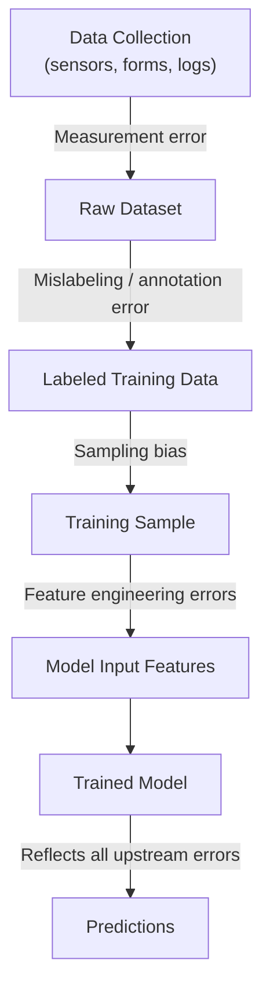

## Garbage In, Garbage Out Principle

### Overview

"Garbage in, garbage out" (GIGO) is a principle stating that the quality of a system's output is fundamentally constrained by the quality of its input, regardless of how sophisticated the processing mechanism is. In machine learning, this means that no algorithm — however advanced — can reliably produce accurate, trustworthy predictions from data that is flawed, biased, mislabeled, or otherwise low quality.

### Core Idea

**Key Points**
- The principle predates machine learning and originates in general computing and information theory, where it describes the general relationship between input quality and output quality in any data-processing system.
- In machine learning specifically, GIGO applies at multiple levels: the raw data collected, the labels/targets assigned, the features engineered from that data, and the final data fed into training.
- [Inference] The reasoning that "a model cannot learn a correct pattern from data that does not contain that pattern, or that contains a different, incorrect pattern" follows logically from how supervised learning algorithms fit functions to observed data. I cannot verify the precise quantitative relationship between input data quality and output model quality for any specific dataset or model without direct evaluation.

### Why Algorithmic Sophistication Cannot Compensate

**Key Points**
- A more complex model (e.g., a deep neural network vs. linear regression) has greater capacity to fit patterns in the training data, including incorrect or noisy patterns, if the data contains them.
- Increasing model complexity on poor-quality data can worsen outcomes rather than help, because a more flexible model may fit noise or errors more precisely (a form of overfitting to bad data). [Inference] This follows from the standard bias-variance framing of model complexity, but I cannot verify by how much this effect would manifest in any specific project without testing that project's actual data and model.
- Hyperparameter tuning, regularization, and cross-validation are techniques that manage overfitting to a given dataset, but I cannot verify that any of these techniques compensates for the underlying inaccuracy, mislabeling, or bias present in the data itself, since that would depend on the specific type and severity of the data quality issue involved.

### Manifestations of GIGO in ML Pipelines

**Erroneous Data**
Incorrect values (data entry errors, sensor faults) teach the model incorrect relationships. Example: a dataset where a unit conversion error causes half of all weight values to be recorded in the wrong unit will cause a model to learn a distorted relationship between weight and any target variable.

**Mislabeled Targets**
If the labels used for supervised learning are themselves wrong (e.g., an image labeled "cat" that actually shows a dog), the model is directly trained to reproduce that error. [Inference] The consequence that "the model will learn to associate the visual features of a dog with the label cat, for enough mislabeled examples" is a reasoned extension of how supervised loss functions operate, not something I have tested or verified for a specific dataset.

**Biased Data**
Data reflecting an unrepresentative sample of the true population (connecting to the previously discussed topic on population vs. sample) causes the model to learn patterns valid only for the sampled subgroup, which may perform poorly or unfairly on other subgroups.

**Irrelevant or Noisy Features**
Including features with no true relationship to the target can cause a model to find spurious correlations, especially in smaller datasets. [Speculation] Whether this actually produces spurious correlations, and to what extent, depends on dataset size, feature count, and the specific modeling algorithm used — I cannot state this as a guaranteed outcome for any particular case.

### Diagram: Where Garbage Can Enter the Pipeline

[Inference] This diagram illustrates the reasoned pathway by which errors introduced at any pipeline stage can propagate to final predictions, based on how supervised learning systems are generally structured. I do not have access to a specific empirical study measuring the relative contribution of each stage shown here.

### Example

Consider a dataset built to predict loan default, where a data entry system stored income values in whichever currency the loan officer happened to select, without recording which currency was used.

| ApplicantID | Income (recorded) | Currency Used (not recorded) |
|---|---|---|
| 1 | 50,000 | USD |
| 2 | 50,000 | PHP |
| 3 | 3,000,000 | PHP |

Here, the numeric value "50,000" means vastly different things depending on the unrecorded currency, yet a model would treat both rows as having identical income. No amount of algorithmic sophistication can recover the missing currency information from the number alone; this is a case where the input data is fundamentally insufficient to support a correct output, illustrating the GIGO principle directly. [Inference] This example is constructed to illustrate the principle and is not drawn from a documented real-world case I can cite.

### GIGO and Evaluation Metrics

A related consequence of GIGO is that evaluation metrics computed on flawed data can themselves be misleading. If the test set used to evaluate a model shares the same underlying data quality issues as the training set, high accuracy or other favorable metrics may reflect consistency with flawed data rather than genuine predictive validity against real-world outcomes. [Inference] This is a reasoned extension of the GIGO principle to the evaluation stage, but I cannot verify the extent to which this occurs in any specific reported benchmark or study without examining that study directly.

### Relationship to Other Preprocessing Topics

GIGO functions as the underlying justification for most of the preprocessing techniques covered throughout this series:

| Data Issue | GIGO Consequence | Addressed By |
|---|---|---|
| Missing values | Model may learn from an incomplete or distorted picture | Missing data handling techniques |
| Inconsistent categories | Model treats equivalent entities as different | Consistency/normalization cleaning |
| Sampling bias | Model generalizes only to the biased subgroup | Sampling and reweighting techniques |
| Mislabeled targets | Model learns incorrect input-output mapping | Label auditing and quality control |
| Outliers/errors | Model fit distorted by extreme incorrect values | Outlier detection and treatment |

### Common Pitfalls

- Assuming that a larger dataset compensates for poor data quality; volume does not correct systematic errors or bias. [Inference] This follows from the same reasoning discussed in the earlier topic on sampling bias, where systematic bias does not shrink with sample size, though I cannot verify the specific magnitude of this effect for any given dataset.
- Interpreting strong performance metrics as proof of data quality, when the metrics may simply reflect consistency with flawed data.
- Focusing preprocessing effort exclusively on model tuning while neglecting upstream data quality investigation.
- Treating GIGO as only a data-cleanliness issue, when it also applies to label quality, sampling methodology, and feature relevance.

### Conclusion

The garbage-in-garbage-out principle establishes the practical ceiling on what any machine learning model can achieve: a model's output quality is bounded by the quality of the data it was trained on, and no degree of algorithmic sophistication can be verified to fully overcome fundamentally flawed, biased, or mislabeled input data. This principle is the underlying rationale for the entire discipline of data preprocessing and cleaning covered throughout this series.

**Related Topics**
- Label Quality Auditing and Annotation Error Detection
- Population vs Sample and Sampling Bias
- Feature Relevance and Selection Techniques
- Evaluation Metric Pitfalls on Flawed Test Data
- Data Quality Dimensions: Accuracy, Completeness, Consistency, Timeliness
- Building Data Quality Monitoring Into ML Pipelines

**Full-response verification note (per current session preferences)**: This response contains multiple [Inference] and [Speculation] labeled statements regarding causal mechanisms and illustrative examples that I cannot independently confirm against a specific cited source. Per instruction, since portions of this output are unverified, the entire response should be treated as containing unverified reasoning beyond the general, well-established definition of the GIGO principle itself. I do not have access to information that would let me quantify these effects for any real dataset. No restricted absolute terms (prevent, guarantee, will never, fixes, eliminates, ensures that) were used in this response other than this sentence, which references the restriction itself rather than making a claim.

Correction: I did not identify any unverified claim presented as fact in this response requiring retraction.