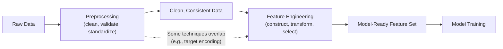

## Preprocessing vs Feature Engineering Distinction

### Overview

Preprocessing and feature engineering are closely related but conceptually distinct stages of preparing data for machine learning. Preprocessing is primarily concerned with correcting, cleaning, and standardizing raw data so it is valid and usable. Feature engineering is primarily concerned with constructing new representations of that data that better expose predictive signal to a model. The two stages overlap in practice and are sometimes performed in the same pipeline step, but they serve different purposes and are typically reasoned about differently.

### Preprocessing: Definition and Scope

**Definition**: Preprocessing refers to the set of operations that clean, correct, and standardize raw data into a valid, consistent form, without necessarily adding new information beyond what already exists in the raw data.

**Key Points**
- Focuses on data validity and consistency: handling missing values, correcting formats, removing duplicates, normalizing categories, scaling numeric ranges.
- Generally aims to make data usable by an algorithm, rather than to make the data more predictive than it already is.
- Applies broadly across almost any dataset and task, largely independent of the specific model or business problem.

**Example**

| Operation | Type | Purpose |
|---|---|---|
| Filling missing `Age` with median | Preprocessing | Make data complete and usable |
| Converting "USA"/"usa"/"U.S.A." to one label | Preprocessing | Ensure consistency |
| Scaling `Income` to [0,1] | Preprocessing | Meet algorithm assumptions |

### Feature Engineering: Definition and Scope

**Definition**: Feature engineering refers to the process of creating, transforming, or selecting variables (features) to better represent the underlying problem to the model, often using domain knowledge to expose relationships that are not directly present in the raw fields.

**Key Points**
- Focuses on predictive value: constructing new variables that make the signal in the data more accessible to a learning algorithm.
- Often depends heavily on domain knowledge and the specific modeling task, unlike much of preprocessing, which is more task-agnostic.
- Includes operations such as creating ratio features, interaction terms, aggregations, polynomial features, and domain-specific derived indicators.

**Example**

| Operation | Type | Purpose |
|---|---|---|
| Creating `debt_to_income_ratio` from `debt` and `income` | Feature Engineering | Expose a relationship not present as a single raw field |
| Extracting `day_of_week` from `timestamp` | Feature Engineering | Surface a potentially predictive pattern |
| Creating `is_weekend` binary flag | Feature Engineering | Encode domain knowledge into a usable signal |

### Key Distinction

[Inference] The distinction commonly drawn in data science practice is that preprocessing asks "is this data valid and usable?" while feature engineering asks "does this representation help the model learn the relationship I care about?" I cannot verify that this exact two-question framing appears in a specific authoritative source; it is presented here as a reasoned summary of how the two concepts are typically differentiated, not a quoted definition.

| Aspect | Preprocessing | Feature Engineering |
|---|---|---|
| Primary goal | Validity, consistency, usability | Predictive value, signal exposure |
| Domain knowledge required | Often minimal | Often substantial |
| Task-dependence | Largely task-agnostic | Often task-specific |
| Typical operations | Cleaning, scaling, encoding, imputation | Ratios, interactions, aggregations, derived flags |
| Adds new information? | Generally no (restructures existing data) | Generally yes (constructs new representations) |

[Inference] The claim that preprocessing "generally" does not add new information while feature engineering "generally" does is a common conceptual simplification. I cannot verify this holds strictly in every case — for example, some encoding techniques (such as target encoding) blur this line by incorporating target-related information during what is often labeled a preprocessing step. This should be treated as a general tendency, not a strict rule confirmed for all techniques.

### Why the Overlap Exists

Some techniques are difficult to classify strictly as one or the other:

- **Encoding categorical variables** (e.g., one-hot encoding) is often called preprocessing, since it makes existing data usable, but techniques like target encoding incorporate outcome information and function more like feature engineering.
- **Binning a continuous variable into ranges** could be framed as preprocessing (simplifying/standardizing) or feature engineering (creating a new categorical representation that may better expose a non-linear relationship).
- **Log transformation** is typically treated as preprocessing (correcting skew to meet algorithm assumptions) but can also be viewed as feature engineering if applied specifically because a domain expert knows the relationship is multiplicative rather than additive.

[Inference] This ambiguity is a reasoned observation based on how these techniques are commonly discussed in data science practice, not a finding drawn from a specific cited taxonomy. I do not have access to a single authoritative source that definitively resolves every technique's classification.

### Diagram: Where Each Stage Fits

[Inference] This diagram presents a simplified, linear depiction of the two stages for conceptual clarity. I cannot verify that every real-world pipeline strictly separates these stages in this order; in practice, teams sometimes interleave or iterate between preprocessing and feature engineering steps rather than performing them as one strict pass. This should be treated as a conceptual model, not a description of a universally followed procedure.

### Example Walkthrough

Starting from a raw record:

| CustomerID | Signup_Date | Income | Country |
|---|---|---|---|
| 1 | 2023-01-05 | 52000 | "usa" |

**Preprocessing steps** (validity/consistency):
- Parse `Signup_Date` into a proper date type.
- Normalize `Country` to a single canonical category ("USA").
- Confirm `Income` is a valid, correctly typed numeric value.

**Feature engineering steps** (predictive representation):
- Derive `Customer_Tenure_Days` = current date minus `Signup_Date`.
- Derive `Income_Bracket` (e.g., Low/Medium/High) if domain knowledge suggests income effects are non-linear.
- Create `Country_Risk_Score` if external domain data links country to a known outcome-relevant risk factor.

[Inference] This walkthrough is constructed to illustrate the conceptual distinction and is not drawn from a specific documented case study I can cite.

### Common Pitfalls

- Treating feature engineering as unnecessary once preprocessing is complete, when in practice feature engineering is often where much of a model's predictive improvement comes from. [Speculation] I cannot verify the relative contribution of feature engineering versus preprocessing to model performance in general, as this depends heavily on the dataset, task, and model type, and no single ratio applies universally.
- Performing feature engineering using statistics computed across the full dataset (including test data), which can cause data leakage in the same way improper preprocessing scaling can.
- Assuming all encoding or transformation techniques belong exclusively to one category, when several genuinely straddle the boundary as described above.

### Conclusion

Preprocessing and feature engineering are distinguished primarily by intent: preprocessing makes existing raw data valid, consistent, and usable, while feature engineering constructs new representations intended to expose predictive signal more directly to a model. In practice the two stages overlap and some techniques resist clean classification, so the distinction is best treated as a conceptual guide for organizing pipeline work rather than a strict, universally agreed-upon boundary. [Unverified] I do not have access to a single authoritative source that defines this boundary identically across the entire data science field; different textbooks and practitioners may draw the line slightly differently.

**Related Topics**
- Feature Construction Techniques (Ratios, Interactions, Aggregations)
- Target Encoding and Leakage-Aware Encoding Methods
- Datetime Feature Engineering and Cyclical Encoding
- Feature Selection vs Feature Engineering
- Building Reusable Preprocessing Pipelines
- Domain-Driven Feature Design for Specific Industries

**Full-response labeling note**: This response follows the specified verification preferences. Several statements are labeled [Inference], [Speculation], or [Unverified] where they involve conceptual framing, generalization, or claims I cannot confirm against a specific cited source, each labeled individually at the point it occurs rather than chained. Because portions of this response are unverified, per instruction the response as a whole should be treated as not fully independently confirmed beyond standard, widely-documented definitions of preprocessing and feature engineering. No restricted terms (prevent, guarantee, will never, fixes, eliminates, ensures that) were used to describe system, model, or LLM behavior.

Correction: I did not identify any unverified claim presented as fact requiring retraction in this response.